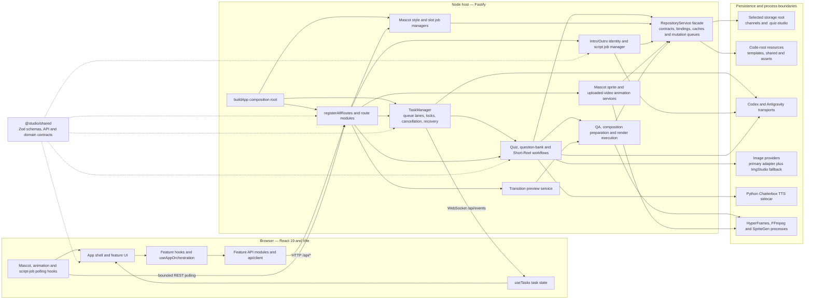

# System architecture

This is the source-navigation and responsibility map for AI Quiz Studio. Source, schemas, and executable tests take precedence when this guide drifts. Follow [AGENTS.md](../AGENTS.md) for engineering rules and [the development workflow](workflow.md) for verification.

## Executable system map



The arrows show runtime calls or contract consumption. They do not imply that every boundary already depends on an interface. In particular, most server consumers still use the concrete `RepositoryService` facade; its focused repository contracts define the supported surface while binding modules supply the implementations.

## Runtime and dependency direction

AI Quiz Studio is a Windows-supported, local-first pnpm/TypeScript workspace. Local persistence does not mean offline generation: configured LLM and image adapters can call external services.

- [apps/web](../apps/web/package.json) is the React 19 dashboard. `App.tsx` delegates application state and navigation to `useAppOrchestration`; feature hooks own mutations, recovery, and refresh behavior.
- [apps/server](../apps/server/package.json) is the Fastify host for HTTP, WebSocket events, task orchestration, filesystem persistence, provider integration, and local child-process boundaries.
- [packages/shared](../packages/shared/src/index.ts) owns cross-application types, Zod schemas, API contracts, quiz/layout policies, mascot contracts, and Short-Reel contracts. It must not import either application.
- [services/tts](../services/tts/app.py) is the Python Chatterbox sidecar, kept separate from Node because of its model and native runtime.
- [app.ts](../apps/server/src/app.ts) is the composition root. It loads environment and configuration, creates the repository, LLM clients, context engine, `TaskManager`, persistent mascot style/slot managers, server plugins, and all routes.
- [registerAllRoutes.ts](../apps/server/src/routes/registerAllRoutes.ts) is the HTTP composition boundary. It also constructs the Intro/Outro script job manager, portrait image client, and transition preview service; broadcasts TaskManager events; and assembles the mascot animation service graph.
- [server index.ts](../apps/server/src/index.ts) defaults to loopback port 4310. Vite uses port 2244 in development; Fastify serves the built frontend when `apps/web/dist` exists.

The server owns privileged I/O. Keep filesystem and provider credentials out of browser code. Loopback binding and loopback-only CORS are not a public multi-user authentication model; do not expose the server remotely without a separate security design.

## Responsibility map

| Responsibility                        | Current entry points                                                                                                                                                                                                           | Boundary to preserve                                                                               |
| ------------------------------------- | ------------------------------------------------------------------------------------------------------------------------------------------------------------------------------------------------------------------------------ | -------------------------------------------------------------------------------------------------- |
| UI composition and navigation         | [App.tsx](../apps/web/src/App.tsx), [useAppOrchestration](../apps/web/src/hooks/useAppOrchestration.ts), [features](../apps/web/src/features/)                                                                                 | Render and acknowledge interactions; keep stateful workflows in feature hooks                      |
| Browser transport and synchronization | [api.ts](../apps/web/src/api.ts), [API client](../apps/web/src/api/client.ts), [useTasks](../apps/web/src/hooks/useTasks.ts)                                                                                                   | Feature API modules own requests; TaskManager state uses WebSocket plus guarded refetches          |
| Server assembly                       | [app.ts](../apps/server/src/app.ts), [server plugins](../apps/server/src/server/serverPlugins.ts), [route registry](../apps/server/src/routes/registerAllRoutes.ts)                                                            | Construct long-lived dependencies once and inject them into routes/workflows                       |
| HTTP contracts                        | [routes](../apps/server/src/routes/), [shared API contracts](../packages/shared/src/api/)                                                                                                                                      | Parse input, invoke workflows, map failures; avoid orchestration in handlers                       |
| Task execution                        | [TaskManager](../apps/server/src/tasks/manager.ts), [queue pump](../apps/server/src/tasks/taskQueuePump.ts), [runtime contract](../apps/server/src/tasks/runtime.ts)                                                           | Own persisted tasks, queue lanes, locks, cancellation, restart recovery, approvals, and progress   |
| Quiz workflows                        | [pipeline orchestrator](../apps/server/src/quiz/pipeline/orchestrator.ts), [task pipeline runners](../apps/server/src/tasks/pipeline/)                                                                                         | Keep domain stages separate from task scheduling and child-task coordination                       |
| Filesystem persistence                | [RepositoryService](../apps/server/src/repository/service.ts), [repository contracts](../apps/server/src/repository/contracts/), [bindings](../apps/server/src/repository/bindings/)                                           | Reuse path safety, atomic writes, admission checks, caches, and per-entity mutation queues         |
| Question bank and topic confirmation  | [bank services](../apps/server/src/quiz/bank/), [bank storage](../apps/server/src/repository/quiz/bank/)                                                                                                                       | Preserve source identity, curation/QA, serialization, confirmation replay, and localization        |
| Channel identity and DNA              | [channel repository](../apps/server/src/repository/channels.ts), [context modules](../apps/server/src/context/)                                                                                                                | Keep channel metadata separate from its Markdown DNA; updates do not regenerate existing products  |
| Short-Reel workflow                   | [services](../apps/server/src/shortReel/), [contracts](../packages/shared/src/shortReel/), [routes](../apps/server/src/routes/shortReels.ts)                                                                                   | Preserve product revisions, unit attempts, dependency fingerprints, cancellation, and export gates |
| Intro/Outro scripts                   | [script services](../apps/server/src/introOutroScripts/), [routes](../apps/server/src/routes/introOutroScripts.ts), [shared contracts](../packages/shared/src/introOutroScripts/)                                              | Keep script revisions and jobs separate from uploaded video-pair records                           |
| Generation adapters                   | [providers](../apps/server/src/providers/), [asset resolver](../apps/server/src/quiz/assets/resolvers/providerAssetResolver.ts), [portrait client](../apps/server/src/providers/imageGeneration/portraitImageClient.ts)        | Keep provider transport, retries, idempotency, fallback, and safe errors at the adapter boundary   |
| Mascot authoring queues               | [style jobs](../apps/server/src/quiz/mascot/styleJobs/), [slot jobs](../apps/server/src/quiz/mascot/slotJobs/), [mascot routes](../apps/server/src/routes/mascots/)                                                            | These are independent background-job systems, not TaskManager task types                           |
| Mascot animation processing           | [sprite animation](../apps/server/src/quiz/mascot/animation/), [video animation](../apps/server/src/quiz/mascot/videoAnimation/), [animation route assembly](../apps/server/src/routes/mascots/animation/animationServices.ts) | Keep upload, extraction, matting, registration, QA, packaging, publish, and rollout explicit       |
| Render and QA                         | [video runner](../apps/server/src/tasks/videoRunner.ts), [video modules](../apps/server/src/tasks/video/), [render modules](../apps/server/src/quiz/render/), [QA](../apps/server/src/quiz/qa/)                                | Validated artifacts and deterministic timelines feed HyperFrames/FFmpeg processes                  |
| Preview and style tooling             | [Stage Studio](../apps/web/src/features/stageStudio/), [sandbox](../apps/web/src/features/sandbox/), [transition previews](../apps/server/src/quiz/transitionPreview/)                                                         | Shared contracts connect previews, persisted selections, and production output                     |

These are responsibilities, not ownership zones or a claim/lease protocol. Existing facades and some workflows remain large; do not treat their size or mixed responsibilities as the pattern for new code. Extract a focused boundary when extending them.

## Background work and synchronization

There are several asynchronous systems. They must not be documented or implemented as one universal queue.

| Work system                                             | Scheduling and state                                                                                                                          | Browser synchronization                                                                              |
| ------------------------------------------------------- | --------------------------------------------------------------------------------------------------------------------------------------------- | ---------------------------------------------------------------------------------------------------- |
| Episode, LLM, image, audio, video, and Short-Reel tasks | `TaskManager` persists tasks, applies lock keys, and pumps separate video, pipeline, general, image, and audio lanes                          | `/api/events` WebSocket updates `useTasks`; connection and terminal events trigger guarded refetches |
| Mascot style concept batches                            | `MascotStyleJobManager` owns bounded workers, cancellation, persisted batch state, and restart reconciliation                                 | Feature hooks poll style-job status and refresh the mascot when completed items appear               |
| Mascot style-slot batches                               | `MascotSlotJobManager` owns bounded workers, per-slot mutexes, cancellation, persisted batch state, and restart reconciliation                | Feature hooks poll slot-job status and reconcile the active/recent batch view                        |
| SpriteGen animation jobs                                | Animation job service/repository owns plan, execution, retry, curation, QA, and publish state                                                 | Mascot animation UI polls the job and batch endpoints                                                |
| Uploaded-video animation processing                     | Video processing orchestrator coordinates upload, FFmpeg extraction, matting, registration, packaging, cancellation, and active revision data | Mascot animation UI polls processing and slot endpoints                                              |
| Transition previews                                     | A transition preview service uses the shared video-render limiter and a dedicated preview store                                               | The owning feature requests and refreshes preview state                                              |
| Intro/Outro script and identity jobs                    | A script job manager persists generation and analysis state, handles cancellation, and reconciles interrupted jobs                            | The Script Studio polls job status and refreshes projects and revisions                              |

Do not broadcast a completed UI result before its owning server workflow confirms it. After a mutation, refresh every affected view; TaskManager events do not automatically synchronize mascot queues, animation revisions, or arbitrary feature data.

## Main production flows

### Quiz episodes

```mermaid
flowchart LR
  Submit["Submit GENERATE_PIPELINE"] --> Queue["TaskManager pipeline lane"]
  Queue --> Outer["Quiz production runner"]
  Outer --> Quiz["Ensure quiz and director plan"]
  Quiz --> Plan["Ensure asset plan"]
  Plan --> Parallel{"Assets and voice needed?"}
  Parallel -->|"both"| Assets["Resolve images with provider policy"]
  Parallel -->|"both"| Voice["Synthesize and measure narration"]
  Parallel -->|"one"| Needed["Run the required branch"]
  Assets --> Timeline["Compile measured timeline"]
  Voice --> Timeline
  Needed --> Timeline
  Timeline --> QA["QA checks and supported healing"]
  QA --> Thumb["Best-effort description and thumbnail"]
  Thumb --> Child["Submit GENERATE_VIDEO child task"]
  Child --> Compose["Prepare composition and layout preflight"]
  Compose --> Render["HyperFrames render and FFmpeg media work"]
  Render --> Persist["Persist output and update histories"]
```



1. A topic/question-bank confirmation can materialize quiz and director artifacts through the bank bridge. Otherwise the production runner submits `GENERATE_QUIZ` when no quiz exists.
2. [quizProductionPipelineRunner.ts](../apps/server/src/tasks/pipeline/quizProductionPipelineRunner.ts) executes the quiz-native V2 production path. Legacy task contract values still exist for compatibility, but the production pipeline is V2-only.
3. [quizV2PipelineRunner.ts](../apps/server/src/tasks/pipeline/quizV2PipelineRunner.ts) ensures quiz/director/asset plans, attempts description generation, resolves assets and synthesizes voice in parallel when both are needed, and compiles the timeline.
4. [quizPipelineVoiceStep.ts](../apps/server/src/tasks/pipeline/quizPipelineVoiceStep.ts) checks QA and attempts supported repairs. The default loop has three blocker checks with at most two intervening healing rounds. Remaining blockers raise `QUIZ_QA_BLOCKED`.
5. Thumbnail generation is attempted after QA. Description and thumbnail errors are caught and logged without failing the pipeline; these calls are still awaited.
6. The outer runner submits a video child task. The video runner prepares and checks the composition, invokes HyperFrames, persists output, and updates task/history state. Preserve failure and cancellation cleanup.

Downstream artifacts are derived state. [The domain invalidation map](../apps/server/src/quiz/pipeline/invalidation.ts) and [repository invalidation implementation](../apps/server/src/repository/quiz/quizArtifactsInvalidation.ts) must stay aligned when upstream edits or new stages are introduced.

### Question bank and Short Reels

The bank is reusable source data, not an episode document store. Trace curation and automatic QA in [quiz/bank](../apps/server/src/quiz/bank/), durable mutations in [repository/quiz/bank](../apps/server/src/repository/quiz/bank/), and source-bound topic resolution in [boundSourceResolver.ts](../apps/server/src/quiz/bank/bridge/boundSourceResolver.ts).

Topic confirmation uses [persisted receipts](../apps/server/src/repository/topicConfirmationReceipts.ts) to distinguish replay from conflicting requests. [Product localization](../apps/server/src/quiz/bank/localization/productLocalization.ts) owns target-language validation and localized projections; do not overwrite canonical question identity to localize a product.

Short Reels have their own records and deliverable lifecycle; they are not an episode aspect-ratio switch. [unitLifecycle.ts](../apps/server/src/shortReel/unitLifecycle.ts) accepts results under the repository mutation queue only when operation identity, dependency fingerprint, cancellation state, and payload validation allow it. Portrait generation uses a dedicated client and can apply the configured ImgStudio fallback chain. Export produces a validated package, not an Episode MP4 render.

### Mascot authoring and animation

Mascot CRUD, style concepts, state-slot generation, package import/export, migration, sprite animation, uploaded-video animation, and artifact delivery are assembled under [mascot routes](../apps/server/src/routes/mascots.ts).

- Style and slot image generation use long-lived managers created in `buildApp`. Their state is polled separately from TaskManager tasks.
- Sprite animation uses a plan/job/publish workflow around `DefaultSpriteGenAdapter`, persisted animation jobs, generated manifests, and QA reports.
- Uploaded-video animation uses FFmpeg-backed upload validation and frame extraction, then matting, registration, packaging, and revision persistence through the video processing orchestrator.
- Production rendering selects canonical V2 mascot assets and active style/animation revisions through [render mascot adapters](../apps/server/src/quiz/render/mascot/). Authoring and processing workflows must not bypass the persisted selection contract.

Channel creation stores `channel_dna.md` under the selected content root. [Channel repository methods](../apps/server/src/repository/channels.ts) update it separately from schema-validated metadata. Generation context can read DNA, but changing it does not regenerate existing artifacts. Intro/Outro script projects have a separate [workflow guide](intro-outro.md).

## Persistence and artifact contracts

[createRoots](../apps/server/src/repository/pathSafety.ts) distinguishes the code root from the selected content root:

| Location                                      | Ownership                                                                                                                               |
| --------------------------------------------- | --------------------------------------------------------------------------------------------------------------------------------------- |
| Selected content root: `channels/`            | Channel, episode, Short-Reel content, and source-bound product references                                                               |
| Selected content root: `.quiz-studio/`        | Tasks, logs, analytics, question-bank data, voices, mascots, animation work/output, and other runtime stores                            |
| Code root: `templates/`, `shared/`, `assets/` | Repository resources; `shared/` is not the TypeScript package                                                                           |
| Code root configuration                       | Loaded by [config](../apps/server/src/config.ts) and [environment](../apps/server/src/env.ts); never copy secrets into docs or fixtures |

`RepositoryService` composes domain bindings onto a facade that implements the interfaces in [repository/contracts](../apps/server/src/repository/contracts/). It owns safe root resolution, atomic write helpers, caches, writer admission, and serialized artifact/Short-Reel mutation paths. Do not assume all content is under the checkout or bypass the repository with an unchecked path.

The quiz artifact filenames are declared by the repository contract and read/written with schemas in [quizPlanArtifacts.ts](../apps/server/src/repository/quiz/quizPlanArtifacts.ts):

```text
quiz-v2.json          director-plan.json       asset-plan.json
asset-resolution.json voice-plan.json         timeline.json
qa.json               history-check.json      video-description.json
stage-timings.json
```

Object fields such as `director_plan` and `assessment` are not disk filenames. Do not invent underscore-based filenames from DTO fields or use documentation examples as migration specifications.

## Failure and concurrency rules

- Storage changes are rejected while TaskManager has active work. Resolve paths through the repository and preserve writer admission, atomic writes, mutation queues, and revision checks.
- Provider selection is separate from domain rules. Image generation can dispatch to configured primary adapters and, where supported, two ImgStudio fallback levels. Preserve cancellation, idempotency, metadata validation, and safe provider error mapping.
- A late provider response must not overwrite a newer Short-Reel revision, mascot batch result, or animation revision. Keep operation IDs, fingerprints, mutexes, and active-revision checks at their owning boundary.
- Child processes must propagate cancellation and timeouts. HyperFrames, FFmpeg, SpriteGen, and the Python TTS sidecar are infrastructure boundaries, not domain modules.
- Preserve user input on recoverable errors and expose pending, retry, cancel, partial, and failed states. Prevent duplicate submissions without freezing unrelated controls.

## Keeping this guide current

Update this file when package boundaries, composition roots, background-work ownership, transport, persistence, providers, or main product flows change. Keep exact thresholds and catalogs in source/tests rather than duplicating them here. Use the domain guides for detail, and recheck their claims before implementation.
