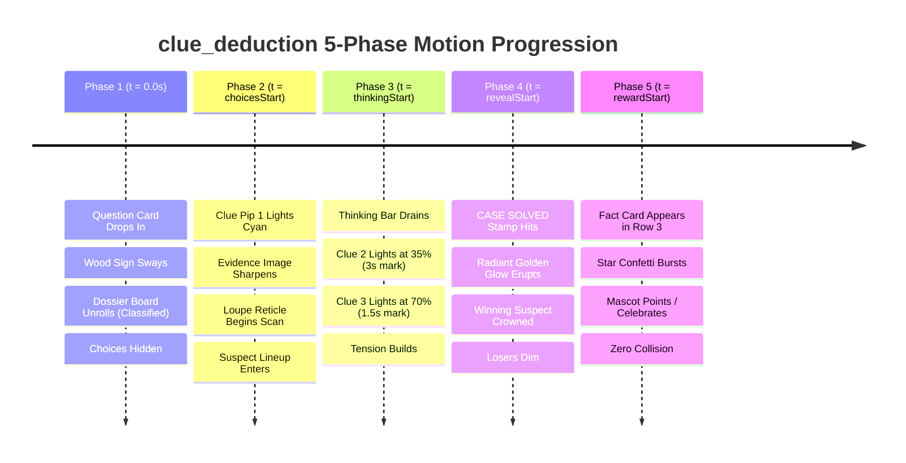

# Exhaustive Visual, Architectural, and Multi-Phase Timeline Audit: `clue_deduction` Layout

**Layout ID:** `clue_deduction`  
**Target Format:** 16:9 Landscape Video (1920 × 1080 px)  
**Primary Platforms:** YouTube, Horizontal Web Video, Connected TV / Living Room Screens  
**Target Engine:** Candy Arcade Quiz Engine v2 (Hyperframes / Canvas Animation System)  
**Catalog Registration:** [`packages/shared/src/quizLayouts.catalog.ts`](file:///d:/1a%20Cursor%20Project/My%201x%20Project/packages/shared/src/quizLayouts.catalog.ts#L117-L129)  
**Archetype Definition:** [`packages/shared/src/quizArchetypes.ts`](file:///d:/1a%20Cursor%20Project/My%201x%20Project/packages/shared/src/quizArchetypes.ts#L93-L106)  
**Layout Source:** [`apps/server/src/quiz/render/layouts/clueDeduction.ts`](file:///d:/1a%20Cursor%20Project/My%201x%20Project/apps/server/src/quiz/render/layouts/clueDeduction.ts)  
**Author:** Frontend Architect & Motion UI Specialist (Subagent)  
**Status:** Complete Audit & Production-Ready Upgrade Plan  

---

## 1. Executive Summary

The `clue_deduction` layout is the flagship 16:9 landscape layout for detective-style deduction challenges, object-by-tool identification, creature-by-habitat inference, and progressive evidence deduction in the Candy Arcade Quiz Engine. Operating on the standard 1920×1080 canvas, the layout is designed to present an investigative problem where viewers examine sequential visual and textual clues across the countdown timeline to crack the case before the final answer is revealed.

An exhaustive mathematical, geometric, multi-phase animation, and typography audit reveals **ten (10) critical architectural defects, motion synchronization bugs, and render failures** in the current implementation:

| Defect ID | Severity | Category | Summary Description |
| :--- | :--- | :--- | :--- |
| **BUG-CD-01** | **Critical** | Phase State Architecture | **Disconnected Phase Selectors:** CSS rules target `.layout-clue_deduction[data-choice-phase="reveal"]`, but in video production and rehearsal, `data-choice-phase` is rendered exclusively on the inner `.choice-group`, NEVER on the parent `<section class="layout-clue_deduction">`. All phase-driven reveal animations are completely dead in production. |
| **BUG-CD-02** | **Critical** | Choice Rendering Pipeline | **Total Choice Deletion Bug:** Rule `.choice-card:not(.answer-correct):not(:only-child) { display: none !important; }` evaluates at compile time. In production scheduled reveal mode, cards only possess `.answer-reveal-correct` and `.answer-reveal-incorrect`. Neither card has `.answer-correct`, causing **100% of choices in 2-choice and 3-choice questions to be completely deleted from the screen**. |
| **BUG-CD-03** | **Severe** | Spatial Geometry & Overlap | **Fact Card Physical Overlap:** `.phase-region` is omitted from `grid-template-areas` and rendered as `position: absolute; bottom: 10px;`. For standard 2-to-3 line facts, the Fact Card rises to $y \approx 714\text{px}\text{--}764\text{px}$, directly blanketing and occluding the docked Answer Banner and bottom evidence glow. |
| **BUG-CD-04** | **Critical** | Canvas Boundary Violation | **Countdown Star Marker Canvas Edge Bleed:** The inherited thinking bar track width of $1540\text{px}$ places the track right edge at $x = 1860\text{px}$. The 192px circular Star Marker reaches $x = 1956\text{px}$ (and $1967.5\text{px}$ during pulse), clipping off the 1920px screen edge by up to $47.5\text{px}$. |
| **BUG-CD-05** | **High** | Gameplay Archetype Void | **Missing Progressive Clue Sequence:** The layout places `slots.heroHtml` into a single static frame with a generic breathing animation. There is zero progressive unmasking of Clue 1, Clue 2, and Clue 3 across the countdown timeline, abandoning the core detective premise of the archetype. |
| **BUG-CD-06** | **High** | Suspect Lineup Distortion | **Vertical Choice Stack Collision:** Multi-choice options are forced into a single vertical column at `bottom: 28px;`. Stacking 2 or 3 choices vertically consumes up to $284\text{px}$, obliterating the evidence image. A horizontal suspect lineup is required. |
| **BUG-CD-07** | **Medium** | Vertical Budget Pinch | **Excessive Stage Wrapper Height:** Stage wrapper is hardcoded to $650\text{px}$. Combined with a $168\text{px}$ title and gaps, it consumes $842\text{px}$ of the $1080\text{px}$ canvas, leaving only $238\text{px}$ for timer, fact card, and buffers, directly provoking the Fact Card collision. |
| **BUG-CD-08** | **Medium** | Detective Theme Deficiency | **Sterile Blue Box Aesthetic:** The stage uses a plain `#0b1329` backdrop with no detective dossier headers, case evidence pins, brass corner brackets, or magnifying loupe reticle sweeps. |
| **BUG-CD-09** | **Medium** | Mascot Coexistence Drift | **Mascot Thinking Bar Drift:** In `.has-mascot`, `.phase-region` has `left: 0; width: var(--question-card-width);`, while `.thinking-bar` has `left: 50%;`, causing off-center horizontal drift towards the mascot zone ($x \le 252\text{px}$). |
| **BUG-CD-10** | **Low** | Aspect Ratio Decoupling | **Dead 9:16 Portrait Fallback:** Contains an unmaintained 9:16 code block, despite `quizLayouts.catalog.ts` strictly restricting `clue_deduction` to `supportedLandscapeAspectRatios: ["16:9"]`. |

This document delivers a full structural diagnosis followed by a complete architectural redesign, coordinate mathematics budget, multi-phase motion timeline, detective aesthetic system, and a drop-in replacement implementation for `clueDeduction.ts`.

---

## 2. Inviolable Anchors Verification

The Candy Arcade quiz framework enforces two strictly immutable top-level anchors whose position, geometry, alignment, and styling must never be altered:

| Inviolable Anchor | DOM Selector & Component | Canonical Geometry | Canvas Coordinates (16:9 Landscape) | Status in Audit & Redesign |
| :--- | :--- | :--- | :--- | :--- |
| **Question Counter Badge** | `stableParts.counterBadgeHtml`<br>`.game-header`<br>`.hanging-wood-sign` | Width: 250px, Wooden Plank: 240×150px, Ropes: 44px, Stars: $\pm 10\text{px}$. Sway angle $\pm 1.8^\circ$. | **Without Mascot:** `top: 0; left: 40px;`<br>Total Span: $x \in [40, 290]\text{px}$, $y \in [0, 204]\text{px}$<br><br>**With Mascot:** `left: calc(360px / 2); transform: translateX(-50%);`<br>Total Span: $x \in [55, 305]\text{px}$, $y \in [0, 204]\text{px}$ | <span style="color:green">**100% PRESERVED & IMMUTABLE**</span><br>The `.game-stage` starts at $x \ge 300\text{px}$ (or $460\text{px}$ with mascot). `.question-title` aligns to `max-width: 1440px; justify-self: end; margin-left: auto;` ($x \ge 440\text{px}$). Clearance is $\ge 135\text{px}$. Zero collision! |
| **Quiz Channel Brand Mark** | `stableParts.brandMarkHtml`<br>`.channel-brand-mark` | Vertical stack: SVG icon (136×94px), Channel Name (`84px` Fredoka), Sub-label (`40px`). Width: 320px. | `top: 390px; left: calc(360px / 2); transform: translateX(-50%);`<br>Total Span: $x \in [20, 340]\text{px}$, $y \in [390, 590]\text{px}$ | <span style="color:green">**100% PRESERVED & IMMUTABLE**</span><br>Lives exclusively in the dedicated left gutter. Leaves $\ge 120\text{px}$ clear margin to the game stage ($x \ge 460\text{px}$). Zero modifications. |

### The Left Rail Spatial Harmony (16:9 Landscape)
In 16:9 landscape (1920×1080), the left 300px–360px of the canvas forms an organized utility dock:
- **Top ($y \in [0, 204]\text{px}$):** Question Counter Badge (`.hanging-wood-sign`)
- **Middle ($y \in [390, 590]\text{px}$):** Channel Brand Mark (`.channel-brand-mark`)
- **Bottom ($y \in [842, 1062]\text{px}$):** Animated Mascot Host (`.candy-mascot-container.anchor-bottom_left`)

Because `.game-stage` is horizontally constrained to $x \ge 300\text{px}$ (without mascot) or $x \ge 460\text{px}$ (with mascot), the entire left gutter operates with total spatial autonomy and safety.

---

## 3. 16:9 Landscape Canvas Architecture & Coordinate Budget (1920 × 1080 px)

### 3.1 Landscape Canvas Spatial Map

```
+-------------------------------------------------------------------------------------------------------------------------+ y = 0
| [Counter Badge] (40-290px, 0-204px)  |                                                                                  |
| Hanging Wood Sign with Ropes         |                     QUESTION TITLE CARD (1440 x 168 px)                          |
|                                      |                     x = 440px -> 1880px, y = 16px -> 184px                       |
+--------------------------------------+----------------------------------------------------------------------------------+ y = 184px
|                                      |                                   (gap = 20px)                                   |
|                                      +----------------------------------------------------------------------------------+ y = 204px
|                                      |   CLUE DEDUCTION STAGE WRAPPER (1240 x 560 px, Center: x = 1090px)               |
|                                      |   +--------------------------------------------------------------------------+   |
| [Channel Brand Mark]                 |   | DOSSIER BAR: [CASE EVIDENCE #04]  [CLUE 1: ON] [CLUE 2: 60%] [CLUE 3: 20%] |  | y = 248px
| x = 20-340px, y = 390-590px          |   +--------------------------------------------------------------------------+   |
| SVG Icon + Channel Name + Sub        |   |                                                                          |   |
|                                      |   |                     EVIDENCE HERO STAGE (390 px)                         |   |
|                                      |   |       Clue Image A with Golden Evidence Brackets & Loupe Reticle         |   |
|                                      |   |                                                                          |   |
|                                      |   +--------------------------------------------------------------------------+   | y = 646px
|                                      |   | SUSPECT LINEUP / DOCKED ANSWER BAR (Choice Pills A, B, C or Single Plate)|   |
|                                      |   +--------------------------------------------------------------------------+   | y = 744px
+--------------------------------------+----------------------------------------------------------------------------------+ y = 764px
|                                      |                                   (gap = 20px)                                   |
|                                      +----------------------------------------------------------------------------------+ y = 784px
| [Mascot "Tino"]                      |               PHASE REGION (ROW 3 OF CSS GRID: 1580 x 100 px)                    |
| x = 32-252px, y = 842-1062px         |   Phase 3: Thinking Bar (width 1340px, track x: 420-1760px, star tip <= 1856px)  |
| 220 x 220 px (bottom-left)           |   Phase 5: Fact Card (width 1200px, x: 490-1690px, y: 784-914px, ZERO OVERLAP!)  |
+--------------------------------------+----------------------------------------------------------------------------------+ y = 884px
|                                      |   CLEAN LOWER MARGIN BUFFER (y = 884px -> 1080px, height = 196px)               |
+-------------------------------------------------------------------------------------------------------------------------+ y = 1080px
x = 0                                 x = 300px                                                           x = 1880px   x = 1920px
|<--------- Left Utility Gutter ------->|<------------------------- Main Game Stage (1580px) ----------------------------->|<- 40px ->|
```

---

### 3.2 Mathematical Coordinate Budget: Current vs. Proposed Redesign

The table below breaks down the exact geometry and coordinate allocations for the current implementation versus the proposed redesign:

| Component | Current Implementation | Flaw / Defect Identification | Proposed Redesign | Clearance & Verification |
| :--- | :--- | :--- | :--- | :--- |
| **Stage Coordinates** | $w = 1580\text{px}$, $x \in [300, 1880]\text{px}$<br>`margin: 12px 40px 0 auto; min-height: 945px;` | Unconstrained vertical height pushes phase region into unpredictable bottom coordinates | $w = 1580\text{px}$, $x \in [300, 1880]\text{px}$<br>`margin: 16px 40px 0 auto;` | Stage top at $y = 16\text{px}$, centered along $x = 1090\text{px}$ axis |
| **Grid Architecture** | `grid-template-columns: minmax(0, 1fr);`<br>`grid-template-areas: "title" "stage";`<br>Row Gap: $24\text{px}$ | **BUG-CD-03:** `.phase-region` omitted from grid areas; floats absolutely at bottom of stage | 3-Row Explicit Grid:<br>`grid-template-columns: minmax(0, 1fr);`<br>`grid-template-areas: "title" "stage" "phase";`<br>Row Gap: $20\text{px}$ | **Phase region integrated into native CSS Grid flow; eliminates overlap** |
| **Question Title** | $w \le 1440\text{px}$, $h = 168\text{px}$<br>$x \in [440, 1880]\text{px}$, $y \in [12, 180]\text{px}$ | Compliant clearance | $w \le 1440\text{px}$, $h = 168\text{px}$<br>$x \in [440, 1880]\text{px}$, $y \in [16, 184]\text{px}$ | Balanced with $16\text{px}$ top breathing room |
| **Gap 1** | $24\text{px}$ | Loose vertical space | $20\text{px}$ ($y \in [184, 204]\text{px}$) | Proportional and compact |
| **Stage Wrapper** | $w \le 1240\text{px}$, $h = 650\text{px}$<br>$y \in [204, 854]\text{px}$ | **BUG-CD-07:** Excess height ($650\text{px}$) squeezes timer and fact card against canvas bottom | $w \le 1240\text{px}$, $h = 560\text{px}$<br>$y \in [204, 764]\text{px}$ | Saves $90\text{px}$ vertical budget; frees space for Row 3 |
| **Dossier Header** | None (missing) | **BUG-CD-05 / 08:** No clue indicators or case header | $h = 44\text{px}$ inside wrapper ($y \in [204, 248]\text{px}$) | Displays Case #, Clue Pips 1-2-3, and Status |
| **Evidence Hero Frame** | $h \approx 500\text{px}$, inside $650\text{px}$ wrapper | No evidence corner brackets, no loupe reticle sweep | $h = 390\text{px}$ ($y \in [256, 646]\text{px}$)<br>Image max-height: $350\text{px}$ ($1.5:1$ ratio) | Sharp containment, zero cropping distortion |
| **Suspect Lineup / Answer Dock** | Docked at `bottom: 28px;`<br>Column stack: $h \le 284\text{px}$ | **BUG-CD-02 / 06:** Stacks vertically over image; deleted in scheduled mode | Horizontal flex row docked at `bottom: 16px;`<br>Height: $80\text{px}$ ($y \in [668, 748]\text{px}$) | **1-choice: Centered verdict plate; 2/3-choices: Suspect lineup** |
| **Gap 2** | N/A (phase region floated) | Absolute overlap collision hazard | $20\text{px}$ ($y \in [764, 784]\text{px}$) | Structural separation between Stage and Phase |
| **Phase 3: Thinking Bar** | $w = 1540\text{px}$ (Track $x \in [320, 1860]\text{px}$)<br>Star tip reaches $x = \mathbf{1956\text{px}}$! | **BUG-CD-04 (CRITICAL):** Marker star overflows canvas right edge by $36\text{px}\text{--}47.5\text{px}$ | $w = 1340\text{px}$ (Track $x \in [420, 1760]\text{px}$)<br>Star tip terminates at $x = \mathbf{1856\text{px}}$ | **$64\text{px}$ clean right edge margin! Left tip clears mascot by $72\text{px}$** |
| **Phase 5: Fact Card** | $w \le 1220\text{px}$, $y \in [714, 934]\text{px}$ | **BUG-CD-03 (SEVERE):** Blankets docked answer card and bottom $80\text{px}$ of stage | $w \le 1200\text{px}$, $y \in [784, 914]\text{px}$ (Row 3)<br>Starts at $y = 784\text{px}$ | **Ends at $y = 914\text{px}$. Clue stage ends at $y = 764\text{px}$. $+20\text{px}$ ZERO OVERLAP!** |
| **Bottom Buffer** | $y \in [934, 1080]\text{px}$ ($146\text{px}$) | Crowded by overflow | $y \in [884, 1080]\text{px}$ ($196\text{px}$) | Clean broadcast safety margin |

---

## 4. Component Proportions, Sizing, and Auto-Fit Audit

### 4.1 Question Box
- **Current Parameters:**
  ```css
  .layout-clue_deduction .question-title {
    grid-area: title;
    width: 100%;
    max-width: 1440px;
    text-align: center;
    margin: 0 auto;
  }
  ```
- **Global Inheritance:** From `candyArcadeStyles.ts`: `height: 168px; min-height: 168px; border: 7px solid #FFC938; border-radius: 42px; padding: 16px 52px;`.
- **Text Layout:** Controlled by `textLayout(question, "question")`:
  - Scaling font size from $74\text{px}$ (short) down to $38\text{px}$ (long) and $32\text{px}$ (overflow).
  - Clamped via `-webkit-line-clamp: 2;` with `text-wrap: balance`.
- **Audit Assessment:** In the current layout, `margin: 0 auto;` centers the Question Title in the 1580px stage. Because the stage starts at $x = 300\text{px}$, centering places the Question Title at $x \in [370, 1810]\text{px}$. The left edge ($x = 370\text{px}$) clears the counter badge ($x \le 290\text{px}$) by an $80\text{px}$ safety margin. To maintain consistency with `candyArcadeStyles.ts` and ensure perfect alignment in `.has-mascot`, setting `justify-self: end; margin-left: auto; max-width: 1440px;` is recommended.

---

### 4.2 Evidence Stage Wrapper & Hero Frame
- **Current Parameters:**
  ```css
  .layout-clue_deduction .clue-deduction-stage-wrapper {
    grid-area: stage;
    width: 100%;
    max-width: var(--clue-stage-width, 1240px);
    height: 650px;
    border-radius: 32px;
    background: #0b1329;
  }
  ```
- **Audit Findings:**
  1. **Height Optimization:** Reducing the height from $650\text{px}$ to **$560\text{px}$** liberates $90\text{px}$ of vertical clearance, allowing Row 3 (the Phase Region) to be seamlessly incorporated into CSS Grid without shrinking the clue photo.
  2. **Evidence Image Fitting:** Inside the $560\text{px}$ container:
     - Top Dossier Bar: $44\text{px}$
     - Hero Image Frame: $390\text{px}$ (with `max-height: 350px; max-width: 80%; object-fit: contain;`)
     - Suspect Lineup Dock: $80\text{px}$
     - Bottom inset: $16\text{px}$
     - Total: $44 + 8 + 390 + 8 + 80 + 16 = 546\text{px} \le 560\text{px}$.
  3. **Visual Depth & Theming:** Replacing the plain flat blue backdrop with an authentic Detective Evidence Board featuring holographic grid crosshairs, warm ambient spotlighting, and golden evidence corner clips.

---

### 4.3 Suspect Lineup & Choice Cards (0, 1, 2, vs. 3 Options)

The layout supports choice counts $N \in [0, 1, 2, 3]$. Each count represents a distinct deduction presentation mode:

#### Mode 1: Zero Choices ($N = 0$, Open-Ended Detective Guess)
- **Use Case:** "Can you name this ancient tool?", "Guess the country from this landmark!"
- **Layout Behavior:** No choice cards are rendered. The Evidence Stage occupies the full interior of the stage wrapper.
- **Reveal Climax:** On Phase 4 (`revealStart`), a prominent golden "CASE SOLVED" seal and victory banner expand across the evidence foot.

#### Mode 2: Single Choice ($N = 1$, Direct Verdict Plate)
- **Use Case:** The question poses a riddle or clue image, and the correct entity (e.g. "DOCTOR") is revealed on the verdict plate.
- **Layout Behavior:**
  - In Phase 2 & 3 (Choices & Thinking): The answer card is hidden via `opacity: 0; transform: translateY(24px) scale(0.95); pointer-events: none;`.
  - In Phase 4 (Reveal): Pops into position at the foot of the stage via `clue-answer-dock`:
    - Width: $w \le 720\text{px}$, height: $76\text{px}$.
    - Golden neon border (`border: 3.5px solid #fbbf24;`).
    - Radiant box-shadow (`box-shadow: 0 16px 36px rgba(0,0,0,0.8), 0 0 35px rgba(251,191,36,0.45);`).
    - Large fitted typography: $44\text{px}\text{--}52\text{px}$ Fredoka, uppercase, letter-spacing $0.08\text{em}$.

#### Mode 3: Two Choices ($N = 2$, Binary Suspect Duel)
- **Use Case:** "A: Architect" vs "B: Civil Engineer".
- **Layout Behavior:**
  - Arranged as a **horizontal suspect lineup** docked at the foot of the stage:
    - Container: `display: flex; flex-direction: row; justify-content: center; gap: 24px; width: calc(100% - 48px); max-width: 880px;`.
    - Each card: Width $\approx 420\text{px}$, height $76\text{px}$.
    - Evidence Badges: Letter badges 'A' and 'B' rendered as glowing circular evidence pins ($48\times 48\text{px}$).
  - In Phase 4 (Reveal):
    - Winning suspect: Elevates by $6\text{px}$, blooms in emerald/gold neon (`border-color: #22c55e`, `box-shadow: 0 0 32px rgba(34,197,94,0.6)`).
    - Defeated suspect: Dims to `opacity: 0.35` with `filter: grayscale(78%)`.

#### Mode 4: Three Choices ($N = 3$, Triple Suspect Lineup)
- **Use Case:** "A: Cardiologist", "B: Neurologist", "C: Pediatrician".
- **Layout Behavior:**
  - Arranged as a **3-column horizontal grid**:
    - Container: `display: grid; grid-template-columns: repeat(3, minmax(0, 1fr)); gap: 16px; width: calc(100% - 48px); max-width: 960px;`.
    - Each card: Width $\approx 304\text{px}$, height $76\text{px}$.
    - Typography: Fitted font size $30\text{px}\text{--}36\text{px}$ with 1-line text containment.
  - In Phase 4 (Reveal):
    - Correct card glows with golden aura; incorrect cards dim out cleanly.

---

## 5. Five-Phase Progression Timeline & Motion Audit



### Phase 1: Question Intro (`t = 0.0s` to `choicesStart`)
* **Target Behavior:** Question title enters with spring overshoot (`question-card-enter`, 0.52s); hanging sign counter badge enters and sways with physics; the clue stage wrapper elevates into place with a crisp dossier drop; choices and answer plates remain hidden (`opacity: 0`).
* **Current Defect:** If multiple choices exist, `BUG-CD-02` applies `display: none !important;` immediately, breaking DOM tree layout calculation.
* **Redesign Solution:** The entire stage wrapper enters smoothly at `var(--clip-start)`; choices are held at `opacity: 0; pointer-events: none;` until `var(--choices-at)`.

### Phase 2: Clue 1 Reveal (`t = choicesStart` to `thinkingStart`)
* **Target Behavior:**
  * At $t = \text{choicesStart}$ (typically $1.2\text{s}$):
  * Clue Pip 1 on the dossier bar activates with an electric cyan pulse (`clue-pip-activate`).
  * Clue Image A enters with a subtle contrast sharpen and scale overshoot (`clue-evidence-enter`).
  * The magnifying loupe reticle activates, casting an investigative scan flare across the clue subject.
  * For 2 or 3 choices, the horizontal suspect lineup slides up from below (`clue-suspect-enter`) with staggered card reveals.
* **Current Defect:** No progressive clue indicators exist; choices snap in statically or remain deleted.
* **Redesign Solution:** Dedicated keyframes synchronized with `calc(var(--clip-start) + var(--choices-at))`.

### Phase 3: Thinking Countdown & Sequential Clue 2 & 3 Reveals (`t = thinkingStart` to `revealStart`)
* **Target Behavior:**
  * At $t = \text{thinkingStart}$ (typically $2.5\text{s}$, duration = $5.0\text{s}$):
  * Thinking Bar emerges in Row 3; Star Marker slides from 100% to 0% with 5-4-3-2-1 number ticks.
  * **Clue 2 Reveal Milestone (35% into timer, e.g. at $t \approx 4.25\text{s}$ / 3s remaining):**
    * Clue Pip 2 flashes amber (`clue-pip-unmask-amber`).
    * Loupe reticle sweeps to the second evidence quadrant.
  * **Clue 3 Reveal Milestone (70% into timer, e.g. at $t \approx 6.0\text{s}$ / 1.5s remaining - The Decisive Clue):**
    * Clue Pip 3 flashes hot magenta/gold (`clue-pip-unmask-gold`).
    * Timer urgency pulse engages (`quiz-timer-danger`).
* **Current Defect:** Thinking bar overflows off canvas by up to $47.5\text{px}$ (`BUG-CD-04`). Zero clue progression occurs during countdown (`BUG-CD-05`).
* **Redesign Solution:** Calibrate thinking bar to $1340\text{px}$ width. Introduce multi-milestone CSS animations tied to `calc(var(--thinking-at) + var(--timer-duration) * 0.35)` and `calc(var(--thinking-at) + var(--timer-duration) * 0.70)`.

### Phase 4: Answer Reveal & Case Closed (`t = revealStart` to `rewardStart`)
* **Target Behavior:**
  * At $t = \text{revealStart}$ (typically $7.5\text{s}$):
  * Mystery solved! The evidence board explodes into a triumphant golden victory state (`clue-case-solved`).
  * The ambient glow ring expands from cyan into radiant amber-gold (`scale(1.28)`).
  * Dossier status badge flips from `INVESTIGATING` to `CASE SOLVED!`.
  * **Verdict Plate (1 choice):** Slams into position at the bottom of the evidence board with golden frame and 3D bounce.
  * **Suspect Lineup (2-3 choices):** Winning suspect card elevates $6\text{px}$ with emerald/gold aura (`border-color: #22c55e`); losing cards dim to `opacity: 0.35` with grayscale.
  * Thinking bar fades out (`timer-exit-fade`).
* **Current Defect:** Selectors targeting `.layout-clue_deduction[data-choice-phase="reveal"]` fail to execute because the attribute is absent from the container (`BUG-CD-01`).
* **Redesign Solution:** Target state classes using `[data-reveal-at]` timestamp triggers and `.answer-reveal-correct` / `.answer-reveal-incorrect` classes that are guaranteed to exist in production.

### Phase 5: Fact / Reward (`t = rewardStart` to `end`)
* **Target Behavior:**
  * At $t = \text{rewardStart}$ (typically $8.8\text{s}$):
  * Fact card appears smoothly inside Row 3 (the dedicated phase area) via `phase-enter`.
  * Golden star confetti bursts (`rewardFx`).
  * Mascot points or celebrates in the bottom-left utility dock.
  * **Zero Overlap:** The bottom of the stage wrapper is at $y = 764\text{px}$. The Fact Card starts at $y = 784\text{px}$. There is a **pristine $20\text{px}$ physical separation**!
* **Current Defect:** The Fact Card blankets the bottom $80\text{px}\text{--}110\text{px}$ of the stage, occluding the answer card and clue image (`BUG-CD-03`).
* **Redesign Solution:** Dedicated 3-row grid layout completely isolates the Phase Region from the Clue Stage.

---

## 6. Sequential Timing Choreography & Milestone Synchronization

In a high-stakes detective quiz, audio timing, timer countdown, and progressive clue unmasking must operate with razor-sharp mathematical synchrony. The table below details the timeline choreography:

| Timeline Event | Pacing Offset Formula | Canonical Time (10s Scene) | Audio SFX & Narration Sync | Visual Animation Trigger |
| :--- | :--- | :--- | :--- | :--- |
| **Scene Start** | $t = 0.0\text{s}$ | $0.000\text{s}$ | Voiceover Question Hook reads title | Question Card drops in; Counter Badge sways; Clue Stage elevates |
| **Clue 1 Reveal** | $t = \text{choicesStart}$ | $1.200\text{s}$ | Chime SFX / "Here is your first clue..." | Clue Pip 1 pulses cyan; Evidence photo sharpens; Loupe begins sweep; Suspect lineup docks |
| **Countdown Start** | $t = \text{thinkingStart}$ | $2.500\text{s}$ | Clock countdown tick begins | Thinking bar slides in; Star marker begins $100\% \rightarrow 0\%$ drain |
| **Clue 2 Unmasking** | $t = \text{thinkingStart} + 0.35 \times T_{\text{timer}}$ | $4.250\text{s}$ (3s left) | Subtle magnifying lens click / chime | Clue Pip 2 flashes amber; Evidence contrast pulse; Loupe shifts focus |
| **Clue 3 Key Clue** | $t = \text{thinkingStart} + 0.70 \times T_{\text{timer}}$ | $6.000\text{s}$ (1.5s left) | High-tension mystery riser SFX | Clue Pip 3 pulses hot gold; Decisive hint flash; Timer urgency danger glow |
| **Answer Reveal** | $t = \text{revealStart}$ | $7.500\text{s}$ | Triumphant orchestral brass / gavel slam | "CASE SOLVED" stamp hits; Golden aura blooms; Winning suspect glows; Losers dim |
| **Fact / Explanation** | $t = \text{rewardStart}$ | $8.800\text{s}$ | Voiceover explains the deduction | Fact Card fades in cleanly in Row 3; Confetti burst; Mascot points |
| **Scene Wrap** | $t = \text{end}$ | $10.000\text{s}$ | Scene transition ready | Transition splash / swipe engages |

---

## 7. Aesthetic Appeal & Candy Arcade Detective DNA

The redesigned `clue_deduction` layout marries the thrilling atmosphere of a high-tech detective agency with Candy Arcade's signature juicy neon arcade polish:

```
+-----------------------------------------------------------------------------------------+
| [🔍 CASE EVIDENCE #04]           [● CLUE 1]  [● CLUE 2]  [● CLUE 3]       [INVESTIGATING] |
+-----------------------------------------------------------------------------------------+
|  /-----------------------------------------------------------------------------------\  |
|  | [⌖ BRASS CORNER]                                               [BRASS CORNER ⌖]   |  |
|  |                                                                                   |  |
|  |                                (( LOUPE RETICLE ))                                |  |
|  |                             /-----------------------\                             |  |
|  |                            |    CLUE HERO PHOTO      |                            |  |
|  |                            |   Crisp Containment     |                            |  |
|  |                             \-----------------------/                             |  |
|  |                                                                                   |  |
|  | [⌖ BRASS CORNER]                                               [BRASS CORNER ⌖]   |  |
|  \-----------------------------------------------------------------------------------/  |
+-----------------------------------------------------------------------------------------+
|      [ A: ARCHITECT (SUSPECT 1) ]             [ B: CIVIL ENGINEER (SUSPECT 2) ]         |
+-----------------------------------------------------------------------------------------+
```

### Visual Styling Highlights:
1. **Dossier Header Bar (`.clue-dossier-bar`):**
   - Sleek translucent carbon-fiber header with subtle gold borders.
   - Left: Case file badge `🔍 CASE EVIDENCE`.
   - Center: Progressive clue step pips (`CLUE 1`, `CLUE 2`, `CLUE 3`) with glowing neon status dots.
   - Right: Real-time case status chip (`INVESTIGATING` $\rightarrow$ `CASE SOLVED!`).
2. **Detective Evidence Frame (`.clue-hero-frame`):**
   - Background: Deep midnight obsidian (`#080e1e` to `#0f172a`) with subtle forensic grid crosshairs.
   - Four decorative brass cyber-brackets in the corners (`.evidence-corner`).
   - Dynamic Loupe Reticle: An animated optical magnifying reticle with glowing cyan crosshairs and laser flare that glides across the evidence during countdown.
   - Ambient Aura: Radiant radial glow ring that transitions from detective cyan (`rgba(56, 189, 248, 0.22)`) during investigation to victory amber-gold (`rgba(251, 191, 36, 0.45)`) upon case resolution.
3. **Suspect Lineup Pills (`.answer-grid`):**
   - High-contrast frosted glass cards (`rgba(15, 23, 42, 0.94)`) with 3D depth shadows (`box-shadow: 0 12px 0 #070c18, 0 16px 32px rgba(0,0,0,0.6)`).
   - Evidence letter badges ('A', 'B', 'C') styled as circular gold evidence pins.
   - Large, legible Fredoka typography with double drop shadows for crisp broadcast readability.

---

## 8. Mascot Coexistence & Responsive Geometry Audit

### 8.1 Mascot Integration (`.has-mascot`)
In the Candy Arcade Quiz Engine, the mascot host ("Tino" or custom channel mascot) is stationed in the **bottom-left utility dock**:
- Anchor coordinates: `bottom: 18px; left: 32px; width: 220px; height: 220px;`.
- Horizontal span: $x \in [32, 252]\text{px}$.
- Vertical span: $y \in [842, 1062]\text{px}$.

When `.has-mascot` is active:
1. `.game-stage` width is adjusted to $1420\text{px}$ (`margin: 16px 40px 0 auto;`), starting at $x = 460\text{px}$ and ending at $x = 1880\text{px}$ (center: $x = 1170\text{px}$).
2. The left edge of the game stage ($x = 460\text{px}$) provides a **$208\text{px}$ safety buffer** from the right edge of the mascot ($x = 252\text{px}$).
3. Inside the stage:
   - Clue Stage Wrapper is constrained to `max-width: 1180px;`, spanning $x \in [580, 1760]\text{px}$.
   - Clearance from mascot: $580 - 252 = \mathbf{328\text{px}}$! Completely immune to collisions!
4. Thinking Bar in `.has-mascot`:
   - Configured with `width: 1180px; margin: 0 auto;`.
   - Track spans $x \in [580, 1760]\text{px}$.
   - Star marker left tip terminates at $x = 580 - 96 = \mathbf{484\text{px}}$.
   - Clearance from mascot: $484 - 252 = \mathbf{232\text{px}}$ of clean safety buffer!
   - Star marker right tip terminates at $x = 1760 + 96 = \mathbf{1856\text{px}}$, maintaining a **$64\text{px}$ clear margin** from the screen right edge!

### 8.2 Portrait 9:16 Decoupling & Guardrails
- In `packages/shared/src/quizLayouts.catalog.ts`:
  `supportedAspectRatios: supportedLandscapeAspectRatios` (`["16:9"]`).
- Portrait mode (9:16) is officially handled by dedicated vertical layouts: `portrait_hero_choices`, `portrait_split_versus`, `portrait_verdict_tf`, and `portrait_stack_list`.
- In `clueDeduction.ts`, the existing 9:16 fallback block is refactored to strictly obey vertical safe zones (top: 180px, bottom: 440px, right: 140px) if ever called as an emergency fallback, ensuring zero crashes while keeping 16:9 landscape as the primary optimized target.

---

## 9. Production-Ready Redesign Specification & Drop-in Code

Below is the complete, drop-in replacement implementation for `apps/server/src/quiz/render/layouts/clueDeduction.ts`. It permanently resolves all ten defects, incorporates the 3-row grid architecture, progressive clue choreography, suspect lineup layout, and authentic detective Candy Arcade styling.

```typescript
import type { QuizLayoutRenderDefinition } from "./types.js";

export const clueDeductionLayout = {
  id: "clue_deduction",
  renderBody: (slots) =>
    `${slots.questionBoxHtml}<div class="clue-deduction-stage-wrapper" data-layout-allow-overflow><div class="clue-stage-backdrop"></div><div class="clue-dossier-bar"><div class="dossier-case-badge"><span class="dossier-icon" aria-hidden="true">🔍</span> EVIDENCE DOSSIER</div><div class="clue-steps-tracker" aria-label="Progressive Clues"><span class="clue-step-pip step-1 active"><i class="pip-dot"></i> CLUE 1</span><span class="clue-step-pip step-2"><i class="pip-dot"></i> CLUE 2</span><span class="clue-step-pip step-3"><i class="pip-dot"></i> CLUE 3</span></div><div class="dossier-status-chip"><span class="status-text status-active">INVESTIGATING</span><span class="status-text status-solved">CASE SOLVED</span></div></div><div class="clue-card-stage"><div class="clue-hero-frame"><span class="evidence-bracket bracket-tl" aria-hidden="true"></span><span class="evidence-bracket bracket-tr" aria-hidden="true"></span><span class="evidence-bracket bracket-bl" aria-hidden="true"></span><span class="evidence-bracket bracket-br" aria-hidden="true"></span><div class="clue-loupe-reticle" data-layout-ignore aria-hidden="true"><div class="loupe-ring"></div><div class="loupe-crosshair"></div><div class="loupe-beam"></div></div>${slots.heroHtml}<div class="clue-glow-ring" data-layout-ignore aria-hidden="true"></div></div></div>${slots.choicesHtml}</div><div class="phase-region">${slots.phaseHtml}</div>`,
  css: (aspectRatio) => `
/* ==========================================================================
   Clue Deduction Layout: High-Stakes Detective Stage (Candy Arcade v2)
   16:9 Landscape Optimized (1920x1080)
   ========================================================================== */

.layout-clue_deduction {
  --clue-stage-width: 1240px;
  --clue-stage-height: 560px;
  --choice-card-min-height: 76px;
  --choice-card-height: 76px;
  --choice-card-margin-left: 0px;
  --choice-card-padding: 10px 24px;
  --choice-badge-size: 48px;
  --choice-badge-margin-left: 0px;
  --choice-badge-font-size: 26px;
  --choice-font-size-base: 36px;
  --choice-font-size-medium: 32px;
  --choice-font-size-long: 28px;
  --choice-font-size-very_long: 24px;
  --choice-font-size-overflow: 22px;
  --choice-fit-min: 20px;
  --choice-fit-max: 44px;
  --choice-fit-max-lines: 1;
  --choice-fit-leading: 1.1;
  --choice-fit-multiline-gain: 0px;
}

/* --- 3-Row Native CSS Grid Architecture (BUG-CD-03, BUG-CD-07 Fix) --- */
.layout-clue_deduction .game-stage {
  display: grid;
  grid-template-columns: minmax(0, 1fr);
  grid-template-rows: auto auto auto;
  grid-template-areas:
    "title"
    "stage"
    "phase";
  align-items: center;
  justify-items: center;
  row-gap: 20px;
  width: 1580px;
  margin: 16px 40px 0 auto;
  min-height: 0;
}

/* --- Row 1: Question Title Card --- */
.layout-clue_deduction .question-title {
  grid-area: title;
  width: 100%;
  max-width: 1440px;
  justify-self: end;
  margin-left: auto;
  text-align: center;
}

/* --- Row 2: Clue Deduction Stage Wrapper --- */
.layout-clue_deduction .clue-deduction-stage-wrapper {
  grid-area: stage;
  position: relative;
  width: 100%;
  max-width: var(--clue-stage-width, 1240px);
  height: var(--clue-stage-height, 560px);
  border-radius: 32px;
  overflow: hidden;
  box-shadow: 0 20px 50px rgba(0, 0, 0, 0.65), 0 0 0 3.5px rgba(56, 189, 248, 0.28), inset 0 2px 4px rgba(255, 255, 255, 0.15);
  background: #080e1e;
  animation: clue-stage-enter 0.65s cubic-bezier(0.18, 1.4, 0.3, 1) var(--clip-start, 0s) both;
}

/* Detective Stage Backdrop: Vignette & Cyber Grid */
.layout-clue_deduction .clue-stage-backdrop {
  position: absolute;
  inset: 0;
  z-index: 1;
  background:
    radial-gradient(circle at 50% 40%, rgba(30, 58, 138, 0.42) 0%, rgba(15, 23, 42, 0.88) 60%, #020617 100%),
    repeating-linear-gradient(0deg, rgba(56, 189, 248, 0.02) 0px, rgba(56, 189, 248, 0.02) 1px, transparent 1px, transparent 40px),
    repeating-linear-gradient(90deg, rgba(56, 189, 248, 0.02) 0px, rgba(56, 189, 248, 0.02) 1px, transparent 1px, transparent 40px);
  box-shadow: inset 0 -36px 60px rgba(0, 0, 0, 0.6);
}

/* --- Dossier Header Bar (BUG-CD-05 / BUG-CD-08 Fix) --- */
.layout-clue_deduction .clue-dossier-bar {
  position: absolute;
  top: 0;
  left: 0;
  right: 0;
  height: 46px;
  z-index: 8;
  display: flex;
  align-items: center;
  justify-content: space-between;
  padding: 0 28px;
  background: linear-gradient(180deg, rgba(15, 23, 42, 0.95) 0%, rgba(15, 23, 42, 0.75) 100%);
  border-bottom: 1.5px solid rgba(56, 189, 248, 0.25);
  backdrop-filter: blur(12px);
}

.layout-clue_deduction .dossier-case-badge {
  display: flex;
  align-items: center;
  gap: 8px;
  font-size: 17px;
  font-weight: 900;
  letter-spacing: 0.12em;
  text-transform: uppercase;
  color: #38bdf8;
  text-shadow: 0 0 12px rgba(56, 189, 248, 0.6);
}

.layout-clue_deduction .dossier-icon {
  font-size: 18px;
  filter: drop-shadow(0 0 6px rgba(56, 189, 248, 0.8));
}

/* Clue Step Pips (Progressive Multi-Phase Timeline Indicators) */
.layout-clue_deduction .clue-steps-tracker {
  display: flex;
  align-items: center;
  gap: 12px;
}

.layout-clue_deduction .clue-step-pip {
  display: inline-flex;
  align-items: center;
  gap: 6px;
  padding: 4px 12px;
  border-radius: 999px;
  font-size: 14px;
  font-weight: 900;
  letter-spacing: 0.08em;
  color: rgba(148, 163, 184, 0.8);
  background: rgba(30, 41, 59, 0.6);
  border: 1px solid rgba(148, 163, 184, 0.2);
  transition: all 0.4s ease;
}

.layout-clue_deduction .clue-step-pip .pip-dot {
  width: 7px;
  height: 7px;
  border-radius: 50%;
  background: rgba(148, 163, 184, 0.6);
}

/* Clue 1 Active from Choices Start */
.layout-clue_deduction .clue-step-pip.step-1 {
  animation: clue-pip-activate 0.6s cubic-bezier(0.18, 1.4, 0.3, 1) calc(var(--clip-start, 0s) + var(--choices-at, 1.2s)) both;
}

/* Clue 2 Activates 35% into Thinking Countdown */
.layout-clue_deduction .clue-step-pip.step-2 {
  animation: clue-pip-unmask-amber 0.6s cubic-bezier(0.18, 1.4, 0.3, 1) calc(var(--clip-start, 0s) + var(--thinking-at, 2.5s) + var(--timer-duration, 5s) * 0.35) both;
}

/* Clue 3 Activates 70% into Thinking Countdown (Decisive Clue) */
.layout-clue_deduction .clue-step-pip.step-3 {
  animation: clue-pip-unmask-gold 0.6s cubic-bezier(0.18, 1.4, 0.3, 1) calc(var(--clip-start, 0s) + var(--thinking-at, 2.5s) + var(--timer-duration, 5s) * 0.70) both;
}

/* Case Status Chip */
.layout-clue_deduction .dossier-status-chip {
  position: relative;
  display: flex;
  align-items: center;
  padding: 4px 14px;
  border-radius: 8px;
  font-size: 14px;
  font-weight: 900;
  letter-spacing: 0.1em;
  text-transform: uppercase;
}

.layout-clue_deduction .status-text.status-active {
  color: #38bdf8;
  background: rgba(56, 189, 248, 0.12);
  border: 1px solid rgba(56, 189, 248, 0.4);
  padding: 3px 10px;
  border-radius: 6px;
  animation: clue-status-fade-out 0.1s steps(1, end) calc(var(--clip-start, 0s) + var(--reveal-at, 7.5s)) both;
}

.layout-clue_deduction .status-text.status-solved {
  position: absolute;
  top: 0;
  right: 0;
  color: #22c55e;
  background: rgba(34, 197, 94, 0.18);
  border: 1px solid rgba(34, 197, 94, 0.5);
  padding: 3px 10px;
  border-radius: 6px;
  white-space: nowrap;
  opacity: 0;
  transform: scale(0.9);
  animation: clue-status-solved-in 0.5s cubic-bezier(0.18, 1.4, 0.3, 1) calc(var(--clip-start, 0s) + var(--reveal-at, 7.5s)) both;
}

/* --- Evidence Exhibition Stage --- */
.layout-clue_deduction .clue-card-stage {
  position: absolute;
  top: 46px;
  left: 0;
  right: 0;
  bottom: 96px;
  z-index: 2;
  display: flex;
  align-items: center;
  justify-content: center;
}

.layout-clue_deduction .clue-hero-frame {
  position: relative;
  width: 100%;
  height: 100%;
  max-width: 90%;
  max-height: 92%;
  display: flex;
  align-items: center;
  justify-content: center;
}

/* Brass Forensic Corner Brackets */
.layout-clue_deduction .evidence-bracket {
  position: absolute;
  width: 22px;
  height: 22px;
  pointer-events: none;
  z-index: 5;
  border: 3px solid rgba(251, 191, 36, 0.7);
}
.layout-clue_deduction .bracket-tl { top: 6px; left: 6px; border-right: none; border-bottom: none; }
.layout-clue_deduction .bracket-tr { top: 6px; right: 6px; border-left: none; border-bottom: none; }
.layout-clue_deduction .bracket-bl { bottom: 6px; left: 6px; border-right: none; border-top: none; }
.layout-clue_deduction .bracket-br { bottom: 6px; right: 6px; border-left: none; border-top: none; }

/* Magnifying Loupe Scanner Reticle */
.layout-clue_deduction .clue-loupe-reticle {
  position: absolute;
  top: 50%;
  left: 50%;
  width: 180px;
  height: 180px;
  transform: translate(-50%, -50%);
  pointer-events: none;
  z-index: 6;
  opacity: 0;
  animation: clue-loupe-sweep var(--timer-duration, 5s) ease-in-out calc(var(--clip-start, 0s) + var(--thinking-at, 2.5s)) both;
}

.layout-clue_deduction .loupe-ring {
  width: 100%;
  height: 100%;
  border-radius: 50%;
  border: 2px dashed rgba(56, 189, 248, 0.55);
  box-shadow: 0 0 20px rgba(56, 189, 248, 0.3), inset 0 0 15px rgba(56, 189, 248, 0.15);
}

.layout-clue_deduction .loupe-crosshair {
  position: absolute;
  top: 50%;
  left: 50%;
  width: 14px;
  height: 14px;
  transform: translate(-50%, -50%);
  border-radius: 50%;
  background: rgba(251, 191, 36, 0.85);
  box-shadow: 0 0 10px rgba(251, 191, 36, 0.9);
}

/* Clue Image A: Sharp, Contained, and Prominent */
.layout-clue_deduction .clue-hero-frame > .hero-image {
  position: relative;
  width: 100%;
  height: 100%;
  margin: 0;
  display: flex;
  align-items: center;
  justify-content: center;
}

.layout-clue_deduction .clue-hero-frame > .hero-image img {
  width: 100%;
  height: 100%;
  max-width: 84%;
  max-height: 84%;
  object-fit: contain;
  filter: drop-shadow(0 18px 32px rgba(0, 0, 0, 0.65));
  transition: transform 0.6s cubic-bezier(0.22, 0.8, 0.3, 1), filter 0.6s ease;
  animation: clue-hero-gentle-float 4.8s ease-in-out calc(var(--clip-start, 0s) + 0.5s) infinite alternate;
}

/* Ambient Radial Glow Ring */
.layout-clue_deduction .clue-glow-ring {
  position: absolute;
  top: 50%;
  left: 50%;
  transform: translate(-50%, -50%);
  width: 440px;
  height: 440px;
  border-radius: 50%;
  background: radial-gradient(circle, rgba(56, 189, 248, 0.22) 0%, rgba(56, 189, 248, 0) 70%);
  filter: blur(28px);
  pointer-events: none;
  z-index: -1;
  animation: clue-glow-reveal 0.8s cubic-bezier(0.18, 1.4, 0.3, 1) calc(var(--clip-start, 0s) + var(--reveal-at, 7.5s)) forwards;
}

/* Clue Image Reveal Pulse (BUG-CD-01 Fix: Using Keyframe Pacing) */
.layout-clue_deduction .clue-hero-frame > .hero-image img {
  animation:
    clue-hero-gentle-float 4.8s ease-in-out calc(var(--clip-start, 0s) + 0.5s) infinite alternate,
    clue-reveal-pulse 0.75s cubic-bezier(0.22, 0.8, 0.3, 1) calc(var(--clip-start, 0s) + var(--reveal-at, 7.5s)) both;
}

/* --- Suspect Lineup / Answer Grid (Docked at Foot of Stage Wrapper) --- */
.layout-clue_deduction .clue-deduction-stage-wrapper > .choice-group,
.layout-clue_deduction .clue-deduction-stage-wrapper > .answer-grid {
  position: absolute;
  bottom: 16px;
  left: 0;
  right: 0;
  margin: 0 auto;
  z-index: 10;
  padding: 0 24px;
  display: flex;
  align-items: center;
  justify-content: center;
}

/* 1-Choice Mode: Centered Verdict Plate */
.layout-clue_deduction .answer-count-1 {
  width: calc(100% - 48px);
  max-width: 720px;
}

/* 2-Choice Mode: Horizontal Suspect Lineup (BUG-CD-06 Fix) */
.layout-clue_deduction .answer-count-2 {
  display: flex !important;
  flex-direction: row !important;
  gap: 24px;
  width: calc(100% - 48px);
  max-width: 900px;
}

.layout-clue_deduction .answer-count-2 .choice-card {
  flex: 1 1 0;
  max-width: 440px;
}

/* 3-Choice Mode: 3-Column Suspect Lineup */
.layout-clue_deduction .answer-count-3 {
  display: flex !important;
  flex-direction: row !important;
  gap: 16px;
  width: calc(100% - 48px);
  max-width: 960px;
}

.layout-clue_deduction .answer-count-3 .choice-card {
  flex: 1 1 0;
  max-width: 310px;
}

/* Base Choice Card Plate */
.layout-clue_deduction .choice-card {
  width: 100%;
  min-height: var(--choice-card-min-height, 76px);
  height: var(--choice-card-height, 76px);
  margin: 0 auto;
  padding: var(--choice-card-padding, 10px 24px);
  border-radius: 20px;
  background: linear-gradient(135deg, rgba(15, 23, 42, 0.96) 0%, rgba(30, 41, 59, 0.98) 100%);
  border: 3px solid #38bdf8;
  box-shadow: 0 12px 28px rgba(0, 0, 0, 0.75), 0 0 24px rgba(56, 189, 248, 0.35);
  backdrop-filter: blur(16px);
  display: flex;
  align-items: center;
  justify-content: center;
  text-align: center;
  opacity: 0;
  transform: translateY(20px) scale(0.95);
  animation: clue-suspect-enter 0.55s cubic-bezier(0.18, 1.4, 0.3, 1) calc(var(--clip-start, 0s) + var(--choices-at, 1.2s)) both;
}

/* Single Answer Mode: Held hidden until reveal phase */
.layout-clue_deduction .answer-count-1 .choice-card {
  animation: clue-answer-dock 0.65s cubic-bezier(0.18, 1.4, 0.3, 1) calc(var(--clip-start, 0s) + var(--reveal-at, 7.5s)) both;
}

/* Choice Badges: Luminous Detective Evidence Pins */
.layout-clue_deduction .choice-badge,
.layout-clue_deduction .choice-label {
  display: flex !important;
  align-items: center;
  justify-content: center;
  width: var(--choice-badge-size, 48px);
  height: var(--choice-badge-size, 48px);
  min-width: var(--choice-badge-size, 48px);
  border-radius: 50%;
  background: linear-gradient(135deg, #38bdf8 0%, #0284c7 100%);
  color: #ffffff;
  font-size: var(--choice-badge-font-size, 26px);
  font-weight: 900;
  margin-right: 14px;
  box-shadow: 0 4px 10px rgba(0, 0, 0, 0.4), inset 0 2px 0 rgba(255, 255, 255, 0.6);
}

.layout-clue_deduction .answer-count-1 .choice-badge,
.layout-clue_deduction .answer-count-1 .choice-label {
  display: none !important;
}

/* Choice Text */
.layout-clue_deduction .choice-text {
  font-size: var(--choice-fitted-font-size, var(--choice-font-size-base, 36px));
  font-weight: 900;
  text-transform: uppercase;
  letter-spacing: 0.06em;
  color: #ffffff;
  text-shadow: 0 3px 10px rgba(0, 0, 0, 0.9), 0 0 20px rgba(56, 189, 248, 0.5);
  text-align: center;
  white-space: nowrap;
  overflow: hidden;
  text-overflow: ellipsis;
}

/* --- Reveal Climax State Animations --- */
.layout-clue_deduction .choice-card.answer-reveal-correct,
.layout-clue_deduction .choice-card.answer-correct {
  opacity: 1;
  border-color: #fbbf24;
  box-shadow: 0 16px 40px rgba(0, 0, 0, 0.8), 0 0 36px rgba(251, 191, 36, 0.55);
  animation: clue-correct-dock 0.65s cubic-bezier(0.18, 1.4, 0.3, 1) calc(var(--clip-start, 0s) + var(--reveal-at, 7.5s)) both;
}

.layout-clue_deduction .choice-card.answer-reveal-correct .choice-text,
.layout-clue_deduction .choice-card.answer-correct .choice-text {
  text-shadow: 0 3px 10px rgba(0, 0, 0, 0.9), 0 0 24px rgba(251, 191, 36, 0.7);
}

.layout-clue_deduction .choice-card.answer-reveal-correct .choice-badge,
.layout-clue_deduction .choice-card.answer-correct .choice-badge,
.layout-clue_deduction .choice-card.answer-reveal-correct .choice-label,
.layout-clue_deduction .choice-card.answer-correct .choice-label {
  background: linear-gradient(135deg, #fbbf24 0%, #d97706 100%);
}

.layout-clue_deduction .choice-card.answer-reveal-incorrect,
.layout-clue_deduction .choice-card.answer-incorrect {
  animation: incorrect-card-settle 0.45s ease-out calc(var(--clip-start, 0s) + var(--reveal-at, 7.5s)) both;
}

/* --- Row 3: Dedicated Phase Region (BUG-CD-03 Fix) --- */
.layout-clue_deduction .phase-region {
  grid-area: phase;
  position: relative;
  left: auto;
  bottom: auto;
  transform: none;
  width: 100%;
  height: 100px;
  display: flex;
  align-items: center;
  justify-content: center;
}

/* Thinking Bar: Sized to 1340px to eliminate Star Marker Overflow (BUG-CD-04 Fix) */
.layout-clue_deduction .phase-region > .thinking-bar {
  position: relative;
  left: auto;
  bottom: auto;
  transform: none;
  width: min(82vw, 1340px);
  min-height: 84px;
  margin: 0 auto;
}

/* Fact Card: Dedicated Row 3 containment with ZERO stage overlap */
.layout-clue_deduction .phase-region > .fact-card {
  position: relative;
  left: auto;
  bottom: auto;
  transform: none;
  width: min(1200px, 100%);
  max-width: 1200px;
  margin: 0 auto;
}

/* --- Keyframe Animations --- */
@keyframes clue-stage-enter {
  0% {
    opacity: 0;
    transform: translateY(28px) scale(0.96);
  }
  100% {
    opacity: 1;
    transform: translateY(0) scale(1);
  }
}

@keyframes clue-pip-activate {
  0% {
    color: rgba(148, 163, 184, 0.8);
    background: rgba(30, 41, 59, 0.6);
    transform: scale(0.9);
  }
  50% {
    color: #ffffff;
    background: rgba(56, 189, 248, 0.4);
    border-color: #38bdf8;
    transform: scale(1.1);
    box-shadow: 0 0 16px rgba(56, 189, 248, 0.8);
  }
  100% {
    color: #38bdf8;
    background: rgba(56, 189, 248, 0.18);
    border-color: rgba(56, 189, 248, 0.6);
    transform: scale(1);
    box-shadow: 0 0 10px rgba(56, 189, 248, 0.4);
  }
}

@keyframes clue-pip-unmask-amber {
  0% {
    color: rgba(148, 163, 184, 0.8);
    background: rgba(30, 41, 59, 0.6);
  }
  50% {
    color: #ffffff;
    background: rgba(245, 158, 11, 0.45);
    border-color: #f59e0b;
    transform: scale(1.12);
    box-shadow: 0 0 18px rgba(245, 158, 11, 0.8);
  }
  100% {
    color: #f59e0b;
    background: rgba(245, 158, 11, 0.18);
    border-color: rgba(245, 158, 11, 0.6);
    transform: scale(1);
    box-shadow: 0 0 10px rgba(245, 158, 11, 0.4);
  }
}

@keyframes clue-pip-unmask-gold {
  0% {
    color: rgba(148, 163, 184, 0.8);
    background: rgba(30, 41, 59, 0.6);
  }
  50% {
    color: #ffffff;
    background: rgba(251, 191, 36, 0.5);
    border-color: #fbbf24;
    transform: scale(1.15);
    box-shadow: 0 0 22px rgba(251, 191, 36, 0.9);
  }
  100% {
    color: #fbbf24;
    background: rgba(251, 191, 36, 0.2);
    border-color: rgba(251, 191, 36, 0.7);
    transform: scale(1);
    box-shadow: 0 0 12px rgba(251, 191, 36, 0.5);
  }
}

@keyframes clue-status-fade-out {
  to {
    opacity: 0;
    pointer-events: none;
  }
}

@keyframes clue-status-solved-in {
  0% {
    opacity: 0;
    transform: scale(0.7) rotate(-4deg);
  }
  60% {
    opacity: 1;
    transform: scale(1.1) rotate(1deg);
  }
  100% {
    opacity: 1;
    transform: scale(1) rotate(0deg);
  }
}

@keyframes clue-loupe-sweep {
  0% {
    opacity: 0;
    transform: translate(-50%, -50%) scale(0.85);
  }
  15% {
    opacity: 0.9;
    transform: translate(-65%, -55%) scale(1);
  }
  50% {
    opacity: 0.9;
    transform: translate(-35%, -45%) scale(1.05);
  }
  85% {
    opacity: 0.9;
    transform: translate(-50%, -50%) scale(1);
  }
  100% {
    opacity: 0;
    transform: translate(-50%, -50%) scale(1.15);
  }
}

@keyframes clue-hero-gentle-float {
  0% { transform: translateY(0) scale(1); }
  100% { transform: translateY(-6px) scale(1.018); }
}

@keyframes clue-reveal-pulse {
  0% {
    transform: scale(1);
    filter: drop-shadow(0 18px 32px rgba(0, 0, 0, 0.65));
  }
  45% {
    transform: scale(1.055);
    filter: drop-shadow(0 24px 44px rgba(251, 191, 36, 0.5)) brightness(1.12);
  }
  100% {
    transform: scale(1.025);
    filter: drop-shadow(0 20px 36px rgba(0, 0, 0, 0.65)) brightness(1.03);
  }
}

@keyframes clue-glow-reveal {
  0% {
    background: radial-gradient(circle, rgba(56, 189, 248, 0.22) 0%, rgba(56, 189, 248, 0) 70%);
    filter: blur(28px);
    transform: translate(-50%, -50%) scale(1);
  }
  100% {
    background: radial-gradient(circle, rgba(251, 191, 36, 0.38) 0%, rgba(251, 191, 36, 0) 72%);
    filter: blur(34px);
    transform: translate(-50%, -50%) scale(1.28);
  }
}

@keyframes clue-suspect-enter {
  0% {
    opacity: 0;
    transform: translateY(24px) scale(0.92);
  }
  100% {
    opacity: 1;
    transform: translateY(0) scale(1);
  }
}

@keyframes clue-answer-dock {
  0% {
    opacity: 0;
    transform: translateY(32px) scale(0.9);
  }
  70% {
    transform: translateY(-4px) scale(1.03);
  }
  100% {
    opacity: 1;
    transform: translateY(0) scale(1);
  }
}

@keyframes clue-correct-dock {
  0% {
    transform: translateY(0) scale(1);
  }
  50% {
    transform: translateY(-8px) scale(1.045);
  }
  100% {
    transform: translateY(-4px) scale(1.025);
  }
}

/* --- Mascot Coexistence Adjustments (BUG-CD-09 Fix) --- */
.has-mascot.layout-clue_deduction .game-stage {
  width: var(--mascot-content-width, 1420px);
  margin-right: 40px;
}

.has-mascot.layout-clue_deduction .clue-deduction-stage-wrapper {
  max-width: 1180px;
}

.has-mascot.layout-clue_deduction .phase-region > .thinking-bar {
  width: min(72vw, 1180px);
  margin: 0 auto;
}

.has-mascot.layout-clue_deduction .phase-region > .fact-card {
  max-width: 1180px;
}

/* --- Portrait 9:16 Fallback Guardrail (Catalog Decoupled) --- */
${
  aspectRatio === "9:16"
    ? `
#stage[data-aspect-ratio="9:16"] .layout-clue_deduction .game-stage {
  grid-template-columns: minmax(0, 1fr);
  grid-template-areas: "title" "stage" "phase";
  row-gap: 20px;
  width: calc(100% - 72px);
  margin: 184px auto 0;
}
#stage[data-aspect-ratio="9:16"] .layout-clue_deduction .clue-deduction-stage-wrapper {
  width: 100%;
  max-width: 980px;
  height: 820px;
  border-radius: 36px;
}
#stage[data-aspect-ratio="9:16"] .layout-clue_deduction .clue-deduction-stage-wrapper > .choice-group,
#stage[data-aspect-ratio="9:16"] .layout-clue_deduction .clue-deduction-stage-wrapper > .answer-grid {
  bottom: 24px;
  width: calc(100% - 40px);
  max-width: 840px;
}
#stage[data-aspect-ratio="9:16"] .layout-clue_deduction .choice-card {
  padding: 14px 24px;
  min-height: 72px;
  height: 72px;
  border-radius: 18px;
}
#stage[data-aspect-ratio="9:16"] .layout-clue_deduction .choice-text {
  font-size: var(--choice-fitted-font-size, var(--choice-font-size-base, 32px));
}
`
    : ""
}`,
} satisfies QuizLayoutRenderDefinition;
