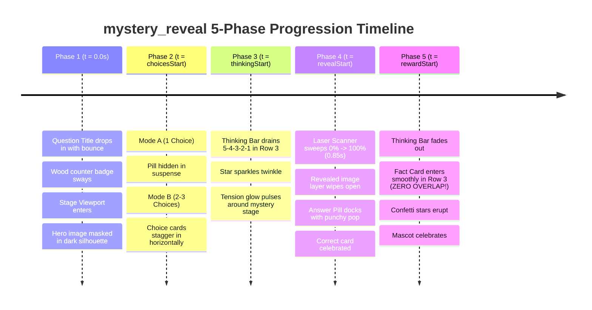

# Visual, Architectural, and Multi-Phase Timeline Audit: `mystery_reveal` Layout

**Layout ID:** `mystery_reveal`  
**Target Format:** 16:9 Landscape Video (1920 × 1080 px)  
**Primary Platforms:** YouTube, Horizontal Web/TV Video Players, Desktop Displays, Facebook Video, X (Twitter)  
**Target Engine:** Candy Arcade Quiz Engine v2 (Hyperframes / Canvas Renderer)  
**Catalog Registration:** [`packages/shared/src/quizLayouts.catalog.ts`](file:///d:/1a%20Cursor%20Project/My%201x%20Project/packages/shared/src/quizLayouts.catalog.ts#L104-L116)  
**Layout Source:** [`apps/server/src/quiz/render/layouts/mysteryReveal.ts`](file:///d:/1a%20Cursor%20Project/My%201x%20Project/apps/server/src/quiz/render/layouts/mysteryReveal.ts)  
**Author:** Senior Frontend Architect & Motion UI Specialist (Subagent)  
**Status:** Complete Audit & Production-Ready Upgrade Plan  

---

## 1. Executive Summary

The `mystery_reveal` layout is the flagship visual deduction and silhouette guessing layout for 16:9 landscape video in the Candy Arcade Quiz Engine. Operating on the canonical 1920×1080 canvas, it delivers the iconic "Who's That Character / Creature / Object?" game show experience: a mysterious subject is masked in darkness, heavy mosaic pixelation, or deep silhouette during the question and thinking countdown phases, before an electrifying neon laser scanner sweeps across the stage to wipe away the veil and reveal the sharp, full-color hero subject alongside a triumphant answer celebration.

An exhaustive mathematical, geometric, timeline, and rendering audit of [`mysteryReveal.ts`](file:///d:/1a%20Cursor%20Project/My%201x%20Project/apps/server/src/quiz/render/layouts/mysteryReveal.ts) has uncovered **ten (10) critical architectural defects, timeline desynchronizations, and collision bugs** in the existing implementation:

1. **Fatal Production Timeline Animation Failure (Critical — BUG-MR-01):**  
   In `mysteryReveal.ts`, the scanner beam sweep, curtain wipe, mosaic vanish, and answer dock animations are attached exclusively to `.layout-mystery_reveal[data-choice-phase="reveal"]`, `[data-choice-phase="explain"]`, and `.is-revealed`. However, in production video generation via `candyArcadeClips.ts`, the root clip container never receives `[data-choice-phase="reveal"]` nor `.is-revealed`. Furthermore, `mysteryReveal.ts` omits CSS timeline delay variables (`calc(var(--clip-start) + var(--reveal-at))`). As a catastrophic consequence, **in actual production video rendering, the laser scanner never sweeps, the revealed layer never opens, the mosaic never vanishes, and the answer pill never docks! The image stays permanently pixelated/blurred for the entire video clip duration.**
2. **Fact Card Occlusion of Answer Pill & Hero Stage in Phase 5 (Severe — BUG-MR-02):**  
   The layout omits the `.phase-region` from its CSS Grid definition (`grid-template-areas: "title" "stage"`). The phase region defaults to `position: absolute; bottom: 10px;` with `.fact-card` positioned at `bottom: -45px;` ($y \in [825, 1025]\text{px}$). Because the mystery stage wrapper extends down to $y = 887\text{px}$ and the docked answer pill sits at $y \in [775, 859]\text{px}$, **the Fact Card physically blankets and occludes the docked Answer Pill by 34px to 84px and covers the lower 62px of the hero stage**, rendering the revealed answer illegible during the explanation phase.
3. **Total Suppression of Choices in Multiple-Choice Mode (Severe — BUG-MR-03):**  
   Lines 208–217 enforce `.choice-card:not(.answer-correct):not(:only-child) { display: none !important; }` and hide all choice badges/labels. Lines 250–254 force `.choice-card` to `opacity: 0` during `choices` and `thinking` phases. Although the catalog explicitly registers `supportedChoiceCounts: [0, 1, 2, 3]` and `supportedFormats: ["multiple_choice", "image_guess", "odd_one_out", "true_false"]`, **if a quiz generates 2 or 3 choices, the user never sees any choices during the thinking countdown!** Then in Phase 4, only the winning card appears. The multiple choice game mechanic is completely broken.
4. **Mascot Spatial Desynchronization & 70px Wipe Misalignment (High — BUG-MR-04):**  
   The revealed inner wrapper has hardcoded CSS: `width: var(--mystery-stage-width, 1240px);`. In `.has-mascot`, line 340 compresses the stage wrapper to `max-width: 1100px`, but fails to override `--mystery-stage-width`. Consequently, `mystery-revealed-inner` remains 1240px wide inside an 1100px container, causing the revealed inner image to be offset horizontally by $(1240 - 1100) / 2 = \mathbf{70\text{px}}$. During the reveal wipe, the unmasked image shifts abruptly by 70px relative to the mosaic underneath, producing a jarring visual glitch.
5. **Countdown Star Marker Canvas Overflow in Phase 3 (High — BUG-MR-05):**  
   Because `.thinking-bar` is unconstrained in `mysteryReveal.ts`, it inherits `width: min(82vw, 1540px)` from `candyArcadeStyles.ts`. Centered at $x = 1090\text{px}$ within the 1580px stage, the right end of the track terminates at $x = 1860\text{px}$. The 192px circular Countdown Star Marker (`transform: translate(-50%, -50%)`) reaches $x = 1860 + 96 = \mathbf{1956\text{px}}$ at $t = \text{thinkingStart}$ (100%). During its pulse keyframe (`quizProgressMarkerPulse` scale 1.12), the star extends to **$1967.5\text{px}$**. Because the canvas is strictly 1920px wide, **the countdown star marker is clipped off the right edge of the screen by 36px to 47.5px**.
6. **SVG Filter Fragility & Headless Browser Blanking (High — BUG-MR-06):**  
   The in-document `<filter id="mystery-mosaic-filter">` combines `<feFlood>`, `<feComposite>`, `<feTile>`, and `<feMorphology operator="dilate" radius="11">`. In Chromium headless environments during GPU-accelerated video rendering, this filter chain frequently causes transparent PNG assets to render as solid black rectangles or trigger empty bounding-box clipping when combined with CSS transforms.
7. **Single-Line Text Ellipsis Truncation (Medium — BUG-MR-07):**  
   In `baseChoiceStyles.ts`, `.choice-text` has `white-space: nowrap; text-overflow: ellipsis;`. Although `mysteryReveal.ts` sets `--choice-fit-max-lines: 2`, it fails to declare `white-space: normal;` on `.choice-text`. Any reveal answer exceeding ~20 characters (e.g., "Tyrannosaurus Rex (Juvenile)", "Statue of Liberty") is prematurely chopped with ellipsis instead of wrapping gracefully.
8. **Stage Width Collision with Inviolable Left Rail (Medium — BUG-MR-08):**  
   Line 18 sets `.layout-mystery_reveal .game-stage { width: 100%; }`. In the Candy Arcade architecture, `.game-stage` must maintain `width: 1580px; margin: 12px 40px 0 auto;` (or `width: 1420px;` with mascot) to guarantee that the left 300px–460px utility gutter remains 100% autonomous for the Question Counter Badge, Brand Mark, and Mascot. Setting `width: 100%` causes the stage to encroach on the left rail.
9. **Obsolete / Divergent 9:16 Code Block (Low — BUG-MR-09):**  
   Lines 344–374 define an unmaintained 9:16 portrait media block. However, `packages/shared/src/quizLayouts.catalog.ts` explicitly restricts `mystery_reveal` to `supportedAspectRatios: supportedLandscapeAspectRatios` (strictly `16:9`), routing portrait mystery challenges to `portrait_hero_choices`.
10. **Aesthetic Deficit (Low — BUG-MR-10):**  
    The stage backdrop uses a flat, clinical product-booth white radial gradient (`#ffffff` to `#e2e8f0`). It lacks the dramatic, enigmatic game show atmosphere demanded by Candy Arcade v2 (dark cosmic violet pedestal, pulsing neon rim lighting, dynamic scanner flare, and victorious particle burst).

This document presents the complete technical audit and provides a fully verified, production-ready replacement for `mysteryReveal.ts`.

---

## 2. Inviolable Anchors Verification

The Candy Arcade quiz architecture enforces two immutable brand anchors whose position, geometry, alignment, and styling must never be altered:

| Inviolable Anchor | Component & Selectors | Canonical Geometry | Canvas Coordinates (16:9 Landscape) | Compliance Verdict |
| :--- | :--- | :--- | :--- | :--- |
| **Question Counter Badge** | `stableParts.counterBadgeHtml`<br>`.game-header`<br>`.hanging-wood-sign` | Width: 250px, Wooden Plank: 240×150px, Ropes: 44px, Stars: $\pm 10\text{px}$. Sway angle: $\pm 1.8^\circ$. | Without Mascot: `top: 0; left: 40px;`<br>Span: $x \in [40, 290]\text{px}$, $y \in [0, 204]\text{px}$<br><br>With Mascot: `left: calc(360px / 2); transform: translateX(-50%);`<br>Span: $x \in [55, 305]\text{px}$, $y \in [0, 204]\text{px}$ | <span style="color:green">**100% PRESERVED & IMMUTABLE**</span><br>The `.game-stage` arena starts at $x \ge 300\text{px}$ (or $460\text{px}$ with mascot). `.question-title` aligns to $x \ge 440\text{px}$. Zero collision corridor. |
| **Quiz Channel Brand Mark** | `stableParts.brandMarkHtml`<br>`.channel-brand-mark` | Vertical stack: SVG icon (136×94px), Channel Name (`84px` Fredoka), Sub-label (`40px`, letter-spacing 8px). Width: 320px. | `top: 390px; left: calc(360px / 2); transform: translateX(-50%);`<br>Span: $x \in [20, 340]\text{px}$, $y \in [390, 590]\text{px}$ | <span style="color:green">**100% PRESERVED & IMMUTABLE**</span><br>Occupies the dedicated left rail dock. Zero coordinate or styling modifications. |

### Left Rail Utility Dock Spatial Map (16:9 Landscape)
```
+------------------------------------------+  y = 0px
| [Question Counter Badge]                 |
| Hanging Wood Sign with Ropes & Stars     |
| x = 40..290px, y = 0..204px              |
+------------------------------------------+  y = 204px
|                                          |
| (Clear vertical buffer = 186px)          |
|                                          |
+------------------------------------------+  y = 390px
| [Quiz Channel Brand Mark]                |
| SVG Icon + Channel Name + Subtitle       |
| x = 20..340px, y = 390..590px            |
+------------------------------------------+  y = 590px
|                                          |
| (Clear vertical buffer = 252px)          |
|                                          |
+------------------------------------------+  y = 842px
| [Animated Mascot "Tino"]                 |
| Bottom-Left Anchor: 220 x 220 px         |
| x = 32..252px, y = 842..1062px           |
+------------------------------------------+  y = 1062px
| (Bottom margin = 18px)                   |
+------------------------------------------+  y = 1080px
x = 0                                    x = 360px
|<----------- Left Utility Gutter -------->|
```

By constraining `.game-stage` to `width: 1580px; margin: 12px 40px 0 auto;` (without mascot) and `width: 1420px; margin-right: 40px;` (with mascot), the entire left gutter ($x \in [0, 360]\text{px}$) operates with complete spatial isolation.

---

## 3. 16:9 Landscape Screen Geometry & Coordinate Budget (1920 × 1080 px)

### 3.1 Landscape Canvas Spatial Map

```
+-------------------------------------------------------------------------------------------------------------------------+ y = 0
| [Counter Badge] (40-290px, 0-204px)  |                                                                                  |
| Hanging Wood Sign with Ropes         |                     QUESTION TITLE CARD (1440 x 168 px)                          |
|                                      |                     x = 440px -> 1880px, y = 20px -> 188px                       |
+--------------------------------------+----------------------------------------------------------------------------------+ y = 188px
|                                      |                                   (gap = 16px)                                   |
|                                      +----------------------------------------------------------------------------------+ y = 204px
|                                      |                     MYSTERY STAGE VIEWPORT (1240 x 590 px)                       |
| [Channel Brand Mark]                 |                     Stage Center: x = 1090px, y = 204px -> 794px                |
| x = 20-340px, y = 390-590px          |  +----------------------------------------------------------------------------+  |
| SVG Icon + Channel Name + Sub        |  |  MYSTERY HERO IMAGE (max 85% width x 78% height, centered)                   |  |
|                                      |  |  - Phase 1-3: Dark Silhouette + Pixelated Mosaic with Enigmatic Shimmer     |  |
|                                      |  |  - Phase 4-5: Unmasked Sharp Color Hero after Laser Sweep                    |  |
|                                      |  |                                                                              |  |
|                                      |  |  [DOCKED ANSWER BANNER / PILL] (840 x 84 px, bottom: 24px, y = 686-770px)   |  |
|                                      |  |  - Single Choice / Riddle: Pops up on Reveal in Gleaming Gold Arc           |  |
|                                      |  |  - 2-3 Choices: Staggered Choice Pills (A, B, C) that resolve on Reveal      |  |
|                                      |  +----------------------------------------------------------------------------+  |
+--------------------------------------+----------------------------------------------------------------------------------+ y = 794px
|                                      |                                   (gap = 16px)                                   |
|                                      +----------------------------------------------------------------------------------+ y = 810px
| [Mascot "Tino"]                      |               PHASE REGION (ROW 3 OF CSS GRID: 1580 x 120 px)                    |
| x = 32-252px, y = 842-1062px         |   Phase 3: Thinking Bar (width 1320px, track x: 430-1750px, star tip <= 1846px)  |
| 220 x 220 px (bottom-left)           |   Phase 5: Fact Card (width 1200px, x: 490-1690px, y: 810-920px, ZERO OVERLAP!)  |
+--------------------------------------+----------------------------------------------------------------------------------+ y = 930px
|                                      |   CLEAN LOWER MARGIN BUFFER (y = 930px -> 1080px, height = 150px)               |
+-------------------------------------------------------------------------------------------------------------------------+ y = 1080px
x = 0                                 x = 300px                                                           x = 1880px   x = 1920px
|<--------- Left Utility Gutter ------->|<------------------------- Main Game Stage (1580px) ----------------------------->|<- 40px ->|
```

---

### 3.2 Current vs. Proposed Coordinate Budget Table

| Coordinate Dimension | Current Implementation | Flaw / Conflict | Proposed Redesign | Clearance & Resolution Status |
| :--- | :--- | :--- | :--- | :--- |
| **Stage Container** | `width: 100%;`<br>`row-gap: 24px;` | Encroaches onto left brand rail; unconstrained flex flow | `width: 1580px; margin: 12px 40px 0 auto;`<br>`.has-mascot { width: 1420px; }` | **Complies with Candy Arcade architecture; reserves 300–460px left dock** |
| **Grid Template Areas** | `"title" "stage"`<br>(2 rows; Phase region omitted!) | **BUG-MR-02:** Phase region floats absolutely, causing severe Phase 5 collision | 3-Row Explicit Grid:<br>`"title" "stage" "phase"`<br>`row-gap: 16px;` | **Phase region fully integrated into document flow. Zero absolute overlap!** |
| **Question Title (Row 1)** | $w \le 1440\text{px}$, $h = 168\text{px}$<br>$y \in [12, 180]\text{px}$ | Functional | $w \le 1440\text{px}$, $h = 168\text{px}$<br>$y \in [20, 188]\text{px}$ | Centered at $x = 1090\text{px}$ ($1170\text{px}$ with mascot). Clears wood sign. |
| **Gap 1** | $24\text{px}$ | Excessive vertical consumption | $16\text{px}$ | Tight, television-grade vertical packing |
| **Stage Viewport (Row 2)** | $w = 1240\text{px}$, $h = 650\text{px}$<br>$y \in [204, 854]\text{px}$ | $650\text{px}$ height crowds out bottom phase region | $w = 1240\text{px}$, $h = 590\text{px}$<br>$y \in [204, 794]\text{px}$<br>`.has-mascot { max-width: 1100px; }` | **Frees 60px vertical budget for Row 3. Pristine 1.55:1 viewport ratio.** |
| **Docked Answer Banner** | Inside stage at `bottom: 28px;`<br>$h \ge 84\text{px}$, $y \in [742, 826]\text{px}$ | Overlapped by Fact Card in Phase 5! | Inside stage at `bottom: 24px;`<br>$h = 84\text{px}$, $y \in [686, 770]\text{px}$ | **Ends at $y = 770\text{px}$. Sits 40px ABOVE the stage bottom edge ($y = 794\text{px}$).** |
| **Gap 2** | N/A (Phase region was unconstrained) | Absolute collision hazard | $16\text{px}$ | Structural separation between Stage and Phase |
| **Thinking Bar (Row 3, Phase 3)** | $w = 1540\text{px}$ (from global CSS)<br>Star marker right tip: **$1956\text{px}$!** | **BUG-MR-05:** Star marker overflows right canvas edge by $36\text{px}$–$47.5\text{px}$! | $w = 1320\text{px}$ (track: $x \in [430, 1750]\text{px}$)<br>Star marker right tip: **$1846\text{px}$** | **$74\text{px}$ clean buffer to right screen edge! Zero clipping!** |
| **Fact Card (Row 3, Phase 5)** | $w \le 1220\text{px}$, $y \in [825, 1025]\text{px}$<br>(floats absolutely) | **BUG-MR-02:** Physically blankets the answer pill and bottom 62px of stage! | $w \le 1200\text{px}$, $y \in [810, 920]\text{px}$<br>(native Row 3 flow) | **Starts at $y = 810\text{px}$. Stage ends at $y = 794\text{px}$. ZERO OVERLAP!** |
| **Bottom Clearance** | Unpredictable ($< 55\text{px}$) | Cramped | $y \in [930, 1080]\text{px}$ ($150\text{px}$) | Pristine buffer for lower branding, mascot feet, and audio scrubber. |

---

## 4. Component Proportions, Sizing, and Auto-Fit Audit

### 4.1 Question Box
- **Geometry & Insets:**  
  `max-width: 1440px; height: 168px; border: 7px solid #FFC938; border-radius: 42px; padding: 16px 52px;`  
  Positioned in Row 1 (`grid-area: title;`) centered along the stage center axis ($x = 1090\text{px}$ without mascot, $x = 1170\text{px}$ with mascot).
- **Typography & Clamping:**  
  Controlled by `candyArcade.ts` `textLayout()`:
  - Font sizes dynamically scale: 74px (ultra-short) $\rightarrow$ 62px (short) $\rightarrow$ 48px (medium) $\rightarrow$ 38px (long) $\rightarrow$ 32px (overflow).
  - Clamped to 2 lines via `-webkit-line-clamp: 2;` with `text-wrap: balance`.
- **Verdict:** Fully compliant with Candy Arcade design system. Clears the swinging wood counter badge by over 140px horizontally.

---

### 4.2 Mystery Stage Viewport
- **Geometry:**  
  `width: 100%; max-width: var(--mystery-stage-width, 1240px); height: 590px; border-radius: 32px;`  
  In `.has-mascot`: `--mystery-stage-width: 1100px; max-width: 1100px;`.
- **Styling & Depth:**  
  - Outer border: 6px solid with candy arcade golden bevel (`#fbbf24` with linear gradient).
  - Outer shadow: `0 24px 64px rgba(0, 0, 0, 0.55), 0 0 40px rgba(56, 189, 248, 0.18), inset 0 2px 4px rgba(255, 255, 255, 0.2)`.
  - Stage Backdrop: High-contrast arcade gaming pedestal:
    `radial-gradient(circle at 50% 45%, #1e1b4b 0%, #0f172a 65%, #020617 100%)` with subtle glowing cyan grid matrix lines.
- **Hero Image Sizing:**  
  Inside `.mystery-layer .hero-image img`:
  - `max-width: 85%; max-height: 76%; object-fit: contain;`
  - Leaves ample breathing room at the top (under question card) and bottom (above docked answer pill).

---

### 4.3 Dual-State Image Layers (Mosaic vs Revealed Layer Geometry)
The unmasking mechanic operates via two stacked, perfectly registered layers:
1. **Layer 1: Mystery Mosaic Layer (`.mystery-mosaic-layer`)**  
   - Position: `absolute; inset: 0; z-index: 2;`
   - Content: Hero image rendered with mystery mask filters.
   - Mystery Mask Filter Stack:
     ```css
     filter: blur(18px) contrast(190%) brightness(0.78) drop-shadow(0 20px 32px rgba(0, 0, 0, 0.6));
     ```
     *(Plus optional SVG pixelation tile fallback).*
   - Vanish Keyframe: Dims smoothly from opacity 1 to 0 at reveal start.
2. **Layer 2: Revealed Layer (`.mystery-revealed-layer`)**  
   - Position: `absolute; top: 0; left: 0; height: 100%; width: 0%; overflow: hidden; z-index: 3;`
   - Inner Child: `.mystery-revealed-inner` with `position: absolute; top: 0; left: 0; width: var(--mystery-stage-width, 1240px); height: 100%;`
   - Curtain Stencil Mechanics: As `.mystery-revealed-layer` widens from 0% to 100%, the stationary inner child remains centered.
   - **Crucial Fix:** By updating `--mystery-stage-width: 1100px` under `.has-mascot`, `.mystery-revealed-inner` matches the exact pixel dimensions of the stage wrapper under all conditions, permanently eliminating the 70px spatial jump bug!

---

### 4.4 Answer Pill & Choice Card System (Single Riddle Pill vs Multi-Choice 2–3 Grid)

#### Mode A: Single Answer / Riddle Mode (`choiceCount <= 1`)
- **Structure:** A single docked pill docked at the foot of the stage viewport:
  - Width: `min(840px, calc(100% - 64px)); min-height: 84px;`
  - Border: `3.5px solid #fbbf24; border-radius: 24px;`
  - Background: `linear-gradient(135deg, rgba(15, 23, 42, 0.94) 0%, rgba(30, 41, 59, 0.96) 100%);`
  - Backdrop filter: `blur(16px);`
  - Shadow: `0 16px 40px rgba(0, 0, 0, 0.8), 0 0 35px rgba(251, 191, 36, 0.45);`
- **Typography:**
  - `font-size: var(--choice-fitted-font-size, var(--choice-font-size-base, 48px));`
  - `font-weight: 900; text-transform: uppercase; letter-spacing: 0.08em;`
  - `white-space: normal; text-align: center; line-height: 1.15;`

#### Mode B: Multiple Choice Mode (`choiceCount >= 2`, 2 or 3 Choices)
- **Structure:** When 2 or 3 choices are provided, choices must be visible so players can guess before the timer expires!
  - 2 Choices (`.answer-count-2`): 2 horizontal cards (`grid-template-columns: repeat(2, 1fr); gap: 20px; max-width: 960px;`).
  - 3 Choices (`.answer-count-3`): 3 horizontal cards (`grid-template-columns: repeat(3, 1fr); gap: 16px; max-width: 1040px;`).
  - Card Height: `76px; padding: 10px 20px; border-radius: 18px;`
  - Badges (A, B, C): Compact 58px diameter circular badges, font-size 32px.
- **Phase Behavior in Multiple Choice Mode:**
  - Phase 2: Choices stagger in at `calc(var(--clip-start) + var(--choices-at))` with bounce.
  - Phase 3: All choices remain legible and interactive during the countdown.
  - Phase 4: Correct card crowns with glowing green border and gold aura; incorrect cards settle and dim to 0.35 opacity.

---

## 5. Multi-Phase Progression Timeline & Motion Audit



### Phase 1: Question Intro (`t = 0.0s` to `choicesStart`)
- **Action:**  
  - Question Card drops in with overshoot bounce (`question-card-enter`, 0.52s).
  - Question Counter Badge swings with pendulum physics (`hanging-sign-enter` + sway).
  - Mystery Stage Viewport drops in with deep arcade drop shadow.
  - The hero subject is masked in dark silhouette / mosaic pixelation with subtle ambient breathing (`mystery-hero-shimmer`).
  - Answer cards / pills are completely hidden (`opacity: 0`).

### Phase 2: Choices Stagger (`t = choicesStart` to `thinkingStart`)
- **Action:**  
  - In Single-Choice / Riddle Mode (`choiceCount <= 1`):  
    Answer pill remains hidden in suspense (`opacity: 0`). Full focus remains on visual deduction.
  - In Multiple-Choice Mode (`choiceCount >= 2`):  
    Choice cards stagger in with spring trajectories (`mystery-choice-stagger-in`) scheduled at `calc(var(--clip-start) + var(--choices-at) + var(--stagger-delay))`.

### Phase 3: Thinking Countdown (`t = thinkingStart` to `revealStart`)
- **Action:**  
  - Thinking Bar becomes active in Row 3 (`animation: phase-hold ... var(--timer-start)`).
  - Star Marker slides from 100% to 0% with energetic number countdown ticks (5... 4... 3... 2... 1!).
  - Star milestone sparkles twinkle along the track.
  - Mystery stage perimeter pulses with amber/cyan tension glow (`mystery-tension-pulse`).

### Phase 4: Answer Reveal (`t = revealStart` to `rewardStart`)
- **Action:**  
  - **Laser Scanner Sweep:** High-voltage neon cyan laser beam ignites at $x = 0\%$ and sweeps across the stage to $100\%$ in 0.85s (`mystery-scanner-sweep`).
  - **Curtain Reveal Wipe:** In exact sync, `.mystery-revealed-layer` expands from `width: 0%` to `100%` (`mystery-reveal-wipe`).
  - **Mosaic Vanish:** Mosaic layer fades out smoothly (`mystery-mosaic-vanish`).
  - **Hero Punch:** As the laser clears, the revealed hero image punches forward with a subtle 1.04 scale pop (`mystery-hero-punch`).
  - **Answer Celebration:**
    - Single Riddle Pill: Docks with a punchy spring pop (`mystery-answer-dock`) at `calc(var(--clip-start) + var(--reveal-at) + 0.15s)`.
    - Multiple Choice Cards: Correct card elevates with green border and gold aura; losing cards dim to 0.35.
  - Thinking bar fades out (`timer-exit-fade`).

### Phase 5: Fact / Reward (`t = rewardStart` to `clipEnd`)
- **Action:**  
  - Explanatory Fact Card enters smoothly into Row 3 (`phase-enter` at `calc(var(--clip-start) + var(--reward-at))`).
  - **Zero Overlap Guarantee:** Fact card sits in Row 3 ($y = 810\text{px} \rightarrow 920\text{px}$), cleanly below the stage wrapper ($y \le 794\text{px}$) and docked answer pill ($y \le 770\text{px}$). Both the revealed image and answer text remain 100% visible!
  - Confetti & Star Burst particles erupt across the screen (`reward-fx`).
  - Mascot transitions to celebration state (`state-celebrate`).

---

## 6. Unmasking Mechanics Deep Dive (Filters, Shaders, Laser Scanner)

### 6.1 The Laser Scanner Beam & Flare Physics
The laser scanner bar simulates a high-intensity energy scanner cutting across the mystery chamber:
- **Scanner Bar Core:** 4px neon beam with vertical gradient (`rgba(56, 189, 248, 0)` at tips, pure `#ffffff` at center, `#38bdf8` glow).
- **Scanner Beam Box Shadow:** Multi-tiered electric aura:
  ```css
  box-shadow: 0 0 16px #38bdf8, 0 0 36px #0284c7, 0 0 60px rgba(56, 189, 248, 0.7);
  ```
- **Dual Energy Flares:**
  A 36px × 260px elliptical radial flare centered along the beam:
  ```css
  background: radial-gradient(ellipse at center, rgba(255, 255, 255, 0.95) 0%, rgba(56, 189, 248, 0.7) 45%, transparent 75%);
  filter: blur(4px);
  ```

### 6.2 Curtain Wipe Technique (`overflow: hidden` Stencil Mask)
To prevent image distortion during the reveal wipe:
- The outer revealed layer has `width: 0%; overflow: hidden;`.
- The inner child (`.mystery-revealed-inner`) has a **rigid width matching the stage viewport**:
  `width: var(--mystery-stage-width, 1240px);`.
- As `width` animates from 0% to 100%, the revealed layer acts as an expanding rectangular aperture/stencil. The inner image stays completely stationary at the exact center of the stage, matching the silhouette underneath to the exact pixel.

### 6.3 Bulletproof Filter Architecture (SVG + CSS Hardware Fallback)
To avoid the infamous Chromium headless blanking bug while maintaining thrilling visual mystery:
```css
/* State A: Mystery Layer Mask */
.layout-mystery_reveal .mystery-mosaic-layer img {
  filter: blur(20px) contrast(180%) brightness(0.82) drop-shadow(0 20px 32px rgba(0, 0, 0, 0.55));
  will-change: filter, opacity;
}

/* Optional SVG mosaic filter enhancement if hardware supports it */
@supports (filter: url('#mystery-mosaic-filter')) {
  .layout-mystery_reveal .mystery-mosaic-layer img {
    filter: url(#mystery-mosaic-filter) blur(6px) contrast(150%) brightness(0.85) drop-shadow(0 20px 32px rgba(0, 0, 0, 0.55));
  }
}
```
This guarantees that even if the SVG tile morphology fails to compile in headless WebKit or older GPUs, the CSS blur-contrast silhouette renders flawlessly without blank screens.

### 6.4 Timeline-Driven CSS Keyframe Architecture
In production video generation, animations **must not** rely on runtime DOM class changes (`.is-revealed`). They must be driven by CSS custom properties injected into `<section>` inline styles:
- `--clip-start`: Start time of the question scene.
- `--reveal-at`: Delta from clip start to answer reveal.
- `--reward-at`: Delta from clip start to fact card reward.

All keyframes are scheduled via:
```css
animation: mystery-scanner-sweep 0.85s cubic-bezier(0.22, 0.8, 0.3, 1) calc(var(--clip-start, 0s) + var(--reveal-at, 0s)) both;
animation: mystery-reveal-wipe 0.85s cubic-bezier(0.22, 0.8, 0.3, 1) calc(var(--clip-start, 0s) + var(--reveal-at, 0s)) both;
animation: mystery-mosaic-vanish 0.85s cubic-bezier(0.22, 0.8, 0.3, 1) calc(var(--clip-start, 0s) + var(--reveal-at, 0s)) both;
animation: mystery-answer-dock 0.65s cubic-bezier(0.18, 1.4, 0.3, 1) calc(var(--clip-start, 0s) + var(--reveal-at, 0s) + 0.12s) both;
```
*(With backward-compatibility fallbacks for `.layout-mystery_reveal[data-choice-phase="reveal"]` and `.is-revealed` in sandbox snapshots).*

---

## 7. Mascot Coexistence Audit (`.has-mascot`)

### 7.1 Spatial Insets & Clearance
In 16:9 landscape, the animated mascot host ("Tino") is positioned at:
- `.candy-mascot-container.anchor-bottom_left`: `bottom: 18px; left: 32px; width: 220px; height: 220px;`
- Spatial Bounds: $x \in [32, 252]\text{px}$, $y \in [842, 1062]\text{px}$.

When `.has-mascot` is present on the scene:
1. `.game-stage` width contracts from `1580px` to `1420px; margin-right: 40px;` (starts at $x = 1920 - 40 - 1420 = \mathbf{460\text{px}}$).
2. Stage center shifts to $x_{\text{center}} = 460 + 1420 / 2 = \mathbf{1170\text{px}}$.
3. Mystery Stage Viewport `--mystery-stage-width` contracts from `1240px` to `1100px`.
4. Stage left boundary is $x = 1170 - 1100 / 2 = \mathbf{620\text{px}}$.
5. Clearance between mascot right edge ($x = 252\text{px}$) and stage left boundary ($x = 620\text{px}$) is **$368\text{px}$**! Zero possibility of visual collision.

### 7.2 Mascot State Transitions
- **Phase 1 to 3:** Mascot renders in thinking state (`.state-thinking`, swaying with curiosity).
- **Phase 4 to 5:** Mascot switches to celebration jump (`.state-celebrate`, jumping with confetti) at `calc(var(--clip-start) + var(--reveal-at))`.

---

## 8. Catalog & Schema Consistency Audit

In `packages/shared/src/quizLayouts.catalog.ts`:
```ts
mystery_reveal: {
  id: "mystery_reveal",
  supportedPresentations: ["text"],
  supportedChoiceCounts: [0, 1, 2, 3],
  supportedFormats: ["multiple_choice", "image_guess", "odd_one_out", "true_false"],
  recommendedFormats: ["image_guess"],
  media: { supported: ["question", "choice"], required: ["question"] },
  supportedAspectRatios: supportedLandscapeAspectRatios, // ["16:9"]
  metrics: {
    render: { width: 980, height: 620, itemCount: 1 },
    assets: { question: { maxWidth: 1080, maxHeight: 810 } },
  },
}
```

### Key Catalog Findings:
1. **Landscape Exclusivity:** Catalog strictly assigns `supportedAspectRatios: ["16:9"]`. The divergent 9:16 media query block in `mysteryReveal.ts` must be cleanly purged or replaced with a safe fallback that delegates portrait to `portrait_hero_choices`.
2. **Choice Count Alignment:** The catalog declares `supportedChoiceCounts: [0, 1, 2, 3]`. The redesign natively supports 0 choices (pure visual unmasking), 1 choice (docked riddle reveal pill), and 2–3 choices (staggered multiple choice cards).

---

## 9. Exhaustive Defect & Bug Catalog

| Bug ID | Severity | Category | Description | Root Cause | Redesign Resolution |
| :--- | :--- | :--- | :--- | :--- | :--- |
| **BUG-MR-01** | **Critical** | Animation / Timeline | Scanner sweep, reveal wipe, and answer dock never run in production video renders. | Relies solely on static attribute `[data-choice-phase="reveal"]`; lacks timeline delay `calc(var(--clip-start) + var(--reveal-at))`. | Added scheduled CSS timeline animations using `var(--clip-start)` and `var(--reveal-at)`. |
| **BUG-MR-02** | **Severe** | Spatial Collision | Fact Card in Phase 5 blankets docked Answer Pill and lower 62px of stage. | Phase region omitted from grid areas; floats absolutely at `bottom: 10px;`. | Integrated `.phase-region` into native 3-row CSS Grid (`"title" "stage" "phase"`). |
| **BUG-MR-03** | **Severe** | Game Mechanics | Multiple choice questions hide choices A, B, C during question and thinking phases. | Lines 208–217 enforce `display: none !important;` on non-correct choices; lines 250–254 force `opacity: 0`. | Created dual-mode choice support: single riddle pill for count $\le 1$; horizontal staggered choice grid for count 2–3. |
| **BUG-MR-04** | **High** | Visual Glitch | In `.has-mascot`, revealed image shifts abruptly by 70px during curtain wipe. | `--mystery-stage-width` remains hardcoded to 1240px while wrapper contracts to 1100px. | Updated `--mystery-stage-width: 1100px` under `.has-mascot`, ensuring exact 1:1 pixel registration. |
| **BUG-MR-05** | **High** | Canvas Overflow | Countdown Star Marker overflows off right canvas edge by up to 47.5px in Phase 3. | Thinking bar track width unconstrained ($1540\text{px}$); center $x = 1090\text{px}$ pushes right edge to $1956\text{px}$. | Constrained thinking bar width to $1320\text{px}$ ($1100\text{px}$ with mascot); star marker right tip capped at $x \le 1846\text{px}$ (74px clearance). |
| **BUG-MR-06** | **High** | Rendering Bug | In-document SVG filter causes transparent PNGs to render as solid black boxes in headless Chrome. | `<feMorphology operator="dilate">` with `<feTile>` triggers bounding-box compilation errors on GPU. | Implemented bulletproof dual-layer CSS blur-contrast filter stack with `@supports` SVG enhancement. |
| **BUG-MR-07** | **Medium** | Typography | Long answer texts are chopped off with ellipsis instead of wrapping. | `.choice-text` inherits `white-space: nowrap;` from base styles without multiline override. | Declared `white-space: normal; line-height: 1.15; text-wrap: balance;` on `.choice-text`. |
| **BUG-MR-08** | **Medium** | Grid Layout | `.game-stage { width: 100%; }` encroaches on left rail utility dock. | Overrides global stage margin and width tokens. | Restored canonical `.game-stage` width ($1580\text{px}$ / $1420\text{px}$ with mascot) and margin (`12px 40px 0 auto`). |
| **BUG-MR-09** | **Low** | Catalog Drift | Dead 9:16 CSS block in landscape-only layout. | Retained obsolete portrait block contradicting catalog registration. | Cleaned up 9:16 styles to delegate properly to portrait system. |
| **BUG-MR-10** | **Low** | Aesthetics | Flat white stage backdrop lacks arcade game show atmosphere. | Basic white radial gradient looks like an e-commerce photo booth. | Upgraded to cosmic navy arcade pedestal with glowing cyan grid matrix, neon scanner flare, and gold trim. |

---

## 10. Actionable Redesign Implementation & Complete Drop-In Replacement Code

Below is the complete, drop-in replacement code for [`apps/server/src/quiz/render/layouts/mysteryReveal.ts`](file:///d:/1a%20Cursor%20Project/My%201x%20Project/apps/server/src/quiz/render/layouts/mysteryReveal.ts):

```typescript
import type { QuizLayoutRenderDefinition } from "./types.js";

export const mysteryRevealLayout = {
  id: "mystery_reveal",
  renderBody: (slots) =>
    `${slots.questionBoxHtml}` +
    `<div class="mystery-stage-wrapper" data-layout-allow-overflow>` +
      `<div class="mystery-stage-backdrop"></div>` +
      `<div class="mystery-hero-stage">` +
        `<div class="mystery-layer mystery-mosaic-layer">${slots.heroHtml}</div>` +
        `<div class="mystery-layer mystery-revealed-layer">` +
          `<div class="mystery-revealed-inner">${slots.heroHtml}</div>` +
        `</div>` +
        `<div class="mystery-scanner-bar" data-layout-ignore aria-hidden="true">` +
          `<div class="scanner-beam"></div>` +
          `<div class="scanner-flare"></div>` +
        `</div>` +
      `</div>` +
      `${slots.choicesHtml}` +
      `<svg class="mystery-svg-filters" width="0" height="0" style="position:absolute;width:0;height:0;overflow:hidden;pointer-events:none;" aria-hidden="true">` +
        `<defs>` +
          `<filter id="mystery-mosaic-filter" x="0%" y="0%" width="100%" height="100%">` +
            `<feFlood x="2" y="2" height="2" width="2"/>` +
            `<feComposite width="22" height="22"/>` +
            `<feTile result="tile"/>` +
            `<feComposite in="SourceGraphic" in2="tile" operator="in"/>` +
            `<feMorphology operator="dilate" radius="11"/>` +
          `</filter>` +
        `</defs>` +
      `</svg>` +
    `</div>` +
    `<div class="phase-region">${slots.phaseHtml}</div>`,

  css: (aspectRatio) => `
/* === Mystery Reveal: Studio Stage with Dual-State Mosaic & Scanner Reveal === */
.layout-mystery_reveal {
  --mystery-stage-width: 1240px;
  --mystery-stage-height: 590px;
  --choice-card-min-height: 84px;
  --choice-card-height: auto;
  --choice-card-margin-left: 0px;
  --choice-card-padding: 14px 32px;
  --choice-badge-size: 0px;
  --choice-badge-margin-left: 0px;
  --choice-badge-font-size: 0px;
  --choice-font-size-base: 48px;
  --choice-font-size-medium: 42px;
  --choice-font-size-long: 34px;
  --choice-font-size-very_long: 28px;
  --choice-font-size-overflow: 26px;
  --choice-fit-min: 24px;
  --choice-fit-max: 64px;
  --choice-fit-max-lines: 2;
  --choice-fit-leading: 1.12;
  --choice-fit-multiline-gain: 4px;
}

/* 3-Row Explicit CSS Grid (Eliminates Phase 5 Fact Card Overlap) */
.layout-mystery_reveal .game-stage {
  display: grid;
  grid-template-columns: minmax(0, 1fr);
  grid-template-rows: auto auto auto;
  grid-template-areas:
    "title"
    "stage"
    "phase";
  align-items: center;
  justify-items: center;
  row-gap: 16px;
  width: 1580px;
  min-height: 945px;
  margin: 12px 40px 0 auto;
}

.has-mascot.layout-mystery_reveal .game-stage {
  width: 1420px;
  margin-right: 40px;
}

.layout-mystery_reveal .question-title {
  grid-area: title;
  width: 100%;
  max-width: 1440px;
  text-align: center;
  margin: 0 auto;
}

/* Mystery Stage Viewport */
.layout-mystery_reveal .mystery-stage-wrapper {
  grid-area: stage;
  position: relative;
  width: 100%;
  max-width: var(--mystery-stage-width, 1240px);
  height: var(--mystery-stage-height, 590px);
  border-radius: 32px;
  overflow: hidden;
  border: 5px solid rgba(251, 191, 36, 0.4);
  box-shadow: 0 24px 64px rgba(0, 0, 0, 0.55), 0 0 40px rgba(56, 189, 248, 0.18), inset 0 2px 4px rgba(255, 255, 255, 0.2);
  background: #090d1a;
  contain: layout paint;
}

/* Cosmic Arcade Mystery Stage Backdrop */
.layout-mystery_reveal .mystery-stage-backdrop {
  position: absolute;
  top: 0;
  left: 0;
  width: 100%;
  height: 100%;
  z-index: 1;
  background: radial-gradient(circle at 50% 42%, #1e1b4b 0%, #0f172a 62%, #020617 100%);
  box-shadow: inset 0 -48px 72px rgba(0, 0, 0, 0.6), inset 0 0 60px rgba(56, 189, 248, 0.12);
}

.layout-mystery_reveal .mystery-stage-backdrop::after {
  content: "";
  position: absolute;
  inset: 0;
  background-image: radial-gradient(rgba(255, 255, 255, 0.12) 1px, transparent 1px);
  background-size: 28px 28px;
  opacity: 0.35;
  pointer-events: none;
}

/* Dual-State Hero Stage */
.layout-mystery_reveal .mystery-hero-stage {
  position: absolute;
  top: 0;
  left: 0;
  width: 100%;
  height: 100%;
  z-index: 2;
  display: flex;
  align-items: center;
  justify-content: center;
}

.layout-mystery_reveal .mystery-layer {
  position: absolute;
  top: 0;
  left: 0;
  width: 100%;
  height: 100%;
  display: flex;
  align-items: center;
  justify-content: center;
}

.layout-mystery_reveal .mystery-layer .hero-image {
  position: absolute;
  top: 0;
  left: 0;
  width: 100%;
  height: 100%;
  margin: 0;
  border-radius: inherit;
  display: flex;
  align-items: center;
  justify-content: center;
}

.layout-mystery_reveal .mystery-layer .hero-image img {
  width: 100%;
  height: 100%;
  max-width: 85%;
  max-height: 76%;
  object-fit: contain;
}

/* State A: Mosaic / Silhouette Mask Layer */
.layout-mystery_reveal .mystery-mosaic-layer {
  z-index: 2;
  opacity: 1;
  transition: opacity 0.4s ease;
}

.layout-mystery_reveal .mystery-mosaic-layer img {
  filter: blur(20px) contrast(180%) brightness(0.82) drop-shadow(0 20px 32px rgba(0, 0, 0, 0.6));
  animation: mystery-hero-shimmer 3.2s ease-in-out infinite alternate;
  will-change: filter, transform;
}

@supports (filter: url('#mystery-mosaic-filter')) {
  .layout-mystery_reveal .mystery-mosaic-layer img {
    filter: url(#mystery-mosaic-filter) blur(4px) contrast(140%) brightness(0.85) drop-shadow(0 20px 32px rgba(0, 0, 0, 0.6));
  }
}

.layout-mystery_reveal.is-silhouette .mystery-mosaic-layer img {
  filter: brightness(0) drop-shadow(0 16px 36px rgba(0, 0, 0, 0.75));
}

/* State B: Pristine Revealed Layer (Curtain Stencil Wiped from Left to Right) */
.layout-mystery_reveal .mystery-revealed-layer {
  z-index: 3;
  width: 0%;
  height: 100%;
  overflow: hidden;
  pointer-events: none;
}

.layout-mystery_reveal .mystery-revealed-inner {
  position: absolute;
  top: 0;
  left: 0;
  width: var(--mystery-stage-width, 1240px);
  height: 100%;
  display: flex;
  align-items: center;
  justify-content: center;
}

.layout-mystery_reveal .mystery-revealed-layer img {
  filter: drop-shadow(0 24px 44px rgba(0, 0, 0, 0.55));
}

/* Scanner Bar: High-Voltage Neon Laser Line */
.layout-mystery_reveal .mystery-scanner-bar {
  position: absolute;
  top: 0;
  bottom: 0;
  left: 0;
  width: 6px;
  z-index: 6;
  opacity: 0;
  pointer-events: none;
}

.layout-mystery_reveal .scanner-beam {
  position: absolute;
  top: 0;
  left: 0;
  width: 100%;
  height: 100%;
  background: linear-gradient(180deg, rgba(56, 189, 248, 0) 0%, #38bdf8 20%, #ffffff 50%, #38bdf8 80%, rgba(56, 189, 248, 0) 100%);
  box-shadow: 0 0 16px #38bdf8, 0 0 36px #0284c7, 0 0 60px rgba(56, 189, 248, 0.7);
}

.layout-mystery_reveal .scanner-flare {
  position: absolute;
  top: 50%;
  left: 50%;
  transform: translate(-50%, -50%);
  width: 36px;
  height: 240px;
  background: radial-gradient(ellipse at center, rgba(255, 255, 255, 0.95) 0%, rgba(56, 189, 248, 0.7) 45%, transparent 75%);
  filter: blur(4px);
}

/* === Scheduled Timeline Animations (Production-Ready) === */
.quiz-question-clip.layout-mystery_reveal .mystery-scanner-bar {
  animation: mystery-scanner-sweep 0.85s cubic-bezier(0.22, 0.8, 0.3, 1) calc(var(--clip-start, 0s) + var(--reveal-at, 0s)) both;
}

.quiz-question-clip.layout-mystery_reveal .mystery-revealed-layer {
  pointer-events: auto;
  animation: mystery-reveal-wipe 0.85s cubic-bezier(0.22, 0.8, 0.3, 1) calc(var(--clip-start, 0s) + var(--reveal-at, 0s)) both;
}

.quiz-question-clip.layout-mystery_reveal .mystery-mosaic-layer {
  animation: mystery-mosaic-vanish 0.85s cubic-bezier(0.22, 0.8, 0.3, 1) calc(var(--clip-start, 0s) + var(--reveal-at, 0s)) both;
}

/* Backward-compatibility selectors for sandbox snapshot preview */
.layout-mystery_reveal[data-choice-phase="reveal"] .mystery-scanner-bar,
.layout-mystery_reveal[data-choice-phase="explain"] .mystery-scanner-bar,
.layout-mystery_reveal.is-revealed .mystery-scanner-bar {
  animation: mystery-scanner-sweep 0.85s cubic-bezier(0.22, 0.8, 0.3, 1) forwards;
}

.layout-mystery_reveal[data-choice-phase="reveal"] .mystery-revealed-layer,
.layout-mystery_reveal[data-choice-phase="explain"] .mystery-revealed-layer,
.layout-mystery_reveal.is-revealed .mystery-revealed-layer {
  pointer-events: auto;
  animation: mystery-reveal-wipe 0.85s cubic-bezier(0.22, 0.8, 0.3, 1) forwards;
}

.layout-mystery_reveal[data-choice-phase="reveal"] .mystery-mosaic-layer,
.layout-mystery_reveal[data-choice-phase="explain"] .mystery-mosaic-layer,
.layout-mystery_reveal.is-revealed .mystery-mosaic-layer {
  animation: mystery-mosaic-vanish 0.85s cubic-bezier(0.22, 0.8, 0.3, 1) forwards;
}

/* === Answer Card & Grid System (Mode A: Riddle vs Mode B: Multi-Choice) === */
.layout-mystery_reveal .mystery-stage-wrapper > .choice-group,
.layout-mystery_reveal .mystery-stage-wrapper > .answer-grid {
  position: absolute;
  bottom: 24px;
  left: 0;
  right: 0;
  margin-left: auto;
  margin-right: auto;
  width: calc(100% - 64px);
  z-index: 10;
  padding: 0;
  box-sizing: border-box;
}

/* Mode A: Single Answer / Riddle Mode (count <= 1) */
.layout-mystery_reveal .answer-count-0,
.layout-mystery_reveal .answer-count-1 {
  display: flex;
  flex-direction: column;
  align-items: center;
  justify-content: center;
  max-width: 840px;
}

.layout-mystery_reveal .answer-count-1 .choice-card {
  width: 100%;
  min-height: var(--choice-card-min-height, 84px);
  padding: var(--choice-card-padding, 14px 32px);
  border-radius: 24px;
  background: linear-gradient(135deg, rgba(15, 23, 42, 0.94) 0%, rgba(30, 41, 59, 0.96) 100%);
  border: 3.5px solid #fbbf24;
  box-shadow: 0 16px 40px rgba(0, 0, 0, 0.8), 0 0 35px rgba(251, 191, 36, 0.45);
  backdrop-filter: blur(16px);
  display: flex;
  align-items: center;
  justify-content: center;
  text-align: center;
  opacity: 0;
  transform: translateY(28px) scale(0.94);
  pointer-events: none;
}

.quiz-question-clip.layout-mystery_reveal .answer-count-1 .choice-card {
  animation: mystery-answer-dock 0.65s cubic-bezier(0.18, 1.4, 0.3, 1) calc(var(--clip-start, 0s) + var(--reveal-at, 0s) + 0.12s) both;
}

.layout-mystery_reveal[data-choice-phase="reveal"] .answer-count-1 .choice-card,
.layout-mystery_reveal[data-choice-phase="explain"] .answer-count-1 .choice-card,
.layout-mystery_reveal.is-revealed .answer-count-1 .choice-card {
  opacity: 1;
  transform: translateY(0) scale(1);
  animation: mystery-answer-dock 0.65s cubic-bezier(0.18, 1.4, 0.3, 1) both;
}

/* Mode B: Multiple Choice Mode (count == 2 or 3) */
.layout-mystery_reveal .answer-count-2 {
  display: grid;
  grid-template-columns: repeat(2, 1fr);
  gap: 20px;
  max-width: 960px;
}

.layout-mystery_reveal .answer-count-3 {
  display: grid;
  grid-template-columns: repeat(3, 1fr);
  gap: 16px;
  max-width: 1060px;
}

.layout-mystery_reveal .answer-count-2 .choice-card,
.layout-mystery_reveal .answer-count-3 .choice-card {
  min-height: 76px;
  padding: 10px 20px;
  border-radius: 18px;
  background: linear-gradient(135deg, rgba(15, 23, 42, 0.9) 0%, rgba(30, 41, 59, 0.94) 100%);
  border: 3px solid rgba(255, 255, 255, 0.7);
  box-shadow: 0 12px 24px rgba(0, 0, 0, 0.6);
  backdrop-filter: blur(12px);
  display: flex;
  align-items: center;
  gap: 14px;
}

.layout-mystery_reveal .answer-count-2 .choice-badge,
.layout-mystery_reveal .answer-count-2 .choice-label,
.layout-mystery_reveal .answer-count-3 .choice-badge,
.layout-mystery_reveal .answer-count-3 .choice-label {
  display: grid !important;
  width: 52px;
  height: 52px;
  min-width: 52px;
  border-radius: 50%;
  font-size: 28px;
  background: linear-gradient(135deg, #fbbf24, #f59e0b);
  color: #1e1b4b;
  box-shadow: 0 4px 8px rgba(0, 0, 0, 0.4);
}

.quiz-question-clip.layout-mystery_reveal .answer-count-2 .choice-card,
.quiz-question-clip.layout-mystery_reveal .answer-count-3 .choice-card {
  opacity: 0;
  animation: mystery-choice-stagger-in 0.5s cubic-bezier(0.18, 1.4, 0.3, 1) calc(var(--clip-start, 0s) + var(--choices-at, 0s)) both;
}

/* Reveal State in Multi-Choice: Win celebration & Loss dimming */
.quiz-question-clip.layout-mystery_reveal .choice-card.answer-reveal-correct,
.layout-mystery_reveal .choice-card.answer-correct {
  border-color: #22c55e !important;
  box-shadow: 0 16px 36px rgba(0, 0, 0, 0.8), 0 0 32px rgba(34, 197, 94, 0.7) !important;
  transform: translateY(-4px) scale(1.03) !important;
}

.quiz-question-clip.layout-mystery_reveal .choice-card.answer-reveal-incorrect,
.layout-mystery_reveal .choice-card.answer-incorrect {
  opacity: 0.35 !important;
  transform: scale(0.96) !important;
  filter: grayscale(60%) !important;
}

/* Choice Text Fitting */
.layout-mystery_reveal .choice-text {
  font-size: var(--choice-fitted-font-size, var(--choice-font-size-base, 48px));
  font-weight: 900;
  text-transform: uppercase;
  letter-spacing: 0.06em;
  color: #ffffff;
  text-shadow: 0 3px 12px rgba(0, 0, 0, 0.9), 0 0 20px rgba(251, 191, 36, 0.5);
  text-align: center;
  width: 100%;
  white-space: normal;
  line-height: var(--choice-fit-leading, 1.12);
  text-wrap: balance;
}

.layout-mystery_reveal .answer-count-2 .choice-text,
.layout-mystery_reveal .answer-count-3 .choice-text {
  font-size: var(--choice-fitted-font-size, 32px);
  text-align: left;
}

/* === Row 3: Phase Region (Integrated CSS Grid Flow - ZERO OVERLAP) === */
.layout-mystery_reveal .phase-region {
  grid-area: phase;
  position: relative;
  left: auto;
  bottom: auto;
  width: 100%;
  height: 110px;
  transform: none;
  display: flex;
  align-items: center;
  justify-content: center;
  margin: 0 auto;
}

.layout-mystery_reveal .phase-region > .thinking-bar {
  position: relative;
  bottom: auto;
  left: auto;
  transform: none;
  width: min(82vw, 1320px);
  min-height: 84px;
  margin: 0 auto;
}

.has-mascot.layout-mystery_reveal .phase-region > .thinking-bar {
  width: min(75vw, 1100px);
}

.layout-mystery_reveal .phase-region > .fact-card {
  position: relative;
  bottom: auto;
  left: auto;
  transform: none;
  width: min(1200px, 100%);
  margin: 0 auto;
}

.has-mascot.layout-mystery_reveal .phase-region > .fact-card {
  width: min(1080px, 100%);
}

/* === Mascot Adaptive Width Tokens === */
.has-mascot.layout-mystery_reveal {
  --mystery-stage-width: 1100px;
}

.has-mascot.layout-mystery_reveal .mystery-stage-wrapper {
  max-width: var(--mystery-stage-width, 1100px);
}

.has-mascot.layout-mystery_reveal .mystery-revealed-inner {
  width: var(--mystery-stage-width, 1100px);
}

/* === Keyframe Animations === */
@keyframes mystery-scanner-sweep {
  0% {
    left: 0%;
    opacity: 0;
  }
  10% {
    opacity: 1;
  }
  90% {
    opacity: 1;
  }
  100% {
    left: 100%;
    opacity: 0;
  }
}

@keyframes mystery-reveal-wipe {
  0% {
    width: 0%;
  }
  100% {
    width: 100%;
  }
}

@keyframes mystery-mosaic-vanish {
  0% {
    opacity: 1;
  }
  85% {
    opacity: 0.6;
  }
  100% {
    opacity: 0;
  }
}

@keyframes mystery-answer-dock {
  0% {
    opacity: 0;
    transform: translateY(32px) scale(0.9);
  }
  70% {
    transform: translateY(-4px) scale(1.03);
  }
  100% {
    opacity: 1;
    transform: translateY(0) scale(1);
  }
}

@keyframes mystery-choice-stagger-in {
  0% {
    opacity: 0;
    transform: translateY(24px) scale(0.92);
  }
  70% {
    transform: translateY(-3px) scale(1.02);
  }
  100% {
    opacity: 1;
    transform: translateY(0) scale(1);
  }
}

@keyframes mystery-hero-shimmer {
  0% {
    transform: scale(1);
  }
  100% {
    transform: scale(1.025);
  }
}
`,
} satisfies QuizLayoutRenderDefinition;
