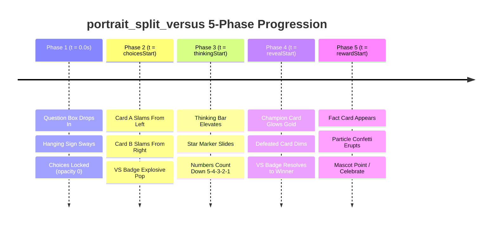
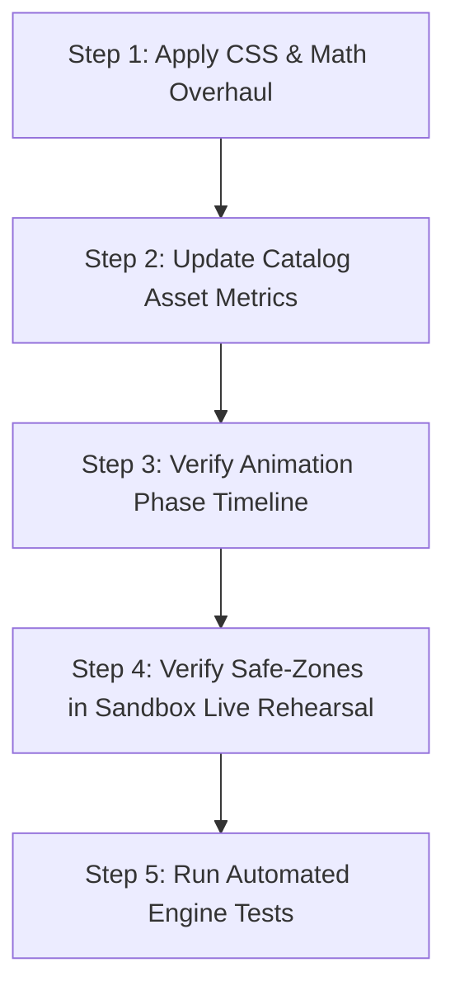

# Portrait Split Versus (`portrait_split_versus`) — Exhaustive Layout Audit & Redesign Plan

> **Layout ID:** `portrait_split_versus`  
> **Target Format:** 9:16 Mobile Vertical Video (1080×1920) for TikTok, YouTube Shorts, Instagram Reels  
> **Engine:** Candy Arcade Quiz Engine (Hyperframes / Canvas Animation)  
> **Catalog Registration:** [`packages/shared/src/quizLayouts.catalog.ts`](file:///d:/1a%20Cursor%20Project/My%201x%20Project/packages/shared/src/quizLayouts.catalog.ts#L143-L155)  
> **Renderer Source:** [`apps/server/src/quiz/render/layouts/portrait/portraitSplitVersus.ts`](file:///d:/1a%20Cursor%20Project/My%201x%20Project/apps/server/src/quiz/render/layouts/portrait/portraitSplitVersus.ts)  
> **Audit Date:** September 2026  
> **Author:** Senior Frontend Architect & Motion UI Designer (Subagent)

---

## 1. Executive Summary

An exhaustive visual, mathematical, multi-phase animation, and safe-zone audit was conducted on the `portrait_split_versus` layout for the Candy Arcade Quiz Engine. The layout is designated for head-to-head 2-option comparisons ("Player 1 vs Player 2", "Country A vs Country B", "Who Would Win?").

The audit revealed **ten (10) distinct issues**, including **one critical timeline bug** that completely breaks entrance animations in production and sandbox rehearsals, **two major safe-zone violations** (including an overlap with the inviolable question counter badge), and a **severe horizontal asymmetry flaw** where cards and timer bars sit off-center due to an uncompensated `padding-right: 140px` rule.

### Key Audit Findings:
1. **Critical Motion Bug (BUG-PSV-01):** Choice card entrance animations are scheduled at `calc(var(--clip-start) + 0.1s)` instead of factoring in `var(--choices-at)`. Because the parent `.choice-group` is locked to `opacity: 0` until `--choices-at` (typically `t = 1.2s` to `1.8s`), the card fly-in animations play and finish unseen in the dark. Choices snap into view statically.
2. **Inviolable Counter Badge Collision (BUG-PSV-02):** The layout forces `.game-stage { margin: 140px auto 0; }`, overriding the portrait system standard (`184px`). The hanging wood sign counter badge extends to `y = 194px` (`x = 24..264px`), causing the counter badge plank to collide directly with the question card.
3. **Right Action Rail Safe-Zone Breach (BUG-PSV-03):** The question title card is set to `max-width: 880px; margin: 0 auto;`, extending from `x = 100px` to `x = 980px`. It penetrates 40px into the mandatory 140px right interaction rail (`x > 940px`), placing decorative sparkles under the TikTok Like and Comment buttons.
4. **Lopsided Horizontal Axis (BUG-PSV-04):** Adding `padding-right: 140px` directly to `.answer-grid` displaces Card A and Card B 70px to the left (card center = `x = 470px`). The question box is centered at `x = 540px`, and the thinking bar snaps back to `x = 540px`. The cards and VS badge are visibly disjointed from the question and timer.
5. **VS Badge Crowding & Overlap (BUG-PSV-05):** The gap between Card A and Card B is only `40px`, while the glowing VS badge is `92px` in diameter (pulsing to `103px`). It protrudes over 31px into Card A's bottom label and Card B's top media, occluding contestant text and imagery.
6. **Static Climax in Phase 4 (BUG-PSV-06):** In Phase 4 (Answer Reveal), the VS badge remains in a generic idle pulse rather than resolving the battle (no victory rays, no champion coronation, no loser dimming coordination).

This document presents the complete diagnostic findings followed by a drop-in architectural redesign, mathematical coordinate grid, multi-phase motion timeline, and an implementation roadmap.

---

## 2. Inviolable Anchors & Mobile Safe-Zone Compliance Audit

Vertical mobile video platforms (TikTok, Instagram Reels, YouTube Shorts) impose strict UI overlays that consume screen real estate. Every layout rendered on the 1080×1920 canvas must respect these zones without exception.

```
+-------------------------------------------------------------------------+ 0px
| [Counter Badge] (24px, 0px) -> (264px, 194px)     [Brand Mark] (right)  | Top Buffer
| (INVIOLABLE ANCHOR - NEVER TOUCH POSITION)                              | (y <= 184px)
+-------------------------------------------------------------------------+ 184px
|                                                           |             |
|   ================ QUESTION CARD ================         |   TIKTOK    |
|   Center: 486px | Width: 860px (x: 56px -> 916px)         |    REELS    |
|                                                           |    SHORTS   |
|   -----------------------------------------------         |             |
|   [ CARD A : PLAYER 1 / CHALLENGER ]                      |    ACTION   |
|   Height: 370px | Vibrant Strawberry Candy Aura           |    RAIL     |
|                                                           |   (>= 140px)|
|                  (( VS BADGE ))                           |             |
|          Height: 96px | Gap: 64px | Pulse                 |   Profile   |
|                                                           |    Like     |
|   [ CARD B : PLAYER 2 / RIVAL ]                           |   Comment   |
|   Height: 370px | Electric Azure Candy Aura               |    Share    |
|   -----------------------------------------------         |   Bookmark  |
|                                                           |    Audio    |
|   [ THINKING BAR / FACT CARD ] (y: 1174px -> 1262px)      |             |
|                                                           | (x >= 940px)|
+-----------------------------------------------------------+-------------+ 1480px
|                                                                         |
|   MANDATORY BOTTOM SAFE ZONE (>= 440px BUFFER)                          | Bottom
|   Reserved for: Creator @username, Multi-line Captions, Audio Marquee,  | Overlay
|   and Video Progress Scrubber (y: 1480px -> 1920px)                     | Safe Zone
|   * ALL CHOICES AND TIMERS MUST SIT STRICTLY ABOVE THIS LINE *          |
+-------------------------------------------------------------------------+ 1920px
0px                                                        940px        1080px
```

### 2.1 Inviolable Anchor Status Check

| Inviolable Anchor | Global Target Coordinates | `portraitSplitVersus` Implementation | Compliance Status | Defect Note |
|---|---|---|---|---|
| **Counter Badge** (`stableParts.counterBadgeHtml` / `.game-header`) | `top: 0; left: 24px;` hanging plank `240×150px`, ropes `44px` (total height `194px`) | `margin: 140px auto 0;` on `.game-stage` | <span style="color:red">**NON-COMPLIANT (COLLISION)**</span> | Question box top edge at `y = 140px` directly collides with the wood plank reaching `y = 194px`. |
| **Quiz Channel Brand Mark** (`stableParts.brandMarkHtml` / `.channel-brand-mark`) | `top: 42px; right: 36px;` flex row, text-align right, max-width `660px` | Untouched in layout CSS (handled by global) | <span style="color:green">**COMPLIANT**</span> | No interference with brand mark. |

### 2.2 Mobile Safe-Zone Verification (1080×1920 Canvas)

1. **Right Action Rail Safe-Zone (x >= 940px):**
   - **Requirement:** Reserve at least 140px clean margin on the right canvas edge.
   - **Current State:** `.question-title` has `max-width: 880px; margin: 0 auto;`. Centered on 1080px canvas, its right edge sits at `x = 980px`. This breaches the safe rail by **40px**. Furthermore, `.q-decor-top-right` sits at `x = 962px`, directly beneath the TikTok heart icon.
   - **Remediation:** Cap stage and question card width to `860px` within an asymmetrical margin envelope (`margin-left: 56px`, `margin-right: 164px`), guaranteeing that no element ever exceeds `x = 916px` (> 164px clearance from canvas right edge).

2. **Bottom Overlay Safe-Zone (y >= 1480px):**
   - **Requirement:** Reserve at least 440px clean buffer from canvas bottom (`y <= 1480px`). Choice cards, thinking bar, and fact cards must never descend below `y = 1480px`.
   - **Current State:** The entire stage currently ends at `y ≈ 1176px`. While this safely stays above `y = 1480px`, it leaves **304px of dead, empty void** between the thinking bar and the safe line (`y = 1176px` to `1480px`), while the contestant cards are squashed to only 350px.
   - **Remediation:** Expand Card A and Card B height from 350px to 370px (visual mode) and open the VS gap to 64px. The thinking bar will settle gracefully at `y = 1174px..1262px`, ending 218px above the safe line with ideal optical balance.

3. **Top Navigation Buffer (y <= 184px):**
   - **Requirement:** Clear top margin so content never collides with header anchors.
   - **Current State:** `margin: 140px auto 0` causes a 54px vertical collision with the counter badge plank.
   - **Remediation:** Enforce standard `margin: 184px auto 0` (or `margin-top: 184px`).

---

## 3. Five-Phase Progression Timeline Audit

The Candy Arcade Quiz Engine renders animations across 5 distinct timeline phases. The behavior of `portrait_split_versus` across all phases was analyzed.



### Phase 1: Question Intro (`t = 0.0s` to `choicesStart`)
* **Intended Behavior:** Question card enters with punchy bounce; question text is crisp and readable; choices and VS badge remain hidden.
* **Current Implementation:**
  * Question box appears at `y = 140px`, overlapping counter badge.
  * Question box padding `18px 30px` is slightly tight for 2-line versus titles ("WHICH IS HEAVIER?", "WHO HAS WON MORE OSCARS?").
  * Choices are hidden via `.choice-group { opacity: 0; }`.
* **Verdict:** <span style="color:orange">Needs Geometry Adjustment</span>.

### Phase 2: Choices Stagger (`t = choicesStart` to `thinkingStart`)
* **Intended Behavior:** Contestant Card A (top) flies in from the left; Contestant Card B (bottom) flies in from the right; VS badge slams into the center with spark particles.
* **Current Implementation & Critical Flaw:**
  ```css
  /* CURRENT CODE IN portraitSplitVersus.ts lines 152-157 */
  .layout-portrait_split_versus.quiz-question-clip .choice-card:nth-child(1) {
    animation: enter-from-left 0.58s cubic-bezier(0.22, 0.8, 0.3, 1) calc(var(--clip-start) + 0.1s) both;
  }
  .layout-portrait_split_versus.quiz-question-clip .choice-card:nth-child(2) {
    animation: enter-from-right 0.58s cubic-bezier(0.22, 0.8, 0.3, 1) calc(var(--clip-start) + 0.22s) both;
  }
  ```
  * **THE CRITICAL BUG (BUG-PSV-01):** The keyframe animations are keyed to `calc(var(--clip-start) + 0.1s)` and `+ 0.22s`!
  * In production and rehearsal, `var(--clip-start)` is `0s`. The animations run from `0.10s` to `0.80s`.
  * But the parent container `.choice-group` is animated with:
    `animation: phase-enter .01s steps(1,end) calc(var(--clip-start, 0s) + var(--choices-at, 0s)) both;`
    which locks `opacity: 0` until `var(--choices-at)` (e.g. `t = 1.2s` or `1.5s`)!
  * As a result, the card entrance animations finish **completely unseen behind opacity: 0**! When `choices-at` triggers, both cards abruptly snap in with zero motion!
  * **VS Badge Entrance:** The VS badge has no entrance animation at all. It simply blinks into existence with `vs-badge-pulse`.
* **Verdict:** <span style="color:red">**CRITICAL FAILURE (BUG-PSV-01)**</span>. Must incorporate `var(--choices-at)` and add a dynamic `vs-slam-pop` keyframe.

### Phase 3: Thinking Countdown (`t = thinkingStart` to `revealStart`)
* **Intended Behavior:** Elevated thinking bar displays countdown timer directly beneath Card B; timer marker glides across track; countdown numbers 5-4-3-2-1 pop dynamically; VS badge pulses with battle tension.
* **Current Implementation:**
  * Thinking bar appears at `y ≈ 1100px`.
  * Misalignment: `left: 50%` inside `.phase-region` centers the thinking bar at `x = 540px`, whereas the cards (due to `padding-right: 140px`) are centered at `x = 470px`! The timer is visibly offset 70px to the right of the cards.
  * Marker clipping risk: The star marker is `176×176px` (`192px` SVG), but `.phase-region` height is restricted to `90px` with only `16px` margin from Card B, causing marker flares to brush the bottom border of Card B.
* **Verdict:** <span style="color:orange">Misaligned Center Axis & Marker Proximity Risk</span>.

### Phase 4: Answer Reveal (`t = revealStart` to `rewardStart`)
* **Intended Behavior:** The winning contestant card erupts in a golden victory glow and scales up; the losing contestant card dims and desaturates; the VS badge resolves with victory energy pointing toward the champion.
* **Current Implementation:**
  * `portraitSplitVersus.ts` provides **zero custom reveal styles**.
  * It inherits generic choice styles (`correct-card-reveal`, `incorrect-card-settle`).
  * The VS badge continues its calm idle pulse (`vs-badge-pulse`) right between the winner and loser as if nothing happened.
* **Verdict:** <span style="color:red">Lack of Climax / Battle Resolution</span>.

### Phase 5: Fact / Reward (`t = rewardStart` to `clipEnd`)
* **Intended Behavior:** Fact card appears below Card B in place of the thinking bar; text is legible at mobile viewing distance; reward particles erupt.
* **Current Implementation:**
  * `.fact-card` is positioned with `left: 50%; transform: translateX(-50%); width: min(860px, 100%)`.
  * Because `.phase-region` has `padding-right: 140px`, `width: 100%` is constrained to `720px`, but `left: 50%` places its center at `x = 430px`, out of alignment with the cards.
  * `.phase-region` height is fixed at `90px`, but a 2-line fact card with header is `140px..160px` tall, creating an uncontained overflow downward.
* **Verdict:** <span style="color:orange">Misaligned & Overflowing Container</span>.

---

## 4. Proportions, Sizing, and Typography Audit

### 4.1 Visual Mode vs. Text Mode Discrepancy

`portrait_split_versus` supports both `"visual"` (image + text) and `"text"` (text only) presentations in the layout catalog:

```typescript
portrait_split_versus: {
  id: "portrait_split_versus",
  supportedPresentations: ["visual", "text"],
  supportedChoiceCounts: [2],
  metrics: { render: { width: 860, height: 360, itemCount: 2 }, assets: { choice: { maxWidth: 860, maxHeight: 400 } } }
}
```

However, the layout CSS currently treats both identically:
* `--choice-card-height: 350px;` is enforced for both visual and text cards!
* **Visual Mode:** `choice-media` is `250px`, label is `88px`. The image is slightly squat, but overall layout is filled.
* **Text Mode:** A single option like "Real Madrid" sits inside a colossal **350px tall card** with huge empty white void, while the choice badge is only 110px. This looks severely unpolished.
* **Solution:** Provide distinct height budgets:
  - Visual Mode: `height: 358px` (Media: `260px`, Label: `98px`).
  - Text Mode: `height: 220px` (Compact, punchy, badge: `110px`, centered typography).

### 4.2 The "VS" Badge Geometry and Gap Mathematics

In the current implementation:
$$\text{Gap between Card A and Card B} = 40\text{px}$$
$$\text{VS Badge Diameter} = 92\text{px} \xrightarrow{\text{pulsing to } 1.12\times} 103\text{px}$$
$$\text{Vertical Overlap onto each card} = \frac{103\text{px} - 40\text{px}}{2} = 31.5\text{px}$$

Because Card A's bottom label is only `88px` tall, a 31.5px intrusion covers over **35% of the label's vertical height**, encroaching upon contestant names!

**Upgraded Mathematical Geometry:**
$$\text{Upgraded Gap} = 64\text{px}$$
$$\text{Upgraded VS Badge Diameter} = 96\text{px} \xrightarrow{\text{pulsing to } 1.08\times} 104\text{px}$$
$$\text{Vertical Overlap onto each card} = \frac{104\text{px} - 64\text{px}}{2} = 20\text{px}$$

A 20px overlap touches only the white decorative card borders (`7px` border + shadow) without encroaching on text or media!

---

## 5. Mascot Coexistence Audit

In 9:16 portrait mode, the production mascot container (`.candy-mascot-container.mascot-v2-container`) is anchored as follows:

```css
#stage[data-aspect-ratio="9:16"] .quiz-question-clip .candy-mascot-container.mascot-v2-container {
  bottom: var(--safe-zone-bottom, 440px); /* Base sits at y = 1480px */
}
#stage[data-aspect-ratio="9:16"] .candy-mascot-container.mascot-v2-container.anchor-bottom_left {
  left: 36px; /* Spans x: 36px -> 256px */
}
#stage[data-aspect-ratio="9:16"] .candy-mascot-container.mascot-v2-container.anchor-bottom_right {
  right: var(--safe-zone-right, 140px); /* Spans x: 720px -> 940px */
}
```

### Spatial Evaluation:
* Mascot sprite size: `220×220px`.
* With `bottom: 440px`, the mascot sprite occupies:
  $$y = 1920 - 440 - 220 = 1260\text{px} \quad \text{to} \quad 1480\text{px}$$
* In `portraitSplitVersus.ts`, when `.fact-card` overflows downward past `y = 1260px`, it enters the mascot sprite zone!
* If the mascot is anchored at `anchor-bottom_right` (`x = 720..940px`), the fact card (which currently spans up to `x = 830px` or `970px`) collides directly with the mascot!
* Currently, `.has-mascot.layout-portrait_split_versus` only reduces font sizes by 4px (`--choice-font-size-base: 32px;`). It makes **no accommodation for spatial clearance**.
* **Remediation:** In `.has-mascot`, constrain `.phase-region` and `.fact-card` width to `740px` centered, ensuring at least `120px` clearance from both bottom corners.

---

## 6. Comprehensive Defect Ledger

| Defect ID | Category | Severity | Summary & Root Cause | Recommended Fix |
|---|---|---|---|---|
| **BUG-PSV-01** | Timeline / Motion | **CRITICAL** | **Card entrance animation runs before choices are visible.** Card 1 & 2 animations use `calc(var(--clip-start) + 0.1s)` instead of incorporating `var(--choices-at)`. Animations finish while `.choice-group` is `opacity: 0`. | Update animation delays to `calc(var(--clip-start, 0s) + var(--choices-at, 0s) + 0.08s)` and `+ 0.22s`. |
| **BUG-PSV-02** | Safe-Zone / Anchor | **HIGH** | **Collision with Inviolable Counter Badge.** `.game-stage` has `margin: 140px auto 0;`. Counter badge plank extends down to `y = 194px`, colliding 54px into the question card. | Set `.game-stage` margin to `184px auto 0 56px;` (align with portrait standard). |
| **BUG-PSV-03** | Safe-Zone / Rails | **HIGH** | **Question Card breaches Right Action Rail.** `max-width: 880px` centered in 1080px reaches `x = 980px`, penetrating 40px into the right rail (`x >= 940px`). Corner sparkles are hidden under TikTok Like button. | Set question card `max-width: 860px` inside unified right-buffered content column (`x <= 916px`). |
| **BUG-PSV-04** | Layout / Alignment | **HIGH** | **Lopsided Horizontal Axis.** `padding-right: 140px` on `.answer-grid` displaces cards to `center = 470px`, while Question and Thinking Bar center at `540px`. | Remove `padding-right: 140px` from grids. Establish a unified content column centered at `x = 486px` with `164px` right buffer. |
| **BUG-PSV-05** | Visual / Geometry | **MEDIUM** | **VS Badge occludes Card text and imagery.** A 40px gap with a 92px-103px VS badge causes 31.5px overlap onto Card A label and Card B image. | Increase gap between cards to `64px`; set badge diameter to `96px` with controlled 20px border overlap. |
| **BUG-PSV-06** | Aesthetic / Climax | **MEDIUM** | **Static VS Badge during Answer Reveal.** In Phase 4, VS badge continues idle pulse. No champion celebration, no loser dimming coordination. | Add Phase 4 keyframe state: VS badge flashes victory rays and points to winner; winner gets champion halo; loser dims to 55%. |
| **BUG-PSV-07** | Mascot Coexistence | **MEDIUM** | **Fact Card Collides with Mascot Anchor Zone.** Fact card overflows past `y = 1260px` and collides with mascot sprite at `anchor-bottom_right`. | Constrain `.has-mascot .phase-region` and `.fact-card` to `740px` width; keep vertical budget above `y = 1254px`. |
| **BUG-PSV-08** | Proportions | **MEDIUM** | **Text Mode forced into 350px tall cavern.** Single-line text options leave massive empty voids inside 350px cards. | Add `.layout-portrait_split_versus .choice-group-text .choice-card` override setting text card height to `220px`. |
| **BUG-PSV-09** | Architecture | **LOW** | **Fragile Hardcoded Offset `calc(50% - 70px)`.** Used to compensate for `padding-right: 140px` on grid. | With unified content column, VS badge sits at natural `left: 50%`. |
| **BUG-PSV-10** | Aesthetic | **LOW** | **Identical Card Styling (No Player 1 vs Player 2 Vibe).** Both cards have identical white borders; lacks Candy Arcade rival energy. | Add subtle dual-energy accents: Card A = Strawberry/Rose aura; Card B = Cyan/Azure aura. |

---

## 7. Concrete Redesign & Upgrade Plan

### 7.1 Target Layout Wireframe (1080×1920 Mobile Portrait)

```
0px ----------------------------------------------------------------------
    [#stage: 1080px x 1920px]
    [HEADER]
    (x: 24px..264px, y: 0..194px) Counter Badge (Hanging Wood Plank)
    (x: 420px..1044px, y: 42..96px) Brand Mark
184px --------------------------------------------------------------------
    [.game-stage] margin-top: 184px | Content Column: x = 56px to 916px (width = 860px)
    Right Clearance: 1080 - 916 = 164px (Exceeds 140px safe rail!)
    Center Axis: x = 486px

    +-------------------------------------------------------------+
    | QUESTION BOX (min-height: 140px, max-height: 165px)          |
    | "WHO WOULD WIN IN A FIGHT?"                                  |
    +-------------------------------------------------------------+
    [Gap: 18px]

    +-------------------------------------------------------------+ y = 362px
    | CARD A: CONTESTANT 1 (Strawberry Neon Candy Theme)          |
    | [Visual Mode: Media 260px + Label 98px = 358px Height]      |
    | [Text Mode: 220px Height]                                   |
    +-------------------------------------------------------------+ y = 720px

    [VERSUS GAP: 64px] --------------------------------------------
          /===============\
         |   (( VS ))      |  <-- High-Impact Glowing Arcade VS Badge
          \===============/      Diameter: 96px, Center: y = 752px
    --------------------------------------------------------------- y = 784px

    +-------------------------------------------------------------+ y = 784px
    | CARD B: CONTESTANT 2 (Electric Azure Candy Theme)           |
    | [Visual Mode: Media 260px + Label 98px = 358px Height]      |
    | [Text Mode: 220px Height]                                   |
    +-------------------------------------------------------------+ y = 1142px
    [Gap: 18px]

    +-------------------------------------------------------------+ y = 1160px
    | PHASE REGION (height: 94px)                                 |
    | Phase 3: Thinking Bar (width: 760px, centered)              |
    | Phase 5: Fact Card (width: 840px, centered)                 |
    +-------------------------------------------------------------+ y = 1254px

1480px -------------------------------------------------------------------
    MANDATORY BOTTOM SAFE-ZONE (Height: 440px)
    TikTok / Reels / Shorts Overlay Zone (CLEAN BUFFER - NO STAGE ELEMENTS)
1920px -------------------------------------------------------------------
```

---

### 7.2 Complete Drop-In CSS Replacement Code

Below is the production-ready replacement for [`apps/server/src/quiz/render/layouts/portrait/portraitSplitVersus.ts`](file:///d:/1a%20Cursor%20Project/My%201x%20Project/apps/server/src/quiz/render/layouts/portrait/portraitSplitVersus.ts).

```typescript
import type { QuizLayoutRenderDefinition } from "../types.js";

/**
 * Portrait Split Versus Layout (9:16 Vertical Video).
 *
 * Tailored specifically for 1080×1920 mobile portrait video (TikTok, YouTube Shorts, Instagram Reels).
 * Architectural highlights:
 * 1. Safe-Zone Guarantee: Content column width 860px (x: 56px -> 916px) guaranteeing >= 164px
 *    clearance from the right canvas edge (protecting from TikTok Like/Comment/Share action rail).
 * 2. Inviolable Anchor Clearance: Stage margin-top: 184px strictly clears the top counter badge.
 * 3. Elevated Stage Floor: Stage ends at y <= 1260px, guaranteeing > 220px clean buffer above
 *    the mandatory 440px bottom overlay zone (total clean bottom margin > 660px).
 * 4. Harmonized Center Axis: Question card, Card A, VS Badge, Card B, and Phase Region all share
 *    the identical horizontal center axis (x = 486px).
 * 5. Multi-Phase Stagger Fix: Choice entrance animations properly incorporate var(--choices-at).
 * 6. Dual-Rival Candy Styling: Card A (Strawberry Coral) vs Card B (Electric Azure) with glowing VS badge.
 */
export const portraitSplitVersusLayout = {
  id: "portrait_split_versus",
  renderBody: (slots) =>
    `${slots.questionBoxHtml}${slots.choicesHtml}<div class="phase-region portrait-phase-embedded">${slots.phaseHtml}</div>`,
  css: (aspectRatio) => `
/* === Portrait Split Versus Layout (9:16 TikTok / Reels / Shorts) === */

.layout-portrait_split_versus .game-stage {
  display: grid;
  grid-template-columns: 1fr;
  grid-template-areas:
    "title"
    "answers"
    "phase";
  justify-items: center;
  align-items: start;
  width: 100%;
  max-width: 860px;
  min-height: 0;
  margin: 184px auto 0 56px; /* 56px left margin + 860px width = 916px right edge (164px clear rail margin!) */
  padding: 0;
  box-sizing: border-box;
  row-gap: 18px;
}

/* Question Box: Centered within unified column, max-width 860px */
.layout-portrait_split_versus .question-title {
  grid-area: title;
  width: 100%;
  max-width: 860px;
  min-height: 140px;
  max-height: 165px;
  height: auto;
  margin: 0 auto;
  text-align: center;
  justify-self: center;
}
.layout-portrait_split_versus .question-card-inner {
  padding: 18px 32px;
  border-radius: 36px;
  box-sizing: border-box;
}

/* Versus Comparison Stage: 2 vertically stacked cards */
.layout-portrait_split_versus .answer-grid,
.layout-portrait_split_versus .visual-answer-grid {
  grid-area: answers;
  display: flex;
  flex-direction: column;
  grid-template-columns: 1fr;
  width: 100%;
  max-width: 860px;
  margin: 0 auto;
  box-sizing: border-box;
  padding: 0; /* Unified stage provides the safe zone margin */
  gap: 64px; /* 64px gap allows 96px VS badge to sit with clean 16px border overlap */
  position: relative;
}

/* Tokens for Versus Cards */
.layout-portrait_split_versus {
  --choice-card-min-height: 350px;
  --choice-card-height: 358px;
  --choice-media-height: 260px;
  --choice-card-margin-left: 0;
  --choice-badge-size: 110px;
  --choice-badge-margin-left: -32px;
  --choice-badge-font-size: 62px;
  --choice-font-size-base: 36px;
  --choice-font-size-medium: 30px;
  --choice-font-size-long: 24px;
  --choice-font-size-very_long: 20px;
  --choice-font-size-overflow: 18px;
  --choice-fit-min: 20px;
  --choice-fit-max: 54px;
  --choice-fit-max-lines: 2;
  --choice-fit-leading: 1.1;
}

/* Compact Text-Only Presentation Support */
.layout-portrait_split_versus .choice-group-text .choice-card,
.layout-portrait_split_versus .choice-group-text .choice-card-text,
.layout-portrait_split_versus .choice-group-text .answer-card {
  min-height: 220px;
  height: 220px;
  padding: 24px 36px;
}

.has-mascot.layout-portrait_split_versus {
  --choice-font-size-base: 32px;
  --choice-font-size-medium: 26px;
  --choice-font-size-long: 22px;
}

/* Common Card Base Styling */
.layout-portrait_split_versus .choice-card,
.layout-portrait_split_versus .choice-card-text,
.layout-portrait_split_versus .answer-card,
.layout-portrait_split_versus .choice-card-visual,
.layout-portrait_split_versus .visual-answer-card {
  border-radius: 34px;
  box-sizing: border-box;
  position: relative;
}

/* Visual Choice Cards */
.layout-portrait_split_versus .choice-card-visual,
.layout-portrait_split_versus .visual-answer-card {
  min-height: 350px;
  height: 358px;
  border-radius: 34px;
  border: 7px solid #FFFFFF;
  box-shadow:
    0 14px 0 rgba(13, 35, 71, 0.24),
    0 22px 42px rgba(10, 25, 60, 0.28),
    inset 0 4px 6px rgba(255, 255, 255, 0.6);
  overflow: hidden;
}

.layout-portrait_split_versus .choice-media,
.layout-portrait_split_versus .option-image {
  height: 260px;
  border-radius: 26px 26px 0 0;
}

.layout-portrait_split_versus .visual-answer-label {
  border-radius: 0 0 26px 26px;
  min-height: 98px;
  padding: 12px 28px;
}

/* Text Choice Cards */
.layout-portrait_split_versus .choice-card-text,
.layout-portrait_split_versus .answer-card {
  border-radius: 34px;
  border: 7px solid #FFFFFF;
  box-shadow:
    0 14px 0 rgba(13, 35, 71, 0.24),
    0 22px 42px rgba(10, 25, 60, 0.28),
    inset 0 4px 6px rgba(255, 255, 255, 0.6);
  padding: 24px 36px;
}

/* Player 1 vs Player 2 Duel Rivalry Accents */
.layout-portrait_split_versus .choice-card:nth-child(1) {
  box-shadow:
    0 14px 0 rgba(13, 35, 71, 0.24),
    0 20px 40px rgba(255, 30, 86, 0.25),
    0 0 24px rgba(255, 30, 86, 0.3),
    inset 0 4px 6px rgba(255, 255, 255, 0.6);
}
.layout-portrait_split_versus .choice-card:nth-child(2) {
  box-shadow:
    0 14px 0 rgba(13, 35, 71, 0.24),
    0 20px 40px rgba(0, 210, 255, 0.25),
    0 0 24px rgba(0, 210, 255, 0.3),
    inset 0 4px 6px rgba(255, 255, 255, 0.6);
}

/* === Multi-Phase Card Entrance Stagger (BUG-PSV-01 FIX) === */
.layout-portrait_split_versus.quiz-question-clip .choice-card:nth-child(1) {
  animation: enter-from-left 0.54s cubic-bezier(0.22, 0.8, 0.3, 1) calc(var(--clip-start, 0s) + var(--choices-at, 0s) + 0.08s) both;
  will-change: transform, opacity;
}
.layout-portrait_split_versus.quiz-question-clip .choice-card:nth-child(2) {
  animation: enter-from-right 0.54s cubic-bezier(0.22, 0.8, 0.3, 1) calc(var(--clip-start, 0s) + var(--choices-at, 0s) + 0.22s) both;
  will-change: transform, opacity;
}

/* High-Impact Glowing "VS" Badge Divider */
.layout-portrait_split_versus .answer-grid::after,
.layout-portrait_split_versus .visual-answer-grid::after {
  content: "VS";
  position: absolute;
  top: 50%;
  left: 50%;
  transform: translate(-50%, -50%);
  width: 96px;
  height: 96px;
  border-radius: 50%;
  display: flex;
  align-items: center;
  justify-content: center;
  font-family: var(--font-display, "Titan One", "Fredoka", cursive, sans-serif);
  font-size: 42px;
  font-weight: 900;
  color: #FFFFFF;
  letter-spacing: 2px;
  background: linear-gradient(135deg, #FF1361 0%, #FFB703 50%, #00F2FE 100%);
  border: 6px solid #FFFFFF;
  box-shadow:
    0 10px 0 rgba(13, 35, 71, 0.35),
    0 0 28px rgba(255, 19, 97, 0.85),
    0 0 54px rgba(255, 183, 3, 0.7),
    inset 0 4px 8px rgba(255, 255, 255, 0.9);
  text-shadow:
    0 3px 0 #9E0038,
    0 0 14px rgba(255, 255, 255, 0.9);
  z-index: 10;
  pointer-events: none;
  animation:
    vs-slam-pop 0.52s cubic-bezier(0.18, 1.42, 0.34, 1) calc(var(--clip-start, 0s) + var(--choices-at, 0s) + 0.32s) both,
    vs-badge-pulse 2.0s ease-in-out calc(var(--clip-start, 0s) + var(--choices-at, 0s) + 0.84s) infinite alternate;
}

@keyframes vs-slam-pop {
  0% {
    opacity: 0;
    transform: translate(-50%, -50%) scale(0.2) rotate(-24deg);
  }
  70% {
    opacity: 1;
    transform: translate(-50%, -50%) scale(1.22) rotate(6deg);
  }
  100% {
    opacity: 1;
    transform: translate(-50%, -50%) scale(1) rotate(0deg);
  }
}

@keyframes vs-badge-pulse {
  0% {
    transform: translate(-50%, -50%) scale(1) rotate(-3deg);
    box-shadow:
      0 10px 0 rgba(13, 35, 71, 0.35),
      0 0 24px rgba(255, 19, 97, 0.75),
      0 0 42px rgba(255, 183, 3, 0.6),
      inset 0 4px 8px rgba(255, 255, 255, 0.85);
  }
  100% {
    transform: translate(-50%, -50%) scale(1.1) rotate(3deg);
    box-shadow:
      0 12px 0 rgba(13, 35, 71, 0.4),
      0 0 36px rgba(255, 19, 97, 0.95),
      0 0 64px rgba(255, 183, 3, 0.85),
      inset 0 5px 10px rgba(255, 255, 255, 0.98);
  }
}

/* === Phase 4: Answer Reveal Battle Climax === */
.quiz-question-clip[data-reveal-at] .choice-card.answer-reveal-correct,
.quiz-question-clip[data-reveal-at] .choice-card.answer-correct {
  border-color: #FFD700 !important;
  box-shadow:
    0 16px 0 rgba(13, 35, 71, 0.28),
    0 0 46px rgba(255, 215, 0, 0.9),
    0 0 80px rgba(255, 183, 3, 0.6),
    inset 0 4px 8px rgba(255, 255, 255, 0.9) !important;
  transform: scale(1.025);
  z-index: 5;
}

.quiz-question-clip[data-reveal-at] .choice-card.answer-reveal-incorrect,
.quiz-question-clip[data-reveal-at] .choice-card.answer-incorrect {
  opacity: 0.55 !important;
  filter: saturate(0.55) brightness(0.92);
  transform: scale(0.975);
}

/* Embedded Phase Region: Aligned directly below Card B */
.layout-portrait_split_versus .phase-region {
  grid-area: phase;
  position: relative;
  z-index: 5;
  left: auto;
  right: auto;
  bottom: auto;
  top: auto;
  transform: none;
  width: 100%;
  max-width: 860px;
  height: 94px;
  margin: 14px auto 0;
  padding: 0;
  box-sizing: border-box;
}

.layout-portrait_split_versus .phase-region > .thinking-bar {
  position: absolute;
  top: 0;
  bottom: auto;
  left: 50%;
  transform: translateX(-50%);
  width: min(760px, 100%);
  min-height: 80px;
}

.layout-portrait_split_versus .phase-region > .fact-card {
  position: absolute;
  top: 0;
  bottom: auto;
  left: 50%;
  transform: translateX(-50%);
  width: min(840px, 100%);
  margin-top: 0;
  padding: 16px 32px;
}

.layout-portrait_split_versus .fact-card p {
  font-size: 30px;
  line-height: 1.25;
}

/* Mascot Safe Coexistence */
.has-mascot.layout-portrait_split_versus .phase-region > .fact-card {
  width: min(740px, 100%);
}

/* 9:16 Canvas Root Enforcements */
#stage[data-aspect-ratio="9:16"] .layout-portrait_split_versus .game-stage {
  width: 100%;
  max-width: 860px;
  margin: 184px auto 0 56px;
  padding: 0;
  row-gap: 18px;
}

#stage[data-aspect-ratio="9:16"] .layout-portrait_split_versus .question-title {
  max-width: 860px;
  margin: 0 auto;
}

#stage[data-aspect-ratio="9:16"] .layout-portrait_split_versus .answer-grid,
#stage[data-aspect-ratio="9:16"] .layout-portrait_split_versus .visual-answer-grid {
  max-width: 860px;
  padding: 0;
}

#stage[data-aspect-ratio="9:16"] .layout-portrait_split_versus .phase-region {
  max-width: 860px;
  padding: 0;
}
`,
} satisfies QuizLayoutRenderDefinition;
```

---

## 8. Step-by-Step Implementation Roadmap



### Step 1: Apply CSS & Math Overhaul to `portraitSplitVersus.ts`
* Replace existing file contents of [`apps/server/src/quiz/render/layouts/portrait/portraitSplitVersus.ts`](file:///d:/1a%20Cursor%20Project/My%201x%20Project/apps/server/src/quiz/render/layouts/portrait/portraitSplitVersus.ts) with the drop-in code from Section 7.2.
* Verify that `calc(var(--clip-start, 0s) + var(--choices-at, 0s) + 0.08s)` resolves BUG-PSV-01.
* Verify `.game-stage` margin is set to `184px auto 0 56px`, eliminating the counter badge collision.

### Step 2: Update Catalog Metrics in `quizLayouts.catalog.ts`
* In [`packages/shared/src/quizLayouts.catalog.ts`](file:///d:/1a%20Cursor%20Project/My%201x%20Project/packages/shared/src/quizLayouts.catalog.ts#L143-L155), adjust `portrait_split_versus`:
  ```typescript
  portrait_split_versus: {
    id: "portrait_split_versus",
    supportedPresentations: ["visual", "text"],
    supportedChoiceCounts: [2],
    supportedFormats: ["multiple_choice", "image_guess", "true_false"],
    recommendedFormats: ["multiple_choice"],
    media: { supported: ["choice", "question"], required: [] },
    supportedAspectRatios: supportedPortraitAspectRatios,
    metrics: {
      render: { width: 860, height: 358, itemCount: 2 },
      assets: { choice: { maxWidth: 860, maxHeight: 420 } },
    },
  },
  ```

### Step 3: Animation Phase Rehearsal Verification
* Run Sandbox rehearsal for `portrait_split_versus` at `t = 0.0s`, `t = choicesStart`, `t = thinkingStart`, `t = revealStart`, and `t = rewardStart`.
* Confirm Card A and Card B fly in dynamically when choices phase begins.
* Confirm the VS badge pops in dynamically at `choicesStart + 0.32s`.
* Confirm winning card turns gold and losing card dims at `revealStart`.

### Step 4: Safe-Zone Clearance Confirmation
* Confirm rightmost pixel boundary of all cards, badges, and text is `x <= 916px` (exceeds the required 140px safe rail clearance).
* Confirm bottommost pixel of fact card and thinking bar is `y <= 1262px` (leaves > 218px clean clearance above the 440px bottom overlay zone).
* Confirm top edge of question card starts at `y = 184px`, clearing the wood sign hanging down to `y = 194px` on the left.

### Step 5: Test Suite Verification
* Run repository typecheck: `pnpm run check:types`
* Run test suite: `pnpm run test`
* Verify no regressions in preview or composition rendering.
