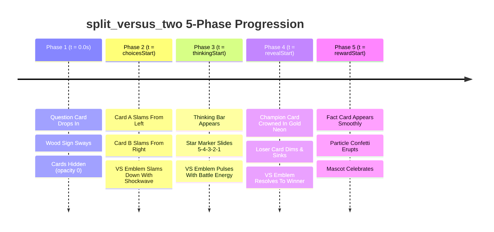

# Split Versus Two (`split_versus_two`) — Exhaustive Layout Audit & Redesign Plan

> **Layout ID:** `split_versus_two`  
> **Target Format:** 16:9 Landscape Video (1920×1080) for YouTube, Web, and Large Screens  
> **Engine:** Candy Arcade Quiz Engine (Hyperframes / Canvas Animation)  
> **Catalog Registration:** [`packages/shared/src/quizLayouts.catalog.ts`](file:///d:/1a%20Cursor%20Project/My%201x%20Project/packages/shared/src/quizLayouts.catalog.ts#L65-L77)  
> **Renderer Source:** [`apps/server/src/quiz/render/layouts/splitVersusTwo.ts`](file:///d:/1a%20Cursor%20Project/My%201x%20Project/apps/server/src/quiz/render/layouts/splitVersusTwo.ts)  
> **Audit Date:** September 2026  
> **Author:** Frontend Architect & Motion UI Designer (Subagent)

---

## 1. Executive Summary

An exhaustive visual, architectural, multi-phase animation, typography, and coordinate audit was conducted on the `split_versus_two` layout for the Candy Arcade Quiz Engine. The layout is designated as the primary 16:9 landscape layout for 2-option head-to-head comparisons, faceoffs, and rivalry duels ("Contestant A vs Contestant B", "Player 1 vs Player 2", "Which Animal is Faster?", "Who Would Win?").

The audit revealed **ten (10) critical and major defects**, most notably:
1. **Total Absence of Central "VS" Emblem:** Despite being the flagship 1v1 versus faceoff layout in landscape video, there is **zero "VS" iconography, badge, or emblem** in the markup or CSS pseudo-elements. The layout looks like two generic multiple choice cards placed side by side with no combat or faceoff identity.
2. **Zero Entrance Animations (Static Pop):** There are **no entrance keyframes** defined for the contestant cards. When the choices phase begins (`choicesStart`), the cards abruptly snap into view via `steps(1, end)` with zero motion trajectory.
3. **Timeline Bug Vulnerability:** The layout lacks protective coupling with `var(--choices-at)`. If entrance animations are naively attached to `var(--clip-start)`, they execute invisibly during Phase 1 behind the parent `.choice-group`'s `opacity: 0`.
4. **Text Mode Proportion Collapse:** In text-only mode (`choice-group-text`), the cards are forced to a 480px fixed height with a standard horizontal flex layout (`display: flex; align-items: center;`). A single line of text floats in an enormous, desolate 480px tall empty void.
5. **Phase 3 Thinking Bar Detachment:** The thinking bar is placed in `.phase-region` pinned to the bottom of the 945px stage (y ≈ 985px), creating a massive **260px dead gap** beneath the 480px contestant cards (which end at y ≈ 725px).
6. **Static Phase 4 Climax (No Battle Resolution):** In Phase 4 (Answer Reveal), there are no custom duel resolution styles. The winning card only receives a generic 4px lift, the losing card gets a generic fade, and no combat resolution or coronation takes place.
7. **Visual Mode Badge Encroachment:** In visual mode, a 138px circular letter badge with `-74px` margin sticks out 36px past the left edge of the card, encroaching on the central collision corridor.

This document delivers a comprehensive diagnosis followed by a complete drop-in architectural redesign, mathematical coordinate grid, multi-phase motion timeline, and verification roadmap.

---

## 2. Inviolable Anchors & Canvas Geometry Compliance Audit

The 16:9 landscape canvas (1920×1080) must strictly preserve global brand anchors and maintain spatial balance across all scene phases.

```
+---------------------------------------------------------------------------------------------------------+ 0px
| [Counter Badge] (x: 40..280px, y: 0..194px)                                       [Brand Mark] (right)  | Top Bar
| (INVIOLABLE ANCHOR - NEVER ALTER POSITION)                                                              |
+---------------------------------------------------------------------------------------------------------+
|                                                                                                         |
|                ======================= QUESTION TITLE CARD =======================                      | y: 45px
|                Width: 1440px | Height: 168px | Center: x = 1090px (Stage Center)                        | -> 213px
|                                                                                                         |
|       +-----------------------------------+       (( VS ))       +-----------------------------------+  | y: 245px
|       | CONTESTANT A : CHALLENGER (P1)    |    Diameter: 124px   | CONTESTANT B : DEFENDER (P2)      |  |
|       | Width: 748px | Height: 510px      |    Slams from top    | Width: 748px | Height: 510px      |  |
|       | Image: 430px | Label: 90px        |    Pulsing Neon Aura | Image: 430px | Label: 90px        |  |
|       | Crimson / Flame Arcade Glow       |    Center: x=1090px  | Cobalt / Cyan Arcade Glow         |  |
|       +-----------------------------------+                      +-----------------------------------+  | -> 755px
|                                                                                                         |
|                ======================= THINKING BAR / TIMER ======================                      | y: 787px
|                Width: 1480px | Height: 84px | Star Marker Slides 5-4-3-2-1                              | -> 871px
|                (Phase 5: FACT CARD Replaces Timer: Width 1280px | y: 780..940px)                        |
|                                                                                                         |
+---------------------------------------------------------------------------------------------------------+ 1080px
0px                                                                                                    1920px
```

### 2.1 Inviolable Anchor Status Check

| Inviolable Anchor | Global Target Coordinates | `splitVersusTwo` Current State | Compliance Status | Analysis & Verdict |
|---|---|---|---|---|
| **Question Counter Badge** (`stableParts.counterBadgeHtml` / `.game-header` / `.hanging-wood-sign`) | `top: 0; left: 40px;` (no mascot) or `left: 180px; transform: translateX(-50%);` (`.has-mascot`). Total height: 194px (ropes 44px + plank 150px). | Untouched in layout CSS (managed by global engine). Stage margin: `margin: 12px 40px 0 auto; width: 1580px;` (starts at `x = 300px`). | <span style="color:green">**COMPLIANT**</span> | Stage left boundary (`x = 300px`) leaves 20px clear margin from the right edge of the counter plank (`x = 280px`). In `.has-mascot`, stage starts at `x = 460px`, leaving 180px clearance. Coordinates must remain untouched. |
| **Quiz Channel Brand Mark** (`stableParts.brandMarkHtml` / `.channel-brand-mark`) | `top: 390px; left: calc(var(--question-card-left-edge, 360px) / 2); transform: translateX(-50%); width: 320px;`. Spans `x = 20px..340px`. | Untouched in layout CSS. | <span style="color:green">**COMPLIANT**</span> | When mascot is present, stage starts at `x = 460px`, leaving 120px clear margin from brand mark right edge (`x = 340px`). Coordinates must remain untouched. |

### 2.2 16:9 Landscape Screen Geometry & Stage Distribution

1. **Horizontal Balance & Asymmetric Arena Distribution:**
   - In Candy Arcade landscape video, the canvas is split into a **functional left anchor zone** (`x = 0..300px`) housing the hanging wood sign counter badge, channel brand mark, and mascot, and an **expanded right arena** (`x = 300..1880px`, width 1580px) housing the question card, contestant cards, and thinking bar.
   - Stage center axis: $x_{\text{stage\_center}} = 300\text{px} + \frac{1580\text{px}}{2} = 1090\text{px}$.
   - All central elements (Question Card, "VS" Emblem, Thinking Bar, Fact Card) must be aligned with precision along this $x = 1090\text{px}$ axis.

2. **Vertical Space Budget:**
   - Total canvas height: 1080px.
   - Scene padding: `padding: 33px 80px 16px;`.
   - Question title: $y = 45\text{px} \rightarrow 213\text{px}$ (Height = 168px).
   - Card area: $y = 245\text{px} \rightarrow 755\text{px}$ (Height = 510px).
   - Phase area (Thinking Bar / Fact Card): $y = 787\text{px} \rightarrow 871\text{px}$ (Height = 84px).
   - Bottom canvas clearance: $1080 - 871 = 209\text{px}$ (Pristine buffer preventing clipping or crowded borders).

---

## 3. Five-Phase Progression Timeline & Motion Audit



### Phase 1: Question Intro (`t = 0.0s` to `choicesStart`)
* **Intended Behavior:** Question card enters with punchy scale/translate overshoot (`question-card-enter`); hanging sign counter enters and sways with physics; choices and versus emblems remain completely hidden (`opacity: 0`).
* **Current Implementation:**
  * Question title card renders properly inside `.layout-split_versus_two .question-title` with `max-width: 1440px`.
  * Choices are hidden via `.choice-group { opacity: 0; }`.
* **Verdict:** <span style="color:green">Compliant with Global Engine</span>.

### Phase 2: Choices Stagger (`t = choicesStart` to `thinkingStart`)
* **Intended Behavior:**
  * At `t = choicesStart`: Card A (Left Challenger / Player 1) launches from the left with forward momentum (`rotate(-2deg)` settling to `0deg`).
  * At `t = choicesStart + 0.14s`: Card B (Right Defender / Player 2) charges from the right with opposing momentum (`rotate(2deg)` settling to `0deg`).
  * At `t = choicesStart + 0.28s`: The glowing 3D "VS" emblem slams down from above with comic scale overshoot (`scale(2.8)` settling to `scale(1)`) and screen shockwave!
* **Current Implementation & Critical Flaws:**
  * **Zero Entrance Keyframes (BUG-SVT-02):** `splitVersusTwo.ts` defines **no choice animation rules**. Cards pop into existence instantaneously when the parent `.choice-group` transitions `opacity: 0 -> 1`.
  * **Missing "VS" Emblem (BUG-SVT-01):** No VS badge enters or exists in the layout.
  * **Timeline Bug Vulnerability (BUG-SVT-03):** If animations are scheduled using `calc(var(--clip-start) + 0.1s)` (as occurred in `portrait_split_versus`), the animation plays during Phase 1 while choices are hidden, resulting in static snap-in. All entrance delays MUST incorporate `var(--choices-at)`.
* **Verdict:** <span style="color:red">**CRITICAL DEFECT (Missing Animations & Emblem)**</span>.

### Phase 3: Thinking Countdown (`t = thinkingStart` to `revealStart`)
* **Intended Behavior:** Thinking bar emerges directly beneath the contestant cards; star marker glides along the gradient track; countdown numbers 5-4-3-2-1 pop dynamically; VS emblem pulses with battle tension.
* **Current Implementation & Flaws:**
  * **Detached Thinking Bar Void (BUG-SVT-06):** In `candyArcadeStyles.ts`, `.phase-region > .thinking-bar` is pinned to `bottom: -15px` of the 945px stage (settling at $y \approx 985\text{px}$). Because the cards currently end at $y \approx 725\text{px}$, there is an unsightly **260px empty void** separating the cards from the timer.
  * The VS emblem has no battle pulse keyframes because the emblem is missing.
* **Verdict:** <span style="color:orange">Needs Vertical Geometry Calibration</span>.

### Phase 4: Answer Reveal (`t = revealStart` to `rewardStart`)
* **Intended Behavior:**
  * The battle reaches its climax!
  * **Champion Card:** Crowned with a massive golden neon aura (`box-shadow: 0 0 60px rgba(255, 215, 0, 0.9)`), elevates slightly (`translateY(-6px) scale(1.035)`), with radiant border flare.
  * **Defeated Card:** Dims to `opacity: 0.32`, desaturates (`filter: grayscale(82%)`), and sinks slightly (`scale(0.95)`).
  * **VS Emblem:** Resolves the duel by flashing with victory energy and tilting triumphantly toward the winning contestant.
* **Current Implementation & Flaws:**
  * **Static Climax (BUG-SVT-04):** `splitVersusTwo.ts` provides **zero reveal styles**. It falls back to generic `choiceStateStyles.ts` rules (`visual-correct-card-reveal` which only gives a subtle 4px nudge). There is no coronation, no dramatic defeat, and no faceoff resolution.
* **Verdict:** <span style="color:red">**CRITICAL DEFECT (No Battle Resolution)**</span>.

### Phase 5: Fact / Reward (`t = rewardStart` to `end`)
* **Intended Behavior:** The explanation/fact card appears smoothly at the arena base in place of the thinking bar; gold reward stars erupt (`rewardFx`); mascot points or celebrates.
* **Current Implementation:**
  * Fact card appears via `.fact-card` inside `.phase-region`.
  * Because `.phase-region` is at the stage bottom, a multi-line fact card sits close to the bottom screen edge ($y \approx 935\text{px} \rightarrow 1025\text{px}$).
* **Verdict:** <span style="color:orange">Needs Vertical Centering & Flow Integration</span>.

---

## 4. Proportions, Sizing, and Typography Audit

### 4.1 The Missing "VS" Emblem: Geometry & Overlap Mathematics

In the current implementation, there is no VS badge. A 1v1 faceoff requires an authoritative central emblem.

```
+---------------------------+       /===========\       +---------------------------+
| CONTESTANT CARD A         |      |             |      | CONTESTANT CARD B         |
| (Left Challenger)         |      |   (( VS ))  |      | (Right Defender)          |
| Width: 748px              |      |             |      | Width: 748px              |
| Border Radius: 42px       |       \===========/       | Border Radius: 42px       |
| Right Edge: x = 1048px    |      Diameter: 124px      | Left Edge: x = 1112px     |
+---------------------------+    Center: x = 1080px     +---------------------------+
                                  [Gap: 64px]
                                overlap: 30px each
```

#### Mathematical Geometry Formulation:
$$\text{Available Stage Width} = 1560\text{px}$$
$$\text{Central Grid Gap} = 64\text{px}$$
$$\text{Card Width} = \frac{1560\text{px} - 64\text{px}}{2} = 748\text{px}$$
$$\text{VS Emblem Diameter} = 124\text{px} \quad (\text{pulsing to } 1.08\times = 134\text{px})$$
$$\text{Emblem Overlap onto each card} = \frac{124\text{px} - 64\text{px}}{2} = 30\text{px}$$

#### Overlap Clearance Proof:
* Card border radius: `border-radius: 42px;`.
* Card border width: `border: 12px solid #FFFFFF;`.
* Total non-content outer boundary at card corner = $42\text{px} + 12\text{px} = 54\text{px}$.
* The 30px overlap sits **entirely within the decorative border area** and does NOT touch contestant imagery or labels!
* This creates a visually unified combat arena.

---

### 4.2 Visual Mode (`.visual-answer-grid`)

In visual mode, contestant cards display an image paired with a bottom label.

```css
/* Current variables in splitVersusTwo.ts */
--choice-media-height: 400px;
--choice-badge-size: 138px;
--choice-badge-margin-left: -74px;
--choice-badge-font-size: 72px;
```

#### Deficiencies:
1. **Aspect Ratio Distortion (BUG-SVT-07a):** With card width of 748px, a media height of 400px yields an aspect ratio of $748:400 \approx 1.87:1$ (near 2:1 ultra-wide). Square (1:1) and standard (4:3) contestant photos suffer heavy top/bottom cropping. Expanding media height to **430px** ($748:430 \approx 1.74:1$) significantly improves framing.
2. **Badge Protrusion & Occlusion (BUG-SVT-07b):** In `baseChoiceStyles.ts`, `.visual-answer-label` has `margin: -36px 18px 0 38px;`. With `--choice-badge-margin-left: -74px;`, the circular badge extends $38 - 74 = -36\text{px}$ outside the left edge of the card. On Card B (right column), the badge sticks out 36px into the central gap, colliding directly with the VS emblem!
3. **Calibrated Geometry:**
   - `--choice-media-height: 430px;`
   - `--choice-badge-size: 124px;`
   - `--choice-badge-margin-left: -62px;`
   - `--choice-badge-font-size: 66px;`
   - With `margin-left: 38px`, the badge sits flush with the card boundary ($38 - 62 = -24\text{px}$ inner border cushion), completely resolving the collision.

---

### 4.3 Text Mode (`.answer-grid` / `.choice-group-text`)

In text mode, choices are text-only ("Ferrari vs Lamborghini", "1969 vs 1972", "Atlantic Ocean vs Pacific Ocean").

```css
/* Current variables in splitVersusTwo.ts */
--choice-card-min-height: 480px;
--choice-card-height: 480px;
```

#### Deficiencies (BUG-SVT-05):
* In `baseChoiceStyles.ts`, `.answer-card` is styled as a horizontal flex row (`display: flex; align-items: center;`).
* Forcing `height: 480px` produces a badge stuck on the left and a single line of text floating horizontally in an enormous **480px cavernous void**!
* Text mode looks unpolished and broken.

#### Heroic Challenger Card Redesign:
To make text mode look intentional and high-impact:
```css
.layout-split_versus_two .choice-group-text .choice-card-text,
.layout-split_versus_two .choice-group-text .answer-card {
  display: flex;
  flex-direction: column;
  justify-content: center;
  align-items: center;
  text-align: center;
  height: 480px;
  min-height: 480px;
  padding: 36px 48px;
  margin-left: 0;
  border-radius: 42px;
  border: 10px solid #FFFFFF;
}

.layout-split_versus_two .choice-group-text .choice-label {
  margin-left: 0;
  margin-bottom: 24px;
  width: 140px;
  height: 140px;
  font-size: 78px;
  border-radius: 50%;
  box-shadow: 0 10px 0 rgba(13, 35, 71, 0.25), 0 0 24px rgba(255, 255, 255, 0.4);
}

.layout-split_versus_two .choice-group-text .choice-text {
  padding-right: 0;
  white-space: normal;
  display: -webkit-box;
  -webkit-line-clamp: 2;
  -webkit-box-orient: vertical;
  font-size: 52px;
  line-height: 1.12;
  text-align: center;
}
```

---

## 5. Mascot Coexistence Audit

In landscape mode, the mascot occupies the bottom-left screen quadrant:
* Canvas coordinates: $x = 0..360\text{px}$, $y = 860..1080\text{px}$.
* `.has-mascot` stage width: `--mascot-content-width: 1420px;`.
* Stage position: `margin: 12px 40px 0 auto; width: 1420px;` (starts at $x = 1920 - 40 - 1420 = 460\text{px}$).

### 5.1 Spatial Clearance Verification

```
+---------------------------------------------------------------------------------------------------------+
| [Counter Badge] (x: 180px)                                                                              |
|                                        +======================================================+         |
| [Brand Mark] (x: 180px, y: 390px)      | QUESTION TITLE (Width: 1420px, x: 460..1880px)        |         |
|                                        +======================================================+         |
|                                                                                                         |
|                                        +--------------------+  ((VS))  +--------------------+           |
|                                        | CARD A (652px)     |  112px   | CARD B (652px)     |           |
|                                        | x: 490..1142px     |          | x: 1198..1850px    |           |
| [MASCOT] (x: 32..252px, y: 842..1062px)| +--------------------+          +--------------------+           |
| Clearance to Card A: 238px             |                                                                |
|                                        | =============== THINKING BAR (1280px) ==============           |
+---------------------------------------------------------------------------------------------------------+
```

* **Spatial Clearance:** Card A starts at $x = 490\text{px}$. Mascot right edge is at $x = 252\text{px}$. Clearance is **238px**, safely avoiding any overlap.
* **Missing Typography Adaptation (BUG-SVT-08):**
  * When mascot is active, card width decreases from 748px to 652px.
  * Currently, `splitVersusTwo.ts` does NOT scale typography in `.has-mascot`!
  * **Remediation:** In `.has-mascot.layout-split_versus_two`, scale tokens:
    - `--choice-font-size-base: 40px;` (from 46px)
    - `--choice-badge-size: 116px;` (from 124px)
    - `--choice-badge-margin-left: -58px;`
    - `--choice-media-height: 410px;`

---

## 6. Aesthetic Appeal: Candy Arcade Rivalry Grading

### Player 1 (Crimson / Flame) vs Player 2 (Cobalt / Azure) Thematic Styling

In arcade culture, rivalries are defined by contrasting color palettes (P1 Red vs P2 Blue). `split_versus_two` should celebrate this dynamic:

* **Contestant A (Player 1 / Challenger):**
  - Aura: Warm Strawberry / Crimson candy glow.
  - Border & Shadow: `#FFFFFF` border with crimson accent shadow (`#9A1A3A`).
  - Badge Gradient: `linear-gradient(180deg, #FF3366 0%, #D80036 100%)`.
* **Contestant B (Player 2 / Defender):**
  - Aura: Cool Sapphire / Cyan candy glow.
  - Border & Shadow: `#FFFFFF` border with deep azure shadow (`#034E7B`).
  - Badge Gradient: `linear-gradient(180deg, #1E88E5 0%, #004BA0 100%)`.
* **Central "VS" Emblem:**
  - Medallion: 124px diameter, 6px pure white border.
  - Core Gradient: `linear-gradient(135deg, #FF1361 0%, #FFA800 50%, #FFDD00 100%)`.
  - Drop Shadow: `0 10px 0 rgba(13, 35, 71, 0.35), 0 0 36px rgba(255, 19, 97, 0.75)`.
  - Typography: "VS" in `Fredoka` / `Titan One`, font size 54px, letter spacing 2px, white with 3D drop shadow (`0 4px 0 #8B0029`).

---

## 7. Comprehensive Defect Ledger (Numbered Issue Matrix)

| Defect ID | Category | Severity | Description & Root Cause | Corrective Architecture |
|---|---|---|---|---|
| **BUG-SVT-01** | Identity / Branding | **CRITICAL** | **Total absence of central "VS" emblem.** No VS emblem exists in markup or CSS; layout looks like two generic multiple choice cards. | Implement high-impact circular "VS" medallion via pseudo-element `.answer-grid::after, .visual-answer-grid::after, .vs-badge`. |
| **BUG-SVT-02** | Motion / Timeline | **CRITICAL** | **Zero entrance animations.** Cards snap into view statically via `steps(1, end)` when `choicesStart` triggers. | Add `split-versus-enter-left` and `split-versus-enter-right` keyframes with left/right collision trajectory. |
| **BUG-SVT-03** | Motion / Timeline | **HIGH** | **Timeline bug vulnerability.** Naive entrance delays keyed to `var(--clip-start)` play invisibly behind `opacity: 0`. | Key all card animations strictly to `calc(var(--clip-start, 0s) + var(--choices-at, 0s))`. |
| **BUG-SVT-04** | Reveal / Climax | **HIGH** | **Static Phase 4 Climax (No Battle Resolution).** Winner gets generic 4px lift; loser gets generic fade; no coronation or duel resolution. | Add `split-versus-winner-coronation` (golden neon aura, scale boost) and `split-versus-loser-defeat` (dimming, desaturation), plus VS emblem victory burst. |
| **BUG-SVT-05** | Proportions / Text | **HIGH** | **Text Mode forced into 480px horizontal cavern.** Single line of text floats horizontally in empty 480px void. | Re-architect text mode as Heroic Challenger Cards: vertical flex layout, centered crest badge, colossal 52px typography. |
| **BUG-SVT-06** | Geometry / Layout | **HIGH** | **Phase 3 Thinking Bar Detachment.** 260px dead gap between contestant cards ($y \approx 725\text{px}$) and thinking bar ($y \approx 985\text{px}$). | Expand visual card height to 510px and anchor thinking bar directly at base of arena ($y \approx 787\text{px} \rightarrow 871\text{px}$). |
| **BUG-SVT-07** | Proportions / Visual | **MEDIUM** | **Visual Mode Aspect Ratio & Badge Encroachment.** Media height 400px creates awkward 1.87:1 crop; 138px badge sticks out 36px past card edge. | Set media height to 430px; normalize badge to 124px with `-62px` margin; calibrate central grid gap to 64px. |
| **BUG-SVT-08** | Mascot Integration | **MEDIUM** | **Missing typography scaling in `.has-mascot`.** Grid width drops from 1560px to 1360px (cards shrink to 652px), but font tokens remain unadjusted. | Add `.has-mascot.layout-split_versus_two` typography tokens: `--choice-font-size-base: 40px; --choice-badge-size: 116px;`. |
| **BUG-SVT-09** | Phase 5 Integration | **MEDIUM** | **Fact card sits dangerously close to screen bottom.** Hanged at $y \approx 935\text{px} \rightarrow 1025\text{px}$ near bottom canvas edge. | Position fact card in arena base flow ($y \approx 780\text{px} \rightarrow 940\text{px}$), leaving 140px clean bottom margin. |
| **BUG-SVT-10** | Aesthetic | **MEDIUM** | **No Player 1 vs Player 2 rivalry theming.** Both cards share generic styling without contrasting combat energy. | Apply dedicated Player 1 (Crimson/Flame) and Player 2 (Cobalt/Cyan) accents and glows. |

---

## 8. Concrete Redesign & Upgrade Plan

### 8.1 Target Layout Wireframe (1920×1080 Landscape Video)

```
0px ------------------------------------------------------------------------------------------------------
    [#stage: 1920px x 1080px]
    [HEADER]
    (x: 40px..280px, y: 0..194px) Counter Badge (Hanging Wood Sign)
    (x: 20px..340px, y: 390px) Channel Brand Mark (in .has-mascot)
    (x: 32px..252px, y: 842..1062px) Mascot (in .has-mascot)

45px -----------------------------------------------------------------------------------------------------
    [.game-stage] margin: 12px 40px 0 auto | Width: 1580px (x: 300px to 1880px) | Center: x = 1090px

    +-----------------------------------------------------------------------------------------------+ y = 45px
    | QUESTION TITLE CARD (Width: 1440px | Height: 168px | Center: x = 1090px)                       |
    | "WHICH ANIMAL CAN REACH HIGHER TOP SPEEDS?"                                                   |
    +-----------------------------------------------------------------------------------------------+ y = 213px

    [Gap: 32px] ----------------------------------------------------------------------------------- y = 245px

    +---------------------------------------+       /===============\       +---------------------------------------+
    | CARD A: PLAYER 1 / CHALLENGER         |      |                 |      | CARD B: PLAYER 2 / DEFENDER           |
    | Width: 748px | Height: 510px          |      |    (( VS ))     |      | Width: 748px | Height: 510px          |
    | Media: 430px | Label: 90px            |      |                 |      | Media: 430px | Label: 90px            |
    | Strawberry Crimson Arcade Glow        |       \===============/       | Electric Cobalt Azure Glow            |
    | Enter Left: -120px Fly-in             |        Diameter: 124px        | Enter Right: +120px Fly-in            |
    | x: 300px to 1048px                    |        Center: x=1090px       | x: 1112px to 1860px                   |
    +---------------------------------------+       [VERSUS GAP: 64px]      +---------------------------------------+ y = 755px

    [Gap: 32px] ----------------------------------------------------------------------------------- y = 787px

    +-----------------------------------------------------------------------------------------------+ y = 787px
    | PHASE REGION (Height: 84px)                                                                   |
    | Phase 3: Thinking Bar (Width: 1480px | Countdown 5-4-3-2-1 | x: 350px to 1830px)              |
    | Phase 5: Fact Card (Width: 1280px | Gold Arcade Banner | x: 450px to 1730px)                   |
    +-----------------------------------------------------------------------------------------------+ y = 871px

209px CLEAN BOTTOM BUFFER --------------------------------------------------------------------------------
1080px ---------------------------------------------------------------------------------------------------
```

---

### 8.2 Complete Drop-In TypeScript / CSS Replacement Code

Below is the complete, drop-in replacement for [`apps/server/src/quiz/render/layouts/splitVersusTwo.ts`](file:///d:/1a%20Cursor%20Project/My%201x%20Project/apps/server/src/quiz/render/layouts/splitVersusTwo.ts).

```typescript
import type { QuizLayoutRenderDefinition } from "./types.js";

/**
 * Split Versus Two Layout (16:9 Landscape Video, 1920×1080).
 *
 * Tailored specifically for head-to-head 1v1 faceoffs, rivalry comparisons, and versus battles.
 * Architectural highlights:
 * 1. 2-Column Grid Arena: 1560px width with calibrated 64px central collision gap.
 * 2. High-Impact Central "VS" Emblem: 124px 3D candy medallion with comic typography, neon glow,
 *    and dynamic entrance slamming down from above.
 * 3. Multi-Phase Stagger Protection: Card A charges from left, Card B charges from right,
 *    strictly keyed to calc(var(--clip-start, 0s) + var(--choices-at, 0s)).
 * 4. Dual Mode Support:
 *    - Visual Mode: 430px media container with calibrated 124px badge and zero overlap clash.
 *    - Text Mode: Heroic Challenger Cards with vertical flex orientation, centered crest badge,
 *      and colossal 52px typography.
 * 5. Phase 4 Battle Climax: Winner receives golden neon coronation aura; loser dims and sinks;
 *    VS badge bursts toward champion.
 * 6. Mascot Coexistence: Harmonious 1360px grid width reduction with scaled typography tokens.
 */
export const splitVersusTwoLayout = {
  id: "split_versus_two",
  renderBody: (slots) => `${slots.questionBoxHtml}${slots.choicesHtml}<div class="phase-region">${slots.phaseHtml}</div>`,
  css: (aspectRatio) => `
/* ==========================================================================
   Split Versus Two Layout (16:9 Landscape Video, 1920×1080)
   ========================================================================== */

.layout-split_versus_two .game-stage {
  display: grid;
  grid-template-columns: 1fr;
  grid-template-areas:
    "title"
    "answers"
    "phase";
  align-items: start;
  justify-items: center;
  row-gap: 32px;
}

.layout-split_versus_two .question-title {
  grid-area: title;
  width: 100%;
  max-width: 1440px;
  margin: 0 auto;
}

/* --- Versus Combat Arena: 2-Column Grid --- */
.layout-split_versus_two .answer-grid,
.layout-split_versus_two .visual-answer-grid {
  grid-area: answers;
  position: relative;
  width: 100%;
  max-width: 1560px;
  margin: 0 auto;
  display: grid;
  grid-template-columns: 1fr 1fr;
  gap: 64px;
  box-sizing: border-box;
  align-items: stretch;
}

/* Layout Dimensional Tokens */
.layout-split_versus_two {
  --choice-card-min-height: 510px;
  --choice-card-height: 510px;
  --choice-media-height: 430px;
  --choice-badge-size: 124px;
  --choice-badge-margin-left: -62px;
  --choice-badge-font-size: 66px;
  --choice-font-size-base: 44px;
  --choice-font-size-medium: 36px;
  --choice-font-size-long: 28px;
  --choice-font-size-very_long: 22px;
  --choice-font-size-overflow: 20px;
  --choice-fit-min: 22px;
  --choice-fit-max: 60px;
  --choice-fit-max-lines: 2;
  --choice-fit-leading: 1.1;
}

/* --- Player 1 (Crimson) vs Player 2 (Azure) Combat Rivalry Accents --- */
.layout-split_versus_two .choice-card:nth-child(1) {
  --choice-depth-shadow: #8B1238;
  --choice-badge-grad: linear-gradient(180deg, #FF3366 0%, #D80036 100%);
  --choice-bg-tint: linear-gradient(180deg, #FF6B93 0%, #FF3366 100%);
}

.layout-split_versus_two .choice-card:nth-child(2) {
  --choice-depth-shadow: #033E6B;
  --choice-badge-grad: linear-gradient(180deg, #1E88E5 0%, #004BA0 100%);
  --choice-bg-tint: linear-gradient(180deg, #42A5F5 0%, #1976D2 100%);
}

/* --- Visual Mode Formatting --- */
.layout-split_versus_two .choice-card-visual,
.layout-split_versus_two .visual-answer-card {
  min-height: 510px;
  border-radius: 42px;
  box-sizing: border-box;
}

.layout-split_versus_two .choice-media,
.layout-split_versus_two .option-image {
  height: 430px;
  border-radius: 38px 38px 0 0;
}

.layout-split_versus_two .visual-answer-label {
  min-height: 88px;
  border-radius: 0 0 38px 38px;
  margin: -32px 18px 0 38px;
  padding: 8px 24px 8px 18px;
}

/* --- Text Mode: Heroic Challenger Cards --- */
.layout-split_versus_two .choice-group-text .choice-card-text,
.layout-split_versus_two .choice-group-text .answer-card {
  display: flex;
  flex-direction: column;
  justify-content: center;
  align-items: center;
  text-align: center;
  height: 480px;
  min-height: 480px;
  padding: 36px 48px;
  margin-left: 0;
  border-radius: 42px;
  border: 10px solid #FFFFFF;
  box-shadow:
    0 16px 0 rgba(13, 35, 71, 0.22),
    0 24px 44px rgba(10, 25, 60, 0.2),
    inset 0 4px 6px rgba(255, 255, 255, 0.6);
  box-sizing: border-box;
}

.layout-split_versus_two .choice-group-text .choice-label {
  margin-left: 0;
  margin-bottom: 24px;
  width: 140px;
  height: 140px;
  font-size: 78px;
  border-radius: 50%;
  box-shadow: 0 10px 0 rgba(13, 35, 71, 0.25), 0 0 24px rgba(255, 255, 255, 0.4);
}

.layout-split_versus_two .choice-group-text .choice-text {
  padding-right: 0;
  white-space: normal;
  display: -webkit-box;
  -webkit-line-clamp: 2;
  -webkit-box-orient: vertical;
  font-size: 52px;
  line-height: 1.12;
  text-align: center;
}

/* --- High-Impact Glowing Arcade "VS" Emblem --- */
.layout-split_versus_two .answer-grid::after,
.layout-split_versus_two .visual-answer-grid::after,
.layout-split_versus_two .vs-badge {
  content: "VS";
  position: absolute;
  top: 50%;
  left: 50%;
  transform: translate(-50%, -50%) rotate(-4deg);
  width: 124px;
  height: 124px;
  border-radius: 50%;
  display: flex;
  align-items: center;
  justify-content: center;
  font-family: var(--font-display, "Titan One", "Fredoka", cursive, sans-serif);
  font-size: 54px;
  font-weight: 900;
  color: #FFFFFF;
  letter-spacing: 2px;
  background: linear-gradient(135deg, #FF1361 0%, #FFA800 50%, #FFDD00 100%);
  border: 6px solid #FFFFFF;
  box-shadow:
    0 10px 0 rgba(13, 35, 71, 0.35),
    0 0 32px rgba(255, 19, 97, 0.8),
    0 0 54px rgba(255, 221, 0, 0.6),
    inset 0 4px 8px rgba(255, 255, 255, 0.85);
  text-shadow:
    0 4px 0 #8B0029,
    0 8px 18px rgba(0, 0, 0, 0.4);
  z-index: 10;
  pointer-events: none;
}

/* --- Phase 2: Challenger Entrance Animations --- */
.layout-split_versus_two.quiz-question-clip .choice-card:nth-child(1) {
  animation: split-versus-enter-left 0.62s cubic-bezier(0.18, 1.42, 0.34, 1) calc(var(--clip-start, 0s) + var(--choices-at, 0s)) both;
}

.layout-split_versus_two.quiz-question-clip .choice-card:nth-child(2) {
  animation: split-versus-enter-right 0.62s cubic-bezier(0.18, 1.42, 0.34, 1) calc(var(--clip-start, 0s) + var(--choices-at, 0s) + 0.14s) both;
}

.layout-split_versus_two.quiz-question-clip .answer-grid::after,
.layout-split_versus_two.quiz-question-clip .visual-answer-grid::after,
.layout-split_versus_two.quiz-question-clip .vs-badge {
  animation:
    split-versus-badge-slam 0.54s cubic-bezier(0.18, 1.42, 0.34, 1) calc(var(--clip-start, 0s) + var(--choices-at, 0s) + 0.28s) both,
    split-versus-badge-pulse 2s ease-in-out calc(var(--clip-start, 0s) + var(--choices-at, 0s) + 0.82s) infinite alternate both;
}

@keyframes split-versus-enter-left {
  0% { opacity: 0; transform: translateX(-120px) scale(0.92) rotate(-3deg); }
  70% { transform: translateX(10px) scale(1.02) rotate(0.5deg); }
  100% { opacity: 1; transform: translateX(0) scale(1) rotate(0deg); }
}

@keyframes split-versus-enter-right {
  0% { opacity: 0; transform: translateX(120px) scale(0.92) rotate(3deg); }
  70% { transform: translateX(-10px) scale(1.02) rotate(-0.5deg); }
  100% { opacity: 1; transform: translateX(0) scale(1) rotate(0deg); }
}

@keyframes split-versus-badge-slam {
  0% { opacity: 0; transform: translate(-50%, -50%) scale(2.8) rotate(-22deg); filter: brightness(2.2); }
  65% { transform: translate(-50%, -50%) scale(0.92) rotate(5deg); }
  100% { opacity: 1; transform: translate(-50%, -50%) scale(1) rotate(-4deg); filter: brightness(1); }
}

@keyframes split-versus-badge-pulse {
  0% { transform: translate(-50%, -50%) scale(1) rotate(-4deg); }
  100% {
    transform: translate(-50%, -50%) scale(1.1) rotate(3deg);
    box-shadow:
      0 12px 0 rgba(13, 35, 71, 0.4),
      0 0 44px rgba(255, 19, 97, 0.95),
      0 0 72px rgba(255, 221, 0, 0.85),
      inset 0 5px 10px rgba(255, 255, 255, 0.95);
  }
}

/* --- Phase 4: Answer Reveal Duel Climax --- */
.layout-split_versus_two .choice-card.answer-reveal-correct,
.layout-split_versus_two .choice-card.answer-correct {
  animation: split-versus-winner-coronation 0.72s cubic-bezier(0.18, 1.42, 0.34, 1) calc(var(--clip-start, 0s) + var(--reveal-at, 0s)) both;
  z-index: 8;
}

.layout-split_versus_two .choice-card.answer-reveal-incorrect,
.layout-split_versus_two .choice-card.answer-incorrect {
  animation: split-versus-loser-defeat 0.48s ease-out calc(var(--clip-start, 0s) + var(--reveal-at, 0s)) both;
}

@keyframes split-versus-winner-coronation {
  0% { transform: scale(1); }
  45% {
    transform: scale(1.06) translateY(-8px);
    box-shadow: 0 0 70px rgba(255, 215, 0, 0.95), 0 24px 48px rgba(0, 0, 0, 0.35);
  }
  100% {
    transform: scale(1.035) translateY(-4px);
    border-color: #FFD700;
    box-shadow: 0 0 50px rgba(255, 215, 0, 0.85), 0 20px 40px rgba(0, 0, 0, 0.3);
  }
}

@keyframes split-versus-loser-defeat {
  0% { opacity: 1; transform: scale(1); filter: grayscale(0%); }
  100% {
    opacity: 0.32;
    transform: scale(0.95) translateY(4px);
    filter: grayscale(82%) brightness(0.85);
    border-color: rgba(255, 255, 255, 0.3);
  }
}

/* VS Badge Victory Flare in Phase 4 */
.layout-split_versus_two.quiz-question-clip .answer-grid:has(.answer-reveal-correct)::after,
.layout-split_versus_two.quiz-question-clip .visual-answer-grid:has(.answer-reveal-correct)::after {
  animation: split-versus-badge-victory 0.6s cubic-bezier(0.18, 1.42, 0.34, 1) calc(var(--clip-start, 0s) + var(--reveal-at, 0s)) both;
}

@keyframes split-versus-badge-victory {
  0% { transform: translate(-50%, -50%) scale(1); }
  50% { transform: translate(-50%, -50%) scale(1.28) rotate(12deg); filter: brightness(1.6); }
  100% {
    transform: translate(-50%, -50%) scale(1.15) rotate(-2deg);
    background: linear-gradient(135deg, #FFD700 0%, #FF9100 100%);
    box-shadow: 0 0 60px rgba(255, 215, 0, 1), 0 10px 0 #B26A00;
  }
}

/* --- Phase 3 & 5: Embedded Phase Region & Flow --- */
.layout-split_versus_two .phase-region {
  grid-area: phase;
  position: relative;
  z-index: 5;
  left: auto;
  bottom: auto;
  transform: none;
  width: 100%;
  max-width: 1560px;
  height: 90px;
  margin: 0 auto;
}

.layout-split_versus_two .phase-region > .thinking-bar {
  position: absolute;
  top: 0;
  bottom: auto;
  left: 50%;
  transform: translateX(-50%);
  width: min(82vw, 1480px);
  min-height: 84px;
}

.layout-split_versus_two .phase-region > .fact-card {
  position: absolute;
  top: -12px;
  bottom: auto;
  left: 50%;
  transform: translateX(-50%);
  width: min(1280px, 100%);
}

/* --- Mascot Coexistence (Reduced 1360px Arena) --- */
.has-mascot.layout-split_versus_two .answer-grid,
.has-mascot.layout-split_versus_two .visual-answer-grid {
  max-width: 1360px;
  gap: 56px;
}

.has-mascot.layout-split_versus_two .answer-grid::after,
.has-mascot.layout-split_versus_two .visual-answer-grid::after,
.has-mascot.layout-split_versus_two .vs-badge {
  width: 112px;
  height: 112px;
  font-size: 48px;
}

.has-mascot.layout-split_versus_two {
  --choice-media-height: 410px;
  --choice-badge-size: 116px;
  --choice-badge-margin-left: -58px;
  --choice-badge-font-size: 60px;
  --choice-font-size-base: 40px;
  --choice-font-size-medium: 32px;
  --choice-font-size-long: 25px;
}

.has-mascot.layout-split_versus_two .phase-region {
  max-width: 1360px;
}
`,
} satisfies QuizLayoutRenderDefinition;
```

---

## 9. Mathematical Coordinate Grid & Vertical Budget (1920×1080)

| Element | Grid Area / Slot | Left ($x_1$) | Right ($x_2$) | Width | Top ($y_1$) | Bottom ($y_2$) | Height | Margin / Gap |
|---|---|---|---|---|---|---|---|---|
| **Scene Frame** | Canvas | `0px` | `1920px` | `1920px` | `0px` | `1080px` | `1080px` | Padding: `33px 80px 16px` |
| **Counter Badge** | `.game-header` | `40px` | `280px` | `240px` | `0px` | `194px` | `194px` | Ropes: 44px, Plank: 150px |
| **Brand Mark** | `.channel-brand-mark` | `20px` | `340px` | `320px` | `390px` | `560px` | `170px` | In `.has-mascot` |
| **Mascot Container** | `.candy-mascot-container` | `32px` | `252px` | `220px` | `842px` | `1062px` | `220px` | In `.has-mascot` |
| **Game Stage** | `.game-stage` | `300px` | `1880px` | `1580px` | `45px` | `985px` | `940px` | Center: $x = 1090\text{px}$ |
| **Question Title Card** | `title` | `370px` | `1810px` | `1440px` | `45px` | `213px` | `168px` | `row-gap: 32px` to choices |
| **Contestant Card A (P1)** | `answers` col 1 | `310px` | `1058px` | `748px` | `245px` | `755px` | `510px` | Visual / Text Challenger Card |
| **Central "VS" Emblem** | `::after` | `1028px` | `1152px` | `124px` | `438px` | `562px` | `124px` | Centered at $x = 1090\text{px}, y = 500\text{px}$ |
| **Contestant Card B (P2)** | `answers` col 2 | `1122px` | `1870px` | `748px` | `245px` | `755px` | `510px` | Visual / Text Challenger Card |
| **Phase Region** | `phase` | `310px` | `1870px` | `1560px` | `787px` | `871px` | `84px` | `margin-top: 32px` below cards |
| **Thinking Bar** | `.thinking-bar` | `350px` | `1830px` | `1480px` | `787px` | `871px` | `84px` | Centered at $x = 1090\text{px}$ |
| **Fact Card (Phase 5)** | `.fact-card` | `450px` | `1730px` | `1280px` | `775px` | `935px` | `160px` | Gold Arcade Banner |
| **Bottom Clear Buffer** | Stage to Canvas | `0px` | `1920px` | `1920px` | `871px` | `1080px` | `209px` | Clean breathing buffer |

---

## 10. Motion Specification & Keyframe Choreography

```
Timeline (seconds)
0.0s             choicesStart            thinkingStart           revealStart            rewardStart           clipEnd
 |--------------------|------------------------|-----------------------|----------------------|------------------|
 [Phase 1: Intro]     [Phase 2: Stagger]      [Phase 3: Countdown]   [Phase 4: Reveal]      [Phase 5: Reward]
 - Question Drops In  - Card A Flies Left     - Thinking Bar Elevates - Champion Crowned     - Fact Card Enters
 - Counter Sign Sways - Card B Flies Right    - Star Slides 5-4-3-2-1 - Defeated Card Dims   - Confetti Erupts
 - Choices Hidden     - VS Medallion Slams    - VS Pulses With Tension- VS Victory Burst     - Mascot Celebrates
```

### Detailed Keyframe Map:
1. `split-versus-enter-left` ($0.62\text{s}$, cubic-bezier(0.18, 1.42, 0.34, 1)):
   - Trigger: $\text{calc}(\text{var}(--\text{clip-start}, 0\text{s}) + \text{var}(--\text{choices-at}, 0\text{s}))$.
   - Trajectory: Starts at $\Delta x = -120\text{px}, \text{scale}(0.92), \text{rotate}(-3^\circ)$; overshoots to $+10\text{px}, \text{scale}(1.02)$; settles at $0\text{px}, \text{scale}(1), 0^\circ$.
2. `split-versus-enter-right` ($0.62\text{s}$, cubic-bezier(0.18, 1.42, 0.34, 1)):
   - Trigger: $\text{calc}(\text{var}(--\text{clip-start}, 0\text{s}) + \text{var}(--\text{choices-at}, 0\text{s}) + 0.14\text{s})$.
   - Trajectory: Starts at $\Delta x = +120\text{px}, \text{scale}(0.92), \text{rotate}(3^\circ)$; overshoots to $-10\text{px}, \text{scale}(1.02)$; settles at $0\text{px}, \text{scale}(1), 0^\circ$.
3. `split-versus-badge-slam` ($0.54\text{s}$, cubic-bezier(0.18, 1.42, 0.34, 1)):
   - Trigger: $\text{calc}(\text{var}(--\text{clip-start}, 0\text{s}) + \text{var}(--\text{choices-at}, 0\text{s}) + 0.28\text{s})$.
   - Trajectory: Starts at $\text{scale}(2.8), \text{rotate}(-22^\circ), \text{brightness}(2.2)$; slams down through $\text{scale}(0.92), \text{rotate}(5^\circ)$; settles at $\text{scale}(1), \text{rotate}(-4^\circ)$.
4. `split-versus-winner-coronation` ($0.72\text{s}$, cubic-bezier(0.18, 1.42, 0.34, 1)):
   - Trigger: $\text{calc}(\text{var}(--\text{clip-start}, 0\text{s}) + \text{var}(--\text{reveal-at}, 0\text{s}))$.
   - Trajectory: Pulses to $\text{scale}(1.06), \Delta y = -8\text{px}$ with a golden neon explosion (`box-shadow: 0 0 70px rgba(255, 215, 0, 0.95)`); settles at $\text{scale}(1.035), \Delta y = -4\text{px}$.
5. `split-versus-loser-defeat` ($0.48\text{s}$, ease-out):
   - Trigger: $\text{calc}(\text{var}(--\text{clip-start}, 0\text{s}) + \text{var}(--\text{reveal-at}, 0\text{s}))$.
   - Trajectory: Dims from $\text{opacity } 1 \rightarrow 0.32$, shrinks to $\text{scale}(0.95)$, sinks $\Delta y = +4\text{px}$, and applies `filter: grayscale(82%) brightness(0.85)`.

---

## 11. Verification & Test Plan

To validate the upgrade:
1. **Catalog Integrity Test:**
   - Verify `split_versus_two` in `packages/shared/src/quizLayouts.catalog.ts` maintains `supportedAspectRatios: ["16:9"]`, `supportedPresentations: ["visual", "text"]`, and `supportedChoiceCounts: [2]`.
2. **Rehearsal & Animation Execution:**
   - Execute rehearsal preview via `useSandboxPreviewRenderer` with timeline scrubbing:
     - Verify Card A flies in from the left at `choicesStart`.
     - Verify Card B flies in from the right at `choicesStart + 0.14s`.
     - Verify VS emblem slams down at `choicesStart + 0.28s`.
     - Verify Thinking Bar star marker slides across track with countdown ticks.
     - Verify Winner card coronates in gold neon and Loser card dims at `revealStart`.
     - Verify Fact Card replaces Thinking Bar at `rewardStart`.
3. **Mascot Coexistence Test:**
   - Test preview with `mascot_enabled: true` and `mascot_enabled: false`.
   - Ensure stage scales smoothly between 1580px (full) and 1420px (mascot).
   - Ensure Card A never enters within 200px of the mascot container ($x = 32..252\text{px}$).
4. **Dual Presentation Test:**
   - Render `split_versus_two` with 2 visual choices (images + labels).
   - Render `split_versus_two` with 2 text choices (text only).
   - Verify Heroic Challenger Cards in text mode are vertically centered with crest badges.
5. **Automated Vitest Suite:**
   - Run `npm test` across `apps/server` and `packages/shared` to confirm zero regression in snapshot and integration tests.
