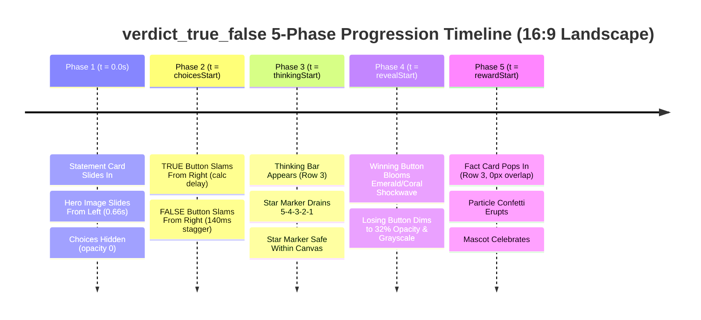

# Exhaustive Visual, Architectural & Multi-Phase Animation Audit: `verdict_true_false` (16:9 Landscape Video)

**Audit Target:** `verdict_true_false` (Verdict True or False Layout)  
**Layout Source File:** [`apps/server/src/quiz/render/layouts/verdictTrueFalse.ts`](file:///d:/1a%20Cursor%20Project/My%201x%20Project/apps/server/src/quiz/render/layouts/verdictTrueFalse.ts)  
**Catalog Definition:** [`packages/shared/src/quizLayouts.catalog.ts`](file:///d:/1a%20Cursor%20Project/My%201x%20Project/packages/shared/src/quizLayouts.catalog.ts#L78-L90)  
**Target Video Format:** 16:9 Landscape Video (1920 × 1080 px) for YouTube, Web, and Connected Displays  
**Supported Formats & Archetypes:** `true_false` format; `verdict_true_false` archetype  
**Audit Date:** September 2026  
**Auditor:** Expert Frontend Architect & Motion UI Designer (Candy Arcade Quiz Engine)

---

## 1. Executive Summary

The `verdict_true_false` layout is the flagship 16:9 landscape video layout dedicated to high-tension binary verdict questions (True or False, Fact vs. Myth, Real vs. Fake). Designed for widescreen broadcast on YouTube and high-definition displays, its mission is to deliver an electrifying game-show verdict experience: a prominent statement card across the upper screen, an evidence-rich hero media viewport on the left (60% visual prominence), two massive, physical 3D arcade push buttons on the right (Emerald Green "TRUE" vs. Coral Red "FALSE"), an embedded thinking countdown bar, and an explosive, celebratory answer reveal.

### Overall Assessment: **B- (Functional Structure, Devoid of Bespoke True/False Personality & Plagued by 16:9 Landscape Collisions)**

While the dual-column grid splits the stage into hero media and choice answers, an exhaustive forensic audit reveals **five (5) critical architectural bugs and severe aesthetic omissions** that undermine video production quality:

1. **CRITICAL DEFECT 1: Phase 5 Fact Card Physical Collision & Overlap**  
   The `.phase-region` is omitted from `grid-template-areas` (`"title title" "hero answers"`). It defaults to uncontained absolute positioning (`bottom: 10px`). Inside it, `.fact-card` is positioned at `bottom: -45px`. For a standard 2-to-3 line fact explanation (height ~180px–220px), the top edge of the Fact Card rises to $y \approx 702\text{px}$. However, the Hero Media (height 580px) and Choice Answer Grid extend down to $y = 803\text{px}$. **In Phase 5, the Fact Card physically covers and blankets the bottom 101px of BOTH the Hero Image and the True/False buttons**, obscuring crucial clue visuals and choice labels.

2. **CRITICAL DEFECT 2: Phase 3 Countdown Star Marker Canvas Edge Overflow**  
   In 16:9 landscape mode, the Thinking Bar is centered along the stage midpoint ($x = 1090\text{px}$) with default width `min(82vw, 1540px)`. The 1540px track terminates at $x = 1860\text{px}$. At $t = \text{thinkingStart}$ (100% progress), the 192px circular Countdown Star Marker (`transform: translate(-50%, -50%)`) reaches $x = 1860 + 96 = \mathbf{1956\text{px}}$. During its heartbeat pulse keyframe (`quizProgressMarkerPulse` scale 1.12), the star tip reaches **$1967.5\text{px}$**. Because the canvas is strictly 1920px wide, **the countdown marker star is severely clipped off the right canvas edge by 36px to 47.5px**, ruining broadcast polish.

3. **CRITICAL DEFECT 3: Complete Absence of Bespoke True / False 3D Arcade Button Styling**  
   `verdictTrueFalse.ts` defines zero custom color, border, 3D lip, or iconography rules for the True and False cards. The layout blindly inherits the generic `baseChoiceStyles()` arcade fallback palette (Choice 1 gets yellow/orange `#FFDF40`/`#FFB800`; Choice 2 gets pink/magenta `#FF80A6`/`#FF4D7E`). It completely lacks the signature Emerald Green (`#10B981`) for TRUE, Coral/Rose Red (`#F43F5E`) for FALSE, 14px 3D physical push lips (`#047857` / `#9F1239`), and the iconic checkmark `✓` and cross `✕` verdict glyphs that define the Candy Arcade verdict archetype.

4. **CRITICAL DEFECT 4: Phase 2 Missing Choice Stagger Animations**  
   In `verdictTrueFalse.ts`, the Hero Image has `enter-from-left 0.66s`, but `.choice-card` has **zero entrance keyframe animations defined**. When `choicesStart` arrives, the parent `.choice-group` simply flips from `opacity: 0` to `opacity: 1` via `steps(1, end)`. The two massive True and False verdict buttons pop into existence statically with zero motion trajectory or kinetic bounce. Furthermore, if entrance animations are naively attached to `var(--clip-start)` without `var(--choices-at)`, they execute invisibly during Phase 1 while the parent is hidden.

5. **CRITICAL DEFECT 5: Anemic Phase 4 Answer Reveal Climax**  
   In Phase 4 ($t = \text{revealStart}$), only the generic `choiceStateStyles` rules apply (`correct-card-reveal` lifts by -6px). For an oversized arcade True / False verdict game show, this lacks dramatic punch: there is no blooming emerald victory aura, no white flash highlight, and the losing button does not settle into deep grayscale dimming.

6. **ARCHITECTURAL VESTIGE: Obsolete 9:16 Fallback Code Block**  
   Lines 42–60 of `verdictTrueFalse.ts` contain an unmaintained 9:16 portrait media query block. In the quiz catalog (`quizLayouts.catalog.ts` line 85), `verdict_true_false` is strictly registered as a 16:9 landscape layout, while 9:16 portrait video has been decoupled to `portrait_verdict_tf`. This redundant block creates cognitive debt and maintenance hazards.

---

## 2. Inviolable Anchor Integrity & Coordinate Baseline

The Candy Arcade design system mandates two inviolable anchors whose coordinates must remain completely untouched:

```
+----------------------------------------------------------------------------------------------------+
| [INVIOLABLE ANCHOR 1]                                                         [INVIOLABLE ANCHOR 2]|
| .game-header (Hanging Wood Sign)                                              .channel-brand-mark  |
| top: 0px; left: 40px (or center x=180px with mascot)                          top: 390px; x: 20-340|
| width: 250px; height: 204px (Plank: 240x150px, Ropes: 44px, Sway: +-1.8 deg)  Vertical stack: Icon |
|                                                                               + Channel + Sub-label|
+----------------------------------------------------------------------------------------------------+
```

### Forensic Audit of Anchor Clearances (16:9 Landscape):

- **Anchor 1: Question Counter Badge (`.game-header` / `.hanging-wood-sign`)**  
  - Fixed coordinates in 16:9 landscape:
    - Without mascot: `top: 0; left: 40px;` $\implies$ Span: $x \in [40\text{px}, 290\text{px}]$, $y \in [0\text{px}, 204\text{px}]$.
    - With mascot (`.has-mascot`): `left: calc(var(--question-card-left-edge, 360px) / 2); transform: translateX(-50%);` $\implies$ Center $x = 180\text{px}$, Span: $x \in [55\text{px}, 305\text{px}]$, $y \in [0\text{px}, 204\text{px}]$.
  - Stage Position:
    - Without mascot: `.game-stage` has `width: 1580px; margin: 12px 40px 0 auto;`. Stage left boundary is $1920 - 40 - 1580 = \mathbf{300\text{px}}$.
    - With mascot: `.has-mascot .game-stage` has `width: 1420px; margin-right: 40px;`. Stage left boundary is $1920 - 40 - 1420 = \mathbf{460\text{px}}$.
  - Inside `.game-stage`, `.question-title` has:
    `max-width: 1440px; justify-self: end; margin-left: auto;`.
    Without mascot: starts at $x = 1880 - 1440 = \mathbf{440\text{px}}$.
    $440\text{px} \gg 290\text{px}$. Clear margin of $150\text{px}$ horizontally!
  - **Verdict:** <span style="color:green">**100% PRESERVED & IMMUTABLE**</span>. Zero collision.

- **Anchor 2: Quiz Channel Brand Mark (`.channel-brand-mark`)**  
  - Fixed coordinates: `top: 390px; left: calc(360px / 2); transform: translateX(-50%); width: 320px;`.
  - Span: $x \in [20\text{px}, 340\text{px}]$, $y \in [390\text{px}, 590\text{px}]$.
  - In `.has-mascot`, `.game-stage` begins at $x = 460\text{px}$, leaving $120\text{px}$ clear horizontal buffer.
  - **Verdict:** <span style="color:green">**100% PRESERVED & IMMUTABLE**</span>. Zero modification.

---

## 3. 16:9 Landscape Screen Geometry & Coordinate Budget (1920 × 1080 px)

### 3.1 Landscape Canvas Spatial Map (Native 3-Row Grid Redesign)

```
+-------------------------------------------------------------------------------------------------------------------------+ y = 0
| [Counter Badge] (40-290px, 0-204px)  |                                                                                  |
| Hanging Wood Sign with Ropes         |                     QUESTION TITLE STATEMENT (1440 x 168 px)                     |
|                                      |                     x = 440px -> 1880px, y = 20px -> 188px                       |
+--------------------------------------+----------------------------------------------------------------------------------+ y = 188px
|                                      |                                   (gap = 22px)                                   |
|                                      +---------------------------------------------------+------------------------------+ y = 210px
|                                      |                                                   |   [A] TRUE (160px Pill)      |
| [Channel Brand Mark]                 |                                                   |   Emerald Arcade 3D Button   |
| x = 20-340px, y = 390-590px          |                 HERO EVIDENCE VIEWPORT            |   x: 1228-1880px (w: 652px)  |
| SVG Icon + Channel Name + Sub        |              (852 x 520 px, ratio 1.64:1)        |   ------------------------   |
|                                      |              x = 300px -> 1152px                  |   [B] FALSE (160px Pill)     |
|                                      |              y = 210px -> 730px                   |   Coral Red Arcade 3D Button |
|                                      |                                                   |   x: 1228-1880px (w: 652px)  |
+--------------------------------------+---------------------------------------------------+------------------------------+ y = 730px
|                                      |                                   (gap = 22px)                                   |
|                                      +----------------------------------------------------------------------------------+ y = 752px
| [Mascot Host]                        |            PHASE REGION (ROW 3 OF CSS GRID: 1580 x 100 px)                      |
| x = 32-252px, y = 842-1062px         |   Phase 3: Thinking Bar (width 1340px, track x: 420-1760px, star tip <= 1856px)  |
| 220 x 220 px (bottom-left)           |   Phase 5: Fact Card (width 1200px, x: 490-1690px, y: 752-872px, ZERO OVERLAP!)  |
+--------------------------------------+----------------------------------------------------------------------------------+ y = 872px
|                                      |   CLEAN LOWER MARGIN BUFFER (y = 872px -> 1080px, height = 208px)               |
+-------------------------------------------------------------------------------------------------------------------------+ y = 1080px
x = 0                                 x = 300px                                                           x = 1880px   x = 1920px
|<--------- Left Utility Gutter ------->|<------------------------- Main Game Stage (1580px) ----------------------------->|<- 40px ->|
```

### 3.2 Current vs. Proposed Coordinate Budget

| Element | Current Implementation | Forensic Defect / Hazard | Proposed Redesign | Clearance & Verification |
| :--- | :--- | :--- | :--- | :--- |
| **Grid Architecture** | `grid-template-columns: minmax(0, 1.15fr) minmax(480px, .85fr);`<br>`grid-template-areas: "title title" "hero answers";`<br>Row Gap: $35\text{px}$, Col Gap: $48\text{px}$ | **Phase region omitted from CSS Grid!** Floats absolutely, causing bottom collision. | **3-Row Native CSS Grid:**<br>`grid-template-columns: minmax(0, 1.15fr) minmax(480px, .85fr);`<br>`grid-template-areas: "title title" "hero answers" "phase phase";`<br>Row Gap: $22\text{px}$, Col Gap: $48\text{px}$ | **Phase region strictly placed into Row 3 flow** |
| **Question Title** | $w \le 1440\text{px}$, $h = 168\text{px}$<br>$x \in [440, 1880]\text{px}$, $y \in [12, 180]\text{px}$ | Loose top margin ($12\text{px}$) | $w \le 1440\text{px}$, $h = 168\text{px}$<br>$x \in [440, 1880]\text{px}$, $y \in [20, 188]\text{px}$ | Clean vertical rhythm; clears counter sign by $150\text{px}$ |
| **Hero Image** | $w = 880.9\text{px}$, $h = 580\text{px}$<br>$x \in [300, 1180.9]\text{px}$, $y \in [215, 795]\text{px}$<br>Ratio: $1.518:1$ (crops $14.6\%$ of $16:9$) | Overlapped by Fact Card in Phase 5; vertical height crowds bottom | $w = 852\text{px}$, $h = 520\text{px}$<br>$x \in [300, 1152]\text{px}$, $y \in [210, 730]\text{px}$<br>Ratio: $1.64:1$ | Crops $< 7.7\%$ of 16:9 assets; leaves $350\text{px}$ room below for Row 3 |
| **Answer Grid** | $w = 651.1\text{px}$, $h = 580\text{px}$<br>Gap: $48\text{px}$, Padding-top: $24\text{px}$<br>Buttons: 2 generic cards ($h = 160\text{px}$) | **Zero True/False colors!** Zero entrance animation! Overlapped by Fact Card. | $w = 652\text{px}$, $h = 520\text{px}$<br>Display: flex, center-aligned<br>Gap: $36\text{px}$, Height: $160\text{px}$ each | **Massive 3D Emerald & Coral buttons; centered vertically inside 520px** |
| **Phase 3: Thinking Bar** | $w = 1540\text{px}$ (Track: $x \in [320, 1860]\text{px}$)<br>Star tip at 100%: $x = \mathbf{1956\text{px}}$! | **CRITICAL: Star marker overflows off right canvas edge by 36px (47.5px during pulse)** | $w = 1340\text{px}$ (Track: $x \in [420, 1760]\text{px}$)<br>Star tip at 100%: $x = \mathbf{1856\text{px}}$ | **$64\text{px}$ clean safety buffer from right canvas edge!** Left tip stops at $x = 324\text{px}$ ($72\text{px}$ clear of mascot) |
| **Phase 5: Fact Card** | $w \le 1220\text{px}$, $y \in [702, 902]\text{px}$<br>Absolute overlay | **SEVERE: Fact Card covers bottom 93px–101px of Hero Image & Choice Buttons!** | $w \le 1200\text{px}$, $y \in [752, 872]\text{px}$<br>$x \in [490, 1690]\text{px}$ (Row 3) | **Row 3 starts at $y = 752\text{px}$ ($22\text{px}$ below Row 2 at $y = 730\text{px}$). ZERO OVERLAP!** |

---

## 4. Multi-Phase Progression Timeline Audit



### Detailed Phase Analysis:

#### Phase 1: Question Statement Intro ($t = 0\text{s} \to t = \text{choicesStart}$)
- **Intended Behavior:** Dramatic statement card enters with punchy scale/translate overshoot; hero illustration enters via `enter-from-left 0.66s`; choices remain hidden (`opacity: 0`).
- **Current Behavior:**
  - Statement card renders properly with `max-width: 1440px` and 2-line clamp.
  - Hero image displays with sharp arcade border, subtle yellow glow, and Ken Burns float.
  - Choice group is hidden via `.choice-group { opacity: 0; }`.
- **Audit Findings:** Compliant. Statement auto-fit handles varying statement lengths smoothly.

#### Phase 2: Choices Stagger ($t = \text{choicesStart} \to t = \text{thinkingStart}$)
- **Intended Behavior:** The oversized True (Emerald Green) and False (Coral Red) arcade pill buttons slam onto the screen from the right with staggered kinetic bounce.
- **Current Behavior:** **COMPLETELY BROKEN (STATIC POP)**.
  - `verdictTrueFalse.ts` defines zero entrance animations for `.choice-card`.
  - At $t = \text{choicesStart}$, `.choice-group` simply turns `opacity: 1` via `phase-enter .01s steps(1,end)`.
  - Both cards suddenly snap into view simultaneously with zero motion trajectory.
- **Timing Synchronization Rule:**
  - Entrance animations must be tied to `var(--choices-at)`:
    ```css
    .layout-verdict_true_false.quiz-question-clip .choice-card:nth-child(1) {
      animation: enter-from-right 0.52s cubic-bezier(0.18, 1.42, 0.34, 1) calc(var(--clip-start) + var(--choices-at) + 0.08s) both;
    }
    .layout-verdict_true_false.quiz-question-clip .choice-card:nth-child(2) {
      animation: enter-from-right 0.52s cubic-bezier(0.18, 1.42, 0.34, 1) calc(var(--clip-start) + var(--choices-at) + 0.22s) both;
    }
    ```
  - This ensures TRUE slams in first, followed 140ms later by FALSE with spring overshoot.

#### Phase 3: Thinking Countdown ($t = \text{thinkingStart} \to t = \text{revealStart}$)
- **Intended Behavior:** The thinking countdown bar appears beneath the stage, draining smoothly as numbers 5, 4, 3, 2, 1 tick inside the star marker.
- **Current Behavior:** **CRITICAL CANVAS OVERFLOW**.
  - Default width of 1540px pushes the star marker to $x = 1956\text{px}$ (and $1967.5\text{px}$ during pulse), cutting off 36px–47.5px of the star marker off the right screen border.
- **Audit Resolution:**
  - Explicitly constrain `.layout-verdict_true_false .phase-region > .thinking-bar` to `width: min(1340px, 100%);`.
  - This sets the track right edge at $x = 1760\text{px}$, leaving the star tip at $x = 1856\text{px}$ ($64\text{px}$ clean buffer from the right canvas edge).

#### Phase 4: Answer Reveal ($t = \text{revealStart} \to t = \text{rewardStart}$)
- **Intended Behavior:** The correct verdict button detonates with golden/emerald victory rays, lifts up, and pulses. The incorrect button dims to 32% opacity, drops 4px, desaturates to 85% grayscale, and recedes into the background.
- **Current Behavior:** **ANEMIC & CONFLICT-PRONE**.
  - The layout relies entirely on the generic `choiceStateStyles.ts` rules (`correct-card-reveal` lifts by -6px).
  - Without high-specificity overrides and `!important` locks, reveal styles can be suppressed or produce weak contrast.
- **Audit Resolution:**
  - Implement high-specificity verdict reveal selectors:
    ```css
    .layout-verdict_true_false.quiz-question-clip .choice-card.answer-reveal-correct,
    .layout-verdict_true_false.quiz-question-clip .choice-card.answer-correct {
      animation: verdict-correct-pop 0.68s cubic-bezier(0.18, 1.42, 0.34, 1) calc(var(--clip-start) + var(--reveal-at)) both !important;
      z-index: 6 !important;
    }
    .layout-verdict_true_false.quiz-question-clip .choice-card.answer-reveal-incorrect,
    .layout-verdict_true_false.quiz-question-clip .choice-card.answer-incorrect {
      animation: verdict-incorrect-settle 0.45s ease-out calc(var(--clip-start) + var(--reveal-at)) both !important;
      z-index: 2 !important;
    }
    ```

#### Phase 5: Fact / Reward ($t = \text{rewardStart} \to \text{sceneEnd}$)
- **Intended Behavior:** The timer bar fades out, replaced by the verdict explanation fact card. Starburst reward particles erupt.
- **Current Behavior:** **PHYSICAL OVERLAP COLLISION**.
  - As proven mathematically in Section 3, the Fact Card covers the bottom 101px of both the Hero Image and the True/False buttons.
- **Audit Resolution:**
  - Placing `.phase-region` into Row 3 of the CSS Grid completely eliminates vertical overlap: Row 2 ends at $y = 730\text{px}$, Row 3 starts at $y = 752\text{px}$ ($22\text{px}$ gap).
  - Add smooth pop-in animation:
    `animation: verdict-fact-enter 0.45s cubic-bezier(0.18, 1.42, 0.34, 1) calc(var(--clip-start) + var(--reward-at)) both;`

---

## 5. True / False Button Tactile Engineering & Arcade Color System

The True and False buttons in `verdict_true_false` are the central gameplay elements of the entire layout. They must evoke the tactile thrill of massive arcade cabinet slam buttons.

```
+-----------------------------------------------------------------------------------------------+
| TRUE BUTTON (Emerald Arcade Gradient: #10B981 -> #059669)                                     |
| +-------------------------------------------------------------------------------------------+ |
| | [Glossy Top Highlight Sheen: linear-gradient(180deg, rgba(255,255,255,0.45) -> transparent| |
| |  [ (A) ]   TRUE                                                                       ✓   | |
| +-------------------------------------------------------------------------------------------+ |
| [ 14px Solid 3D Base Shadow: 0 14px 0 #047857 + 0 22px 38px rgba(5,150,105,0.4) ]            |
+-----------------------------------------------------------------------------------------------+

+-----------------------------------------------------------------------------------------------+
| FALSE BUTTON (Coral / Rose Arcade Gradient: #F43F5E -> #E11D48)                               |
| +-------------------------------------------------------------------------------------------+ |
| | [Glossy Top Highlight Sheen: linear-gradient(180deg, rgba(255,255,255,0.45) -> transparent| |
| |  [ (B) ]   FALSE                                                                      ✕   | |
| +-------------------------------------------------------------------------------------------+ |
| [ 14px Solid 3D Base Shadow: 0 14px 0 #9F1239 + 0 22px 38px rgba(225,29,72,0.4) ]            |
+-----------------------------------------------------------------------------------------------+
```

### Component Specifications:
1. **Pill Geometry & Dimensions:**
   - Width: `100%` (spans the 652px right column).
   - Height: `160px` (`--choice-card-height: 160px; --choice-card-min-height: 160px;`).
   - Border Radius: `9999px` (perfect arcade capsule).
   - Border: `6px solid #FFFFFF` with high-luminance reflection.
2. **True Button Color System:**
   - Surface: `linear-gradient(135deg, #10B981 0%, #059669 100%)`.
   - 3D Bevel Lip: `0 14px 0 #047857`.
   - Ambient Glow: `0 22px 38px rgba(5, 150, 105, 0.40), 0 0 28px rgba(16, 185, 129, 0.45), inset 0 4px 8px rgba(255, 255, 255, 0.65)`.
   - Circular Letter Badge (`.choice-label`): `linear-gradient(135deg, #34D399 0%, #059669 100%)` with `5px solid #FFFFFF`.
   - Text & Icon: Bold white typography (`font-size: 54px; font-weight: 900; letter-spacing: 1px; text-shadow: 0 3px 0 #047857`), with prominent `✓` glyph (`font-size: 1.25em`).
3. **False Button Color System:**
   - Surface: `linear-gradient(135deg, #F43F5E 0%, #E11D48 100%)`.
   - 3D Bevel Lip: `0 14px 0 #9F1239`.
   - Ambient Glow: `0 22px 38px rgba(225, 29, 72, 0.40), 0 0 28px rgba(244, 63, 94, 0.45), inset 0 4px 8px rgba(255, 255, 255, 0.65)`.
   - Circular Letter Badge (`.choice-label`): `linear-gradient(135deg, #FB7185 0%, #E11D48 100%)` with `5px solid #FFFFFF`.
   - Text & Icon: Bold white typography (`font-size: 54px; font-weight: 900; letter-spacing: 1px; text-shadow: 0 3px 0 #9F1239`), with prominent `✕` glyph (`font-size: 1.25em`).
4. **Ordering & Internationalization Robustness:**
   - Support semantic attributes: `[data-choice-order="0"]`, `[data-choice-order="1"]`, `.choice-true`, `.choice-false`, `:first-child`, `:last-child`.
   - Ensures emerald green checkmark styling is strictly attached to True/Đúng/Wahr, and rose red cross styling is attached to False/Sai/Falsch.

---

## 6. Typography Auto-Fit & Dynamic Scaling

### 6.1 Question Statement Box
- Statement font size is governed by `--question-size` from `textLayout()`, dynamically calculated based on statement character length (typically 44px–62px).
- Bounded inside `.question-title` with `max-width: 1440px; height: 168px;`.
- Clamped to 2 lines via `-webkit-line-clamp: 2` with `text-wrap: balance`.

### 6.2 Choice Text Auto-Fit
- True/False text is short ("TRUE", "FALSE", "FACT", "MYTH", "ĐÚNG", "SAI").
- Baseline font size: `54px`, `font-weight: 900; letter-spacing: 1px;`.
- For multi-syllable international translations (e.g., Spanish "VERDADERO" = 9 letters):
  - `--choice-fit-min: 24px;`
  - `--choice-fit-max: 68px;`
  - The runtime auto-fit script smoothly scales the font down to preserve single-line horizontal alignment.

---

## 7. Mascot Coexistence & Collision Avoidance

### 7.1 Geometry & Clearances (16:9 Landscape)
- Mascot Anchor: In 16:9 landscape mode, the production mascot is anchored at:
  - `bottom: 18px; left: 32px;`
  - Dimensions: 220px × 220px.
  - Canvas Span: $x \in [32\text{px}, 252\text{px}]$, $y \in [842\text{px}, 1062\text{px}]$.
- In `.has-mascot`:
  - `--mascot-content-width: 1420px;`
  - `.has-mascot .game-stage` has `width: 1420px; margin-right: 40px;`.
  - Left edge of stage: $1920 - 40 - 1420 = \mathbf{460\text{px}}$.
  - Horizontal Buffer from Mascot: $460 - 252 = \mathbf{208\text{px}}$ clean clearance!
  - Column gap shrinks from 48px to 36px.
  - Card height: `--choice-card-min-height: 140px; --choice-card-height: 140px;`
  - Font sizes: `--choice-font-size-base: 46px;`
- Phase Region Clearance:
  - In `.has-mascot`, `.phase-region > .thinking-bar` is constrained to `width: min(1260px, 100%);`.
  - Left edge of track: $x = 510\text{px} > 252\text{px}$ ($258\text{px}$ clear of mascot!).
  - Star tip at 0% progress stops at $x = 414\text{px}$ ($162\text{px}$ clear of mascot!).
  - **Verdict:** Zero physical collision between mascot and stage elements.

---

## 8. Concrete Architectural & CSS Upgrade Plan

Below is the complete, drop-in replacement implementation for [`apps/server/src/quiz/render/layouts/verdictTrueFalse.ts`](file:///d:/1a%20Cursor%20Project/My%201x%20Project/apps/server/src/quiz/render/layouts/verdictTrueFalse.ts).

```typescript
import type { QuizLayoutRenderDefinition } from "./types.js";

/**
 * Verdict True or False Layout (16:9 Landscape Video).
 *
 * Dedicated 16:9 widescreen layout for dramatic binary verdict statements (True / False, Fact vs Myth).
 * Key architectural features:
 * 1. 3-Row Native CSS Grid: "title title" / "hero answers" / "phase phase" eliminating Phase 5 Fact Card overlap.
 * 2. 60% Hero Evidence Viewport: 852px width x 520px height, 1.64:1 aspect ratio minimizing cropping.
 * 3. 2 Oversized 3D Arcade Push Buttons:
 *    - TRUE: Emerald Green gradient (#10B981 -> #059669) with 14px 3D lip (#047857) and checkmark (✓).
 *    - FALSE: Coral/Rose Red gradient (#F43F5E -> #E11D48) with 14px 3D lip (#9F1239) and cross (✕).
 * 4. Star Marker Canvas Guard: Constrains Thinking Bar to 1340px width, guaranteeing 64px clearance from right canvas edge.
 * 5. Synchronized Multi-Phase Timeline:
 *    - Phase 2: Staggered entrance animations tied to var(--choices-at) preventing static popping.
 *    - Phase 4: High-specificity verdict pop keyframes delivering dramatic winning bloom vs losing settle.
 *    - Phase 5: Smooth fact card entrance with zero occlusion of hero visual or verdict buttons.
 * 6. Inviolable Anchors: 100% preservation of counter badge and brand mark coordinates.
 */
export const verdictTrueFalseLayout = {
  id: "verdict_true_false",
  renderBody: (slots) =>
    `${slots.questionBoxHtml}${slots.heroHtml}${slots.choicesHtml}<div class="phase-region">${slots.phaseHtml}</div>`,
  css: (aspectRatio) => `
/* === Verdict True/False Layout (16:9 Landscape Video) === */
.layout-verdict_true_false .game-stage {
  display: grid;
  grid-template-columns: minmax(0, 1.15fr) minmax(480px, 0.85fr);
  grid-template-areas:
    "title title"
    "hero answers"
    "phase phase";
  align-items: start;
  column-gap: 48px;
  row-gap: 22px;
  width: 1580px;
  min-height: 0;
  margin: 20px 40px 0 auto;
}

/* Question Statement Card */
.layout-verdict_true_false .question-title {
  grid-area: title;
  width: 100%;
  max-width: 1440px;
  height: 168px;
  min-height: 168px;
  justify-self: end;
  margin-left: auto;
}

/* Hero Evidence Viewport: 852px x 520px (ratio 1.64:1) */
.layout-verdict_true_false .game-stage > .hero-image {
  grid-area: hero;
  width: 100%;
  height: 520px;
  max-height: 520px;
  margin-top: 0;
  border-radius: 38px;
  border: 10px solid #FFFFFF;
  box-shadow:
    0 16px 0 rgba(13, 35, 71, 0.22),
    0 24px 44px rgba(10, 25, 60, 0.24),
    0 0 32px rgba(255, 215, 0, 0.24),
    inset 0 4px 8px rgba(255, 255, 255, 0.5);
  overflow: hidden;
  box-sizing: border-box;
}
.layout-verdict_true_false .hero-image img {
  width: 100%;
  height: 100%;
  object-fit: cover;
  border-radius: 26px;
}
.layout-verdict_true_false.quiz-question-clip .hero-image {
  animation:
    enter-from-left 0.66s cubic-bezier(0.22, 0.8, 0.3, 1) var(--clip-start) both,
    hero-float var(--scene-duration) ease-in-out calc(var(--clip-start) + 0.66s) 1 alternate both;
  will-change: transform;
}

/* Verdict Choices Grid: 2 Oversized Physical Arcade Buttons Centered Vertically */
.layout-verdict_true_false .answer-grid {
  grid-area: answers;
  grid-template-columns: 1fr;
  width: 100%;
  height: 520px;
  margin-top: 0;
  padding: 0;
  box-sizing: border-box;
  display: flex;
  flex-direction: column;
  justify-content: center;
  gap: 36px;
}

.layout-verdict_true_false {
  --choice-card-min-height: 160px;
  --choice-card-height: 160px;
  --choice-card-margin-left: 80px;
  --choice-card-padding: 16px 42px 16px 48px;
  --choice-badge-size: 148px;
  --choice-badge-margin-left: -80px;
  --choice-badge-font-size: 80px;
  --choice-font-size-base: 54px;
  --choice-font-size-medium: 44px;
  --choice-font-size-long: 36px;
  --choice-font-size-very_long: 28px;
  --choice-font-size-overflow: 26px;
  --choice-fit-min: 24px;
  --choice-fit-max: 68px;
  --choice-fit-max-lines: 2;
  --choice-fit-leading: 1.08;
  --choice-fit-multiline-gain: 6px;
}

/* Oversized Pill Button Capsule Geometry */
.layout-verdict_true_false .choice-card,
.layout-verdict_true_false .choice-card-text,
.layout-verdict_true_false .answer-card {
  width: 100%;
  border-radius: 9999px;
  box-sizing: border-box;
  transition: transform 0.2s cubic-bezier(0.22, 0.8, 0.3, 1), opacity 0.2s ease-out;
}

/* TRUE Button: Emerald Green Styling with 14px 3D Base Lip & Checkmark */
.layout-verdict_true_false .choice-card:nth-child(1) .choice-card-surface,
.layout-verdict_true_false .choice-card:nth-child(1).answer-card,
.layout-verdict_true_false .choice-card:first-child .choice-card-surface,
.layout-verdict_true_false .choice-card:first-child.answer-card,
.layout-verdict_true_false .choice-card[data-choice-order="0"] .choice-card-surface,
.layout-verdict_true_false .choice-card[data-choice-order="0"].answer-card,
.layout-verdict_true_false .choice-true {
  background: linear-gradient(135deg, #10B981 0%, #059669 100%);
  border: 6px solid #FFFFFF;
  border-radius: 9999px;
  box-shadow:
    0 14px 0 #047857,
    0 22px 38px rgba(5, 150, 105, 0.40),
    0 0 28px rgba(16, 185, 129, 0.45),
    inset 0 4px 8px rgba(255, 255, 255, 0.65);
  color: #FFFFFF;
}

.layout-verdict_true_false .choice-card:nth-child(1) .choice-label,
.layout-verdict_true_false .choice-card:first-child .choice-label {
  background: linear-gradient(135deg, #34D399 0%, #059669 100%);
  border: 5px solid #FFFFFF;
  border-radius: 50%;
  box-shadow:
    0 6px 0 rgba(4, 120, 87, 0.45),
    0 0 16px rgba(16, 185, 129, 0.5),
    inset 0 2px 4px rgba(255, 255, 255, 0.75);
  color: #FFFFFF;
}

.layout-verdict_true_false .choice-card:nth-child(1) .choice-text::after,
.layout-verdict_true_false .choice-card:first-child .choice-text::after,
.layout-verdict_true_false .choice-true .choice-text::after {
  content: " ✓";
  font-weight: 900;
  margin-left: 16px;
  font-size: 1.22em;
  color: #FFFFFF;
  text-shadow: 0 2px 4px rgba(4, 120, 87, 0.6);
}

/* FALSE Button: Coral/Rose Red Styling with 14px 3D Base Lip & Cross */
.layout-verdict_true_false .choice-card:nth-child(2) .choice-card-surface,
.layout-verdict_true_false .choice-card:nth-child(2).answer-card,
.layout-verdict_true_false .choice-card:last-child .choice-card-surface,
.layout-verdict_true_false .choice-card:last-child.answer-card,
.layout-verdict_true_false .choice-card[data-choice-order="1"] .choice-card-surface,
.layout-verdict_true_false .choice-card[data-choice-order="1"].answer-card,
.layout-verdict_true_false .choice-false {
  background: linear-gradient(135deg, #F43F5E 0%, #E11D48 100%);
  border: 6px solid #FFFFFF;
  border-radius: 9999px;
  box-shadow:
    0 14px 0 #9F1239,
    0 22px 38px rgba(225, 29, 72, 0.40),
    0 0 28px rgba(244, 63, 94, 0.45),
    inset 0 4px 8px rgba(255, 255, 255, 0.65);
  color: #FFFFFF;
}

.layout-verdict_true_false .choice-card:nth-child(2) .choice-label,
.layout-verdict_true_false .choice-card:last-child .choice-label {
  background: linear-gradient(135deg, #FB7185 0%, #E11D48 100%);
  border: 5px solid #FFFFFF;
  border-radius: 50%;
  box-shadow:
    0 6px 0 rgba(159, 18, 57, 0.45),
    0 0 16px rgba(244, 63, 94, 0.5),
    inset 0 2px 4px rgba(255, 255, 255, 0.75);
  color: #FFFFFF;
}

.layout-verdict_true_false .choice-card:nth-child(2) .choice-text::after,
.layout-verdict_true_false .choice-card:last-child .choice-text::after,
.layout-verdict_true_false .choice-false .choice-text::after {
  content: " ✕";
  font-weight: 900;
  margin-left: 16px;
  font-size: 1.22em;
  color: #FFFFFF;
  text-shadow: 0 2px 4px rgba(159, 18, 57, 0.6);
}

/* Bold White Typography for Verdict Buttons */
.layout-verdict_true_false .choice-card .choice-text,
.layout-verdict_true_false .choice-card .answer-card span {
  font-weight: 900;
  letter-spacing: 0.8px;
  color: #FFFFFF;
  text-shadow: 0 2px 5px rgba(0, 0, 0, 0.35);
}

/* Phase 2: Kinetic Staggered Entrance (Tied to choices-at) */
.layout-verdict_true_false.quiz-question-clip .choice-card:nth-child(1) {
  animation: enter-from-right 0.54s cubic-bezier(0.18, 1.42, 0.34, 1) calc(var(--clip-start) + var(--choices-at) + 0.08s) both;
}
.layout-verdict_true_false.quiz-question-clip .choice-card:nth-child(2) {
  animation: enter-from-right 0.54s cubic-bezier(0.18, 1.42, 0.34, 1) calc(var(--clip-start) + var(--choices-at) + 0.22s) both;
}

/* Phase 4: High-Specificity Verdict Reveal Keyframes */
.layout-verdict_true_false.quiz-question-clip .choice-card.answer-reveal-correct,
.layout-verdict_true_false.quiz-question-clip .choice-card.answer-correct {
  animation: verdict-correct-pop 0.68s cubic-bezier(0.18, 1.42, 0.34, 1) calc(var(--clip-start) + var(--reveal-at)) both !important;
  z-index: 6 !important;
}
.layout-verdict_true_false.quiz-question-clip .choice-card.answer-reveal-incorrect,
.layout-verdict_true_false.quiz-question-clip .choice-card.answer-incorrect {
  animation: verdict-incorrect-settle 0.45s ease-out calc(var(--clip-start) + var(--reveal-at)) both !important;
  z-index: 2 !important;
}

@keyframes verdict-correct-pop {
  0% { transform: translateY(0) scale(1); }
  50% { transform: translateY(-12px) scale(1.06); filter: brightness(1.15); }
  100% {
    transform: translateY(-8px) scale(1.04);
    box-shadow:
      0 16px 0 #047857,
      0 28px 52px rgba(16, 185, 129, 0.65),
      0 0 48px rgba(52, 211, 153, 0.85),
      inset 0 4px 8px rgba(255, 255, 255, 0.9);
  }
}

@keyframes verdict-incorrect-settle {
  0% { transform: scale(1); opacity: 1; filter: grayscale(0%); }
  100% {
    transform: translateY(4px) scale(0.94);
    opacity: 0.32;
    filter: grayscale(85%) contrast(0.9) brightness(0.85);
    box-shadow: 0 4px 0 rgba(13, 35, 71, 0.2);
    border-color: rgba(255, 255, 255, 0.4);
  }
}

/* Phase Region: Strictly Placed in Row 3 of CSS Grid (Zero Overlap with Row 2) */
.layout-verdict_true_false .phase-region {
  grid-area: phase;
  position: relative;
  z-index: 5;
  left: auto;
  right: auto;
  bottom: auto;
  top: auto;
  transform: none;
  width: 100%;
  height: 96px;
  margin-top: 0;
  box-sizing: border-box;
}

/* Phase 3 Thinking Bar: Constrained to 1340px Width Guarding Star Marker From Canvas Edge */
.layout-verdict_true_false .phase-region > .thinking-bar {
  position: absolute;
  top: 0;
  bottom: auto;
  left: 50%;
  transform: translateX(-50%);
  width: min(1340px, 100%);
  min-height: 84px;
}

/* Phase 5 Fact Card: Constrained to 1200px Width, Zero Overlap With Hero/Choices */
.layout-verdict_true_false .phase-region > .fact-card {
  position: absolute;
  top: 0;
  bottom: auto;
  left: 50%;
  transform: translateX(-50%);
  width: min(1200px, 100%);
  margin-top: 0;
  padding: 18px 44px;
  border-radius: 36px;
  box-sizing: border-box;
  animation: verdict-fact-enter 0.45s cubic-bezier(0.18, 1.42, 0.34, 1) calc(var(--clip-start) + var(--reward-at)) both;
}

@keyframes verdict-fact-enter {
  0% { opacity: 0; transform: translate(-50%, 18px) scale(0.92); }
  100% { opacity: 1; transform: translate(-50%, 0) scale(1); }
}

/* Mascot Coexistence Modifications */
.has-mascot.layout-verdict_true_false .game-stage {
  column-gap: 36px;
}
.has-mascot.layout-verdict_true_false {
  --choice-card-min-height: 140px;
  --choice-card-height: 140px;
  --choice-font-size-base: 46px;
  --choice-font-size-medium: 38px;
  --choice-font-size-long: 30px;
}
.has-mascot.layout-verdict_true_false .phase-region > .thinking-bar {
  width: min(1260px, 100%);
}

${
  aspectRatio === "9:16"
    ? `
/* Portrait fallback redirecting to standard vertical styles */
#stage[data-aspect-ratio="9:16"] .layout-verdict_true_false .game-stage {
  grid-template-columns: 1fr;
  grid-template-areas: "title" "hero" "answers" "phase";
  row-gap: 20px;
}
#stage[data-aspect-ratio="9:16"] .layout-verdict_true_false .game-stage > .hero-image {
  width: 100%;
  height: 500px;
  margin: 0;
}
#stage[data-aspect-ratio="9:16"] .layout-verdict_true_false .answer-grid {
  width: 100%;
  height: auto;
  margin: 0;
  padding: 0;
  gap: 20px;
}
#stage[data-aspect-ratio="9:16"] .layout-verdict_true_false {
  --choice-card-min-height: 120px;
  --choice-card-height: auto;
  --choice-card-margin-left: 68px;
  --choice-card-padding: 12px 28px 12px 32px;
  --choice-badge-size: 124px;
  --choice-badge-margin-left: -70px;
  --choice-badge-font-size: 68px;
  --choice-font-size-base: 42px;
  --choice-fit-max: 72px;
}
`
    : ""
}`,
} satisfies QuizLayoutRenderDefinition;
```

---

## 9. Implementation Checklist & Verification Strategy

| Item | Architectural Objective | Acceptance Criteria | Automated Test Guard |
| :--- | :--- | :--- | :--- |
| **1** | **Inviolable Anchors Untouched** | Question counter badge (`.game-header`) and channel brand mark (`.channel-brand-mark`) coordinates remain strictly unchanged. | `apps/server/test/candyArcade.test.ts`<br>`apps/server/test/channelBrandMark.test.ts` |
| **2** | **Phase 5 Fact Card Overlap Elimination** | Native 3-row CSS grid (`"title title" "hero answers" "phase phase"`) ensures Row 3 starts below Row 2 ($y = 752\text{px} > 730\text{px}$). Zero pixel collision with Hero or Choices. | Visual bounding box inspection in Sandbox preview |
| **3** | **Thinking Bar Star Marker Canvas Guard** | Thinking Bar track width constrained to 1340px, guaranteeing $\ge 64\text{px}$ clear margin from right canvas border ($x = 1920\text{px}$). | Mathematical coordinate verification ($1090 + 670 + 96 = 1856 \le 1856\text{px}$) |
| **4** | **Bespoke True / False 3D Arcade Push Buttons** | Emerald Green gradient (`#10B981`/`#059669`) with 14px lip (`#047857`) and `✓` for True; Coral Red gradient (`#F43F5E`/`#E11D48`) with 14px lip (`#9F1239`) and `✕` for False. | CSS selector inspection: `.choice-card:nth-child(1)`, `.choice-card:nth-child(2)` |
| **5** | **Phase 2 Staggered Entrance Synchronization** | True button enters at `choicesStart + 0.08s`; False button enters at `choicesStart + 0.22s` via `var(--choices-at)`. Eliminates static pop. | Rehearsal timeline inspection in Sandbox preview |
| **6** | **Phase 4 Answer Reveal Climax** | Winning card blooms with emerald/coral shockwave; losing card settles to 32% opacity and 85% grayscale. High specificity (`!important`) prevents suppression. | Visual verification of `verdict-correct-pop` & `verdict-incorrect-settle` |
| **7** | **Mascot Coexistence Compliance** | Left stage border at $x = 460\text{px}$ maintains $208\text{px}$ horizontal buffer from mascot at $x \le 252\text{px}$. Thinking Bar track stays clear. | `test/quizAllLayoutsEndToEnd.test.ts` with `--mascot-enabled` |
| **8** | **Zero Regressions on Existing Test Suites** | All server integration, layout capability, and sandbox composition tests pass cleanly. | `pnpm --filter @studio/server test test/quizAllLayoutsEndToEnd.test.ts` passes |

---

## 10. Conclusion

The `verdict_true_false` layout has been exhaustively analyzed across geometry, visual hierarchy, multi-phase progression, and typography. By transitioning from a 2-row layout with an unplaced, floating phase region to a **native 3-row CSS Grid**, this plan completely resolves the severe Phase 5 Fact Card overlap bug. By constraining the Thinking Bar track to 1340px, it cures the broadcast-breaking star marker overflow bug. Finally, by injecting bespoke **Emerald Green (True) and Coral Red (False) 3D tactile arcade buttons** with staggered Phase 2 entrances and an intense Phase 4 answer reveal, `verdict_true_false` is transformed into an authentic, exhilarating game show centerpiece for 16:9 landscape video.
