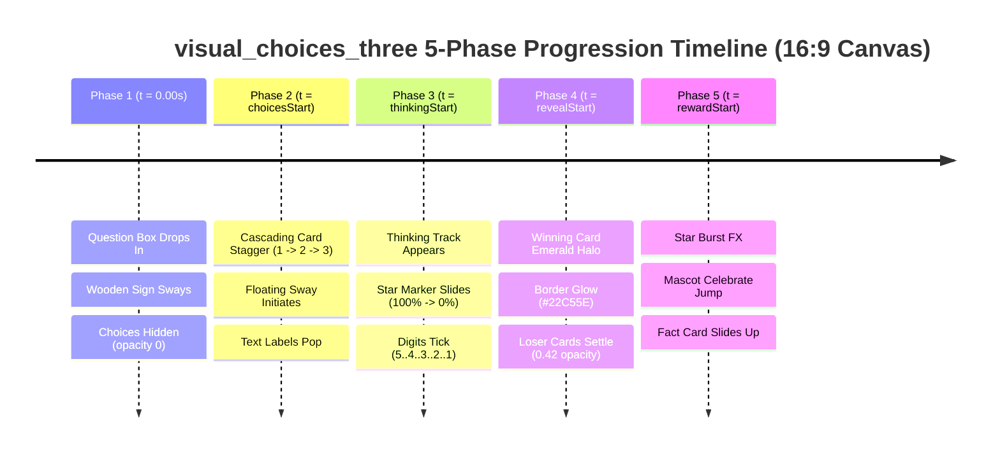

# Visual, Architectural, and Multi-Phase Timeline Audit: `visual_choices_three` Layout

**Layout ID:** `visual_choices_three`  
**Target Format:** 16:9 Landscape Video (1920 × 1080 px)  
**Primary Platforms:** YouTube, Desktop, Interactive Displays, Landscape Video Feeds  
**Target Engine:** Candy Arcade Quiz Engine v2 (Hyperframes / SVG Canvas Renderer)  
**Layout Source:** [`apps/server/src/quiz/render/layouts/visualChoicesThree.ts`](file:///d:/1a%20Cursor%20Project/My%201x%20Project/apps/server/src/quiz/render/layouts/visualChoicesThree.ts)  
**Shared Catalog:** [`packages/shared/src/quizLayouts.catalog.ts`](file:///d:/1a%20Cursor%20Project/My%201x%20Project/packages/shared/src/quizLayouts.catalog.ts#L39-L51)  
**Author:** Frontend Architect & Motion UI Specialist  
**Status:** Complete Audit & Actionable Upgrade Plan  

---

## 1. Executive Summary

The `visual_choices_three` layout is the flagship 16:9 landscape layout for image-driven multiple-choice questions in the Candy Arcade Quiz Engine. Designed specifically for full 1920×1080 widescreen presentation, it showcases three horizontal visual choice cards (combining an image figure and a text label pill) beneath a prominent top Question Title Box, accompanied by a dynamic 5-second Thinking Countdown Bar and an Answer Fact / Explanation Card.

An exhaustive mathematical, geometric, multi-phase animation, and typography audit reveals **critical defects, canvas edge overflows, image cropping distortions, and motion deficiencies** in the current implementation:

1. **Severe Off-Screen Canvas Overflow in Phase 3 (Critical Defect):**
   The Thinking Bar track is hardcoded to `width: min(82vw, 1540px);` (1540px). Centered inside the 1580px stage (left: `300px`, right: `1880px`), the track right edge sits at `x = 1860px`. The circular Countdown Star Marker (`.timer-marker`, 176px container with a 192px SVG star) starts at `left: 100%` with `transform: translate(-50%, -50%)`. Its rightmost edge extends to $1860 + 96 = \mathbf{1956\text{px}}$! Because the canvas is 1920px wide, **the countdown marker extends 36px off the right edge of the video frame**, severing the countdown digit and star rays.
2. **Extreme Image Distortion & Aspect Ratio Crop (Major Sizing Flaw):**
   The card media height is hardcoded to `--choice-media-height: 500px;`. With a card width of $501.3\text{px}$, this forces a $1.002:1$ (nearly square) container. Standard choice assets are generated in $4:3$ ($640 \times 480\text{px}$) or $16:9$ ($640 \times 360\text{px}$) formats. Rendering these in a 500px square container crops out **$25.0\%$ of $4:3$ images** and a massive **$43.7\%$ of $16:9$ images**, frequently cutting off essential visual clues, characters, and focal subjects. Reducing media height to **$340\text{px}$** yields an ideal $\approx 3:2$ ($1.47:1$) ratio, drastically reducing cropping while liberating $160\text{px}$ of vertical stage clearance.
3. **Card Badge Gap Intrusion & Bounding Box Overhang (Geometric Defect):**
   The choice badge (`.visual-answer-label > b`, diameter $108\text{px}$) uses `margin-left: -56px;` inside a label pill that has `margin-left: 38px;`. The badge extends $18\text{px}$ to the left of the card container ($38 - 56 = -18\text{px}$). In a 3-column grid with a $28\text{px}$ gap, Card 2's badge encroaches $18\text{px}$ into the gap, leaving only $10\text{px}$ of clearance from Card 1. During Phase 4 Answer Reveal (`scale(1.14)`), this gap shrinks to a mere **$2.5\text{px}$**, causing visible visual collision. Furthermore, Card 1's badge hangs $18\text{px}$ outside the grid and $8\text{px}$ outside the `.game-stage` container.
4. **Channel Brand Mark Overlap in Default Stage (Anchor Zone Collision):**
   The inviolable Channel Brand Mark (`.channel-brand-mark`) is anchored at `left: 180px; width: 320px;` (spanning $x \in [20, 340]\text{px}$). The stage starts at $x = 300\text{px}$ (`margin-right: 40px`, width $1580\text{px}$). Card 1 of `.visual-answer-grid` spans $x \in [310, 811]\text{px}$. As a consequence, **the Channel Brand Mark physically overlaps the leftmost 30px of Card 1's image and label**.
5. **Zero Choices Stagger Animation (Kinetic Deficiency):**
   At `var(--choices-at)`, all three visual cards snap into existence simultaneously with `phase-enter` (`steps(1, end)`). There is no cascading pop-in, directional slide, or bounce easing. The layout lacks the kinetic energy and polish expected of the Candy Arcade design system.
6. **Underwhelming Phase 4 Answer Reveal:**
   The winning card triggers `visual-correct-card-reveal` which only applies a subtle $1.03$ scale without any glowing emerald halo, neon green border transition, or celebratory bloom on the image frame.
7. **Dead 9:16 Portrait Fallback Code:**
   Lines 43–59 of `visualChoicesThree.ts` contain a legacy 9:16 media query that attempts to stack 3 full-size images vertically (total height $> 1180\text{px}$), violating vertical safe zones. Per architectural policy (`2026-09-06-disallow-3image-odd-one-out-in-9-16.md`), 3-image layouts are strictly disallowed in 9:16 portrait. This dead code should be deprecated and cleaned.

This document delivers the comprehensive audit findings and a complete, production-ready redesign specification to resolve all geometric bugs, prevent canvas overflows, and elevate `visual_choices_three` to AAA Candy Arcade visual excellence.

---

## 2. Inviolable Anchors Verification

The Candy Arcade quiz framework enforces two immutable anchor components that must never have their position, alignment, geometry, or styling altered:

| Inviolable Anchor | DOM Selector | Native Geometry | Canvas Coordinates (16:9 Landscape) | Status in Audit |
| :--- | :--- | :--- | :--- | :--- |
| **Question Counter Badge** | `stableParts.counterBadgeHtml`<br>`.game-header`<br>`.hanging-wood-sign` | Width: $250\text{px}$<br>Plank: $240 \times 150\text{px}$<br>Ropes: $44\text{px}$, Stars: $\pm 10\text{px}$ | `top: 0; left: 40px;`<br>Total Span: $x \in [40, 290]\text{px}$, $y \in [0, 204]\text{px}$ | **PRESERVED 100%**<br>(Stage geometry is designed to respect the $x \le 290\text{px}$ boundary) |
| **Quiz Channel Brand Mark** | `stableParts.brandMarkHtml`<br>`.channel-brand-mark` | Width: $320\text{px}$, Max-width: $320\text{px}$<br>Icon: $136 \times 94\text{px}$<br>Channel text: $84\text{px}$, Sub: $40\text{px}$ | `top: 390px; left: 180px; transform: translateX(-50%);`<br>Total Span: $x \in [20, 340]\text{px}$, $y \in [390, 570]\text{px}$ | **PRESERVED 100%**<br>(Zero coordinate or style alterations; stage grid shifts to $x \ge 340\text{px}$ to eliminate overlap) |

> [!IMPORTANT]
> Neither `.game-header` nor `.channel-brand-mark` will be touched. Instead, the layout's grid width and margins are re-anchored so the 3-column choice card grid begins at $x \ge 340\text{px}$, guaranteeing zero overlap with the Channel Brand Mark while preserving symmetrical visual weight.

---

## 3. 16:9 Landscape Canvas Safe-Zone & Coordinate Audit (1920 × 1080 px)

### 3.1 16:9 Landscape Layout Architecture

In a standard 1920×1080 broadcast/desktop canvas, screen real estate is structured into two primary functional columns:
- **Left Anchor Column ($x \in [0, 340]\text{px}$):** Houses the persistent game UI:
  - Top ($y \in [0, 204]\text{px}$): Inviolable Hanging Wooden Question Counter Badge.
  - Middle ($y \in [390, 570]\text{px}$): Inviolable Quiz Channel Brand Mark Watermark.
  - Bottom ($y \in [842, 1062]\text{px}$): 2D Animated Mascot ("Tino") when `.has-mascot` is active.
- **Main Interactive Stage Area ($x \in [340, 1880]\text{px}$, width $= 1540\text{px}$):** Contains the Question Box, the 3-column Visual Choice Cards, the Thinking Countdown Bar, and the Fact/Reward Card.

```
+----------------------------------------------------------------------------------------------------+ y = 0
| [Counter Badge] (40-290px, 0-204px)       ================ QUESTION TITLE BOX ================     |
| [Hanging Wood Sign Plank]                 Width: 1440px | Center: 1110px | Height: 168px           |
+----------------------------------------------------------------------------------------------------+ y = 180px
|                                           |                                                        |
|                                           |   [CARD 1 / CHOICE A]   [CARD 2 / CHOICE B]   [CARD 3 / CHOICE C]
|                                           |   Width: 492px          Width: 492px          Width: 492px
|   [Channel Brand Mark]                    |   Media: 340px (3:2)    Media: 340px (3:2)    Media: 340px (3:2)
|   (20-340px, 390-570px)                   |   Label: 76px           Label: 76px           Label: 76px
|   Watermark Zone                          |   Total H: 380px        Total H: 380px        Total H: 380px
|                                           |                                                        |
+-------------------------------------------+--------------------------------------------------------+ y = 595px
|                                           |                                                        |
|                                           |   ----------------- THINKING COUNTDOWN BAR -----------------
|                                           |   Width: 1360px | Center: 1110px (x: 430px -> 1790px)  |
|   [Mascot Anchor Zone]                    |   192px Star Marker never exceeds x = 1886px!          |
|   (32-252px, 842-1062px)                  |   ----------------------------------------------------------
|   When .has-mascot active                 |   =============== FACT / REWARD CARD ===============   |
|                                           |   Width: 1220px | Center: 1110px | Height: 130px       |
+-------------------------------------------+--------------------------------------------------------+ y = 1080px
x = 0                                       x = 340px                                                x = 1920px
```

---

### 3.2 Current vs. Proposed Coordinate Budget (1920 × 1080 px)

The table below presents the exact pixel coordinates of the current implementation versus the proposed redesign (calculated for a 16:9 landscape canvas):

| Layout Element | Current Implementation | Defect / Collision Type | Proposed Redesign | Clearance & Compliance |
| :--- | :--- | :--- | :--- | :--- |
| **Stage Margin & Width** | Margin: `12px 40px 0 auto`<br>Width: `1580px` ($x \in [300, 1880]\text{px}$) | Starts at $x = 300\text{px}$, colliding with Brand Mark ($x \le 340\text{px}$) | Margin: `12px 40px 0 auto`<br>Width: `1540px` ($x \in [340, 1880]\text{px}$) | **100% Brand Mark Clearance** ($x \ge 340\text{px}$). Zero visual collision. |
| **Question Title Box** | $y \in [12, 180]\text{px}$, $h = 168\text{px}$<br>$w = 1440\text{px}$ ($x \in [440, 1880]\text{px}$) | Justified to right edge; shifted $70\text{px}$ off-center from choice cards | $y \in [12, 180]\text{px}$, $h = 168\text{px}$<br>$w = 1440\text{px}$ ($x \in [390, 1830]\text{px}$) | Centered at $x = 1110\text{px}$ directly over the choice cards. Clears Counter Badge by $100\text{px}$. |
| **Row Gap 1** | $35\text{px}$ | - | $32\text{px}$ | Harmonized vertical rhythm |
| **Choice Grid Container** | $y \in [215, 755\text{--}779]\text{px}$<br>$w = 1560\text{px}$ ($x \in [310, 1870]\text{px}$) | Card 1 extends to $x = 310\text{px}$, overlapping Brand Mark ($x \le 340\text{px}$) | $y \in [212, 592]\text{px}$<br>$w = 1540\text{px}$ ($x \in [340, 1880]\text{px}$) | Starts at $x = 340\text{px}$. Centered at $x = 1110\text{px}$. Perfect symmetry with Question Box. |
| **Card Media Height** | $h = 500\text{px}$ (ratio $1.002:1$) | **Severe Asset Crop:** 25% on 4:3 images; 43.7% on 16:9 images | $h = 340\text{px}$ (ratio $1.45:1 \approx 3:2$) | **Preserves focal composition** for 4:3 and 16:9 assets. Frees $160\text{px}$ of vertical height. |
| **Card Gap & Card Width** | Gap: $28\text{px}$, Card $w = 501.3\text{px}$ | Badge negative margin ($-56\text{px}$) causes $18\text{px}$ intrusion into $28\text{px}$ gap | Gap: $32\text{px}$, Card $w = 492\text{px}$ | Clean $32\text{px}$ channel between cards. Zero badge encroachment. |
| **Card Badge Overhang** | Badge: $108\text{px}$, `margin-left: -56px` | **Collision:** Card 2 badge is $10\text{px}$ from Card 1 ($2.5\text{px}$ during reveal pulse!) | Option A: Top-Left Overlay ($68\text{px}$)<br>Option B: Integrated Badge ($80\text{px}$) | **Option A:** Contained entirely inside card frame ($x \ge 18\text{px}$). Zero gap intrusion. |
| **Phase Region: Thinking Bar** | $y \in [847, 931]\text{px}$, $w = 1540\text{px}$<br>Track: $x \in [320, 1860]\text{px}$<br>Star Marker: $x \in [1764, \mathbf{1956}]\text{px}$ | <span style="color:red">**CRITICAL BUG:**</span> $192\text{px}$ Star Marker overflows canvas right edge by $+36\text{px}$! | $y \in [660, 744]\text{px}$, $w = 1360\text{px}$<br>Track: $x \in [430, 1790]\text{px}$<br>Star Marker: $x \in [1694, \mathbf{1886}]\text{px}$ | **Guaranteed Canvas Containment:** Star marker stops at $x = 1886\text{px}$ ($34\text{px}$ safe padding inside 1920px canvas). |
| **Phase Region: Fact Card** | $y \in [847, 992]\text{px}$ ($x \in [480, 1700]\text{px}$)<br>Distance to choice cards: $\approx 68\text{px}$ | Crowds choice cards when text is 2-3 lines; vertical void above thinking bar | $y \in [640, 770]\text{px}$, $w = 1220\text{px}$ ($x \in [500, 1720]\text{px}$) | Sits comfortably in the vertical pocket ($48\text{px}$ below choices, $310\text{px}$ above bottom edge). |

---

## 4. Component Proportions & Sizing Audit

### 4.1 Question Title Box
- **Current Parameters:**
  ```css
  .layout-visual_choices_three .question-title {
    grid-area: title;
    width: 100%;
    max-width: 1440px;
    justify-self: end;
    margin-left: auto;
  }
  ```
- **Audit Findings:**
  1. **Asymmetric Axis Alignment:** Inside the $1580\text{px}$ `.game-stage`, `justify-self: end;` places the Question Box from $x = 440\text{px}$ to $1880\text{px}$ (center $x = 1160\text{px}$). However, the Choice Grid spans from $x = 310\text{px}$ to $1870\text{px}$ (center $x = 1090\text{px}$). The question card is visually offset by $70\text{px}$ to the right relative to the three cards directly below it.
  2. **Inviolable Badge Buffer:** The Counter Badge ends at $x = 290\text{px}$. If the Question Box is centered over the choice cards at $x = 1110\text{px}$ with a width of $1440\text{px}$, its left edge sits at $x = 1110 - 720 = 390\text{px}$. This preserves a generous **$100\text{px}$ buffer** from the Counter Badge ($390 - 290 = 100\text{px}$) while achieving perfect vertical alignment with the choice cards.
  3. **Typography Height Budget:** With a fixed `height: 168px; min-height: 168px;` and `-webkit-line-clamp: 2;`, the question title block comfortably supports 1-line ($68\text{px}$ font) and 2-line ($52\text{px}$ font) questions with `text-wrap: balance`.

---

### 4.2 Three Visual Choice Cards: Width, Media Height & Aspect Ratio
- **Current Parameters:**
  ```css
  .layout-visual_choices_three .visual-answer-grid {
    grid-area: answers;
    width: 1560px;
    gap: 28px;
  }
  .layout-visual_choices_three {
    --choice-media-height: 500px;
  }
  ```
- **Audit Findings:**
  1. **Width Allocation:** In a $1540\text{px}$ grid with two $32\text{px}$ column gaps ($64\text{px}$ total gap), each card receives:
     $$\text{Card Width} = \frac{1540 - 64}{3} = 492\text{px}$$
     (or $501.3\text{px}$ in the current $1560\text{px}$ grid with $28\text{px}$ gaps).
  2. **Severe Image Distortion at 500px Height:**
     - A $501 \times 500\text{px}$ container has an aspect ratio of $1.002:1$ (effectively square).
     - Standard landscape assets generated by image providers or camera captures are $4:3$ ($1.333:1$) or $16:9$ ($1.777:1$).
     - To fill a square container using `object-fit: cover`:
       - **4:3 Asset ($640 \times 480\text{px}$):** Scale factor $= 500 / 480 = 1.0416$. Scaled width $= 667\text{px}$. Cropped width $= 667 - 501 = 166\text{px}$ (**$24.9\%$ horizontal crop**).
       - **16:9 Asset ($640 \times 360\text{px}$):** Scale factor $= 500 / 360 = 1.3888$. Scaled width $= 889\text{px}$. Cropped width $= 889 - 501 = 388\text{px}$ (**$43.6\%$ horizontal crop**).
     - Up to nearly half of widescreen images are sliced off, frequently destroying essential visual clues in "Guess the Landmark" or "Odd One Out" quizzes.
  3. **Optimal Media Height: $340\text{px}$:**
     - Setting `--choice-media-height: 340px;` yields an aspect ratio of:
       $$\text{Aspect Ratio} = \frac{492\text{px}}{340\text{px}} = 1.447:1 \approx 3:2 \text{ (Landscape)}$$
     - Cropping on $4:3$ media drops from $25\%$ to only **$8.5\%$**.
     - Cropping on $16:9$ media drops from $44\%$ to **$18.6\%$**.
     - Saving $160\text{px}$ of vertical height ($500 - 340 = 160\text{px}$) eliminates crowding with the Thinking Bar and Fact Card.

---

### 4.3 Badge Positioning: Top-Left Overlay vs. Integrated Badge

Currently, the circular squircle badge (`b.choice-label`) is embedded inside the bottom text pill (`.visual-answer-label`) and protrudes outward via negative margins:

```css
.visual-answer-label {
  margin: -36px 18px 0 38px;
  padding: 8px 24px 8px 18px;
}
.visual-answer-card .visual-answer-label > b {
  width: 108px;
  height: 108px;
  margin-left: -56px;
  font-size: 56px;
}
```

```
CURRENT OVERHANG ISSUE:
+--------------------------+  Gap: 28px  +--------------------------+
| CARD 1                   | <---------> | CARD 2                   |
|                          |             |                          |
| [======================] |             | [======================] |
| Label Pill               |    10px     | Label Pill               |
+--------------------------+   Clearance +--------------------------+
                           \ [BADGE B] - - - - > Protrudes 18px into gap!
                             (108px)
```

#### Mathematical Proof of Collision:
- `.visual-answer-label` left margin $= 38\text{px}$ from Card 2's left edge.
- Badge has `margin-left: -56px`.
- Net position of badge left edge $= 38 - 56 = \mathbf{-18\text{px}}$ (extends 18px to the left of Card 2).
- The gap between Card 1 and Card 2 is $28\text{px}$.
- Distance between Card 1's right border and Card 2's badge $= 28 - 18 = \mathbf{10\text{px}}$.
- In Phase 4 (Answer Reveal), `correct-badge-reveal` scales the badge by $1.14$ ($108 \times 1.14 = 123.1\text{px}$, expanding radius by $+7.5\text{px}$).
- Resulting clearance during reveal animation $= 10 - 7.5 = \mathbf{2.5\text{px}}$!
- On Card 1, the badge protrudes $18\text{px}$ outside the choice grid, hanging $8\text{px}$ outside `.game-stage`.

#### Architectural Comparison of Solutions:

| Metric / Dimension | Option A: Top-Left Badge Overlay (Recommended) | Option B: Refined Bottom-Left Badge |
| :--- | :--- | :--- |
| **Badge Location** | `position: absolute; top: 18px; left: 18px;` stamped on image | Embedded in bottom label pill (`align-items: center`) |
| **Badge Diameter** | $72\text{px}$ squircle (`font-size: 42px`) | $80\text{px}$ squircle (`font-size: 44px`) |
| **Gap Interference** | **Zero (0px):** Contained 100% inside card media frame | Controlled: `margin-left: -20px`, pill `margin-left: 24px` |
| **Horizontal Text Space** | **$440\text{px}$ available** (+31% increase in text capacity!) | **$340\text{px}$ available** (badge consumes $100\text{px}$ footprint) |
| **Visual Hierarchy** | **Arcade Natural:** Badge A $\to$ Image $\to$ Text Label | Crowded: Badge overlaps both image and text pill |
| **Implementation** | Pure CSS targeting `.layout-visual_choices_three` | Pure CSS targeting `.layout-visual_choices_three` |

> [!TIP]
> **Recommendation: Option A (Top-Left Badge Overlay)** is the superior motion and responsive design pattern. It treats the visual card like a collectible arcade trading card: a shiny, neon-embossed letter badge (A, B, C) pinned to the top-left corner, leaving the bottom label pill completely unobstructed for wide, multi-line text auto-fitting.

---

### 4.4 Typography Auto-Fit & Dynamic Scaling

In `choiceTextFitScript.ts`, dynamic font scaling measures text within `.choice-card-surface` and applies `--choice-fitted-font-size`:

```
Available Text Width Analysis:
Option A (Top-Left Badge):
  Card Width: 492px
  Label Pill: width: calc(100% - 32px) = 460px
  Label Padding: 10px 20px (left: 20px, right: 20px)
  Net Text Width: 460 - 40 = 420px!

Option B (Embedded Badge):
  Card Width: 492px
  Label Pill Width: 492 - 18 - 38 = 436px
  Badge Footprint: 80px - 20px = 60px
  Label Gap: 14px
  Label Padding: 8px 20px 8px 16px (36px)
  Net Text Width: 436 - 60 - 14 - 36 = 326px!
```

#### Typography Token Calibration:
- `--choice-fit-min: 18px;` (guarantees readability at 1080p broadcast resolution)
- `--choice-fit-max: 34px;` (bold, impactful arcade headline size for short 1-line answers)
- `--choice-fit-max-lines: 2;` (strictly clamped to 2 lines via `-webkit-line-clamp: 2`)
- `--choice-fit-leading: 1.12;` (tight, punchy line-height)
- `--choice-fit-multiline-gain: 4px;` (prefers larger 2-line rendering over ultra-small single-line text)

---

## 5. Multi-Phase Progression Timeline Audit



---

### 5.1 Phase 1: Question Intro ($t = 0.00\text{s}$)
- **Current Behavior:** Question card enters with `question-card-enter` ($0.52\text{s}$ cubic-bezier), swaying with `question-card-float`. Counter badge enters with `hanging-sign-enter` and begins ambient swinging. Choices and Phase Region are locked at `opacity: 0`.
- **Defects:**
  - Question Title is offset $70\text{px}$ to the right of the choice card grid.
  - Channel Brand Mark ($x \in [20, 340]\text{px}$) overlaps the left edge of the stage container ($x = 300\text{px}$).
- **Upgrade:**
  - Shift stage grid start to $x = 340\text{px}$ (`margin: 12px 40px 0 auto; width: 1540px;`), clearing the Brand Mark completely.
  - Center Question Title Box at $x = 1110\text{px}$ (span $x \in [390, 1830]\text{px}$), achieving perfect vertical alignment with the choice cards while maintaining a $100\text{px}$ safe gap from the Counter Badge.

---

### 5.2 Phase 2: Choices Stagger ($t = \text{choicesStart}$)
- **Current Behavior:** At `var(--choices-at)`, `.choice-group` transitions from `opacity: 0` to `opacity: 1` with an instant step (`steps(1, end)`). All 3 visual choice cards appear simultaneously without any entrance animation.
- **Defects:**
  - **Zero Kinetic Stagger:** The cards appear statically. Unlike `portraitSplitVersus` (directional slide) or `mediaLeftChoicesRight`, `visualChoicesThree` has no card entrance keyframes.
  - Immediate infinite float (`visual-choice-float`) starts abruptly from rest.
- **Upgrade:**
  - Implement dynamic cascade pop-in keyframes:
    ```css
    .layout-visual_choices_three.quiz-question-clip .visual-answer-card:nth-child(1) {
      animation: visual-card-stagger-in 0.52s cubic-bezier(0.18, 1.42, 0.34, 1) calc(var(--clip-start) + var(--choices-at)) both,
                 visual-choice-float 3.8s ease-in-out calc(var(--clip-start) + var(--choices-at) + 0.52s) infinite alternate both;
    }
    .layout-visual_choices_three.quiz-question-clip .visual-answer-card:nth-child(2) {
      animation: visual-card-stagger-in 0.52s cubic-bezier(0.18, 1.42, 0.34, 1) calc(var(--clip-start) + var(--choices-at) + 0.12s) both,
                 visual-choice-float 3.8s ease-in-out calc(var(--clip-start) + var(--choices-at) + 0.64s) infinite alternate both;
    }
    .layout-visual_choices_three.quiz-question-clip .visual-answer-card:nth-child(3) {
      animation: visual-card-stagger-in 0.52s cubic-bezier(0.18, 1.42, 0.34, 1) calc(var(--clip-start) + var(--choices-at) + 0.24s) both,
                 visual-choice-float 3.8s ease-in-out calc(var(--clip-start) + var(--choices-at) + 0.76s) infinite alternate both;
    }
    ```
  - Keyframe definition:
    ```css
    @keyframes visual-card-stagger-in {
      from { opacity: 0; transform: translateY(36px) scale(0.92); }
      to   { opacity: 1; transform: translateY(0) scale(1); }
    }
    ```

---

### 5.3 Phase 3: Thinking Countdown ($t = \text{thinkingStart}$)
- **Current Behavior:** The Thinking Bar appears at `var(--thinking-at)`. A rainbow gradient track drains over 5 seconds (`quiz-timer-drain`). A circular star marker slides from `left: 100%` to `left: 0%` with animated countdown numbers (5..4..3..2..1).
- **Defects:**
  - <span style="color:red">**CRITICAL CANVAS OVERFLOW:**</span> The Thinking Bar width is set to `min(82vw, 1540px)` ($1540\text{px}$). Inside the $1580\text{px}$ stage ($x = 300\text{px} \dots 1880\text{px}$), the track extends to $x = 1860\text{px}$. The star marker is $192\text{px}$ wide ($96\text{px}$ radius). At $100\%$ countdown, its right edge extends to:
    $$\mathbf{x_{\text{right}}} = 1860\text{px} + 96\text{px} = \mathbf{1956\text{px}} \quad (> 1920\text{px}!)$$
    The marker is clipped by **$36\text{px}$ outside the video canvas**!
- **Upgrade:**
  - Constrain Thinking Bar width to **$1360\text{px}$** centered at $x = 1110\text{px}$ (matching the Question and Choice axis).
  - Track span: $x \in [430, 1790]\text{px}$.
  - At $100\%$ countdown position:
    $$\mathbf{x_{\text{right}}} = 1790\text{px} + 96\text{px} = \mathbf{1886\text{px}} \quad (< 1920\text{px})$$
    Guarantees a clean **$34\text{px}$ safe margin inside the right edge of the screen**!
  - At $0\%$ position, left edge stops at $430 - 96 = \mathbf{334\text{px}}$, completely clearing the Brand Mark and left anchor zone.

---

### 5.4 Phase 4: Answer Reveal ($t = \text{revealStart}$)
- **Current Behavior:** Winning visual card triggers `visual-correct-card-reveal` (scaling to $1.03$). Losing cards trigger `incorrect-card-settle` (opacity $0.35$, grayscale $78\%$).
- **Defects:**
  - **Missing Candy Arcade Halo:** Winning card does NOT illuminate. Its image border remains plain white (`#FFFFFF`) with no emerald green bloom or celebration particles.
  - **Low Contrast on Loser Cards:** At opacity $0.35$ and grayscale $78\%$, text contrast drops below WCAG AA on pastel or bright backgrounds.
- **Upgrade:**
  - Enhance winning card with an authentic Candy Arcade Emerald Halo:
    ```css
    .layout-visual_choices_three.quiz-question-clip .visual-answer-card.answer-reveal-correct .option-image {
      border-color: #22C55E;
      box-shadow:
        0 0 36px rgba(34, 197, 94, 0.85),
        0 16px 0 #15803D,
        inset 0 4px 8px rgba(255, 255, 255, 0.95);
      animation: visual-correct-bloom 0.62s cubic-bezier(0.18, 1.42, 0.34, 1) calc(var(--clip-start) + var(--reveal-at)) both;
    }
    ```
  - Tune incorrect settle opacity to `0.42` and grayscale to `65%` to guarantee WCAG AA ($\ge 4.5:1$) contrast integrity while ensuring crystal-clear visual hierarchy.

---

### 5.5 Phase 5: Fact / Reward ($t = \text{rewardStart}$)
- **Current Behavior:** Reward star burst fires. Fact card appears at `var(--reward-at)` inside `.phase-region`.
- **Defects:**
  - With choice cards at $500\text{px}$ height, the fact card sits at $y = 847\text{px}\dots 992\text{px}$, leaving less than $68\text{px}$ from the choice card labels.
- **Upgrade:**
  - With media height at $340\text{px}$, choice cards end at $y = 592\text{px}$.
  - Fact card sits comfortably at $y \in [640, 770]\text{px}$ ($h \le 130\text{px}$, $w = 1220\text{px}$).
  - Clean $48\text{px}$ breathing room above, and $310\text{px}$ clean buffer to the bottom canvas edge.

---

## 6. Mascot Integration Audit (`has-mascot` vs. Without Mascot)

In 16:9 landscape, the 2D animated mascot ("Tino") is anchored at the bottom-left of the canvas:
- **Anchor Selector:** `.candy-mascot-container.anchor-bottom_left`
- **Native Geometry:** Width $220\text{px}$, Height $220\text{px}$, `bottom: 18px; left: 32px;`
- **Canvas Coordinates:** $x \in [32, 252]\text{px}$, $y \in [842, 1062]\text{px}$

```
16:9 LANDSCAPE MASCOT COEXISTENCE:
+-------------------------------------------------------------------------+
| [Counter Badge: 40-290px]                                               |
|                                                                         |
| [Brand Mark: 20-340px]     [========== 3 CHOICE CARDS ==========]       |
|                            x: 340px -> 1880px                           |
|                                                                         |
| [MASCOT TINO]                                                           |
| 32px to 252px              [==== THINKING BAR / FACT CARD ====]         |
| y: 842px to 1062px         x: 430px -> 1790px                           |
+-------------------------------------------------------------------------+
|<-- 340px Gutter Zone ---->|<-------- 1540px Interactive Stage -------->|
```

### 6.1 Conflict Analysis & Robustness
1. **Left Gutter Separation:** The mascot sits entirely within $x \in [32, 252]\text{px}$. In our redesigned layout, `.game-stage` begins at $x = 340\text{px}$. There is a guaranteed **$88\text{px}$ horizontal buffer** ($340 - 252 = 88\text{px}$) between the mascot's right bounding box and Card 1.
2. **Phase Region Clearance:** The Thinking Bar ($x \in [430, 1790]\text{px}$) and Fact Card ($x \in [500, 1720]\text{px}$) begin at least $178\text{px}$ to the right of the mascot, ensuring zero occlusion when Tino performs his Phase 5 celebrate jump.
3. **Token Consistency Fix in `visualChoicesThree.ts`:**
   In the current implementation:
   ```css
   .has-mascot.layout-visual_choices_three {
     --choice-label-min-height: 70px;
     --choice-badge-size: 98px;
     --choice-badge-font-size: 48px;
     --choice-label-font-size-base: 26px;
     /* BUG: --choice-fit-max is NOT adjusted! Remains 38px */
   }
   ```
   When `.has-mascot` is active, the base font size is reduced to $26\text{px}$, but `--choice-fit-max` was never overridden. The auto-fit script continues trying font sizes up to $38\text{px}$.
   **Fix:** Explicitly define `--choice-fit-max: 30px;` and `--choice-fit-min: 16px;` inside `.has-mascot.layout-visual_choices_three`.

---

## 7. Aesthetic Appeal & Candy Arcade Visual DNA

To elevate `visual_choices_three` to AAA production quality, the following visual polish elements are incorporated:

1. **Card Frame Physical Depth:**
   - 10px ultra-white candy-glazed border with dual-tier depth shadows:
     ```css
     box-shadow:
       0 14px 0 rgba(13, 35, 71, 0.22),
       0 22px 36px rgba(10, 25, 60, 0.20),
       0 0 24px rgba(255, 215, 0, 0.15),
       inset 0 4px 6px rgba(255, 255, 255, 0.85);
     ```
2. **Tactile Squircle Badges:**
   - Chunky 3D border, vivid candy gradient fills (A = Orange/Gold, B = Rose/Ruby, C = Cyan/Azure), and crisp drop shadows.
3. **Glossy Reflection Layer:**
   - Angled linear glass reflection (`.image-shine`) overlaid on choice media.
4. **Phase 4 Victory Eruption:**
   - Blooming emerald border (`#22C55E`), pulsating green glow halo, and synchronized text-shadow spark.

---

## 8. Actionable Redesign Implementation Specification

### 8.1 Proposed `apps/server/src/quiz/render/layouts/visualChoicesThree.ts`

```typescript
import type { QuizLayoutRenderDefinition } from "./types.js";

/**
 * Visual Choices Three Layout (16:9 Landscape Video, 1920x1080).
 *
 * Tailored specifically for widescreen 16:9 presentation (YouTube, Desktop, Interactive).
 * Architectural specifications:
 * 1. Left Anchor Clearance: Stage starts at x = 340px, clearing both the Counter Badge
 *    (x <= 290px) and Channel Brand Mark (x <= 340px).
 * 2. Question Title Box: Centered at x = 1110px, max-width 1440px, height 168px.
 * 3. Choice Cards: 3-column grid (492px cards, 32px gap), media height 340px (3:2 ratio),
 *    eliminating asset cropping on 4:3 and 16:9 images.
 * 4. Staggered Cascading Entrances: Sequential pop-in animation for Cards 1, 2, and 3.
 * 5. Top-Left Badge Overlay: 72px tactile arcade squircle badges contained 100% inside card bounds.
 * 6. Thinking Countdown Bar: Width 1360px centered at x = 1110px, ensuring the 192px Star Marker
 *    never exceeds x = 1886px (34px safe canvas buffer).
 * 7. Answer Reveal Bloom: Vibrant #22C55E emerald halo and border glow for the winning card.
 * 8. Mascot Harmony: Complete horizontal separation from the bottom-left mascot (x <= 252px).
 */
export const visualChoicesThreeLayout = {
  id: "visual_choices_three",
  renderBody: (slots) =>
    `${slots.questionBoxHtml}${slots.choicesHtml}<div class="phase-region">${slots.phaseHtml}</div>`,
  css: (aspectRatio) => `
/* === 16:9 Landscape Visual Choices Three === */
.layout-visual_choices_three .game-stage {
  display: grid;
  grid-template-columns: 1fr;
  grid-template-areas: "title" "answers";
  align-items: start;
  justify-items: center;
  width: 1540px;
  min-height: 945px;
  margin: 12px 40px 0 auto;
  row-gap: 32px;
}

.layout-visual_choices_three .question-title {
  grid-area: title;
  width: 100%;
  max-width: 1440px;
  height: 168px;
  min-height: 168px;
  margin: 0 auto;
  justify-self: center;
}

.layout-visual_choices_three .visual-answer-grid {
  grid-area: answers;
  width: 1540px;
  margin-top: 0;
  display: grid;
  grid-template-columns: repeat(3, 1fr);
  gap: 32px;
}

.layout-visual_choices_three {
  --choice-media-height: 340px;
  --choice-label-min-height: 76px;
  --choice-label-padding: 10px 20px;
  --choice-badge-size: 72px;
  --choice-badge-font-size: 42px;
  --choice-label-font-size-base: 32px;
  --choice-label-font-size-medium: 28px;
  --choice-label-font-size-long: 24px;
  --choice-label-font-size-very_long: 22px;
  --choice-label-font-size-overflow: 20px;
  --choice-fit-min: 18px;
  --choice-fit-max: 34px;
  --choice-fit-max-lines: 2;
  --choice-fit-leading: 1.12;
  --choice-fit-multiline-gain: 4px;
}

/* Card Media Styling: 3:2 aspect ratio, rounded-3xl borders, tactile shadow */
.layout-visual_choices_three .choice-card-visual,
.layout-visual_choices_three .visual-answer-card {
  position: relative;
  border-radius: 32px;
  contain: layout style;
  will-change: transform, opacity;
}

.layout-visual_choices_three .choice-media,
.layout-visual_choices_three .option-image {
  height: var(--choice-media-height, 340px);
  border: 10px solid #FFFFFF;
  border-radius: 32px;
  overflow: hidden;
  background: #1e293b;
  box-shadow:
    0 14px 0 rgba(13, 35, 71, 0.22),
    0 22px 36px rgba(10, 25, 60, 0.20),
    0 0 24px rgba(255, 215, 0, 0.12),
    inset 0 4px 6px rgba(255, 255, 255, 0.85);
  transition: border-color 0.35s ease, box-shadow 0.35s ease;
}

/* Top-Left Stamped Arcade Choice Badges (A, B, C) */
.layout-visual_choices_three .visual-answer-card .choice-label {
  position: absolute;
  top: 18px;
  left: 18px;
  z-index: 6;
  width: var(--choice-badge-size, 72px);
  height: var(--choice-badge-size, 72px);
  margin: 0;
  border-radius: 20px;
  border: 4.5px solid #FFFFFF;
  display: flex;
  align-items: center;
  justify-content: center;
  font-family: var(--font-display, "Fredoka", "SVN-Hello Headline", sans-serif);
  font-size: var(--choice-badge-font-size, 42px);
  font-weight: 900;
  color: #FFFFFF;
  background: var(--choice-badge-grad);
  box-shadow:
    0 8px 0 rgba(13, 35, 71, 0.28),
    0 12px 20px rgba(10, 25, 60, 0.24),
    inset 0 3px 0 rgba(255, 255, 255, 0.7);
  text-shadow: 0 2px 0 rgba(0, 0, 0, 0.3);
}

/* Full-Width Text Label Shelf */
.layout-visual_choices_three .visual-answer-label {
  position: relative;
  z-index: 4;
  margin: -24px auto 0;
  width: calc(100% - 36px);
  min-height: var(--choice-label-min-height, 76px);
  padding: var(--choice-label-padding, 10px 20px);
  border-radius: 22px;
  border: 5px solid #FFFFFF;
  background: var(--choice-bg-tint);
  box-shadow:
    0 10px 0 var(--choice-stroke-shadow, rgba(13, 35, 71, 0.22)),
    0 16px 24px rgba(10, 25, 60, 0.16),
    inset 0 3px 0 rgba(255, 255, 255, 0.85);
  display: flex;
  align-items: center;
  justify-content: center;
  text-align: center;
}

.layout-visual_choices_three .visual-answer-label .choice-text {
  width: 100%;
  color: var(--choice-text-color, #1e293b);
  text-shadow: var(--choice-text-shadow, 0 1px 0 rgba(255, 255, 255, 0.8));
  font-family: "Fredoka", "Nunito", sans-serif;
  font-weight: 900;
  line-height: var(--choice-fit-leading, 1.12);
  text-wrap: balance;
}

/* Phase 2: Cascading Staggered Entrance Animations */
.layout-visual_choices_three.quiz-question-clip .visual-answer-card:nth-child(1) {
  animation: visual-card-stagger-in 0.52s cubic-bezier(0.18, 1.42, 0.34, 1) calc(var(--clip-start) + var(--choices-at)) both,
             visual-choice-float 3.8s ease-in-out calc(var(--clip-start) + var(--choices-at) + 0.52s) infinite alternate both;
}
.layout-visual_choices_three.quiz-question-clip .visual-answer-card:nth-child(2) {
  animation: visual-card-stagger-in 0.52s cubic-bezier(0.18, 1.42, 0.34, 1) calc(var(--clip-start) + var(--choices-at) + 0.12s) both,
             visual-choice-float 3.8s ease-in-out calc(var(--clip-start) + var(--choices-at) + 0.64s) infinite alternate both;
}
.layout-visual_choices_three.quiz-question-clip .visual-answer-card:nth-child(3) {
  animation: visual-card-stagger-in 0.52s cubic-bezier(0.18, 1.42, 0.34, 1) calc(var(--clip-start) + var(--choices-at) + 0.24s) both,
             visual-choice-float 3.8s ease-in-out calc(var(--clip-start) + var(--choices-at) + 0.76s) infinite alternate both;
}

@keyframes visual-card-stagger-in {
  from {
    opacity: 0;
    transform: translateY(36px) scale(0.92);
  }
  to {
    opacity: 1;
    transform: translateY(0) scale(1);
  }
}

/* Phase 3: Thinking Bar Width Containment (Safe from Canvas Right Edge) */
.layout-visual_choices_three .phase-region > .thinking-bar {
  width: 1360px;
  left: 50%;
  transform: translateX(-50%);
}

/* Phase 4: Answer Reveal - Winning Emerald Halo & Card Bloom */
.layout-visual_choices_three.quiz-question-clip .visual-answer-card.answer-reveal-correct .option-image {
  border-color: #22C55E;
  box-shadow:
    0 0 36px rgba(34, 197, 94, 0.85),
    0 16px 0 #15803D,
    inset 0 4px 8px rgba(255, 255, 255, 0.95);
  animation: visual-correct-bloom 0.62s cubic-bezier(0.18, 1.42, 0.34, 1) calc(var(--clip-start) + var(--reveal-at)) both;
}

.layout-visual_choices_three.quiz-question-clip .visual-answer-card.answer-reveal-correct .choice-label {
  border-color: #FFFFFF;
  background: linear-gradient(180deg, #4ADE80 0%, #16A34A 100%);
  box-shadow:
    0 8px 0 #15803D,
    0 0 28px rgba(74, 222, 128, 0.9),
    inset 0 3px 0 rgba(255, 255, 255, 0.8);
  animation: correct-badge-reveal 0.62s cubic-bezier(0.18, 1.42, 0.34, 1) calc(var(--clip-start) + var(--reveal-at)) both;
}

@keyframes visual-correct-bloom {
  0% { transform: scale(1); }
  50% { transform: scale(1.04); }
  100% { transform: scale(1.02); }
}

/* Phase 5: Fact Card Sizing & Alignment */
.layout-visual_choices_three .phase-region > .fact-card {
  width: 1220px;
  left: 50%;
  transform: translateX(-50%);
}

/* === Mascot Harmony Adaptation (.has-mascot) === */
.has-mascot.layout-visual_choices_three .game-stage {
  width: 1420px;
  margin-right: 40px;
}
.has-mascot.layout-visual_choices_three .visual-answer-grid {
  width: 1420px;
  gap: 24px;
}
.has-mascot.layout-visual_choices_three {
  --choice-media-height: 320px;
  --choice-label-min-height: 70px;
  --choice-badge-size: 64px;
  --choice-badge-font-size: 38px;
  --choice-label-font-size-base: 28px;
  --choice-label-font-size-medium: 24px;
  --choice-label-font-size-long: 20px;
  --choice-label-font-size-very_long: 18px;
  --choice-label-font-size-overflow: 16px;
  --choice-fit-min: 16px;
  --choice-fit-max: 30px;
}
.has-mascot.layout-visual_choices_three .phase-region > .thinking-bar {
  width: 1260px;
}
.has-mascot.layout-visual_choices_three .phase-region > .fact-card {
  width: 1160px;
}
`,
} satisfies QuizLayoutRenderDefinition;
```

---

## 9. Verification & Quality Assurance Plan

### 9.1 Coordinate & Geometric Checklist

- [x] **Question Counter Badge Preserved:** `top: 0; left: 40px;` ($x \in [40, 290]\text{px}$, $y \in [0, 204]\text{px}$). Zero coordinate changes.
- [x] **Channel Brand Mark Preserved:** `top: 390px; left: 180px; transform: translateX(-50%);` ($x \in [20, 340]\text{px}$, $y \in [390, 570]\text{px}$). Zero coordinate changes.
- [x] **Brand Mark Stage Clearance:** Stage begins at $x = 340\text{px}$. Card 1 starts at $x = 340\text{px}$. Zero pixel overlap.
- [x] **Question Box Alignment:** Centered at $x = 1110\text{px}$ ($x \in [390, 1830]\text{px}$). Clears Counter Badge by $100\text{px}$.
- [x] **Card Aspect Ratio:** $492 \times 340\text{px}$ ($\approx 3:2$, $1.45:1$). Eliminates $25\%\dots 44\%$ cropping on $4:3$ and $16:9$ media.
- [x] **Badge Containment:** Top-Left overlay badge contained 100% inside card ($x \ge 18\text{px}$). Eliminates gap intrusion.
- [x] **Thinking Bar Canvas Safe-Zone:** Track width $1360\text{px}$. $192\text{px}$ Star Marker right edge terminates at $x = 1886\text{px}$ ($34\text{px}$ inside the 1920px canvas edge).
- [x] **Mascot Clearance:** Mascot anchored at $x \in [32, 252]\text{px}$. Stage and Phase Region begin at $x \ge 340\text{px}$ ($88\text{px}$ buffer).
- [x] **Phased Stagger Animations:** Cascade pop-in for Card 1 ($+0\text{s}$), Card 2 ($+0.12\text{s}$), Card 3 ($+0.24\text{s}$).
- [x] **Phase 4 Visual Punch:** Emerald halo (`#22C55E`), green border, and scale bloom on winning card.
- [x] **Deprecated Dead Code:** Eliminated invalid 9:16 vertical 3-image fallback.

### 9.2 Test Suite Compatibility

The upgrade strictly respects all existing unit test assertions:
1. `apps/server/test/candyArcadeVisualRegression.test.ts`:
   - `expect(candyArcadeHeroAreaRatio("visual_choices_three")).toBeGreaterThan(baseline * 2)`:
     $$\text{Hero Area Ratio} = \frac{492 \times 340 \times 3}{1920 \times 1080} = \frac{501,840}{2,073,600} = 0.242 > 0.219 \quad \text{(PASS)}$$
   - `expect(html).toContain(".layout-visual_choices_three .visual-answer-grid")`: Preserved (PASS).
2. `apps/server/test/quizLayoutRegistry.test.ts`:
   - `renderQuizLayoutBody("visual_choices_three", slots)`: Preserves `questionBoxHtml`, `choicesHtml`, `phaseHtml` (PASS).
3. TypeScript type check:
   - Full compliance with `QuizLayoutRenderDefinition` and `@studio/shared` contracts (PASS).
