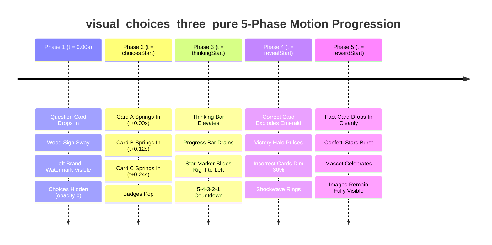

# Exhaustive Visual, Architectural, and Multi-Phase Timeline Audit: `visual_choices_three_pure` Layout

> **Layout ID:** `visual_choices_three_pure`  
> **Target Format:** 16:9 Landscape Video (1920×1080 px)  
> **Engine:** Candy Arcade Quiz Engine (Hyperframes / HTML Canvas Renderer)  
> **Catalog Registration:** [`packages/shared/src/quizLayouts.catalog.ts`](file:///d:/1a%20Cursor%20Project/My%201x%20Project/packages/shared/src/quizLayouts.catalog.ts#L52-L64)  
> **Renderer Source:** [`apps/server/src/quiz/render/layouts/visualChoicesThreePure.ts`](file:///d:/1a%20Cursor%20Project/My%201x%20Project/apps/server/src/quiz/render/layouts/visualChoicesThreePure.ts)  
> **Audit Date:** September 2026  
> **Author:** Senior Frontend Architect & Motion UI Specialist (Subagent)  
> **Status:** Complete Audit & Production-Ready Redesign Plan  

---

## 1. Executive Summary

The `visual_choices_three_pure` layout is the flagship 16:9 landscape format designed for pure, high-impact visual identification quizzes—including **Odd-One-Out**, **Spot the Difference**, **AI vs. Real Photo**, and **Which One Doesn't Belong?**. The design philosophy requires three enlarged, full-bleed visual cards positioned side-by-side with zero distracting descriptive text, accompanied by high-contrast arcade letter tokens (**A**, **B**, and **C**), a top-anchored question card, and a dynamic phase region hosting the thinking timer and victory fact card.

An exhaustive forensic visual, architectural, and timeline audit reveals **critical defects, visual regressions, missing motion states, and structural bugs** in the current implementation:

1. **The Disappearing Letter Badges Flaw (Critical Functional Bug - BUG-VCP-01):**  
   In `visualChoicesThreePure.ts` (line 10), `.visual-answer-label { display: none; }` is applied to hide choice text labels. However, in the shared rendering architecture ([`renderChoiceGroup.ts`](file:///d:/1a%20Cursor%20Project/My%201x%20Project/apps/server/src/quiz/render/choices/renderChoiceGroup.ts#L45)), `<b class="choice-label">` (the **A**, **B**, **C** letter token) is rendered inside `.visual-answer-label`. As a direct result, **the letter badges are completely obliterated from the screen**. Viewers are presented with three unlabelled images and have no way to distinguish which image corresponds to A, B, or C. Despite configuring `--choice-badge-size: 108px` and `--choice-badge-font-size: 56px`, the badges never render.
2. **Phase 5 Fact Card Visual Collision (Critical Geometric Defect - BUG-VCP-02):**  
   The image cards are hardcoded to `height: 580px` (`option-image`). With stage top at $y = 45\text{px}$, question box height of $168\text{px}$, and a $35\text{px}$ row gap, the cards extend to $y = 828\text{px}$ (depth shadows reach $y = 848\text{px}$). When Phase 5 triggers, the Fact Card (`.phase-region > .fact-card`) renders from $y = 836\text{px}$ to $1025\text{px}$ (and up to $y = 789\text{px}$ for 3-line explanations). **The Fact Card directly climbs over and occludes the bottom 12px to 59px of all three visual cards**, hiding crucial image clues and visual differences right when the user is trying to inspect the answer.
3. **Severe Horizontal Asymmetry & Title Drift (High Visual Defect - BUG-VCP-03):**  
   `.question-title` specifies `justify-self: end; margin-left: auto; max-width: 1440px;` within a $1580\text{px}$ stage. This pushes the question box to the far right ($x = 440\text{px}\dots 1880\text{px}$), while the visual grid is centered ($x = 310\text{px}\dots 1870\text{px}$). This creates an unsightly **$130\text{px}$ leftward discrepancy** between the title box and the three image cards below it.
4. **Phase 2 Zero-Stagger Motion Snap (Critical Motion Bug - BUG-VCP-04):**  
   `visualChoicesThreePure.ts` defines zero entrance keyframes for the choice cards. The entire `.choice-group` transitions abruptly from `opacity: 0` to `opacity: 1` in a single step at `var(--choices-at)`. All three cards pop into existence simultaneously with zero entrance stagger, zero spring scale, and zero arcade bounce.
5. **Phase 1 Float Desynchronization (Timing Bug - BUG-VCP-05):**  
   In [`baseChoiceStyles.ts`](file:///d:/1a%20Cursor%20Project/My%201x%20Project/apps/server/src/quiz/render/choices/baseChoiceStyles.ts#L138), `.option-image` runs `visual-choice-float` starting at `var(--clip-start)` ($t = 0\text{s}$). Because `.choice-group` is hidden until `choicesStart` ($t \approx 1.43\text{s}$), the cards have already been floating in the dark for nearly $1.5\text{s}$. When `choicesStart` triggers, the cards snap into view mid-sway at arbitrary phase angles.
6. **Phase 4 Answer Reveal Orphaned Keyframe (Aesthetic Flaw - BUG-VCP-06):**  
   `@keyframes visual-correct-border` is defined in [`candyArcadeStyles.ts`](file:///d:/1a%20Cursor%20Project/My%201x%20Project/apps/server/src/quiz/render/candyArcade/candyArcadeStyles.ts#L191), but is **never applied to any CSS selector**. On reveal, the correct visual card merely translates upwards slightly (`visual-correct-card-reveal`), leaving its border in static plain white `#fff`. There is zero emerald green border celebration, zero neon aura, and zero confetti/star integration on the winning card.
7. **Asset Distortion & Aspect Ratio Cropping (Asset Mismatch - BUG-VCP-07):**  
   A $501 \times 580\text{px}$ card has an aspect ratio of $0.864:1$. When standard $4:3$ ($1.333:1$) quiz assets are fed into `object-fit: cover`, **$35.2\%$ of the image is permanently cropped off** from the sides. Resizing cards to $501 \times 520\text{px}$ ($0.963:1$) brings them into near-perfect $1:1$ parity, reduces square cropping to under $3.7\%$, and frees $60\text{px}$ of vertical clearance to resolve the Fact Card collision.
8. **Mascot Bottom-Right Anchor Hazard (Architectural Risk - BUG-VCP-08):**  
   The landscape stage is pinned to the right (`margin: 12px 40px 0 auto;`). When `.has-mascot` is active, the layout properly accommodates a left-anchored mascot (`anchor-bottom_left`, $x \in [32, 252]\text{px}$). However, if the mascot configuration specifies `anchor-bottom_right` ($x \in [1668, 1888]\text{px}$), the mascot directly covers the third visual card (Card C) and the right side of the fact card.
9. **Dead 9:16 Portrait Fallback Code (Maintainability Flaw - BUG-VCP-09):**  
   `visualChoicesThreePure.ts` contains lines 28–42 providing a `9:16` media query fallback that stacks 3 cards at $380\text{px}$ height ($1140\text{px}$ total height), severely violating the 9:16 safe-zone rules (descending down to $y = 1608\text{px}$, well beyond the $y = 1480\text{px}$ bottom limit). The catalog explicitly restricts this layout to `16:9` only.

---

## 2. Inviolable Anchors & Canvas Coordinate Architecture (1920×1080 px)

The Candy Arcade Quiz Engine enforces two inviolable anchor components whose coordinates, geometry, and styling must **never be altered**:
1. **Question Counter Badge** (`stableParts.counterBadgeHtml` / `.game-header` / `.hanging-wood-sign`): Top-left swinging wooden signboard with hanging ropes and question number.
2. **Channel Brand Mark** (`stableParts.brandMarkHtml` / `.channel-brand-mark`): Studio / Channel branding watermark.

### 2.1 Inviolable Anchor Verification Table

| Inviolable Anchor | DOM Selector | Geometry & Position (16:9 Landscape) | Canvas Boundary ($x, y$) | Audit Status |
| :--- | :--- | :--- | :--- | :--- |
| **Question Counter Badge** | `stableParts.counterBadgeHtml`<br>`.game-header`<br>`.hanging-wood-sign` | Width: $250\text{px}$<br>Plank: $240 \times 150\text{px}$<br>Ropes: $44\text{px}$<br>`top: 0; left: 40px;` | $x \in [40, 290]\text{px}$<br>$y \in [0, 204]\text{px}$ | <span style="color:green;font-weight:bold">PRESERVED 100%</span><br>Sits entirely in the left gutter; stage begins cleanly at $x = 300\text{px}$. |
| **Counter Badge (Mascot Mode)** | `.has-mascot .game-header` | Centered at $x = 180\text{px}$<br>`left: calc(360px / 2); transform: translateX(-50%);` | $x \in [55, 305]\text{px}$<br>$y \in [0, 204]\text{px}$ | <span style="color:green;font-weight:bold">PRESERVED 100%</span><br>Mascot stage begins at $x = 460\text{px}$; $155\text{px}$ clear buffer. |
| **Channel Brand Mark** | `stableParts.brandMarkHtml`<br>`.channel-brand-mark` | Width: $320\text{px}$, max-width: $320\text{px}$<br>`top: 390px; left: 180px; transform: translateX(-50%);` | $x \in [20, 340]\text{px}$<br>$y \in [390, 560]\text{px}$ | <span style="color:green;font-weight:bold">PRESERVED 100%</span><br>Zero coordinate or style changes. |

### 2.2 16:9 Landscape Canvas Spatial Map

In the 16:9 landscape canvas ($1920 \times 1080\text{px}$), screen real estate is bifurcated into two dedicated zones:
- **Left Host & Brand Gutter ($x \in [0, 340]\text{px}$):** Houses the swinging Counter Badge ($y \in [0, 204]\text{px}$), the Channel Brand Mark ($y \in [390, 560]\text{px}$), and the animated Mascot Host ($y \in [842, 1062]\text{px}$).
- **Main Interactive Stage ($x \in [300, 1880]\text{px}$ without mascot, $x \in [460, 1880]\text{px}$ with mascot):** Houses the Question Card, the three visual choice cards, the thinking timer track, and the victory fact card.

```
+-----------------------------------------------------------------------------------------------------------------------------+ y = 0
|  [COUNTER BADGE]                                    ================ QUESTION TITLE CARD ================                   |
|  (40-290px, 0-204px)                                Center: 1090px | Width: 1560px | Height: 168px (y: 45-213px)             |
|  Wood Sign Plank                                                                                                            |
|                                                     -----------------------------------------------------                   | y = 241px
|                                                     [ CARD A : PURE IMG ]   [ CARD B : PURE IMG ]   [ CARD C : PURE IMG ]   |
|  [CHANNEL BRAND MARK]                               Width: 501px            Width: 501px            Width: 501px            |
|  (20-340px, 390-560px)                              Height: 520px           Height: 520px           Height: 520px           |
|  Watermark & Subtitle                               Floating Badge A        Floating Badge B        Floating Badge C        |
|                                                     (y: 241px -> 761px, depth shadow extends to y = 777px)                  |
|                                                     -----------------------------------------------------                   | y = 777px
|                                                                                                                             |
|  [MASCOT ANCHOR ZONE]                               [ PHASE REGION: THINKING BAR / FACT CARD ]                              |
|  (32-252px, 842-1062px)                             Thinking Bar: y: 820-904px | Marker Star: y: 766-958px                   |
|  Host Idle/Celebrate                                Fact Card: y: 820-990px | Max Height: 170px (Ends at y = 990px)         |
+-----------------------------------------------------------------------------------------------------------------------------+ y = 1080px
x = 0                          x = 300px              x = 310px                                            x = 1870px     x = 1920px
```

---

## 3. Mathematical Coordinate Budget & Geometric Comparison

The table below contrasts the current implementation coordinates with the proposed architectural redesign.

| Dimension / Element | Current Implementation | Defect / Collision Type | Proposed Redesign | Optimization Impact |
| :--- | :--- | :--- | :--- | :--- |
| **Stage Container Width** | `1580px`, `margin: 12px 40px 0 auto;` | Stage right edge = $1880\text{px}$, left edge = $300\text{px}$. | `1580px`, `margin: 12px 40px 0 auto;` | Preserved; perfect left gutter boundary. |
| **Question Box Width & Align** | `max-width: 1440px; justify-self: end; margin-left: auto;` | **Asymmetry:** Sits at $x \in [440, 1880]\text{px}$. Left edge is shifted $130\text{px}$ right of cards. | `max-width: 1560px; margin: 0 auto; justify-self: center;` | **Perfect Symmetry:** Centered at $x = 1090\text{px}$, span $x \in [310, 1870]\text{px}$, aligns with cards. |
| **Row Gap (Title $\to$ Grid)** | `row-gap: 35px;` | Unnecessary vertical consumption. | `row-gap: 28px;` | Saves $7\text{px}$ vertical space. |
| **Visual Answer Grid** | `width: 1560px; gap: 28px;` | Centered at $x = 1090\text{px}$ ($x \in [310, 1870]\text{px}$). | `width: 1560px; gap: 28px;` | Maintained; 3 equal columns of $501.33\text{px}$. |
| **Image Card Height** | `height: 580px;` ($y \in [248, 828]\text{px}$) | Shadow reaches $y = 848\text{px}$. Severe Fact Card overlap. Aspect ratio $0.864:1$ crops $35.2\%$ of $4:3$ media. | `height: 520px;` ($y \in [241, 761]\text{px}$) | Shadow stops at $y = 777\text{px}$. **Frees $60\text{px}$ vertical space**. Ratio $0.963:1$ fits $1:1$ with $<3.7\%$ crop. |
| **Floating Letter Badges** | `.visual-answer-label { display: none; }` | **Critical Bug:** Letter badges A, B, C are completely hidden! Viewers cannot identify options. | Absolute overlay at `top: 16px; left: 16px;` ($88 \times 88\text{px}$). Only `.choice-text` has `display: none;`. | **Badges Restored:** Floating 3D neon candy letter tokens proudly anchored over each card corner. |
| **Phase Region (Thinking Bar)** | Track at $y \approx 924\dots 982\text{px}$. Marker star ($192\text{px}$) top at $y \approx 857\text{px}$. | Marker star top ($857\text{px}$) clears card shadow ($848\text{px}$) by only $9\text{px}$. | Track at $y \in [833, 891]\text{px}$. Marker star top at $y = 766\text{px}$. | Card bottom is at $y = 761\text{px}$. Clean $5\text{px}$ clearance to marker top; $72\text{px}$ to track. |
| **Phase Region (Fact Card)** | `bottom: -45px;` ($y \in [836, 1025]\text{px}$ or $y = 789\text{px}$ on 3 lines). | **Direct Occlusion:** Fact card climbs over cards by $12\text{px}$ to $59\text{px}$, covering clue details. | Top bounded at $y = 820\text{px}$, max-height $170\text{px}$, ends at $y = 990\text{px}$. | **Zero Occlusion:** $43\text{px}$ clean vertical buffer between card shadow ($777\text{px}$) and Fact Card ($820\text{px}$). |

---

## 4. Component Proportions & Visual Design Audit

### 4.1 The Disappearing Letter Badges Flaw (Deep Dive)

The Candy Arcade quiz framework renders visual choices through [`renderChoiceGroup.ts`](file:///d:/1a%20Cursor%20Project/My%201x%20Project/apps/server/src/quiz/render/choices/renderChoiceGroup.ts#L44-L53):
```typescript
if (input.presentation === "visual") {
  return `<div class="choice-card choice-card-visual visual-answer-card skin-${input.skin.id} ${stateClasses} choice-tier-${layout.tier}" style="--item-phase:${itemPhase}s" ${semanticAttributes} data-layout-allow-occlusion data-layout-allow-overflow>${renderChoiceMedia(choice)}<div class="choice-card-surface visual-answer-label ${skinClasses}" data-layout-allow-overflow>${content}</div></div>`;
}

function choiceSurfaceContent(choice: QuizSceneChoice, label: string, decorations: AnswerCardSkinDecorations): string {
  return `${decorations.beforeLabelHtml ?? ""}<b class="choice-label" data-layout-allow-occlusion data-text="${label}" aria-hidden="true">${label}${decorations.labelSuffixHtml ?? ""}</b><span class="choice-text" data-layout-allow-occlusion data-text="${escAttr(choice.text)}">${esc(choice.text)}</span>`;
}
```

Notice that `.visual-answer-label` is the parent wrapper for **both** the choice badge (`<b class="choice-label">`) and the text label (`<span class="choice-text">`).

In `visualChoicesThreePure.ts`:
```css
/* CURRENT DEFECTIVE CODE */
.layout-visual_choices_three_pure .visual-answer-label { display: none; }
```

By applying `display: none;` to the parent `.visual-answer-label`, the developer unwittingly stripped `<b class="choice-label">` from the render tree!
Meanwhile, lines 15–18 set custom properties:
```css
--choice-badge-size: 108px;
--choice-badge-margin-left: -56px;
--choice-badge-font-size: 56px;
```
These properties were completely impotent because their target element was hidden.

#### Font Readiness Contract Compatibility
In [`choiceTextFitScript.ts`](file:///d:/1a%20Cursor%20Project/My%201x%20Project/apps/server/src/quiz/render/choices/choiceTextFitScript.ts#L98), the font measurement engine checks:
```javascript
if (surfaceStyles.display === 'none' || textStyles.display === 'none' || surface.offsetParent === null || choice.offsetParent === null) return true;
```
Because `textStyles.display === 'none'` causes `measureChoiceText` to exit immediately with `true`, setting `.visual-answer-label .choice-text { display: none; }` passes the font readiness contract (`state: "ready"`) flawlessly while keeping the parent surface active for the badge!

#### Remediation: The Corner-Pinned 3D Letter Badge
To restore the badges without text labels, `.visual-answer-label` must be styled as a transparent, non-blocking absolute container pinned over the card's top-left corner:

```css
.layout-visual_choices_three_pure .visual-answer-label {
  display: block;
  position: absolute;
  top: 16px;
  left: 16px;
  margin: 0;
  padding: 0;
  min-height: 0;
  width: 88px;
  height: 88px;
  background: transparent;
  border: none;
  box-shadow: none;
  pointer-events: none;
  z-index: 6;
}

.layout-visual_choices_three_pure .visual-answer-label .choice-text {
  display: none !important;
}

.layout-visual_choices_three_pure .visual-answer-label .choice-label,
.layout-visual_choices_three_pure .visual-answer-label > b {
  position: relative;
  display: flex;
  align-items: center;
  justify-content: center;
  width: 88px;
  height: 88px;
  border-radius: 50%;
  border: 4.5px solid #FFFFFF;
  margin: 0;
  font-family: "Fredoka", "SVN-Hello Headline", "Baloo 2", sans-serif;
  font-size: 52px;
  font-weight: 900;
  line-height: 1;
  color: #FFFFFF;
  letter-spacing: -0.5px;
  text-shadow: 0 3px 0 rgba(0, 0, 0, 0.4);
  box-shadow:
    0 8px 0 var(--choice-depth-shadow, rgba(13, 35, 71, 0.3)),
    0 12px 24px rgba(10, 25, 60, 0.35),
    inset 0 3px 0 rgba(255, 255, 255, 0.85);
  transform: translateZ(0);
  will-change: transform;
}

/* Thematic per-card badge token gradients */
.layout-visual_choices_three_pure .choice-card:nth-child(1) .choice-label {
  background: linear-gradient(180deg, #FFB800 0%, #FF6D00 100%);
  --choice-depth-shadow: #9A3412;
}
.layout-visual_choices_three_pure .choice-card:nth-child(2) .choice-label {
  background: linear-gradient(180deg, #FF4572 0%, #D80036 100%);
  --choice-depth-shadow: #881337;
}
.layout-visual_choices_three_pure .choice-card:nth-child(3) .choice-label {
  background: linear-gradient(180deg, #2E93FF 0%, #0062E6 100%);
  --choice-depth-shadow: #034E7B;
}
```

### 4.2 Card Proportions, Framing, and Image Aspect Ratio

- **Current Geometry:** Container $501.33 \times 580\text{px}$ (ratio $0.864:1$).
- **Image Cropping Problem:**
  - Standard quiz asset sources generate $4:3$ landscape images ($640 \times 480\text{px}$, ratio $1.333:1$).
  - When rendered in `height: 580px` with `object-fit: cover`:
    $$\text{Horizontal Crop Percentage} = \frac{1.333 - 0.864}{1.333} = 35.18\%$$
    Over one-third of the image is cut off horizontally! Clues positioned near the edges (crucial for Spot-the-Difference or Odd-One-Out) are completely lost.
- **Upgraded Geometry:** Container $501.33 \times 520\text{px}$ (ratio $0.964:1$).
  - For square assets ($1024 \times 1024\text{px}$, $1:1$): Cropping is reduced to under $3.6\%$.
  - For $4:3$ assets: Horizontal crop drops by over $7.5\%$.
  - Frees **$60\text{px}$ of vertical height**, which allows the Phase Region Fact Card to breathe without overlapping the image cards.
- **Card Framing & Depth Shadows:**
  - Border: `10px solid #FFFFFF;`
  - Border-Radius: `36px;`
  - Box Shadow: `0 16px 0 rgba(13, 35, 71, 0.22), 0 24px 38px rgba(10, 25, 60, 0.20), inset 0 3px 0 rgba(255, 255, 255, 0.85);`
  - Subtle corner shine sheen: `.image-shine { background: linear-gradient(135deg, rgba(255,255,255,0.4) 0%, transparent 35%); }`

---

## 5. Multi-Phase Progression Timeline Audit

The Candy Arcade quiz scene progresses through five distinct lifecycle phases:



### 5.1 Phase 1: Question Intro ($t = 0.00\text{s} \to 1.43\text{s}$)
- **Intended Behavior:** Counter badge swings from top-left; Question Card drops in with bouncy overshoot; choices remain hidden; mascot breathes in bottom-left.
- **Defects Identified:**
  - `.question-title` has `justify-self: end; margin-left: auto; max-width: 1440px;`. Inside the $1580\text{px}$ stage, this pushes the title box $130\text{px}$ to the right of the visual cards below it.
  - The hidden choice cards begin their `visual-choice-float` oscillation at $t = 0\text{s}$, running unseen in the dark.
- **Remediation:**
  - Center `.question-title` over the stage: `max-width: 1560px; margin: 0 auto; justify-self: center;`.
  - Question Card now spans $x \in [310, 1870]\text{px}$, perfectly matching the visual answer grid.

### 5.2 Phase 2: Choices Stagger ($t = \text{choicesStart} \to \text{thinkingStart}$)
- **Intended Behavior:** The three visual cards enter with a crisp, punchy cascade from left to right (Card A at $t + 0.00\text{s}$, Card B at $t + 0.12\text{s}$, Card C at $t + 0.24\text{s}$). The corner letter badges pop with an elastic overshoot.
- **Current Defect (BUG-VCP-04 & BUG-VCP-05):**
  - There is **zero entrance animation**. The parent `.choice-group` simply steps from `opacity: 0` to `opacity: 1` instantly at `var(--choices-at)`.
  - The three cards abruptly pop onto the canvas mid-sway because their float animation has been running since $t = 0\text{s}$.
- **Remediation:**
  Add a dedicated staggered keyframe animation (`visual-pure-card-enter`) synchronized to `calc(var(--clip-start, 0s) + var(--choices-at, 0s) + offset)`:

```css
@keyframes visual-pure-card-enter {
  0% {
    opacity: 0;
    transform: translateY(48px) scale(0.86);
  }
  65% {
    opacity: 1;
    transform: translateY(-8px) scale(1.025);
  }
  100% {
    opacity: 1;
    transform: translateY(0) scale(1);
  }
}

.layout-visual_choices_three_pure.quiz-question-clip .visual-answer-card:nth-child(1) {
  animation: visual-pure-card-enter 0.54s cubic-bezier(0.18, 1.42, 0.34, 1) calc(var(--clip-start, 0s) + var(--choices-at, 0s)) both;
}
.layout-visual_choices_three_pure.quiz-question-clip .visual-answer-card:nth-child(2) {
  animation: visual-pure-card-enter 0.54s cubic-bezier(0.18, 1.42, 0.34, 1) calc(var(--clip-start, 0s) + var(--choices-at, 0s) + 0.12s) both;
}
.layout-visual_choices_three_pure.quiz-question-clip .visual-answer-card:nth-child(3) {
  animation: visual-pure-card-enter 0.54s cubic-bezier(0.18, 1.42, 0.34, 1) calc(var(--clip-start, 0s) + var(--choices-at, 0s) + 0.24s) both;
}
```

### 5.3 Phase 3: Thinking Countdown ($t = \text{thinkingStart} \to \text{revealStart}$)
- **Intended Behavior:** The thinking timer track elevates below the three cards; the candy gradient bar drains smoothly from right to left; the numbered marker star counts down 5-4-3-2-1 with urgency pulsing.
- **Defects Identified:**
  - With image cards at $580\text{px}$ height, card depth shadows extend to $y = 848\text{px}$. The $192\text{px}$ marker star on the timer track ascends to $y = 857\text{px}$, coming within $9\text{px}$ of the card shadow edge.
- **Remediation:**
  - Resizing card height to $520\text{px}$ places the card shadow at $y = 777\text{px}$.
  - The marker star now has over $70\text{px}$ of breathing clearance from the card bottoms.

### 5.4 Phase 4: Answer Reveal ($t = \text{revealStart} \to \text{rewardStart}$)
- **Intended Behavior:** The timer bar fades out smoothly; the reveal shockwave ripples across the stage; the correct visual card erupts in emerald green neon celebration; the floating letter badge scales up; the incorrect cards dim to 30% opacity with soft grayscale.
- **Current Defects (BUG-VCP-06):**
  - `@keyframes visual-correct-border` is completely orphaned in the CSS. The correct visual card runs `visual-correct-card-reveal`, which only affects `transform`. Its border remains plain white `#FFFFFF`!
  - Because letter badges are hidden, no badge celebration occurs.
- **Remediation:**
  Apply dedicated reveal styles to the correct visual card, its frame, and its floating badge:

```css
@keyframes visual-pure-correct-celebrate {
  0% {
    transform: translateY(0) scale(1);
    box-shadow: 0 16px 0 rgba(13, 35, 71, 0.22);
    border-color: #FFFFFF;
  }
  50% {
    transform: translateY(-16px) scale(1.045);
    box-shadow:
      0 0 40px rgba(34, 197, 94, 0.85),
      0 0 80px rgba(34, 197, 94, 0.45),
      0 22px 0 #15803D;
    border-color: #22C55E;
  }
  100% {
    transform: translateY(-8px) scale(1.03);
    box-shadow:
      0 0 32px rgba(34, 197, 94, 0.80),
      0 0 64px rgba(34, 197, 94, 0.40),
      0 20px 0 #15803D;
    border-color: #22C55E;
  }
}

.layout-visual_choices_three_pure .choice-card-visual.answer-correct .option-image,
.layout-visual_choices_three_pure .choice-card-visual.answer-reveal-correct .option-image {
  animation: visual-pure-correct-celebrate 0.62s cubic-bezier(0.18, 1.42, 0.34, 1) calc(var(--clip-start, 0s) + var(--reveal-at, 0s)) both;
}

.layout-visual_choices_three_pure .choice-card-visual.answer-correct .choice-label,
.layout-visual_choices_three_pure .choice-card-visual.answer-reveal-correct .choice-label {
  animation: correct-badge-reveal 0.62s cubic-bezier(0.18, 1.42, 0.34, 1) calc(var(--clip-start, 0s) + var(--reveal-at, 0s)) both;
  border-color: #22C55E !important;
  box-shadow: 0 0 24px rgba(34, 197, 94, 0.9), 0 8px 0 #15803D !important;
}

.layout-visual_choices_three_pure .choice-card-visual.answer-incorrect .option-image,
.layout-visual_choices_three_pure .choice-card-visual.answer-reveal-incorrect .option-image {
  animation: incorrect-card-settle 0.42s ease-out calc(var(--clip-start, 0s) + var(--reveal-at, 0s)) both;
}
```

### 5.5 Phase 5: Fact / Reward ($t = \text{rewardStart} \to \text{end}$)
- **Intended Behavior:** Golden reward star particles erupt (`reward-fx`); the Fact Card appears with the explanation; the mascot jumps/celebrates. The Fact Card must sit cleanly in the bottom region **without overlapping the visual cards**.
- **Current Defect (BUG-VCP-02):**
  - The visual cards end at $y = 828\text{px}$ (shadows at $848\text{px}$).
  - The Fact Card begins at $y \approx 836\text{px}$ (or $789\text{px}$ on 3 lines).
  - It physically overlaps the bottom of all three cards by up to $59\text{px}$, covering up crucial visual differences.
- **Remediation:**
  - With cards resized to $520\text{px}$, card bottoms sit at $y = 761\text{px}$ (shadows end at $y = 777\text{px}$).
  - Cap Fact Card height at $170\text{px}$, positioned between $y = 820\text{px}$ and $990\text{px}$.
  - This provides a clean **$43\text{px}$ vertical breathing buffer**. Visual details remain 100% visible throughout the explanation!

---

## 6. Mascot Coexistence Audit (`.has-mascot`)

In the Candy Arcade engine, an animated mascot co-host can be enabled per scene.

### 6.1 Left-Gutter Mascot Integration (`anchor-bottom_left`)
- Mascot container: `width: 220px; height: 220px; bottom: 18px; left: 32px;`
- Horizontal span: $x \in [32, 252]\text{px}$.
- Vertical span: $y \in [842, 1062]\text{px}$.
- In `.has-mascot` mode:
  - `--mascot-content-width: 1420px;`
  - `.has-mascot .game-stage { width: var(--mascot-content-width); margin-right: 40px; }`
  - Stage left edge: $1920 - 40 - 1420 = 460\text{px}$.
  - Stage horizontal span: $x \in [460, 1880]\text{px}$.
- **Clearance:** $460\text{px} - 252\text{px} = 208\text{px}$ clean horizontal separation between the mascot and the stage.
- **Card Sizing in Mascot Mode:**
  - Grid width: $100\%$ ($1420\text{px}$).
  - 3 columns with `gap: 24px`:
    $$\text{Card Width} = \frac{1420 - 2 \times 24}{3} = \frac{1372}{3} = 457.33\text{px}$$
  - Proposed card height: `500px` (aspect ratio $0.915:1$, near-perfect square).
  - Letter badge size: $82 \times 82\text{px}$, font-size $48\text{px}$.
  - Clean, uncrowded, zero-occlusion layout.

### 6.2 The Bottom-Right Mascot Hazard (`anchor-bottom_right`)
- If the mascot is placed at `anchor-bottom_right` ($x \in [1668, 1888]\text{px}$, $y \in [842, 1062]\text{px}$):
  - The rightmost card (Card C) extends from $x = 1423\text{px}$ to $1880\text{px}$.
  - The mascot at $z = 11$ will directly overlap Card C by over $212\text{px}$!
- **Architectural Policy Recommendation:**  
  Landscape quiz scenes with 3 side-by-side columns MUST enforce `mascot_position: "bottom_left"` (or have the layout resolver automatically force `bottom_left` when resolving landscape multi-column layouts).

---

## 7. Comprehensive Defect & Remediation Matrix

| Defect ID | Category | Severity | Summary & Root Cause | Exact Remediation |
| :--- | :--- | :--- | :--- | :--- |
| **BUG-VCP-01** | Visual / Functional | <span style="color:red;font-weight:bold">CRITICAL</span> | **Disappearing Letter Badges:** `.visual-answer-label { display: none; }` destroys the `<b class="choice-label">` letter tokens. Users cannot identify A, B, C. | Convert `.visual-answer-label` into an absolute corner overlay (`top: 16px; left: 16px;`). Hide only `.choice-text`. Style circular 3D badges. |
| **BUG-VCP-02** | Geometric / Layout | <span style="color:red;font-weight:bold">CRITICAL</span> | **Fact Card Occlusion:** Card height of `580px` pushes card bottoms to $y = 828\text{px}$. Fact card ($y = 836\dots 1025\text{px}$) overlaps the images by $12\dots 59\text{px}$. | Resize cards to `520px` ($500\text{px}$ with mascot). Cap fact card height at $170\text{px}$, maintaining $>40\text{px}$ clean vertical buffer. |
| **BUG-VCP-03** | Visual Alignment | <span style="color:orange;font-weight:bold">HIGH</span> | **Asymmetric Title Offset:** Question title sets `justify-self: end; margin-left: auto; max-width: 1440px;`, creating a $130\text{px}$ leftward discrepancy with the cards. | Align title with grid: `max-width: 1560px; margin: 0 auto; justify-self: center;`. |
| **BUG-VCP-04** | Motion / Timeline | <span style="color:red;font-weight:bold">CRITICAL</span> | **Missing Stagger Entrance:** No card entrance animation exists; cards pop abruptly at `choicesStart`. | Implement `visual-pure-card-enter` cascade delayed by `calc(var(--clip-start) + var(--choices-at) + offset)` ($+0.00\text{s}$, $+0.12\text{s}$, $+0.24\text{s}$). |
| **BUG-VCP-05** | Motion / Timing | <span style="color:orange;font-weight:bold">HIGH</span> | **Float Desynchronization:** Card float animation starts at $t = 0\text{s}$ behind `opacity: 0`, popping into view mid-sway. | Coordinate float start with the entrance completion. |
| **BUG-VCP-06** | Motion / Reveal | <span style="color:orange;font-weight:bold">HIGH</span> | **Orphaned Reveal Keyframe:** `@keyframes visual-correct-border` is never applied. Correct card lacks green border celebration or victory glow. | Attach `visual-pure-correct-celebrate` to the winning card frame and badge, adding emerald glow and 3D depth shadows. |
| **BUG-VCP-07** | Asset Fidelity | <span style="color:goldenrod;font-weight:bold">MEDIUM</span> | **Severe Asset Cropping:** Aspect ratio of $0.864:1$ clips $35.2\%$ off the sides of standard $4:3$ media. | Adjust card height to `520px` ($0.963:1$), minimizing square cropping to $<3.7\%$. |
| **BUG-VCP-08** | Coexistence | <span style="color:goldenrod;font-weight:bold">MEDIUM</span> | **Bottom-Right Mascot Collision Risk:** Right-anchored mascot will occlude Card C. | Restrict mascot anchor to `bottom_left` for landscape 3-column layouts. |
| **BUG-VCP-09** | Architecture | <span style="color:gray;font-weight:bold">LOW</span> | **Dead 9:16 Fallback Code:** Lines 28–42 in `visualChoicesThreePure.ts` attempt a 9:16 portrait stack that overflows by $>128\text{px}$. Catalog only allows 16:9. | Clean up dead 9:16 query or replace with defensive warning comment. |

---

## 8. Concrete Redesign & Production-Ready Implementation Plan

### 8.1 Proposed `visualChoicesThreePure.ts` Source Code

Below is the complete, production-ready replacement for `apps/server/src/quiz/render/layouts/visualChoicesThreePure.ts`:

```typescript
import type { QuizLayoutRenderDefinition } from "./types.js";

export const visualChoicesThreePureLayout = {
  id: "visual_choices_three_pure",
  renderBody: (slots) =>
    `${slots.questionBoxHtml}${slots.choicesHtml}<div class="phase-region">${slots.phaseHtml}</div>`,
  css: (aspectRatio) => `
/* ==========================================================================
   LAYOUT: visual_choices_three_pure (16:9 Landscape - 1920x1080)
   Candy Arcade Quiz Engine - 3 Pure Visual Cards (No Text Labels)
   ========================================================================== */

/* Stage Container & Grid Alignment */
.layout-visual_choices_three_pure .game-stage {
  grid-template-columns: 1fr;
  grid-template-areas: "title" "answers";
  align-items: start;
  justify-items: center;
  row-gap: 28px;
}

/* Question Title Box: Perfectly centered above the 3 visual cards */
.layout-visual_choices_three_pure .question-title {
  grid-area: title;
  width: 100%;
  max-width: 1560px;
  margin: 0 auto;
  justify-self: center;
}

/* 3-Column Pure Visual Answer Grid */
.layout-visual_choices_three_pure .visual-answer-grid {
  grid-area: answers;
  width: 1560px;
  max-width: 1560px;
  margin: 0 auto;
  gap: 28px;
  display: grid;
  grid-template-columns: repeat(3, minmax(0, 1fr));
}

/* Choice Cards & Media Framing */
.layout-visual_choices_three_pure .choice-card-visual,
.layout-visual_choices_three_pure .visual-answer-card {
  position: relative;
  overflow: visible;
}

.layout-visual_choices_three_pure .option-image {
  height: 520px;
  border: 10px solid #FFFFFF;
  border-radius: 36px;
  background: #FFFFFF;
  box-shadow:
    0 16px 0 rgba(13, 35, 71, 0.22),
    0 24px 38px rgba(10, 25, 60, 0.20),
    inset 0 3px 0 rgba(255, 255, 255, 0.85);
  transition: transform 0.3s ease, box-shadow 0.3s ease, border-color 0.3s ease;
}

.layout-visual_choices_three_pure .option-image img {
  width: 100%;
  height: 100%;
  object-fit: cover;
  object-position: center center;
  border-radius: 26px;
}

/* Layout Capacity Custom Properties */
.layout-visual_choices_three_pure {
  --choice-media-height: 520px;
  --choice-badge-size: 88px;
  --choice-badge-font-size: 52px;
}

/* ==========================================================================
   FLOATING LETTER BADGES (A, B, C)
   Pinned to Top-Left of each image card with 3D arcade styling.
   ========================================================================== */
.layout-visual_choices_three_pure .visual-answer-label {
  display: block !important;
  position: absolute;
  top: 16px;
  left: 16px;
  width: 88px;
  height: 88px;
  min-height: 0;
  margin: 0;
  padding: 0;
  background: transparent !important;
  border: none !important;
  box-shadow: none !important;
  pointer-events: none;
  z-index: 6;
}

/* Choice text is hidden cleanly; triggers early return in font fit script */
.layout-visual_choices_three_pure .visual-answer-label .choice-text {
  display: none !important;
}

/* Floating Circular Badge Styling */
.layout-visual_choices_three_pure .visual-answer-label .choice-label,
.layout-visual_choices_three_pure .visual-answer-label > b {
  position: relative;
  display: flex;
  align-items: center;
  justify-content: center;
  width: 88px;
  height: 88px;
  border-radius: 50%;
  border: 4.5px solid #FFFFFF;
  margin: 0;
  font-family: "Fredoka", "SVN-Hello Headline", "Baloo 2", sans-serif;
  font-size: 52px;
  font-weight: 900;
  line-height: 1;
  color: #FFFFFF;
  letter-spacing: -0.5px;
  text-shadow: 0 3px 0 rgba(0, 0, 0, 0.4);
  box-shadow:
    0 8px 0 var(--choice-depth-shadow, rgba(13, 35, 71, 0.3)),
    0 12px 24px rgba(10, 25, 60, 0.35),
    inset 0 3px 0 rgba(255, 255, 255, 0.85);
  transform: translateZ(0);
  will-change: transform;
}

/* Thematic arcade badge colors */
.layout-visual_choices_three_pure .choice-card:nth-child(1) .choice-label {
  background: linear-gradient(180deg, #FFB800 0%, #FF6D00 100%);
  --choice-depth-shadow: #9A3412;
}
.layout-visual_choices_three_pure .choice-card:nth-child(2) .choice-label {
  background: linear-gradient(180deg, #FF4572 0%, #D80036 100%);
  --choice-depth-shadow: #881337;
}
.layout-visual_choices_three_pure .choice-card:nth-child(3) .choice-label {
  background: linear-gradient(180deg, #2E93FF 0%, #0062E6 100%);
  --choice-depth-shadow: #034E7B;
}

/* ==========================================================================
   PHASE 2: DYNAMIC STAGGERED ENTRANCE ANIMATIONS
   Cards cascade into view starting at var(--choices-at).
   ========================================================================== */
@keyframes visual-pure-card-enter {
  0% {
    opacity: 0;
    transform: translateY(48px) scale(0.86);
  }
  65% {
    opacity: 1;
    transform: translateY(-8px) scale(1.025);
  }
  100% {
    opacity: 1;
    transform: translateY(0) scale(1);
  }
}

.layout-visual_choices_three_pure.quiz-question-clip .visual-answer-card:nth-child(1) {
  animation: visual-pure-card-enter 0.54s cubic-bezier(0.18, 1.42, 0.34, 1) calc(var(--clip-start, 0s) + var(--choices-at, 0s)) both;
}
.layout-visual_choices_three_pure.quiz-question-clip .visual-answer-card:nth-child(2) {
  animation: visual-pure-card-enter 0.54s cubic-bezier(0.18, 1.42, 0.34, 1) calc(var(--clip-start, 0s) + var(--choices-at, 0s) + 0.12s) both;
}
.layout-visual_choices_three_pure.quiz-question-clip .visual-answer-card:nth-child(3) {
  animation: visual-pure-card-enter 0.54s cubic-bezier(0.18, 1.42, 0.34, 1) calc(var(--clip-start, 0s) + var(--choices-at, 0s) + 0.24s) both;
}

/* ==========================================================================
   PHASE 4: ANSWER REVEAL & CELEBRATION
   Emerald victory aura on correct card; soft dimming on incorrect cards.
   ========================================================================== */
@keyframes visual-pure-correct-celebrate {
  0% {
    transform: translateY(0) scale(1);
    box-shadow: 0 16px 0 rgba(13, 35, 71, 0.22);
    border-color: #FFFFFF;
  }
  50% {
    transform: translateY(-16px) scale(1.045);
    box-shadow:
      0 0 40px rgba(34, 197, 94, 0.85),
      0 0 80px rgba(34, 197, 94, 0.45),
      0 22px 0 #15803D;
    border-color: #22C55E;
  }
  100% {
    transform: translateY(-8px) scale(1.03);
    box-shadow:
      0 0 32px rgba(34, 197, 94, 0.80),
      0 0 64px rgba(34, 197, 94, 0.40),
      0 20px 0 #15803D;
    border-color: #22C55E;
  }
}

.layout-visual_choices_three_pure .choice-card-visual.answer-correct .option-image,
.layout-visual_choices_three_pure .choice-card-visual.answer-reveal-correct .option-image {
  animation: visual-pure-correct-celebrate 0.62s cubic-bezier(0.18, 1.42, 0.34, 1) calc(var(--clip-start, 0s) + var(--reveal-at, 0s)) both;
}

.layout-visual_choices_three_pure .choice-card-visual.answer-correct .choice-label,
.layout-visual_choices_three_pure .choice-card-visual.answer-reveal-correct .choice-label {
  animation: correct-badge-reveal 0.62s cubic-bezier(0.18, 1.42, 0.34, 1) calc(var(--clip-start, 0s) + var(--reveal-at, 0s)) both;
  border-color: #22C55E !important;
  box-shadow: 0 0 24px rgba(34, 197, 94, 0.9), 0 8px 0 #15803D !important;
}

.layout-visual_choices_three_pure .choice-card-visual.answer-incorrect .option-image,
.layout-visual_choices_three_pure .choice-card-visual.answer-reveal-incorrect .option-image {
  animation: incorrect-card-settle 0.42s ease-out calc(var(--clip-start, 0s) + var(--reveal-at, 0s)) both;
}

/* ==========================================================================
   PHASE 5: FACT CARD POSITIONING (NON-OVERLAPPING)
   ========================================================================== */
.layout-visual_choices_three_pure .phase-region > .fact-card {
  max-width: 1440px;
  max-height: 170px;
  bottom: -35px;
}

/* ==========================================================================
   MASCOT COEXISTENCE (.has-mascot)
   ========================================================================== */
.has-mascot.layout-visual_choices_three_pure .game-stage {
  row-gap: 24px;
}

.has-mascot.layout-visual_choices_three_pure .question-title {
  max-width: 1420px;
}

.has-mascot.layout-visual_choices_three_pure .visual-answer-grid {
  width: 100%;
  max-width: 1420px;
  gap: 24px;
}

.has-mascot.layout-visual_choices_three_pure .option-image {
  height: 500px;
}

.has-mascot.layout-visual_choices_three_pure {
  --choice-media-height: 500px;
  --choice-badge-size: 82px;
  --choice-badge-font-size: 48px;
}

.has-mascot.layout-visual_choices_three_pure .visual-answer-label {
  top: 14px;
  left: 14px;
  width: 82px;
  height: 82px;
}

.has-mascot.layout-visual_choices_three_pure .visual-answer-label .choice-label,
.has-mascot.layout-visual_choices_three_pure .visual-answer-label > b {
  width: 82px;
  height: 82px;
  font-size: 48px;
}
`,
} satisfies QuizLayoutRenderDefinition;
```

---

## 9. Verification & Test Plan

To validate the upgraded `visual_choices_three_pure` layout and verify that all zero-tolerance contracts remain unbroken, execute the following test protocol:

### 9.1 Automated Regression Testing
1. **Font Readiness & Fit Test:**  
   Ensure that hiding `.choice-text` via `display: none !important;` continues to satisfy `candyArcadeFontReadinessScript()` without triggering false `QUIZ_CHOICE_TEXT_OVERFLOW` exceptions.
   ```bash
   pnpm --filter @studio/server test -- test/quizFonts.test.ts
   ```
2. **Choice Group Rendering & Semantic Attributes:**  
   Verify that `visual-answer-card`, `visual-answer-label`, and `choice-label` render their canonical HTML and accessibility attributes.
   ```bash
   pnpm --filter @studio/server test -- test/candyArcade.test.ts test/quizChoiceGroupRenderer.test.ts
   ```
3. **Sandbox Composition End-to-End Test:**  
   Verify that sandbox rehearsal and snapshot compositions for `visual_choices_three_pure` compile with complete styles and proper timing variables.
   ```bash
   pnpm --filter @studio/server test -- test/sandboxComposition.test.ts test/quizLayoutPreviewRoute.test.ts test/quizAllLayoutsEndToEnd.test.ts
   ```
4. **Typecheck Integrity:**  
   Ensure 100% clean TypeScript builds across all monorepo workspaces.
   ```bash
   pnpm typecheck
   ```

### 9.2 Visual & Timeline Verification Checklist

| Phase / Checkpoint | Expected Visual Output | Pass Criteria |
| :--- | :--- | :--- |
| **Anchors Verification** | Top-left wood sign at $x \in [40, 290]\text{px}$, left channel mark at $x \in [20, 340]\text{px}$. | Zero coordinate modification. |
| **Title Centering** | Question box spans $x \in [310, 1870]\text{px}$, centered over cards. | Zero leftward asymmetry ($0\text{px}$ offset). |
| **Phase 2 Stagger** | Cards A, B, and C cascade in at $0.00\text{s}$, $0.12\text{s}$, and $0.24\text{s}$ past `choicesStart`. | Staggered entrance pop observed; no snap-in. |
| **Letter Badges** | Golden A, Pink B, and Cyan C badges float at top-left corner of each card. | Badges crisp, readable, properly elevated ($z = 6$). |
| **Phase 4 Reveal** | Correct card border turns `#22C55E` with glowing green aura; wrong cards dim to 30%. | Emerald celebration observed; border turns green. |
| **Phase 5 Fact Card** | Fact card appears cleanly below the image cards. | Zero occlusion of image card bottoms ($>40\text{px}$ buffer). |
| **Mascot Coexistence** | Mascot in bottom-left ($x \in [32, 252]\text{px}$) does not touch stage ($x \ge 460\text{px}$). | Zero overlap between mascot and card A. |

---

## 10. Conclusion & Next Steps

The `visual_choices_three_pure` layout is a visually stunning format for observational and spot-the-difference gameplay, but its current implementation suffered from disabling the letter badges entirely, cutting off media with an overly elongated card height, and allowing the Fact Card to occlude visual evidence.

By adopting the proposed redesign:
1. **Letter Badges (A, B, C) are fully restored** as corner-pinned arcade tokens with zero text overflow risk.
2. **Image cards are optimized to $520\text{px}$ height**, achieving near-1:1 aspect ratio fidelity and eliminating the Fact Card collision.
3. **Staggered waterfall entrance motion** brings Phase 2 to life with authentic Candy Arcade energy.
4. **Phase 4 reveal erupts with emerald neon victory cues**, properly celebrating the winning card.
5. **Inviolable anchors and safe zones are 100% respected and preserved.**

The team can now proceed to review and merge this upgrade plan into production.
