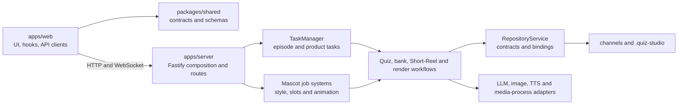

# System map

Reviewed on 2026-09-19. Start with [Architecture](architecture.md); this page is a source-navigation index, not a second specification or a test report.

| Area                                   | Start here                                                                                                                                                                                                                                                                                          | Guide                                           |
| -------------------------------------- | --------------------------------------------------------------------------------------------------------------------------------------------------------------------------------------------------------------------------------------------------------------------------------------------------- | ----------------------------------------------- |
| Server composition                     | [app.ts](../apps/server/src/app.ts), [route registry](../apps/server/src/routes/registerAllRoutes.ts), [server plugins](../apps/server/src/server/serverPlugins.ts)                                                                                                                                 | [Architecture](architecture.md)                 |
| Browser orchestration and transport    | [App.tsx](../apps/web/src/App.tsx), [useAppOrchestration](../apps/web/src/hooks/useAppOrchestration.ts), [api.ts](../apps/web/src/api.ts), [useTasks](../apps/web/src/hooks/useTasks.ts)                                                                                                            | [Architecture](architecture.md)                 |
| Shared contracts                       | [shared index](../packages/shared/src/index.ts), [schemas](../packages/shared/src/schemas/), [API types](../packages/shared/src/api/), [mascot types](../packages/shared/src/mascot/), [Short-Reel types](../packages/shared/src/shortReel/)                                                        | [Architecture](architecture.md)                 |
| Task scheduling and lifecycle          | [TaskManager](../apps/server/src/tasks/manager.ts), [taskQueuePump.ts](../apps/server/src/tasks/taskQueuePump.ts), [taskLifecycle.ts](../apps/server/src/tasks/taskLifecycle.ts), [runner dispatcher](../apps/server/src/tasks/delegates/runnerDispatcher.ts)                                       | [Quiz engine](quiz-engine-v2.md)                |
| Storage facade and contracts           | [RepositoryService](../apps/server/src/repository/service.ts), [contracts](../apps/server/src/repository/contracts/), [bindings](../apps/server/src/repository/bindings/), [pathSafety.ts](../apps/server/src/repository/pathSafety.ts)                                                             | [Architecture](architecture.md)                 |
| Channels and DNA                       | [channels repository](../apps/server/src/repository/channels.ts), [context](../apps/server/src/context/), [channel feature](../apps/web/src/features/channel/)                                                                                                                                      | [Channel DNA](channel-dna.md)                   |
| Bank, curation and topic confirmation  | [bank services](../apps/server/src/quiz/bank/), [bank storage](../apps/server/src/repository/quiz/bank/), [receipts](../apps/server/src/repository/topicConfirmationReceipts.ts)                                                                                                                    | [Question bank](question-bank.md)               |
| Episode production                     | [production runner](../apps/server/src/tasks/pipeline/quizProductionPipelineRunner.ts), [V2 runner](../apps/server/src/tasks/pipeline/quizV2PipelineRunner.ts), [domain orchestrator](../apps/server/src/quiz/pipeline/orchestrator.ts)                                                             | [Episode workflow](episode-workflow.md)         |
| Short-Reel product                     | [services](../apps/server/src/shortReel/), [contracts](../packages/shared/src/shortReel/), [routes](../apps/server/src/routes/shortReels.ts), [UI](../apps/web/src/features/shortReel/)                                                                                                             | [Short Reels](short-reel.md)                    |
| Asset and image-provider policy        | [asset resolution](../apps/server/src/quiz/assets/resolveQuizAssets.ts), [provider resolver](../apps/server/src/quiz/assets/resolvers/providerAssetResolver.ts), [portrait client](../apps/server/src/providers/imageGeneration/portraitImageClient.ts), [providers](../apps/server/src/providers/) | [Providers](provider-system.md)                 |
| LLM engines                            | [Codex](../apps/server/src/codex.ts), [Antigravity](../apps/server/src/antigravity.ts), [task runner](../apps/server/src/tasks/codexRunner.ts)                                                                                                                                                      | [Engine integration](codex-integration.md)      |
| Audio and narration                    | [quiz audio](../apps/server/src/quiz/audio/), [Chatterbox provider](../apps/server/src/providers/chatterbox.ts), [TTS service](../services/tts/app.py)                                                                                                                                              | [Providers](provider-system.md)                 |
| QA and timing                          | [QA](../apps/server/src/quiz/qa/), [timeline](../apps/server/src/quiz/timeline/), [invalidation](../apps/server/src/quiz/pipeline/invalidation.ts)                                                                                                                                                  | [Quiz engine](quiz-engine-v2.md)                |
| Video rendering                        | [videoRunner.ts](../apps/server/src/tasks/videoRunner.ts), [video task modules](../apps/server/src/tasks/video/), [render modules](../apps/server/src/quiz/render/)                                                                                                                                 | [Quiz engine](quiz-engine-v2.md)                |
| Mascot style and slot queues           | [style jobs](../apps/server/src/quiz/mascot/styleJobs/), [slot jobs](../apps/server/src/quiz/mascot/slotJobs/), [mascot routes](../apps/server/src/routes/mascots/)                                                                                                                                 | [Mascot contract](mascot-rendering-contract.md) |
| Mascot sprite animation                | [animation services](../apps/server/src/quiz/mascot/animation/), [SpriteGen adapter](../apps/server/src/quiz/mascot/animation/spriteGen/), [sprite routes](../apps/server/src/routes/mascots/animation/mascotAnimationSpriteRoutes.ts)                                                              | [Mascot contract](mascot-rendering-contract.md) |
| Mascot uploaded-video animation        | [video processing](../apps/server/src/quiz/mascot/videoAnimation/), [service assembly](../apps/server/src/routes/mascots/animation/animationServices.ts), [video routes](../apps/server/src/routes/mascots/animation/mascotAnimationVideoRoutes.ts)                                                 | [Mascot contract](mascot-rendering-contract.md) |
| Style, sandbox and transition previews | [style modules](../apps/server/src/quiz/visual/styleModules/), [Stage Studio](../apps/web/src/features/stageStudio/), [sandbox](../apps/web/src/features/sandbox/), [transition previews](../apps/server/src/quiz/transitionPreview/)                                                               | [Mascot contract](mascot-rendering-contract.md) |
| Local runtime                          | [launcher](../run%20dashboard.bat), [TTS bootstrap](../scripts/ensure-tts.ps1), [TTS service](../services/tts/app.py)                                                                                                                                                                               | [Setup](setup.md)                               |

Use source and tests for current thresholds, catalogs, field names, and supported actions. TaskManager WebSocket events do not cover the independent mascot style/slot queues or every animation workflow; those features use their own status endpoints and polling hooks. Episode output is currently landscape; portrait-capable internal types must not be mistaken for a portrait Episode workflow. Short Reels remain a separate product.

Historical evidence is listed separately in [Documentation](README.md). Do not execute old handoff prompts as current instructions.
