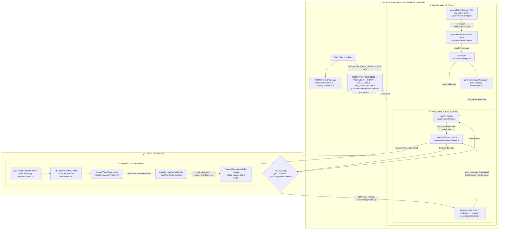

# System Map & Architecture Reference

_Last verified: 2026-09-05 against commit `964d35d`_

A dense onboarding guide and navigation map for engineers and coding agents. Grounded directly in repository source files.

---

## 1. Product Overview

[AI Quiz Studio](README.md) is a local-first, Windows-only desktop workspace for automated educational and trivia video creators. It takes channel personas (mascots, voice references, channel DNA) plus candidate topics or question-bank entries to research, script, direct, voice, QA-verify, and render broadcast-ready animated quiz videos in landscape (`16:9`) and portrait (`9:16` Shorts) formats. The architecture runs entirely on local filesystem persistence (no cloud database; see [`apps/server/src/repository.ts`](apps/server/src/repository.ts)), orchestrating LLM generation ([Codex](apps/server/src/codex.ts) or [Antigravity](apps/server/src/antigravity.ts)), local neural TTS ([Chatterbox Python sidecar](services/tts/app.py)), multi-stage deterministic QA, and an HTML5 [HyperFrames](apps/server/src/tasks/video/videoRenderExecution.ts) headless browser renderer that outputs MP4 videos with synchronized narration, BGM, SFX, thumbnails, and YouTube descriptions. A recent subsystem, the **question bank** ([`apps/server/src/quiz/bank/`](apps/server/src/quiz/bank/questionBankBatchService.ts)), curates reusable English-base questions in a coverage matrix and transcreates them per channel language, feeding episodes via a one-click topic→episode bridge. See [docs/architecture.md](docs/architecture.md), [docs/quiz-engine-v2.md](docs/quiz-engine-v2.md), and [docs/episode-workflow.md](docs/episode-workflow.md).

---

## 2. Quiz Production Pipeline

The end-to-end pipeline is orchestrated by [`quizProductionPipelineRunner.ts`](apps/server/src/tasks/pipeline/quizProductionPipelineRunner.ts) (outer stages + video render) and [`quizV2PipelineRunner.ts`](apps/server/src/tasks/pipeline/quizV2PipelineRunner.ts) (quiz derivation, parallel synthesis, QA healing). Domain stage functions live in [`apps/server/src/quiz/pipeline/orchestrator.ts`](apps/server/src/quiz/pipeline/orchestrator.ts) and [`stages/`](apps/server/src/quiz/pipeline/stages/quizGenerationStage.ts).

_Reference doc:_ [docs/quiz-engine-v2.md](docs/quiz-engine-v2.md) (see drift note 6 below — it still describes the legacy narrative chain as the default flow).

---

## 3. Ownership Zones & Entry Points

All files are strictly partitioned into 23 zones defined in [`.agent-orchestrator/zones.yml`](.agent-orchestrator/zones.yml) — see that file for full glob lists. Never modify files across boundaries without expanding claim ownership.

| Zone ID                   | One-Sentence Purpose                                                                                                                                               | "Start Here" Entry-Point Files                                                                                                                                                                                                                                                       |
| :------------------------ | :----------------------------------------------------------------------------------------------------------------------------------------------------------------- | :----------------------------------------------------------------------------------------------------------------------------------------------------------------------------------------------------------------------------------------------------------------------------------- |
| `shared-contracts`        | Core types, base enums, and schemas consumed across applications (exclusive Core Hub).                                                                             | [`packages/shared/src/index.ts`](packages/shared/src/index.ts), [`schemas/index.ts`](packages/shared/src/schemas/index.ts), [`constants.ts`](packages/shared/src/constants.ts)                                                                                                       |
| `shared-layout-contracts` | Quiz layouts, style catalogs, policies, archetypes, and preview contracts (`shared-disjoint`).                                                                     | [`packages/shared/src/quizLayouts.ts`](packages/shared/src/quizLayouts.ts), [`quizStyles.ts`](packages/shared/src/quizStyles.ts), [`quizArchetypes.ts`](packages/shared/src/quizArchetypes.ts)                                                                                       |
| `shared-mascot-contracts` | Mascot poses, render schemas, motion presets, and creative contracts (`shared-disjoint`).                                                                          | [`packages/shared/src/mascot/renderTypes.ts`](packages/shared/src/mascot/renderTypes.ts), [`mascot/renderSchema.ts`](packages/shared/src/mascot/renderSchema.ts), [`presets.ts`](packages/shared/src/presets.ts)                                                                     |
| `project-configuration`   | Package manifests, TypeScript settings, and build/test entry configuration.                                                                                        | [`apps/server/package.json`](apps/server/package.json), [`apps/web/vite.config.ts`](apps/web/vite.config.ts), [`apps/server/tsconfig.json`](apps/server/tsconfig.json)                                                                                                               |
| `api-contracts`           | Fastify HTTP routes, app assembly, LLM engine clients, and env contracts.                                                                                          | [`apps/server/src/app.ts`](apps/server/src/app.ts), [`src/routes/quizV2.ts`](apps/server/src/routes/quizV2.ts), [`src/routes/questionBank.ts`](apps/server/src/routes/questionBank.ts)                                                                                               |
| `task-status-progress`    | Task lifecycle, runners, queues, SSE events, and their dedicated web presentation.                                                                                 | [`apps/server/src/tasks/manager.ts`](apps/server/src/tasks/manager.ts), [`taskQueuePump.ts`](apps/server/src/tasks/taskQueuePump.ts), [`TaskProgressPanel.tsx`](apps/web/src/components/TaskProgressPanel.tsx)                                                                       |
| `artifact-contracts`      | Artifact repositories, filesystem naming, atomic JSON storage, and stage invalidation.                                                                             | [`apps/server/src/repository.ts`](apps/server/src/repository.ts), [`repository/quizArtifacts.ts`](apps/server/src/repository/quizArtifacts.ts), [`quiz/pipeline/invalidation.ts`](apps/server/src/quiz/pipeline/invalidation.ts)                                                     |
| `server-pipeline`         | Quiz application workflows, pipeline stages, domain rules, directors, and descriptions.                                                                            | [`apps/server/src/quiz/pipeline/orchestrator.ts`](apps/server/src/quiz/pipeline/orchestrator.ts), [`quiz/domain/quiz.ts`](apps/server/src/quiz/domain/quiz.ts), [`director/validateDirectorPlan.ts`](apps/server/src/quiz/director/validateDirectorPlan.ts)                          |
| `render-inputs`           | Render model contracts, scene adapters, timing inputs, and layout compatibility boundaries.                                                                        | [`apps/server/src/quiz/render/scene/buildQuizSceneRenderModel.ts`](apps/server/src/quiz/render/scene/buildQuizSceneRenderModel.ts), [`quiz/layoutCompatibility.ts`](apps/server/src/quiz/layoutCompatibility.ts), [`sceneTiming.ts`](apps/server/src/sceneTiming.ts)                 |
| `render-implementation`   | Renderers, layouts, scene assembly, visual variants, and effects.                                                                                                  | [`apps/server/src/quiz/render/candyArcadeComposition.ts`](apps/server/src/quiz/render/candyArcadeComposition.ts), [`productionMascotRenderer.ts`](apps/server/src/quiz/render/productionMascotRenderer.ts), [`visual/registry.ts`](apps/server/src/quiz/visual/registry.ts)          |
| `image-thumbnail-prompt`  | Thumbnail planning, media prompts, asset resolution, audio, and mascot generation.                                                                                 | [`apps/server/src/quiz/thumbnail/index.ts`](apps/server/src/quiz/thumbnail/index.ts), [`quiz/assets/resolveQuizAssets.ts`](apps/server/src/quiz/assets/resolveQuizAssets.ts), [`quiz/audio/voiceSynthesis.ts`](apps/server/src/quiz/audio/voiceSynthesis.ts)                         |
| `media-providers`         | External image/audio provider client adapters (OpenAI, Fal, Chatterbox, gpti2).                                                                                    | [`apps/server/src/providers/index.ts`](apps/server/src/providers/index.ts), [`providers/chatterbox.ts`](apps/server/src/providers/chatterbox.ts), [`providers/gpti2/provider.ts`](apps/server/src/providers/gpti2/provider.ts)                                                       |
| `quality-timeline`        | QA scoring stages, preflight checks, copyright scanner, and timeline compilers.                                                                                    | [`apps/server/src/quiz/qa/quizAssessment.ts`](apps/server/src/quiz/qa/quizAssessment.ts), [`quiz/qa/preflight.ts`](apps/server/src/quiz/qa/preflight.ts), [`quiz/timeline/compileTimeline.ts`](apps/server/src/quiz/timeline/compileTimeline.ts)                                     |
| `server-core`             | Remaining cohesive server entry points and utilities — including the question bank engine ([`quiz/bank/`](apps/server/src/quiz/bank/questionBankToQuizBridge.ts)). | [`apps/server/src/index.ts`](apps/server/src/index.ts), [`quiz/bank/questionBankToQuizBridge.ts`](apps/server/src/quiz/bank/questionBankToQuizBridge.ts), [`logger.ts`](apps/server/src/logger.ts), [`runtimePaths.ts`](apps/server/src/runtimePaths.ts)                             |
| `server-tests`            | Server test fixtures and executable Vitest behavioral suites.                                                                                                      | [`apps/server/test/quizPipeline.test.ts`](apps/server/test/quizPipeline.test.ts), [`test/quizSceneModel.test.ts`](apps/server/test/quizSceneModel.test.ts), [`test/candyArcade.test.ts`](apps/server/test/candyArcade.test.ts)                                                       |
| `web-api-state`           | Frontend API client layer, React Query/SSE hooks, and episode pipeline hooks.                                                                                      | [`apps/web/src/api.ts`](apps/web/src/api.ts), [`hooks/useTasks.ts`](apps/web/src/hooks/useTasks.ts), [`features/episode/hooks/useEpisodePipeline.ts`](apps/web/src/features/episode/hooks/useEpisodePipeline.ts)                                                                     |
| `web-layout-style`        | React UI components, Studio views, modals, and Tailwind styling.                                                                                                   | [`apps/web/src/App.tsx`](apps/web/src/App.tsx), [`features/episode/components/QuizEpisodeView.tsx`](apps/web/src/features/episode/components/QuizEpisodeView.tsx), [`features/stageStudio/MascotStageStudioModal.tsx`](apps/web/src/features/stageStudio/MascotStageStudioModal.tsx) |
| `tts-service`             | Python FastAPI Chatterbox neural TTS sidecar service.                                                                                                              | [`services/tts/app.py`](services/tts/app.py), [`audio_merger.py`](services/tts/audio_merger.py), [`voice_manager.py`](services/tts/voice_manager.py)                                                                                                                                 |
| `generated-artifacts`     | Runtime output files (rendered MP4s, channel content, audio clips, caches).                                                                                        | [`channels/`](channels/), [`.quiz-studio/`](.quiz-studio/), [`assets/audio/`](assets/audio/)                                                                                                                                                                                         |
| `runtime-resources`       | Environment files, launchers, operational scripts, logger, and runtime paths.                                                                                      | [`.env.example`](.env.example), [`run dashboard.bat`](run%20dashboard.bat), [`scripts/check-format.mjs`](scripts/check-format.mjs)                                                                                                                                                   |
| `agent-coordination`      | Multi-agent lease registry, claim commands, tests, and protocol docs.                                                                                              | [`.agent-orchestrator/zones.yml`](.agent-orchestrator/zones.yml), [`scripts/agent-claim.mjs`](scripts/agent-claim.mjs), [`scripts/agent-validate-zones.mjs`](scripts/agent-validate-zones.mjs)                                                                                       |
| `coordination-handoffs`   | Agent task and phase completion handoff summaries.                                                                                                                 | [`docs/agent-coordination/handoffs/`](docs/agent-coordination/handoffs/), [`templates/phase-handoff-summary.md`](docs/agent-coordination/templates/phase-handoff-summary.md)                                                                                                         |
| `repository-docs`         | Repository specifications, architectural documentation, guidelines, and manuals.                                                                                   | [`README.md`](README.md), [`docs/system-map.md`](docs/system-map.md), [`docs/architecture.md`](docs/architecture.md)                                                                                                                                                                 |

---

## 4. Non-Obvious Domain Rules & Invariants

1. **Director Plan Coverage & Semantic Purity:** [`validateDirectorPlan.ts`](apps/server/src/quiz/director/validateDirectorPlan.ts) requires `plan.beats` to cover _every_ `QuizV2` question ID exactly once (no missing/extra IDs, L25-51), the plan schema only accepts semantic presentation enums, and every beat must include an `answer_reveal` intent (L133-141) or rendering is blocked.
2. **Age-Band Thinking Time Floors & Ceilings:** [`validateDirectorPlan.ts` L4](apps/server/src/quiz/director/validateDirectorPlan.ts) enforces `4-6` ≥ 7.2s, `7-9`/`family` ≥ 6.8s, `10-12` ≥ 6.5s thinking time (blocker below floor); anything above **20s** is a warning.
3. **Consecutive Answer Position Rebalancing:** [`balanceQuizChoicePositions`](apps/server/src/quiz/domain/quiz.ts#L192-L252) deterministically prevents two consecutive questions from sharing the same correct-answer letter position (3+ choice layouts), rotating to the least-used position episode-wide. Applied both on legacy scene derivation and on direct LLM quiz output ([`directQuizHandler.ts`](apps/server/src/tasks/handlers/directQuizHandler.ts)).
4. **Strict Copyright Term Filter:** [`copyrightValidator.ts` L15-55](apps/server/src/quiz/qa/copyrightValidator.ts#L15-L55) hard-blocks "lion cub"/"Simba" (any context, even nature quizzes), Marvel/DC superheroes, game IPs (Nintendo, Pokémon, Minecraft, Roblox, Fortnite), and classic Disney characters. Adult lions and anime IPs (Naruto, Doraemon) are explicitly allowed.
5. **30-Day Duplicate Question Gate:** [`questionHistory.ts` L66-114](apps/server/src/quiz/qa/questionHistory.ts#L66-L114) matches new questions against a 30-day history ledger (pruned in `pruneQuestionHistory`, L119) using Token Jaccard + Character Bigram Dice. Duplicates: ≥ 50% similarity with a matching correct answer, or ≥ 75% similarity overall. The ledger is appended only after a **successful render** ([`videoRunner.ts` L105-108](apps/server/src/tasks/videoRunner.ts)) and rolled back if the render task fails.
6. **Timeline Narration Completeness:** [`compileTimeline.ts` L32-35](apps/server/src/quiz/timeline/compileTimeline.ts#L31-L36) throws a fatal error if any `VoicePlan` segment is not explicitly scheduled on the timeline — the timeline is then re-sorted by `at_seconds` and Zod-validated.
7. **Voice Pacing Safety & LLM Healing:** [`assessVoiceQa.ts` L27](apps/server/src/quiz/qa/stages/assessVoiceQa.ts#L24-L36) raises a `voice_pace_unsafe` blocker when measured WPS exceeds the age-band target + **0.45 WPS** (warning-only between target and target+0.45). The runner auto-heals via [`voicePacingHealer.ts`](apps/server/src/quiz/audio/voicePacingHealer.ts) for up to **3 cycles** ([`quizV2PipelineRunner.ts` L334-355](apps/server/src/tasks/pipeline/quizV2PipelineRunner.ts)) — healing assets and voice concurrently when both blocker classes exist — before failing the task.
8. **Mascot Transform Layer Order:** Per [docs/mascot-rendering-contract.md](docs/mascot-rendering-contract.md), transforms compose as: canvas anchor → placement offset (unscaled logical px) → scale & flip around the bottom-center pivot → per-action registration offset → deterministic motion transform. The chain is implemented in [`mascotHtmlRenderer.ts`](apps/server/src/quiz/render/mascotHtmlRenderer.ts) (pivot math at L162-169); [`productionMascotRenderer.ts`](apps/server/src/quiz/render/productionMascotRenderer.ts) is only the timeline-state adapter. Viewport zoom/fit must never mutate placement coordinates.
9. **Deterministic Downstream Invalidation:** Modifying any upstream stage cascades invalidation via the fixed map in [`invalidation.ts`](apps/server/src/quiz/pipeline/invalidation.ts) (e.g. `quiz` → `[director, assets, asset_resolution, voice, timeline, render, qa]`).
10. **Non-Blocking Polish Stages:** Episode description ([`quizV2PipelineRunner.ts` L148-159](apps/server/src/tasks/pipeline/quizV2PipelineRunner.ts)) and thumbnail (L360-383) generation are wrapped in non-fatal try/catch — their failure logs a warning and never blocks the pipeline, whereas QA blockers always do.

---

## 5. Known Documentation Drift

The following discrepancies exist between existing documentation and current code (listed only, not silently fixed):

1. **Pipeline Execution & Autonomous Healing:** [docs/quiz-engine-v2.md](docs/quiz-engine-v2.md) describes a purely linear pipeline. In [`quizV2PipelineRunner.ts`](apps/server/src/tasks/pipeline/quizV2PipelineRunner.ts), `resolveAssets` and `generateVoice` run concurrently via `Promise.all`, and a 3-cycle auto-healing loop rewrites voice pacing with AI and retries asset generation before raising fatal QA blockers.
2. **Integrated Thumbnails & YouTube Descriptions:** [docs/quiz-engine-v2.md](docs/quiz-engine-v2.md) does not mention thumbnails or descriptions. The actual pipeline auto-executes [`generateEpisodeThumbnail`](apps/server/src/quiz/thumbnail/index.ts) and [`generateEpisodeDescription`](apps/server/src/quiz/description/index.ts) during Quiz V2 runs.
3. **Quiz-Native Fast Path Is The Default:** [docs/quiz-engine-v2.md](docs/quiz-engine-v2.md) line 5 documents `research → treatment → script → visual bible → scenes → QuizV2` as the flow. In [`quizProductionPipelineRunner.ts` L39, L125-147](apps/server/src/tasks/pipeline/quizProductionPipelineRunner.ts), the default path generates `quiz.json` directly (LLM output parsed by [`directQuizHandler.ts`](apps/server/src/tasks/handlers/directQuizHandler.ts), which synthesizes `script.md`/`visual_bible.md`/`scenes.json` for backward compatibility); the narrative chain only runs when `USE_LEGACY_QUIZ_PIPELINE=true`.
4. **Dual LLM Engine (Antigravity + Codex):** [docs/architecture.md](docs/architecture.md) and [docs/codex-integration.md](docs/codex-integration.md) only document Codex. The server and web client have first-class dual-engine support ([`apps/server/src/antigravity.ts`](apps/server/src/antigravity.ts), [`EngineToggleGroup.tsx`](apps/web/src/components/chrome/topbar/EngineToggleGroup.tsx)).
5. **Batch Audio vs. Per-Scene Audio:** [docs/episode-workflow.md](docs/episode-workflow.md) states _"Audio generation is per-scene in this phase; there is no episode-level batch action."_ In Quiz V2, [`generateVoice`](apps/server/src/quiz/pipeline/stages/assetsVoiceStages.ts) synthesizes all question segments in batch and assembles an episode-wide `narration.wav`.
6. **Modular Style Packages & Element Registries:** [docs/mascot-rendering-contract.md](docs/mascot-rendering-contract.md) focuses primarily on Candy Arcade. The server now has an extensible style module catalog ([`apps/server/src/quiz/visual/styleModules/catalog.ts`](apps/server/src/quiz/visual/styleModules/catalog.ts)) and visual element variant registries ([`apps/server/src/quiz/visual/registry.ts`](apps/server/src/quiz/visual/registry.ts)).
7. **Question Bank Subsystem Undocumented:** No doc in `docs/*.md` covers the question bank curation engine, coverage matrix, JIT seeding, transcreation, or the topic→episode bridge ([`apps/server/src/quiz/bank/`](apps/server/src/quiz/bank/matrixCoverageService.ts), [`apps/server/src/routes/questionBank.ts`](apps/server/src/routes/questionBank.ts)); current state is tracked only in [docs/agent-coordination/handoffs/](docs/agent-coordination/handoffs/2026-09-05-step-4-multi-question-topic-bridge.md).

---

## 6. Sources Read

Every file inspected during this verification pass (existence of every cited path was additionally re-checked mechanically):

- `README.md`, `AGENTS.md`, `.agent-orchestrator/zones.yml`
- `docs/system-map.md` (previous revision), `docs/quiz-engine-v2.md`, `docs/architecture.md`, `docs/episode-workflow.md`, `docs/mascot-rendering-contract.md`, `docs/codex-integration.md`, `docs/channel-dna.md`, `docs/provider-system.md`, `docs/setup.md`
- `docs/agent-coordination/handoffs/2026-09-05-step-4-multi-question-topic-bridge.md`
- `apps/server/src/tasks/pipeline/quizProductionPipelineRunner.ts`, `apps/server/src/tasks/pipeline/quizV2PipelineRunner.ts`, `apps/server/src/tasks/videoRunner.ts`
- `apps/server/src/quiz/pipeline/orchestrator.ts`, `apps/server/src/quiz/pipeline/invalidation.ts`
- `apps/server/src/quiz/pipeline/stages/quizGenerationStage.ts`, `apps/server/src/quiz/pipeline/stages/assetsVoiceStages.ts`
- `apps/server/src/tasks/handlers/directQuizHandler.ts`, `apps/server/src/tasks/handlers/textArtifactHandlers.ts`
- `apps/server/src/quiz/domain/quiz.ts`
- `apps/server/src/quiz/director/validateDirectorPlan.ts`
- `apps/server/src/quiz/timeline/compileTimeline.ts`
- `apps/server/src/quiz/qa/copyrightValidator.ts`, `apps/server/src/quiz/qa/questionHistory.ts`, `apps/server/src/quiz/qa/stages/assessVoiceQa.ts`
- `apps/server/src/quiz/render/productionMascotRenderer.ts`, `apps/server/src/quiz/render/mascotHtmlRenderer.ts`
- `apps/server/src/routes/questionBank.ts`
- `apps/server/src/quiz/bank/questionBankToQuizBridge.ts`, `apps/server/src/quiz/bank/matrixCoverageService.ts`
- Entry-point heads re-opened for citation verification: `packages/shared/src/index.ts`, `packages/shared/src/schemas/index.ts`, `packages/shared/src/mascot/renderTypes.ts`, `apps/server/package.json`, `apps/server/tsconfig.json`, `apps/web/vite.config.ts`, `apps/server/src/app.ts`, `apps/server/src/index.ts`, `apps/server/src/logger.ts`, `apps/server/src/runtimePaths.ts`, `apps/server/src/antigravity.ts`, `apps/server/src/codex.ts`, `apps/server/src/repository.ts`, `apps/server/src/repository/quizArtifacts.ts`, `apps/server/src/routes/quizV2.ts`, `apps/server/src/tasks/manager.ts`, `apps/server/src/tasks/taskQueuePump.ts`, `apps/server/src/tasks/video/videoCompositionPreparer.ts`, `apps/server/src/tasks/video/videoRenderExecution.ts`, `apps/server/src/quiz/layoutCompatibility.ts`, `apps/server/src/sceneTiming.ts`, `apps/server/src/quiz/render/candyArcadeComposition.ts`, `apps/server/src/quiz/render/scene/buildQuizSceneRenderModel.ts`, `apps/server/src/quiz/visual/registry.ts`, `apps/server/src/quiz/visual/styleModules/catalog.ts`, `apps/server/src/quiz/thumbnail/index.ts`, `apps/server/src/quiz/assets/resolveQuizAssets.ts`, `apps/server/src/quiz/audio/voiceSynthesis.ts`, `apps/server/src/quiz/audio/voicePacingHealer.ts`, `apps/server/src/quiz/description/index.ts`, `apps/server/src/quiz/qa/quizAssessment.ts`, `apps/server/src/quiz/qa/preflight.ts`, `apps/server/src/quiz/pipeline/stages/timelineAssessmentStages.ts`, `apps/server/src/providers/index.ts`, `apps/server/src/providers/chatterbox.ts`, `apps/server/src/providers/gpti2/provider.ts`, `apps/server/test/quizPipeline.test.ts`, `apps/server/test/quizSceneModel.test.ts`, `apps/server/test/candyArcade.test.ts`, `apps/web/src/api.ts`, `apps/web/src/App.tsx`, `apps/web/src/components/TaskProgressPanel.tsx`, `apps/web/src/components/chrome/topbar/EngineToggleGroup.tsx`, `apps/web/src/hooks/useTasks.ts`, `apps/web/src/features/episode/components/QuizEpisodeView.tsx`, `apps/web/src/features/episode/hooks/useEpisodePipeline.ts`, `apps/web/src/features/stageStudio/MascotStageStudioModal.tsx`, `services/tts/app.py`, `services/tts/audio_merger.py`, `services/tts/voice_manager.py`, `.env.example`, `run dashboard.bat`, `scripts/check-format.mjs`, `scripts/agent-claim.mjs`, `scripts/agent-validate-zones.mjs`
