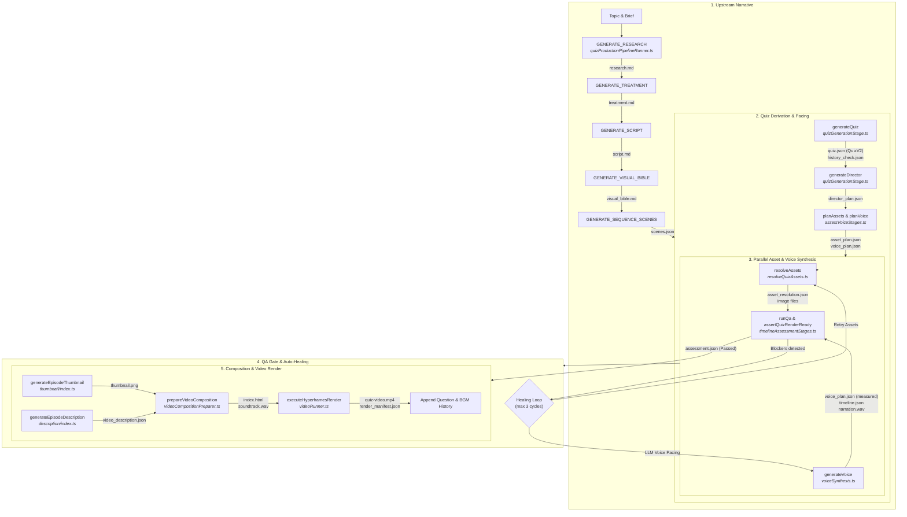

# System Map & Architecture Reference

A dense onboarding guide and navigation map for engineers and coding agents. Grounded directly in repository source files.

---

## 1. Product Overview

[AI Quiz Studio](README.md) is a local-first, Windows-optimized desktop workspace designed for automated educational and trivia video creators. It takes channel personas (mascots, voice references, channel DNA) and candidate topics to research, script, direct, voice, QA-verify, and render broadcast-ready animated quiz videos in landscape (`16:9`) and portrait (`9:16` Shorts) formats. The architecture operates entirely without cloud database dependencies, orchestrating LLM generation ([Codex](apps/server/src/codex.ts) or [Antigravity](apps/server/src/antigravity.ts)), local neural TTS ([Chatterbox Python sidecar](services/tts/app.py)), multi-stage deterministic QA, and an HTML5 [HyperFrames](apps/server/src/tasks/video/videoRenderExecution.ts) headless browser renderer to output MP4 videos with synchronized narration, BGM, SFX, thumbnails, and YouTube descriptions. See [docs/architecture.md](docs/architecture.md) and [docs/episode-workflow.md](docs/episode-workflow.md).

---

## 2. Quiz Production Pipeline

The production pipeline is orchestrated by [`quizProductionPipelineRunner.ts`](apps/server/src/tasks/pipeline/quizProductionPipelineRunner.ts) and [`quizV2PipelineRunner.ts`](apps/server/src/tasks/pipeline/quizV2PipelineRunner.ts), backed by the domain stages in [`apps/server/src/quiz/pipeline/`](apps/server/src/quiz/pipeline/orchestrator.ts).

*Reference doc:* [docs/quiz-engine-v2.md](docs/quiz-engine-v2.md).

---

## 3. Ownership Zones & Entry Points

All files are strictly partitioned into 19 zones defined in [`.agent-orchestrator/zones.yml`](.agent-orchestrator/zones.yml). Never modify files across boundaries without expanding claim ownership.

| Zone ID | One-Sentence Purpose | "Start Here" Entry-Point Files |
| :--- | :--- | :--- |
| `shared-contracts` | Shared Zod schemas, domain models, and mascot contracts. | [`packages/shared/src/index.ts`](packages/shared/src/index.ts), [`schemas/index.ts`](packages/shared/src/schemas/index.ts), [`mascot/renderTypes.ts`](packages/shared/src/mascot/renderTypes.ts) |
| `project-configuration` | Package manifests, build entry points, and tsconfig definitions. | [`apps/server/package.json`](apps/server/package.json), [`apps/web/vite.config.ts`](apps/web/vite.config.ts), [`apps/server/tsconfig.json`](apps/server/tsconfig.json) |
| `api-contracts` | Fastify HTTP routes, app assembly, LLM transports, and server env. | [`apps/server/src/app.ts`](apps/server/src/app.ts), [`src/routes/quizV2.ts`](apps/server/src/routes/quizV2.ts), [`src/antigravity.ts`](apps/server/src/antigravity.ts) |
| `task-status-progress` | Task submission, execution queues, SSE events, and progress UI. | [`apps/server/src/tasks/manager.ts`](apps/server/src/tasks/manager.ts), [`taskQueuePump.ts`](apps/server/src/tasks/taskQueuePump.ts), [`TaskProgressPanel.tsx`](apps/web/src/components/TaskProgressPanel.tsx) |
| `artifact-contracts` | Filesystem persistence, atomic JSON storage, and stage invalidation. | [`apps/server/src/repository.ts`](apps/server/src/repository.ts), [`repository/quizArtifacts.ts`](apps/server/src/repository/quizArtifacts.ts), [`quiz/pipeline/invalidation.ts`](apps/server/src/quiz/pipeline/invalidation.ts) |
| `server-pipeline` | Quiz domain workflows, scene derivation, director, and descriptions. | [`apps/server/src/quiz/pipeline/orchestrator.ts`](apps/server/src/quiz/pipeline/orchestrator.ts), [`quiz/domain/quiz.ts`](apps/server/src/quiz/domain/quiz.ts), [`director/validateDirectorPlan.ts`](apps/server/src/quiz/director/validateDirectorPlan.ts) |
| `render-inputs` | Boundary models, scene adapters, and layout compatibility contracts. | [`apps/server/src/quiz/render/scene/buildQuizSceneRenderModel.ts`](apps/server/src/quiz/render/scene/buildQuizSceneRenderModel.ts), [`layoutCompatibility.ts`](apps/server/src/quiz/layoutCompatibility.ts), [`sceneTiming.ts`](apps/server/src/sceneTiming.ts) |
| `render-implementation` | Candy Arcade HTML/CSS assembly, visual element registries, and styles. | [`apps/server/src/quiz/render/candyArcadeComposition.ts`](apps/server/src/quiz/render/candyArcadeComposition.ts), [`productionMascotRenderer.ts`](apps/server/src/quiz/render/productionMascotRenderer.ts), [`visual/registry.ts`](apps/server/src/quiz/visual/registry.ts) |
| `image-thumbnail-prompt` | Thumbnail engine, image resolution, mascot art, and voice synthesis. | [`apps/server/src/quiz/thumbnail/index.ts`](apps/server/src/quiz/thumbnail/index.ts), [`quiz/assets/resolveQuizAssets.ts`](apps/server/src/quiz/assets/resolveQuizAssets.ts), [`quiz/audio/voiceSynthesis.ts`](apps/server/src/quiz/audio/voiceSynthesis.ts) |
| `media-providers` | Image and audio provider client adapters (OpenAI, Fal, Chatterbox). | [`apps/server/src/providers/index.ts`](apps/server/src/providers/index.ts), [`providers/chatterbox.ts`](apps/server/src/providers/chatterbox.ts), [`providers/gpti2/provider.ts`](apps/server/src/providers/gpti2/provider.ts) |
| `quality-timeline` | QA scoring stages, preflight checks, copyright scanner, and timeline. | [`apps/server/src/quiz/qa/quizAssessment.ts`](apps/server/src/quiz/qa/quizAssessment.ts), [`quiz/qa/preflight.ts`](apps/server/src/quiz/qa/preflight.ts), [`quiz/timeline/compileTimeline.ts`](apps/server/src/quiz/timeline/compileTimeline.ts) |
| `server-core` | Core server utilities, logger, runtime paths, and zip archiver. | [`apps/server/src/index.ts`](apps/server/src/index.ts), [`logger.ts`](apps/server/src/logger.ts), [`runtimePaths.ts`](apps/server/src/runtimePaths.ts) |
| `server-tests` | Server test fixtures and executable Vitest behavioral suites. | [`apps/server/test/quizPipeline.test.ts`](apps/server/test/quizPipeline.test.ts), [`test/quizSceneModel.test.ts`](apps/server/test/quizSceneModel.test.ts), [`test/candyArcade.test.ts`](apps/server/test/candyArcade.test.ts) |
| `web-api-state` | Frontend API client layer, React Query/SSE hooks, and episode pipeline hooks. | [`apps/web/src/api.ts`](apps/web/src/api.ts), [`hooks/useTasks.ts`](apps/web/src/hooks/useTasks.ts), [`features/episode/hooks/useEpisodePipeline.ts`](apps/web/src/features/episode/hooks/useEpisodePipeline.ts) |
| `web-layout-style` | React UI components, Studio views, modals, flags, and Tailwind styling. | [`apps/web/src/App.tsx`](apps/web/src/App.tsx), [`features/episode/components/QuizEpisodeView.tsx`](apps/web/src/features/episode/components/QuizEpisodeView.tsx), [`features/stageStudio/MascotStageStudioModal.tsx`](apps/web/src/features/stageStudio/MascotStageStudioModal.tsx) |
| `tts-service` | Python FastAPI Chatterbox neural TTS sidecar service. | [`services/tts/app.py`](services/tts/app.py), [`audio_merger.py`](services/tts/audio_merger.py), [`voice_manager.py`](services/tts/voice_manager.py) |
| `generated-artifacts` | Runtime output files (rendered MP4s, channel content, audio clips). | [`channels/`](channels/), [`.quiz-studio/`](.quiz-studio/), [`assets/audio/`](assets/audio/) |
| `runtime-resources` | Environment configs, operational scripts, and batch launchers. | [`.env.example`](.env.example), [`run dashboard.bat`](run%20dashboard.bat), [`scripts/check-format.mjs`](scripts/check-format.mjs) |
| `agent-coordination` | Multi-agent lease registry, lock commands, tests, and protocols. | [`.agent-orchestrator/zones.yml`](.agent-orchestrator/zones.yml), [`scripts/agent-claim.mjs`](scripts/agent-claim.mjs), [`scripts/agent-validate-zones.mjs`](scripts/agent-validate-zones.mjs) |

---

## 4. Non-Obvious Domain Rules & Invariants

1. **Director Plan Purity & Full Question Coverage:** [`DirectorPlan`](apps/server/src/quiz/director/validateDirectorPlan.ts#L6-L51) can only reference valid canonical question IDs from `QuizV2` and semantic presentation enums (`archetype`, `energy`, `thinking_seconds`, `reward_intensity`). It cannot alter question text, choices, or answers. Furthermore, `plan.beats` must cover *every* question in `QuizV2` exactly once with no missing or extra IDs.
2. **Consecutive Answer Position Rebalancing:** In [`deriveQuizV2FromScenes`](apps/server/src/quiz/domain/quiz.ts#L188-L252), `balanceQuizChoicePositions` deterministically prevents two consecutive 3-choice questions from sharing the same correct letter position (e.g. choice A followed by choice A). It rotates choices to the least frequently used position across the episode.
3. **Age-Band Thinking Time Minimums:** [`validateDirectorPlan.ts`](apps/server/src/quiz/director/validateDirectorPlan.ts#L4-L5) enforces strict thinking duration floors: `4-6` requires $\ge 7.2\text{s}$, `7-9` and `family` require $\ge 6.8\text{s}$, and `10-12` requires $\ge 6.5\text{s}$. Sub-minimum durations trigger a blocker issue.
4. **Strict Copyright Term Filter:** [`copyrightValidator.ts`](apps/server/src/quiz/qa/copyrightValidator.ts#L15-L55) hard-blocks copyright-sensitive terms that trigger AI image moderation, notably `"lion cub" / "sư tử con" / "Simba"` (in any context, even nature quizzes), Marvel/DC superheroes, and Disney/Nintendo game IPs. Adult lions and standard anime IPs (e.g., Naruto, Doraemon) are allowed.
5. **30-Day Duplicate Question Gate:** [`questionHistory.ts`](apps/server/src/quiz/qa/questionHistory.ts#L66-L114) evaluates newly generated questions against the channel's 30-day historical ledger using Token Jaccard Similarity and Character Bigram Dice Coefficient. Matches $\ge 50\%$ with identical answers or $\ge 75\%$ overall similarity are marked duplicates.
6. **Timeline Narration Completeness:** In [`compileTimeline.ts`](apps/server/src/quiz/timeline/compileTimeline.ts#L31-L36), all segments defined in `VoicePlan` must be explicitly scheduled on the timeline. Missing voice segments trigger a fatal compilation exception.
7. **Voice Pacing Safety & LLM Healing:** [`assessVoiceQa.ts`](apps/server/src/quiz/qa/stages/assessVoiceQa.ts#L24-L36) computes Words-Per-Second (WPS) against age-band targets. If actual speech exceeds target $+ 0.45\text{ WPS}$, a `voice_pace_unsafe` blocker is raised, triggering an automatic LLM voice script healing cycle ([`voicePacingHealer.ts`](apps/server/src/quiz/audio/voicePacingHealer.ts)) for up to 3 attempts.
8. **Mascot Transform Layer Order:** According to [docs/mascot-rendering-contract.md](docs/mascot-rendering-contract.md) and [`productionMascotRenderer.ts`](apps/server/src/quiz/render/productionMascotRenderer.ts), coordinate transformations must strictly follow: `canvas anchor → channel placement offset (unscaled logical px) → scale & flip around pivot (bottom-center) → per-action registration offset → deterministic motion transform`. Viewport zoom/fit must never mutate placement coordinates.
9. **Deterministic Downstream Invalidation:** Modifying any upstream stage cascades invalidation downstream via [`invalidation.ts`](apps/server/src/quiz/pipeline/invalidation.ts) (e.g. `quiz` invalidates `[director, assets, asset_resolution, voice, timeline, render, qa]`).

---

## 5. Known Documentation Drift

The following discrepancies exist between existing documentation and current code:

1. **Pipeline Execution & Autonomous Healing:** [docs/quiz-engine-v2.md](docs/quiz-engine-v2.md) describes a purely linear pipeline. In [`quizV2PipelineRunner.ts`](apps/server/src/tasks/pipeline/quizV2PipelineRunner.ts), `resolveAssets` and `generateVoice` run concurrently via `Promise.all`, and a 3-cycle auto-healing loop dynamically rewrites voice pacing with AI and retries asset generation before raising fatal QA blockers.
2. **Integrated Thumbnails & YouTube Descriptions:** [docs/quiz-engine-v2.md](docs/quiz-engine-v2.md) does not mention thumbnails or descriptions. The actual pipeline automatically executes [`generateEpisodeThumbnail`](apps/server/src/quiz/thumbnail/index.ts) and [`generateEpisodeDescription`](apps/server/src/quiz/description/index.ts) during Quiz V2 runs.
3. **Dual LLM Engine (Antigravity + Codex):** [docs/architecture.md](docs/architecture.md) and [docs/codex-integration.md](docs/codex-integration.md) only document Codex. The server and web client now have first-class dual-engine support with Google Antigravity ([`apps/server/src/antigravity.ts`](apps/server/src/antigravity.ts), [`EngineToggleGroup.tsx`](apps/web/src/components/chrome/topbar/EngineToggleGroup.tsx)).
4. **Batch Audio vs. Per-Scene Audio:** [docs/episode-workflow.md](docs/episode-workflow.md) states *"Audio generation is per-scene in this phase; there is no episode-level batch action."* In Quiz V2, [`generateVoice`](apps/server/src/quiz/pipeline/stages/assetsVoiceStages.ts#L111-L179) synthesizes all question segments in batch and assembles them into an episode-wide `narration.wav`.
5. **Modular Style Packages & Element Registries:** [docs/mascot-rendering-contract.md](docs/mascot-rendering-contract.md) focuses primarily on Candy Arcade. The server now features an extensible Style Module catalog ([`apps/server/src/quiz/visual/styleModules/`](apps/server/src/quiz/visual/styleModules/catalog.ts)) and visual element variant registries (e.g. `answerCard`, `thinkingBar`, `counterBadge`).

---

## 6. Sources Read

Every file inspected during verification:

- `README.md`, `AGENTS.md`, `GEMINI.md`
- `docs/architecture.md`, `docs/quiz-engine-v2.md`, `docs/provider-system.md`, `docs/mascot-rendering-contract.md`, `docs/channel-dna.md`, `docs/episode-workflow.md`, `docs/codex-integration.md`, `docs/setup.md`
- `.agent-orchestrator/zones.yml`
- `scripts/agent-validate-zones.mjs`, `scripts/agent-coordination-registry.mjs`
- `apps/server/src/app.ts`, `apps/server/src/antigravity.ts`
- `apps/server/src/routes/quizV2.ts`
- `apps/server/src/quiz/pipeline/orchestrator.ts`, `apps/server/src/quiz/pipeline/invalidation.ts`
- `apps/server/src/quiz/pipeline/stages/quizGenerationStage.ts`, `apps/server/src/quiz/pipeline/stages/assetsVoiceStages.ts`, `apps/server/src/quiz/pipeline/stages/timelineAssessmentStages.ts`
- `apps/server/src/tasks/pipeline/quizProductionPipelineRunner.ts`, `apps/server/src/tasks/pipeline/quizV2PipelineRunner.ts`
- `apps/server/src/tasks/videoRunner.ts`, `apps/server/src/tasks/video/videoCompositionPreparer.ts`, `apps/server/src/tasks/video/videoRenderExecution.ts`
- `apps/server/src/quiz/domain/quiz.ts`
- `apps/server/src/quiz/director/validateDirectorPlan.ts`
- `apps/server/src/quiz/timeline/compileTimeline.ts`, `apps/server/src/quiz/timeline/timingPolicy.ts`, `apps/server/src/quiz/timeline/compilers/questionCompiler.ts`
- `apps/server/src/quiz/qa/quizAssessment.ts`, `apps/server/src/quiz/qa/preflight.ts`, `apps/server/src/quiz/qa/copyrightValidator.ts`, `apps/server/src/quiz/qa/questionHistory.ts`
- `apps/server/src/quiz/qa/stages/assessSemanticQa.ts`, `apps/server/src/quiz/qa/stages/assessVoiceQa.ts`, `apps/server/src/quiz/qa/stages/assessTimelineQa.ts`
- `apps/server/src/quiz/visual/registry.ts`
- `apps/server/src/quiz/assets/resolveQuizAssets.ts`
- `apps/server/src/quiz/thumbnail/index.ts`
- `apps/server/src/quiz/description/index.ts`
- `apps/server/src/repository/quizArtifacts.ts`
- `packages/shared/src/index.ts`, `packages/shared/src/schemas.ts`, `packages/shared/src/schemas/index.ts`, `packages/shared/src/enums.ts`, `packages/shared/src/mascot/renderTypes.ts`
- `apps/web/src/api.ts`
- `apps/web/src/hooks/useTasks.ts`, `apps/web/src/hooks/useEpisode.ts`
- `apps/web/src/features/stageStudio/MascotStageStudioModal.tsx`, `apps/web/src/features/stageStudio/hooks/useStageStudio.ts`
- `apps/web/src/features/episode/components/QuizEpisodeView.tsx`, `apps/web/src/features/episode/hooks/useEpisodePipeline.ts`
