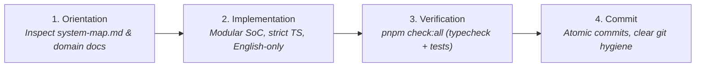

# Lean Developer Workflow & Verification Guide

_Last updated: 2026-09-09_

This guide outlines the streamlined developer workflow for solo engineers and paired AI coding agents working on **AI Quiz Studio**.

The legacy multi-agent coordination protocol (claim gates, lease tokens, heartbeat loops, conflict checkers, and lockfiles) has been decommissioned. In its place, the repository operates under a **Lean Workflow** characterized by zero ceremony, autonomous execution, strict separation of concerns, and one-touch automated verification.

---

## The Four-Stage Lean Workflow



---

### Stage 1: Orientation & Discovery

Before introducing modifications or authoring new features, inspect the architecture and domain invariants:

1. **System Map Navigation:** Start with [`docs/system-map.md`](system-map.md). It serves as the single source of truth for repository structure, module entry points, data flow, and non-obvious invariants (e.g., director plan coverage, age-band thinking floors, 30-day duplicate question gates).
2. **Domain Architecture Deep-Dives:** Consult domain documents relevant to your scope:
   - [`docs/architecture.md`](architecture.md): Overall workspace layers, Fastify security boundary, and dual LLM engine (Codex + Antigravity).
   - [`docs/quiz-engine-v2.md`](quiz-engine-v2.md): End-to-end Quiz V2 pipeline, parallel asset/voice synthesis, and autonomous healing loops.
   - [`docs/question-bank.md`](question-bank.md): Reusable trivia question bank, coverage matrix, JIT seeder, and channel transcreation bridge.
   - [`docs/mascot-rendering-contract.md`](mascot-rendering-contract.md): Mascot HTML coordinate transform order, motion presets, and style packages.
   - [`docs/episode-workflow.md`](episode-workflow.md): Batch voice synthesis, scene breakdown, and topic lifecycle.
   - [`docs/codex-integration.md`](codex-integration.md): LLM JSON-RPC protocol, transcript streaming, and recovery strategies.
3. **Inspect Existing Test Fixtures:** Review relevant tests in `apps/server/test/` or `apps/web/src/` to understand expected inputs, outputs, and edge cases.

---

### Stage 2: Implementation Standards

All contributions must adhere to clean code principles and repository standards:

1. **Modular Design & Separation of Concerns (SoC):**
   - **Presentation Layer (`apps/web`):** Components focus strictly on rendering and immediate user interactions. Keep them stateless or limited to local UI state.
   - **Business & Domain Logic (`apps/server/src/quiz`, `packages/shared`):** Keep workflows, pacing rules, scoring algorithms, and data transformations isolated in dedicated services, stages, or pure helpers.
   - **Data Access Layer (`apps/server/src/repository`):** Filesystem storage, atomic JSON writes, and path safety must remain encapsulated in repository modules.
   - **Contract Boundaries (`packages/shared/src`):** Shared models, enums, and Zod schemas must reside in `@studio/shared` and be exported through its root barrel.
2. **File & Function Size Restraints:**
   - Keep functions concise (ideally under 30–40 lines). Decompose complex logic into well-named helper functions.
   - Keep modules and components under 150–200 lines. Proactively extract sub-components or utility modules when complexity grows.
3. **Strict TypeScript Typing:**
   - Avoid `any` or loose typing. Define strict TypeScript interfaces and Zod validation contracts.
   - Maintain full compilation cleanliness without type assertions (`as any`) or suppressed warnings.
4. **Strict English-Only Specification:**
   - All code, filenames, directory names, variable/function/type identifiers, docstrings, inline comments, test cases, and mock fixtures MUST be 100% in English.
   - All user-facing text (UI labels, dialogs, buttons, toasts, tooltips) and server outputs (logs, error messages) MUST be strictly in English.

---

### Stage 3: One-Command Verification Suite

Verification is fully automated and executable with simple, high-signal commands from the repository root:

#### Unified Workspace Verification

```bash
# Run full workspace typecheck followed by all test suites and audits
pnpm check:all
```

#### Individual Verification Checks

- **Type Checking:**
  ```bash
  # Builds @studio/shared and typechecks packages/shared, apps/server, and apps/web
  pnpm typecheck
  ```
- **Test Suite & Domain Audits:**
  ```bash
  # Runs all Vitest suites across server and web, plus question-choice and quiz-only audits
  pnpm test
  ```
- **Production Build:**
  ```bash
  # Verifies clean compilation and Vite production bundling across the entire workspace
  pnpm build
  ```

#### Targeted & Incremental Testing

For rapid development, run targeted Vitest filters:

```bash
# Run a specific server test suite
pnpm --filter @studio/server test -- test/quizPipeline.test.ts

# Run a specific web component or hook test suite
pnpm --filter @studio/web test -- src/features/channel/components/TopicCard.test.tsx

# Run visual regression tests for quiz layout rendering
pnpm test:visual
```

---

### Stage 4: Git Hygiene & Commit Standards

With claim gates and file-locking scripts retired:

1. **No Coordination Ceremonies:** Developers and agents do not need to obtain lease tokens, start monitor daemons, or execute claim/release scripts.
2. **Atomic Commits:** Group cohesive changes together. Keep refactoring, feature additions, and documentation updates logically distinct.
3. **Conventional Commit Messages:** Write clear, descriptive English commit messages following standard conventions:
   - `feat: add topic coverage matrix visualizer`
   - `fix: correct mascot transform pivot offset for portrait layouts`
   - `refactor: extract question bank bridge adapter into dedicated service`
   - `docs: update system map with lean workflow guide`
   - `test: add unit coverage for voice pacing auto-healer`
4. **Clean Workspace State:** Ensure scratch files, temporary logs, and generated test output files are cleaned up or excluded via `.gitignore`.

---

## Command Reference Cheat Sheet

| Command              | Target / Scope            | Description                                                                 |
| :------------------- | :------------------------ | :-------------------------------------------------------------------------- |
| `pnpm check:all`     | Entire workspace          | **Primary verification gate:** Executes `pnpm typecheck` and `pnpm test`.   |
| `pnpm typecheck`     | `shared`, `server`, `web` | Builds `@studio/shared` and validates TypeScript across all packages.       |
| `pnpm test`          | Server + Web + Audits     | Runs complete Vitest behavioral suite and automated consistency audits.     |
| `pnpm build`         | Entire workspace          | Compiles TypeScript and creates Vite production web bundle.                 |
| `pnpm dev`           | `server` + `web`          | Concurrently launches backend Fastify server and frontend Vite dev server.  |
| `pnpm start`         | `server`                  | Launches production Fastify server.                                         |
| `pnpm test:coverage` | Server + Web              | Executes Vitest with V8 code coverage instrumentation.                      |
| `pnpm test:visual`   | Server (HyperFrames)      | Executes Pixelmatch visual regression tests against layout baseline images. |
| `pnpm format:check`  | Staged / changed files    | Validates formatting against Prettier and the baseline ledger.              |
| `pnpm lint`          | Entire workspace          | Validates ESLint rules across all workspace packages.                       |
